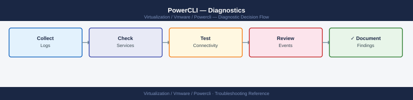

---
tags:
  - powercli
  - troubleshooting
  - vmware
search:
  boost: 1.5
---
# PowerCLI — Diagnostics

<div class="kb-summary">
PowerCLI diagnostic techniques: enable verbose and debug output, trace API calls via ExtensionData, profile large-inventory queries with Get-View, inspect exception detail, test vCenter API connectivity, and collect module versions and event logs for VMware escalations.

*Applies to: PowerCLI 13.x*
</div>



```mermaid
graph TD
    A([PowerCLI Issue]) --> B{What type of problem?}
    B -->|Script throws an error| C[Enable -Verbose\nRead full exception message]
    B -->|Script produces wrong output| D[Add breakpoints\npdb-equivalent: Set-PSBreakpoint]
    B -->|Slow execution on large inventory| E[Measure-Command timing\nSwitch to Get-View]
    B -->|Connection or auth error| F[Test-Connection vcenter\ncurl /sdk to verify HTTPS]
    B -->|Cmdlet missing expected property| G[ExtensionData for raw API object\nGet-Member to list all properties]
    C --> H[Read $_.Exception.Message\nand $_.Exception.InnerException]
    H --> I{Error type?}
    I -->|InvalidLogin or 401| J[Verify credential and domain\nConnect-VIServer -Credential Get-Credential]
    I -->|NotFound or 404| K[Confirm object exists\nGet-VM -Name name; check typo]
    I -->|PermissionDenied| L[Check vCenter RBAC role\nfor the connecting account]
    I -->|Timeout| M[Test TCP 443 to vCenter\ncheck network and certificate]
    D --> N[Add Write-Debug statements\nor use Get-View for inspection]
    E --> O[Get-View -ViewType VirtualMachine\n-Filter RuntimePowerState]
    F --> P[Invoke-WebRequest -Uri vcenter/sdk\nCheck StatusCode = 200]
    G --> Q[vm.ExtensionData | Get-Member\nAccess Config.Hardware directly]
    J --> R[Collect module versions\nGet-Module VMware.* -ListAvailable]
    K --> R
    L --> R
    M --> R
    N --> R
    O --> R
    P --> R
    Q --> R
    R --> S[Capture debug output\nVerbose + DebugPreference + Out-File]

    classDef dark fill:#1e3a5f,color:#fff
    classDef action fill:#78350f,color:#fff
    classDef escalate fill:#991b1b,color:#fff
    class A,B,I dark
    class C,D,E,F,G,H,J,K,L,M,N,O,P,Q action
    class R,S escalate
```

```d2
direction: down

symptom: Identify Symptom {shape: diamond}
step_1_check_versions_and_connection: "Step 1 — Check versions and connection state" {shape: rectangle}
step_2_enable_verbose_and_debug_outp: "Step 2 — Enable verbose and debug output" {shape: rectangle}
step_3_read_the_full_exception: "Step 3 — Read the full exception" {shape: rectangle}
step_4_use_extensiondata_for_raw_api: "Step 4 — Use ExtensionData for raw API access" {shape: rectangle}
step_5_profile_and_optimize_large_in: "Step 5 — Profile and optimize large inventory queries" {shape: rectangle}
step_6_test_vcenter_api_connectivity: "Step 6 — Test vCenter API connectivity" {shape: rectangle}
resolution: Resolve or Escalate {shape: oval}

symptom -> step_1_check_versions_and_connection: investigate
symptom -> step_2_enable_verbose_and_debug_outp: investigate
symptom -> step_3_read_the_full_exception: investigate
symptom -> step_4_use_extensiondata_for_raw_api: investigate
symptom -> step_5_profile_and_optimize_large_in: investigate
symptom -> step_6_test_vcenter_api_connectivity: investigate
step_1_check_versions_and_connection -> resolution
step_2_enable_verbose_and_debug_outp -> resolution
step_3_read_the_full_exception -> resolution
step_4_use_extensiondata_for_raw_api -> resolution
step_5_profile_and_optimize_large_in -> resolution
step_6_test_vcenter_api_connectivity -> resolution
```

## Before you begin

- **Access:** PowerShell 7+ with VMware.PowerCLI module installed; vCenter credentials with sufficient permissions for the operations being tested
- **Gather first:** the exact error message (full exception text, not just the summary line), the PowerCLI and PowerShell versions, and the vCenter version
- **Scope:** confirm whether the error occurs with a specific cmdlet, a specific object, or all vCenter operations

---

## Step 1 — Check versions and connection state

```powershell
# Confirm PowerShell version
$PSVersionTable.PSVersion
# Expected: 7.x; PowerCLI 13+ requires PowerShell 7

# Confirm PowerCLI module versions
Get-Module -Name "VMware.*" -ListAvailable |
  Select-Object Name, Version | Sort-Object Name | Format-Table

# Confirm the current vCenter connection
$global:DefaultVIServer
# Expected: Name = vcenter FQDN, IsConnected = True, User = <your account>

# Connect if not connected
Connect-VIServer -Server "vcenter.corp.example.com" -Credential (Get-Credential)

# Check vCenter API version
$si = Get-View ServiceInstance
$si.Content.About | Select-Object ApiVersion, Version, Build, OsType
```

---

## Step 2 — Enable verbose and debug output

```powershell
# Enable verbose output for all cmdlets in the session
$VerbosePreference = "Continue"
$DebugPreference   = "Continue"

# Run the failing cmdlet
Get-VM -Name "web01" -Verbose -Debug

# Capture all output (stdout + stderr + verbose + debug) to a file
& {
  $VerbosePreference = "Continue"
  $DebugPreference   = "Continue"
  Get-VM -Name "web01"
} 2>&1 | Out-File -Path ".\debug-output.txt"

# Revert to default (silence verbose/debug after troubleshooting)
$VerbosePreference = "SilentlyContinue"
$DebugPreference   = "SilentlyContinue"
```

---

## Step 3 — Read the full exception

```powershell
# Capture full exception detail in a try/catch
try {
  Connect-VIServer -Server "vcenter.corp.example.com" -Credential (Get-Credential)
} catch {
  Write-Host "Error class: $($_.Exception.GetType().FullName)" -ForegroundColor Red
  Write-Host "Message:     $($_.Exception.Message)"           -ForegroundColor Red
  Write-Host "Inner:       $($_.Exception.InnerException?.Message)" -ForegroundColor Yellow
  Write-Host "Stack trace: $($_.ScriptStackTrace)"            -ForegroundColor Gray
}

# Inspect the last error without try/catch
$Error[0] | Select-Object * | Format-List
$Error[0].Exception | Format-List *
$Error[0].Exception.InnerException | Format-List *

# Common exception patterns:
# ViServerConnectionException     = cannot reach vCenter; check DNS and TCP 443
# InvalidLogin                    = wrong username / domain suffix
# NotEnoughLicenses               = license limit for operation
# InvalidArgument                 = property value type mismatch in cmdlet call
# PermissionDenied                = RBAC role missing for the connecting account
```

---

## Step 4 — Use ExtensionData for raw API access

When a PowerCLI cmdlet abstracts too much or a property is missing:

```powershell
# Get raw vSphere API managed object for a VM
$vm = Get-VM -Name "web01"
$vmView = $vm | Get-View

# List all available properties on the raw object
$vmView | Get-Member -MemberType Properties | Select-Object Name, Definition

# Access specific raw properties not exposed by Get-VM
$vmView.Config.Hardware           # CPU, memory, disk config
$vmView.Config.ExtraConfig        # guestinfo.* and advanced settings
$vmView.Config.GuestId            # guest OS type string
$vmView.Runtime.PowerState        # actual power state from vSphere
$vmView.Runtime.ConnectionState   # host connection state (notConnected, inaccessible)
$vmView.Guest.ToolsStatus         # VMware Tools version status

# Call vSphere API methods directly on the object
$vmView.RefreshStorageInfo()
$vmView.ReloadVirtualMachineFromPath($null)

# For a host
$hostView = Get-VMHost -Name "esxi01" | Get-View
$hostView.Config.StorageDevice    # HBAs and LUNs visible to this host
$hostView.Hardware.BiosInfo       # BIOS version
```

---

## Step 5 — Profile and optimize large inventory queries

```powershell
# Measure execution time for any cmdlet or block
Measure-Command { Get-VM } | Select-Object TotalSeconds

# SLOW pattern — retrieves all VMs then filters in PowerShell
$slow = Measure-Command {
  Get-VM | Where-Object { $_.PowerState -eq 'PoweredOff' }
}
Write-Host "Slow method: $($slow.TotalSeconds) seconds"

# FAST pattern — filters at the vSphere API layer (no per-VM round trips)
$fast = Measure-Command {
  Get-View -ViewType VirtualMachine `
    -Filter @{ "Runtime.PowerState" = "poweredOff" } |
    Select-Object Name, @{N="State";E={$_.Runtime.PowerState}}
}
Write-Host "Fast method: $($fast.TotalSeconds) seconds"

# Scope expensive queries to a specific container (cluster, folder, datacenter)
Get-VM -Location (Get-Cluster -Name "Production")

# For bulk property retrieval (e.g., get Name + Memory for 1000 VMs at once)
Get-View -ViewType VirtualMachine `
  -Property Name, Config.Hardware.MemoryMB |
  Select-Object Name, @{N="MemGB";E={$_.Config.Hardware.MemoryMB/1024}}
```

---

## Step 6 — Test vCenter API connectivity

```powershell
# Test TCP 443 to vCenter
Test-NetConnection -ComputerName "vcenter.corp.example.com" -Port 443
# Expected: TcpTestSucceeded: True

# Test the vCenter HTTPS SDK endpoint
try {
  $resp = Invoke-WebRequest -Uri "https://vcenter.corp.example.com/sdk" `
    -Method Get -SkipCertificateCheck -TimeoutSec 10
  Write-Host "vCenter SDK reachable. Status: $($resp.StatusCode)"
} catch {
  Write-Host "vCenter SDK unreachable: $($_.Exception.Message)" -ForegroundColor Red
}

# Check active vCenter sessions (requires existing connection)
$sessionMgr = Get-View SessionManager
$sessionMgr.SessionList | Select-Object UserName, LoginTime, IpAddress, UserAgent

# Confirm certificate validity (common cause of SkipCertificateCheck workarounds)
$cert = [System.Net.ServicePointManager]::SecurityProtocol
$null = [System.Net.ServicePointManager]::CertificatePolicy
echo | openssl s_client -connect vcenter.corp.example.com:443 2>/dev/null |
  openssl x509 -noout -dates -subject -issuer
```

---

## Step 7 — Collect diagnostics for escalation

```powershell
# All-in-one diagnostic collection
$diagDir = ".\PowerCLI-Diag-$(Get-Date -Format yyyyMMdd-HHmm)"
New-Item -ItemType Directory $diagDir

# PowerCLI module versions
Get-Module -Name "VMware.*" -ListAvailable |
  Select-Object Name, Version | Export-Csv "$diagDir\powercli-modules.csv"

# PowerShell and OS version
$PSVersionTable | Export-Csv "$diagDir\psversion.csv"

# vCenter version and API level
$si = Get-View ServiceInstance
$si.Content.About | Export-Csv "$diagDir\vcenter-version.csv"

# Last 24h vCenter events (all severity)
Get-VIEvent -Start (Get-Date).AddHours(-24) |
  Select-Object CreatedTime, UserName, FullFormattedMessage |
  Export-Csv "$diagDir\vcenter-events.csv"

# Capture the failing script with full verbose output
& {
  $VerbosePreference = "Continue"
  $DebugPreference   = "Continue"
  # --- paste the failing script block here ---
} 2>&1 | Out-File "$diagDir\debug-output.txt"

Compress-Archive -Path $diagDir -DestinationPath "$diagDir.zip"
Write-Host "Diagnostic bundle: $diagDir.zip"
```

---

## See also

- [PowerCLI — Common Issues](../common-issues/)
- [PowerCLI — Escalation](../escalation/)

## Verify resolution

- The failing cmdlet or script runs without exception; verify with `$Error.Count -eq 0` at the start of the session
- `Measure-Command` shows execution time within acceptable bounds after switching to `Get-View`
- `$global:DefaultVIServer.IsConnected` returns `True` without re-authentication
- The operation that was failing (VM query, snapshot, migration) completes successfully for the affected object
