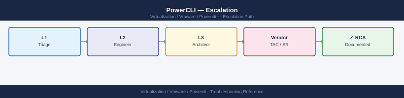

---
tags:
  - powercli
  - troubleshooting
  - vmware
search:
  boost: 1.5
---
# PowerCLI — Escalation

<div class="kb-summary">
How to escalate VMware PowerCLI issues to Broadcom support: what diagnostic data to collect, how to generate a minimal reproduction, step-by-step case creation on support.broadcom.com, and when to use the community vs. a formal SR.

*Applies to: PowerCLI 13.x*
</div>



---

```d2
direction: down

symptom: Identify Symptom {shape: diamond}
when_to_escalate: "When to Escalate" {shape: rectangle}
preescalation_selfcheck: "Pre-Escalation Self-Check" {shape: rectangle}
stepbystep_data_collection: "Step-by-Step Data Collection" {shape: rectangle}
module_version_compatibility: "Module Version Compatibility" {shape: rectangle}
common_api_error_codes: "Common API Error Codes" {shape: rectangle}
how_to_open_the_sr_on_supportbroadco: "How to Open the SR on support.broadcom.com" {shape: rectangle}
resolution: Resolve or Escalate {shape: oval}

symptom -> when_to_escalate: investigate
symptom -> preescalation_selfcheck: investigate
symptom -> stepbystep_data_collection: investigate
symptom -> module_version_compatibility: investigate
symptom -> common_api_error_codes: investigate
symptom -> how_to_open_the_sr_on_supportbroadco: investigate
when_to_escalate -> resolution
preescalation_selfcheck -> resolution
stepbystep_data_collection -> resolution
module_version_compatibility -> resolution
common_api_error_codes -> resolution
how_to_open_the_sr_on_supportbroadco -> resolution
```

## Before you begin

- **Access required:** A PowerShell session with the failing PowerCLI command reproducible; Broadcom support account at support.broadcom.com with active vSphere entitlement (PowerCLI issues are handled under the vSphere product)
- **Check community first** — the VMware {code} community and PowerCLI GitHub issues tab resolve the majority of PowerCLI problems without a formal support case
- **Do NOT clear `$Error`** before capturing diagnostics — the error record contains the full exception chain GSS needs to diagnose the failure
- **Do NOT disable cert validation permanently** with `Set-PowerCLIConfiguration -InvalidCertificateAction Ignore` as a permanent fix — this masks TLS issues and introduces security risk

---

## When to Escalate

| Scenario | Escalation path |
|---|---|
| PowerCLI cmdlet returns undocumented API error (not a permission issue) | VMware Support case |
| Cmdlet behaviour changed after a vCenter upgrade | VMware Support case |
| Module install fails from PowerShell Gallery with non-network errors | VMware Support case |
| Cmdlet parameter documented in help but rejected by the API | VMware Support case |
| Performance regression after PowerCLI or vCenter upgrade (API latency increased) | VMware Support case |
| General "how do I do X" questions | VMware {code} Community, vCommunity Slack |
| Cross-vendor PowerCLI integration questions | Community forums |

---

## Pre-Escalation Self-Check

Run these before opening the case.

| Check | Command | Expected result |
|---|---|---|
| PowerCLI version | `Get-Module VMware.PowerCLI -ListAvailable \| Select Version` | Latest stable for your vCenter version |
| PowerShell version | `$PSVersionTable.PSVersion` | 7.x for best compatibility; 5.1 min |
| Module conflicts | `Get-Module VMware.* -ListAvailable \| Group-Object Name \| Where Count -gt 1` | No duplicate versions |
| vCenter connection | `$global:DefaultVIServers` | Non-empty; IsConnected = True |
| vCenter version | `$global:DefaultVIServers \| Select Name, Version, Build` | Note for SR description |
| PowerCLI config | `Get-PowerCLIConfiguration` | InvalidCertificateAction not Ignore in prod |
| Same op via UI | Log into vSphere Client and perform the same action | Passes (isolates PowerCLI vs. vCenter API) |
| KB check | Search `portal.broadcom.com/s/global-search` for the exact error message | No known issue with a patch |

---

## Step-by-Step Data Collection

### 1. Get PowerCLI and PowerShell version information

```powershell
# PowerShell and OS version
$PSVersionTable | Select-Object PSVersion, PSEdition, OS | Format-List

# All installed PowerCLI/VMware modules
Get-Module -ListAvailable | Where-Object { $_.Name -like 'VMware*' } |
    Select-Object Name, Version | Sort-Object Name | Format-Table -AutoSize

# Active session: currently loaded modules
Get-Module | Where-Object { $_.Name -like 'VMware*' } |
    Select-Object Name, Version | Format-Table -AutoSize

# PowerCLI configuration
Get-PowerCLIConfiguration | Format-Table -AutoSize

# Connected vCenter(s)
$global:DefaultVIServers | Select-Object Name, Version, Build, IsConnected | Format-Table -AutoSize
```

### 2. Capture the full error record

```powershell
# IMPORTANT: run this immediately after the failure — before any other commands
$Error[0] | Format-List * -Force

# Export to file for the SR attachment
$Error[0] | ConvertTo-Json -Depth 5 | Out-File "powercli-error-$(Get-Date -Format 'yyyyMMddHHmm').json"

# Full exception including inner exception
Write-Host "=== Exception Message ==="
Write-Host $Error[0].Exception.Message

Write-Host "`n=== Inner Exception ==="
Write-Host $Error[0].Exception.InnerException

Write-Host "`n=== Stack Trace ==="
Write-Host $Error[0].ScriptStackTrace
```

### 3. Reproduce with verbose and debug logging

```powershell
# Enable verbose mode to see raw API calls in the console
$VerbosePreference = 'Continue'
$DebugPreference = 'Continue'

# Run the EXACT failing command here — capture all output
# Example:
Get-VM -Name "problem-vm" *>&1 | Tee-Object -FilePath "powercli-verbose-$(Get-Date -Format 'yyyyMMddHHmm').txt"

# Reset preferences after capture
$VerbosePreference = 'SilentlyContinue'
$DebugPreference = 'SilentlyContinue'
```

### 4. Enable API trace logging (for API-layer issues)

```powershell
# Enable SOAP/XML trace logging — captures raw API requests and responses
# WARNING: trace files grow quickly — disable after capturing the reproduction

# Set trace file path before connecting
$env:POWERCLI_TRACE_FILE = "C:\temp\powercli-trace-$(Get-Date -Format 'yyyyMMdd').log"

# Or enable on an existing connection
$global:DefaultVIServer.ExtensionData.Client.TraceEnabled = $true

# Reproduce the failing operation here

# Disable tracing
$global:DefaultVIServer.ExtensionData.Client.TraceEnabled = $false
Write-Host "Trace log written to: $env:POWERCLI_TRACE_FILE"
```

### 5. Write a minimal reproduction script

Create the smallest possible script that triggers the failure. Remove all:
- Real hostnames, IPs, usernames, passwords (use placeholders)
- Unrelated logic or loops
- Production-specific data

Example format:

```powershell
# Minimal reproduction for: Get-VM returning SystemError on vCenter 8.0.2
# PowerCLI 13.3.0 | PowerShell 7.4 | vCenter 8.0.2 build XXXXXXXX

Connect-VIServer -Server "vcenter.example.com" -User "readonly@vsphere.local" -Password "REDACTED"

# This line fails with: System.Exception: A specified parameter was not correct
$vm = Get-VM -Name "test-vm-01"
```

---

## Module Version Compatibility

```powershell
# PowerCLI version matrix:
# PowerCLI 13.x → vCenter 8.x (recommended)
# PowerCLI 12.x → vCenter 7.x and 8.x
# PowerCLI 11.x → vCenter 6.7 and 7.x

# Check for compatibility warning when connecting
Connect-VIServer -Server "vcenter.example.com" -Verbose
# Watch for: "The 'VimAutomation.Core' module version X is not supported with vCenter Y"

# Upgrade to the latest PowerCLI
Update-Module -Name VMware.PowerCLI -Force

# Install a specific version for compatibility testing
Install-Module -Name VMware.PowerCLI -RequiredVersion "13.3.0.24145081" -Force -AllowClobber

# Find module conflicts (multiple versions installed)
Get-Module -ListAvailable | Where-Object { $_.Name -like 'VMware*' } |
    Group-Object Name | Where-Object { $_.Count -gt 1 } |
    Select-Object Name, @{N='Versions';E={$_.Group.Version -join ', '}} |
    Format-Table -AutoSize

# Remove old versions (keep latest only)
Get-Module -ListAvailable | Where-Object { $_.Name -like 'VMware*' } |
    Group-Object Name | ForEach-Object {
        $_.Group | Sort-Object Version -Descending | Select-Object -Skip 1 |
        ForEach-Object { Uninstall-Module -Name $_.Name -RequiredVersion $_.Version -Force }
    }
```

---

## Common API Error Codes

| Error | Likely Cause | First Step |
|---|---|---|
| `InvalidLogin` | Wrong credentials or SSO issue | Check service account password; test in vCenter UI |
| `NotAuthenticated` | Session expired or token invalid | Re-connect with `Connect-VIServer` |
| `NoPermission` | Role missing required privilege | Check role in vCenter → Administration → Roles |
| `NotFound` | Object deleted or renamed since script run | Verify object name; check vCenter inventory |
| `InvalidArgument` | Parameter value out of range | Check vSphere API docs for method constraints |
| `SystemError` | vCenter internal error | Check vCenter logs; may require vCenter restart |
| `Fault.VimFault` | Low-level VI API fault | Enable debug and capture full error; open support case |
| `ServerFaultCode` | vCenter returned SOAP fault | Check vCenter's vpxd.log for correlation |
| `HttpException` | TLS/connectivity error | Verify cert settings; test TCP 443 connectivity |

---

## How to Open the SR on support.broadcom.com

1. Go to **support.broadcom.com** and sign in with your Broadcom account.

2. Click **Open a Support Request**.

3. Under **Product Group**, select **VMware Cloud Foundation and Virtualization** → **VMware vSphere** (PowerCLI issues are handled under the vSphere product).

4. Under **Version**, select your vCenter version (the version connected to at the time of the failure).

5. Under **Severity**, select:
   - **Severity 1 — Critical**: A production automation script failure has halted a critical operation (e.g. mass-vMotion, host remediation) with no manual workaround; production is down
   - **Severity 2 — High**: Automation pipeline is broken; significant operational tasks cannot complete; a degraded workaround exists
   - **Severity 3 — Medium**: A specific cmdlet or API call returns an error; manual vSphere Client workaround is available (most PowerCLI SRs are Sev 3)
   - **Severity 4 — Low**: How-to question, pre-upgrade compatibility question, documentation request

6. In the **Summary** field: cmdlet name + symptom + versions. Example: `PowerCLI 13.3 Get-VM returns SystemError on vCenter 8.0.2 — worked on vCenter 8.0.1 — production automation pipeline broken`.

7. In the **Description** field, paste:
   - PowerCLI and PowerShell versions from Step 1
   - vCenter version from Step 1
   - The full error record from Step 2
   - Whether the same operation works in the vCenter UI
   - When the issue first appeared (after upgrade? always?)
   - The minimal reproduction steps from Step 5

8. Under **Attachments**, upload:
   - The error JSON from Step 2
   - The verbose output from Step 3
   - The API trace log from Step 4 (if captured)
   - The minimal reproduction script from Step 5

9. Click **Submit**. You will receive a case number by email immediately.

10. **Severity 1 only:** call Broadcom/VMware support after submission:
    - North America: +1 877-486-9273 (24×7 for Severity 1)
    - EMEA: +44 (0)3453 700 100
    - State "Severity 1 — PowerCLI — production automation pipeline down, [specific cmdlet] failing on vCenter [version]" at the start of the call.

---

## Escalation Path

```text
Step 1 — Check VMware {code} community (code.vmware.com) and PowerCLI GitHub issues tab
         ↓
Step 2 — Open case at support.broadcom.com (under VMware vSphere product)
         Attach: error JSON, verbose log, minimal repro, versions
         ↓
Step 3 — T1 engineer acknowledges and reviews the repro (Sev3: < 8 hr; Sev1: < 30 min)
         ↓
Step 4 — If no meaningful progress within SLA:
         → Reply: "Requesting escalation to PowerCLI Senior Engineer"
         → State: "[cmdlet name / vCenter version / production impact]"
         ↓
Step 5 — PowerCLI T2 Senior Engineer assigned
         → They will review the API trace and may request a live session
         → Have the minimal repro ready to run in a shared screen session
         ↓
Step 6 — If confirmed product defect:
         → T2 escalates to the PowerCLI Product Team (T3)
         → T3 may provide a workaround script or an emergency hotfix module build
```

---

## What NOT to Do

| Do NOT do this | Why | What to do instead |
|---|---|---|
| Clear `$Error` before capturing diagnostics | The error record contains the full exception chain; once cleared it cannot be recovered | Capture `$Error[0] \| ConvertTo-Json -Depth 5` immediately after the failure |
| Run destructive cmdlets to reproduce the issue | Commands like `Remove-VM`, `Set-VMHost -State Disconnected`, or `Remove-Datastore` on a production environment can cause outages | Build a minimal repro in a test environment or against a test object |
| Set `InvalidCertificateAction = Ignore` as a permanent fix | Disables TLS certificate validation for all future connections; masks real connectivity issues and introduces security risk | Fix the certificate issue; if urgent, use `Ignore` temporarily and revert after the fix |
| Upgrade PowerCLI in the middle of an active incident | A version change mid-incident changes the module code GSS is analysing; may introduce new behaviour | Freeze the PowerCLI version during the case; test the new version in isolation after the issue is understood |
| Remove and reinstall all VMware.* modules without backing up the list | May change the installed version set GSS is using to replicate the issue | Note all installed versions first (`Get-Module VMware.* -ListAvailable`); only remove after GSS advises |
| Run `Update-Module VMware.PowerCLI` on a production automation host mid-case | Upgrades may change cmdlet behaviour; the updated version may not reproduce the original issue | Test the upgrade in a non-production environment; only apply to production after the case is closed |

---

## Useful Commands for Case Updates

```powershell
# Paste these into every case update

# Connected vCenter state
$global:DefaultVIServers | Select-Object Name, Version, Build, IsConnected | Format-Table

# Active PowerCLI module versions
Get-Module | Where-Object { $_.Name -like 'VMware*' } |
    Select-Object Name, Version | Sort-Object Name | Format-Table

# Latest error record (run immediately after the failure)
$Error[0] | Format-List * -Force

# PowerCLI configuration
Get-PowerCLIConfiguration | Format-Table -AutoSize

# Re-run the failing command with verbose output
$VerbosePreference = 'Continue'
# <paste failing command here>
$VerbosePreference = 'SilentlyContinue'
```

---

## Community Resources

| Resource | Best For |
|---|---|
| VMware {code} Community (`code.vmware.com`) | Official forums; VMware staff engagement |
| vCommunity Slack (`#powercli` channel) | Quick questions; community answers |
| PowerCLI GitHub (`github.com/vmware/PowerCLI-Example-Scripts`) | Sample scripts; known issue tracking |
| PowerCLI documentation (`developer.vmware.com/docs/powercli`) | Cmdlet reference; release notes |
| VMTN Community Boards (`communities.vmware.com`) | Broader vSphere/VMware questions |
| Stack Overflow tag `[vmware-powercli]` | Scripting and PowerShell questions |

---

## Support SLA Reference

| Severity | Definition | Initial Response SLA |
|---|---|---|
| Sev 1 — Critical | Production automation failure; critical operation halted; no manual workaround | < 30 min (24×7) |
| Sev 2 — High | Automation pipeline broken; significant tasks cannot complete; degraded workaround | < 2 hours (24×7) |
| Sev 3 — Medium | Specific cmdlet or API call failing; manual UI workaround available (most PowerCLI SRs) | < 8 hours |
| Sev 4 — Low | How-to, pre-upgrade, compatibility, documentation question | Next business day |

---

## See also

- [PowerCLI — Diagnostics](../diagnostics/)
- [PowerCLI — Common Issues](../common-issues/)

---

## Verify resolution

- Run the previously failing command and confirm it completes without error
- Confirm `$Error[0]` does not show the original exception
- Run `Get-Module \| Where Name -like 'VMware*' \| Select Name, Version` and confirm the correct module versions are loaded
- If the fix involved a PowerCLI upgrade: run `Connect-VIServer -Server <vcenter> -Verbose` and confirm no compatibility warning appears
- If the fix involved a vCenter configuration change: test from a clean PowerShell session (not cached state)
- Run the automation script or pipeline end-to-end in a non-production environment and confirm it completes successfully before returning to production
