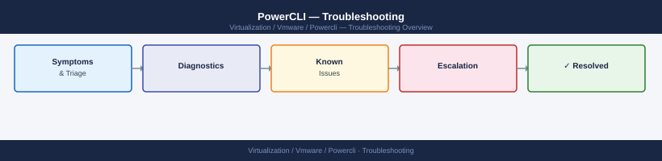

---
tags:
  - powercli
  - troubleshooting
  - vmware
search:
  boost: 1.5
---
# PowerCLI — Troubleshooting

Diagnosing and resolving PowerCLI issues: connection failures, module conflicts, API errors, certificate problems, and performance issues with large inventories.

*Applies to: PowerCLI 13.x*

<a class="kb-card" href="common-issues/">
  <strong>Common Issues</strong>
  Connection failures, certificate errors, module not found, cmdlet parameter errors, and session timeouts.
</a>

<a class="kb-card" href="diagnostics/">
  <strong>Diagnostics</strong>
  Debug mode, API call tracing, performance profiling, and log collection for escalation.
</a>

<a class="kb-card" href="escalation/">
  <strong>Escalation</strong>
  Diagnostic info collection, VMware support case process, API error codes, and community resources.
</a>

