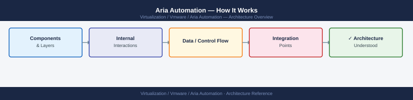
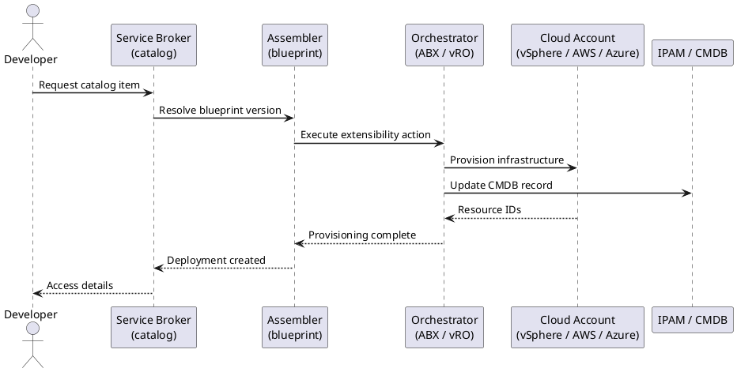

---
tags:
  - architecture
  - aria-automation
  - vmware
description: "How It Works reference covering Overview, Deployment Models, Cluster Topology, Cloud Account Types, Appliance Sizing and 2 more sections."
---
# Aria Automation — How It Works

<div class="kb-summary">
How It Works reference covering Overview, Deployment Models, Cluster Topology, Cloud Account Types, Appliance Sizing and 2 more sections.

*Applies to: Aria Automation 8.x*
</div>




## Overview

Aria Automation (formerly vRealize Automation) is available as a **SaaS offering** or an **on-premises appliance cluster**. The on-premises deployment is a Kubernetes-based microservices platform. All infrastructure provisioning flows through cloud templates (YAML IaC), projects, and cloud zones — Aria Automation resolves placement constraints and orchestrates provisioning without hardcoded infrastructure references.

## Deployment Models

| Model | Description |
|---|---|
| SaaS (Cloud) | VMware-hosted; no infrastructure to manage; connected via cloud extensibility proxy |
| On-Premises | 1 or 3 appliance cluster; self-managed; supports air-gap environments |

## Cluster Topology

```d2
direction: right

CAT: "Service Catalog\n(consumer portal" {shape: rectangle}
ORCH: "Aria Automation Orchestrator\n(workflow engine" {shape: rectangle}
IAAS: "IaaS Service\n(compute engine" {shape: rectangle}
VCTR: "vCenter\n(VM provisioning" {shape: rectangle}
NSX_T: "NSX\n(network provisioning" {shape: rectangle}
CLOUDS: "Public Cloud\nAWS · Azure · GCP" {shape: rectangle}
ADMIN: "Cloud Admin" {shape: rectangle}

CAT -> ORCH
ORCH -> IAAS
IAAS -> VCTR
IAAS -> NSX_T
IAAS -> CLOUDS
ADMIN -> CAT
```

## Cloud Account Types

| Cloud Account | Managed Resources |
|---|---|
| vCenter (vSphere) | VMs, networks, datastores, clusters |
| NSX-T | Overlay segments, security groups, load balancers |
| AWS | EC2, VPC, S3 |
| Azure | VMs, VNets, storage |
| GCP | Compute Engine, VPC |
| Kubernetes | Pod deployments, services |

## Appliance Sizing

| Size | vCPUs | RAM | Disk | Deployments/day |
|---|---|---|---|---|
| Small (1 node) | 8 | 32 GB | 100 GB | Up to 100 |
| Medium (3 nodes) | 16 per node | 48 GB per node | 100 GB per node | Up to 500 |
| Large (3 nodes) | 24 per node | 64 GB per node | 150 GB per node | 500+ |

## Network Ports

| Port | Protocol | Direction | Purpose |
|---|---|---|---|
| 443 | TCP | Inbound | Web UI and REST API |
| 22 | TCP | Inbound | SSH admin access |
| 5480 | TCP | Inbound | VAMI appliance management |
| 443 | TCP | Outbound | vCenter, NSX, Orchestrator, VIDM APIs |
| 5432 | TCP | Cluster-internal | PostgreSQL replication |
| 5671/5672 | TCP | Cluster-internal | RabbitMQ messaging |

## Event Broker Topics (ABX / Extensibility)

| Event Topic | When It Fires |
|---|---|
| `Deployment.Provision.Post` | After all resources provisioned successfully |
| `Deployment.Provision.Pre` | Before provisioning (use for validation) |
| `Deployment.Destroy.Post` | After deployment deleted |
| `Deployment.Resize.Post` | After a VM resize Day-2 action |

## See also

- [Aria Automation — Standards](../design-standards/)
- [Aria Automation — Deploy](../../deploy/)
- [Aria Automation — Integrations](../integrations/)
