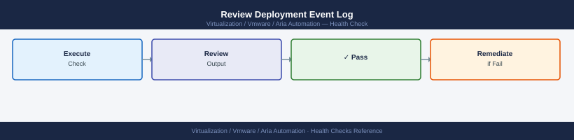

---
tags:
  - aria-automation
  - operations
  - vmware
---
# Aria Automation — Health Checks

<div class="kb-summary">
Health Checks reference covering Daily Checks, Weekly Checks, Pre-Maintenance Checks, Platform Service Health Commands.

*Applies to: Aria Automation 8.x*
</div>

## Before you begin

- **Access:** vCenter read-only minimum; Administrator role for remediation steps
- **Timing:** safe to run during business hours unless a step is marked ⚠ (causes interruption)
- **Dependencies:** no active upgrades or migrations on the same infrastructure
- **Logging:** capture command output — paste into the change record on completion

---

## Daily Checks


### Cloud Account Status


All vCenter and NSX cloud accounts must show a green status indicator:

## Run This Routine

Run these 8 checks in order at the start of each shift or before any planned change.

1. **vRA service health** — `curl -sk https://<vra-fqdn>/health` — expect HTTP 200 OK; a non-200 response means one or more services are unhealthy
2. **Pod health** — SSH to appliance → `kubectl get pods -n prelude | grep -v Running` — any non-Running pod needs investigation
3. **Cloud account connectivity** — Infrastructure → Cloud Accounts → confirm all accounts show Connected; re-test credentials on any showing errors
4. **vCenter data collection** — check the last collection timestamp for each cloud account; flag any account where collection has not run in the last 30 minutes
5. **Catalog item count** — Service Broker → Content → Catalog Items → verify the expected number of items is present and visible to consumers
6. **Recent failed deployments** — `curl -sk -H "Authorization: Bearer $TOKEN" "https://<vra>/deployment/api/deployments?status=CREATE_FAILED"` — review and action any failures
7. **Certificate expiry** — `openssl s_client -connect <vra-fqdn>:443 </dev/null 2>/dev/null | openssl x509 -noout -dates` — flag any cert expiring within 30 days
8. **ABX / FaaS connectivity** — Extensibility → Actions → run a simple test action manually and confirm it completes without error

---

### Review Deployment Event Log



```text
Deployments → All Deployments → filter by "Failed" status
```

Failed deployments should be investigated, even if they are not actively blocking users. Persistent failures in a specific cloud zone may indicate a resource, network, or credential issue.

```bash
# API — list recent failed deployments
curl -sk -H "Authorization: Bearer $TOKEN" \
  "https://vra-prod-01.example.local/deployment/api/deployments?status=FAILED&size=20" | \
  jq '.content[] | {name: .name, status: .status, reason: .reason}'
```


```text title="Expected output"
{
  "name": "web-app-prod-deploy-2024-01-15",
  "status": "FAILED",
  "reason": "Insufficient vSphere cluster resources"
}
{
  "name": "db-migration-v3.2.1",
  "status": "FAILED",
  "reason": "Blueprint validation error: missing required input 'environment'"
}
{
  "name": "kubernetes-upgrade-jan",
  "status": "FAILED",
  "reason": "vRealize Orchestrator workflow timeout after 1800 seconds"
}
{
  "name": "storage-expansion-dc2",
  "status": "FAILED",
  "reason": "Network connectivity lost to vSAN cluster"
}
{
  "name": "app-tier-scale-out",
  "status": "FAILED",
  "reason": "Cloud account credentials expired"
}
```

!!! warning "Common errors"
    **`curl: (60) SSL certificate problem: self signed certificate`** — Add `-k` flag to skip certificate verification (already present; if still failing, verify the hostname matches the certificate CN).
    **`jq: parse error: Cannot index string with string "content"`** — Ensure the API response is valid JSON and the token has read permissions; test with `curl -sk ... | jq '.'` to inspect raw output.
    **`curl: (401) Unauthorized`** — Regenerate the bearer token (`$TOKEN`) in vRealize Automation under Administration > API Tokens and ensure it has not expired.
---

## Weekly Checks


### Pending Approval Requests


Review and action approval requests older than 5 business days:

```text
Catalog → Deployments → Pending Approvals
```

Escalate stale requests (user not responding) or reject if the requester has left the organisation.

---

### Quota Utilisation


Check whether any projects are approaching their VM or CPU/memory quota limits:

```text
Infrastructure → Administration → Projects → select project → Quota
```

Projects at >80% quota will start failing new deployments without a clear error to end users. Review and extend quotas proactively.

---

### Deployment Lease Expiry


```text
Deployments → All Deployments → filter by lease expiry in next 7 days
```

Contact deployment owners for renewals or confirm expiry is intended. Expired deployments are automatically deleted according to the lease policy — ensure owners have been warned.

---

### Service Certificate Expiry


```bash
# Check Aria Automation UI certificate expiry
echo | openssl s_client -connect vra-prod-01.example.local:443 2>/dev/null | \
  openssl x509 -noout -dates

# Check VAMI certificate expiry
echo | openssl s_client -connect vra-prod-01.example.local:5480 2>/dev/null | \
  openssl x509 -noout -dates
```


```text title="Expected output"
notBefore=Jan 15 10:23:45 2023 GMT
notAfter=Jan 15 10:23:45 2024 GMT
notBefore=Jan 15 10:23:45 2023 GMT
notAfter=Jan 15 10:23:45 2024 GMT
```

!!! warning "Common errors"
    **`unable to load certificate`** — Ensure the hostname resolves correctly and the appliance is reachable on both ports 443 and 5480 using `ping` and `telnet vra-prod-01.example.local 443`.
    **`error in x509 parsing`** — The SSL connection succeeded but the certificate format is invalid; regenerate the certificate on the Aria Automation appliance via VAMI or re-issue it through your certificate authority.
    **`Connection refused`** — Verify the Aria Automation services are running with `systemctl status vra-service` on the appliance and check firewall rules allow inbound traffic to ports 443 and 5480.
---

## Pre-Maintenance Checks


Run before any planned change (upgrade, certificate rotation, cloud account re-credential):

- [ ] No deployments in progress: **Deployments → All Deployments** — no CREATING or UPDATING state
- [ ] All cloud accounts green
- [ ] All Kubernetes pods Running: `kubectl get pods --all-namespaces | grep -v Running | grep -v Completed`
- [ ] Backup completed successfully within the last 24 hours (VAMI → Lifecycle Management → Backup)
- [ ] VM snapshots taken for all Aria Automation appliance nodes
- [ ] Inform users of maintenance window

---

## Platform Service Health Commands


```bash
ssh root@vra-prod-01.example.local

# Overall appliance and service health
vracli status

# Show cluster member status (for 3-node deployments)
vracli cluster health

# Show current Aria Automation version
vracli version

# Restart a specific Kubernetes deployment (use as last resort — pods self-heal)
kubectl rollout restart deployment/<deployment-name> -n prelude

# View recent events in the prelude namespace (useful for deployment failures)
kubectl get events -n prelude --sort-by='.metadata.creationTimestamp' | tail -30
```


```text title="Expected output"
root@vra-prod-01:~# vracli status
Service Status Report
=====================
vra-service:           RUNNING
postgres-service:      RUNNING
rabbitmq-service:      RUNNING
kubernetes-service:    RUNNING
Overall Status:        HEALTHY

root@vra-prod-01:~# vracli cluster health
Cluster Status: HEALTHY
Node: vra-prod-01.example.local (10.20.15.42) - READY
Node: vra-prod-02.example.local (10.20.15.43) - READY
Node: vra-prod-03.example.local (10.20.15.44) - READY
Quorum: ESTABLISHED

root@vra-prod-01:~# vracli version
Aria Automation Version: 8.14.2
Build: 22891234
Release Date: 2024-01-15

root@vra-prod-01:~# kubectl rollout restart deployment/vra-api -n prelude
deployment.apps/vra-api restarted

root@vra-prod-01:~# kubectl get events -n prelude --sort-by='.metadata.creationTimestamp' | tail -30
NAMESPACE   LAST SEEN   TYPE      REASON             OBJECT                    MESSAGE
prelude     2m42s       Normal    Scheduled          pod/vra-api-7d8c9f2k1    Successfully assigned prelude/vra-api-7d8c9f2k1 to vra-prod-02
prelude     2m38s       Normal    Pulling            pod/vra-api-7d8c9f2k1    Pulling image "vra-api:8.14.2"
prelude     2m15s       Normal    Pulled             pod/vra-api-7d8c9f2k1    Successfully pulled image
prelude     2m12s       Normal    Created            pod/vra-api-7d8c9f2k1    Created container vra-api
prelude     2m11s       Normal    Started            pod/vra-api-7d8c9f2k1    Started container vra-api
```

!!! warning "Common errors"
    **`error: unable to connect to the server: dial tcp: lookup vra-prod-01.example.local on 10.20.15.1:53: no such host`** — Verify DNS resolution or use the IP address directly (e.g., `ssh root@10.20.15.42`).
    **`command not found: vracli`** — Ensure you are logged into the Aria Automation appliance root shell and the vracli utility is in the PATH; try `/opt/vmware/vra/bin/vracli` if needed.
    **`error: the server doesn't have a resource type "deployment"`** — Confirm you are using the correct kubectl context for the Aria Automation cluster; run `kubectl config current-context` to verify.
---

## See also

- [Aria Automation — Common Issues](../../troubleshooting/common-issues/)
- [Aria Automation — Operational Procedures](../procedures/)
- [Aria Automation — CLI Reference](../cli-reference/)

## Verify

- **Alarms:** vSphere Client → Home → Alarms — no new critical alarms after the operation
- **Events:** monitor the vCenter Events view for the affected object for 5 minutes
- **Health check:** run the morning health-check sequence for the affected product tier
