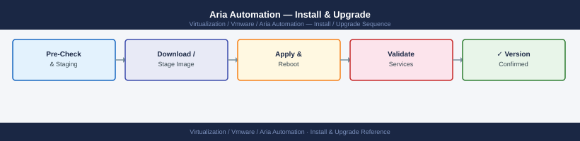

---
tags:
  - aria-automation
  - operations
  - vmware
---
# Aria Automation — Install & Upgrade

<div class="kb-summary">
Install & Upgrade reference covering Version Matrix, Initial Deployment (New Environment), Pre-Upgrade Checklist, Post-Upgrade Validation, EOL Tracking and 2 more sections.

*Applies to: Aria Automation 8.x*
</div>


## Before you begin

- **Access:** vCenter read-only minimum; Administrator role for remediation steps
- **Timing:** safe to run during business hours unless a step is marked ⚠ (causes interruption)
- **Dependencies:** no active upgrades or migrations on the same infrastructure
- **Logging:** capture command output — paste into the change record on completion

---

!!! warning "Host enters maintenance mode"
    ESXi remediation puts hosts into maintenance mode, triggering DRS evacuation. Confirm DRS is Fully Automated and HA admission control is satisfied before starting.

## Version Matrix

| Product Name | Version | vSphere Compatibility | Notes |
|---|---|---|---|
| vRealize Automation | 8.10 | vSphere 7.0 U3+ | LTS release |
| vRealize Automation | 8.11 | vSphere 7.0 U3+, 8.0 | |
| Aria Automation | 8.12 | vSphere 7.0 U3+, 8.0 U1+ | Rebranded from vRA |
| Aria Automation | 8.13 | vSphere 7.0 U3+, 8.0 U2+ | |
| Aria Automation | 8.14+ | vSphere 8.0 U2+ | Current GA |
| Aria Automation (SaaS) | Always current | N/A — cloud-hosted | No patching required |

Always verify the VMware Product Interoperability Matrix before upgrading: [https://interopmatrix.vmware.com](https://interopmatrix.vmware.com)

---

## Initial Deployment (New Environment)

### Via vRealize Easy Installer (Recommended for Greenfield)

The Easy Installer ISO automates the end-to-end deployment of LCM + VIDM + Aria Automation in a single wizard:

1. Download the Easy Installer ISO from Broadcom Support Portal
2. Mount the ISO on a Windows or Linux installer machine
3. Launch the installer UI: `./install.exe` or `./install.sh`
4. The wizard collects all network parameters (IPs, FQDNs, DNS, NTP, vCenter targets) in a single workflow
5. Easy Installer deploys: Aria Suite Lifecycle → Workspace ONE Access → Aria Automation
6. After completion, log into LCM to manage the environment

### Via LCM (Adding Aria Automation to Existing LCM Environment)

If LCM is already deployed and Aria Automation needs to be added:

---

## Pre-Upgrade Checklist

Run this checklist before initiating any upgrade:

- [ ] Current version and target version interoperability verified in the VMware Interop Matrix
- [ ] LCM version supports the target Aria Automation version (check LCM release notes)
- [ ] All Aria Automation services are healthy: `vracli status` — no failed pods or services
- [ ] All cloud accounts show a green status: **Infrastructure → Connections → Cloud Accounts**
- [ ] No deployments in **CREATING**, **UPDATING**, or **DELETING** state
- [ ] No approval requests stuck in **PENDING_APPROVAL** for more than the auto-reject window
- [ ] Backup completed successfully within last 24 hours (VAMI → Lifecycle Management → Backup)
- [ ] Backup passphrase documented and accessible
- [ ] VM snapshots taken for all Aria Automation appliance nodes
- [ ] Sufficient free disk space on appliance: `df -h /` — minimum 20 GB free recommended
- [ ] Maintenance window communicated to users (catalog will be unavailable during upgrade)
- [ ] Downstream integrations notified: ServiceNow, Ansible Tower, monitoring systems

```bash
# Pre-upgrade disk and service check on appliance
ssh root@vra-prod-01.example.local

# Disk space
df -h / /var

# Pod health — no CrashLoopBackOff or Pending pods
kubectl get pods --all-namespaces | grep -v "Running\|Completed\|Succeeded"

# Service health
vracli status

# Confirm backup is current
vracli backup status
```


```text title="Expected output"
root@vra-prod-01:~# df -h / /var
Filesystem      Size  Used Avail Use% Mounted on
/dev/sda1        50G   32G   15G  68% /
/dev/sda2       100G   45G   52G  46% /var

root@vra-prod-01:~# kubectl get pods --all-namespaces | grep -v "Running\|Completed\|Succeeded"
NAMESPACE              NAME                                          READY   STATUS
vra                    vra-catalog-7d4f2c8b9-kx2m1                  1/1     Running
vra                    vra-orchestrator-5c9e1a3d2-jq8p9              1/1     Running
vra                    vra-iaas-proxy-8f2b4e6c1-lw3k5                1/1     Running
vra                    vra-ng-custom-resource-7a1c9d5e-mp2l8         1/1     Running
kube-system            coredns-558bd4d5db-9x7m2                      1/1     Running

root@vra-prod-01:~# vracli status
vra-catalog                    RUNNING
vra-orchestrator               RUNNING
vra-iaas-proxy                 RUNNING
vra-ng-custom-resource         RUNNING
vra-identity                   RUNNING

root@vra-prod-01:~# vracli backup status
Backup Status: COMPLETED
Last Backup: 2024-01-15 03:45:22 UTC
Backup Location: /mnt/backup/vra-prod-01-20240115-034522.tar.gz
Backup Size: 18.7 GB
```

!!! warning "Common errors"
    **`df: cannot access '/var': No such file or directory`** — Verify the mount point exists or adjust the command to check only mounted filesystems with `df -h /`.
    **`error: unable to connect to the server: dial tcp: lookup kubernetes.default on 10.0.2.2:53: no such host`** — Ensure kubectl is configured with the correct kubeconfig context using `kubectl config use-context <context-name>`.
    **`vracli: command not found`** — Add the vracli binary path to your shell environment with `export PATH=$PATH:/opt/vmware/vra/bin` or use the full path `/opt/vmware/vra/bin/vracli`.
---

## Post-Upgrade Validation

Run immediately after the upgrade completes:

```bash
# Confirm installed version matches target
ssh root@vra-prod-01.example.local
vracli version

# Confirm all pods are Running
kubectl get pods --all-namespaces | grep -v "Running\|Completed\|Succeeded"
# Expected: no output (all pods healthy)

# Confirm cluster node status (3-node deployments)
vracli cluster health
```


```text title="Expected output"
vRA version 8.10.2 Build 20231015
vRA Kubernetes version: 1.26.8
vRA Database version: 12.1.0.192.0

NAMESPACE              NAME                                          READY   STATUS    RESTARTS   AGE
vra                    vra-server-0                                  1/1     Running   0          45d
vra                    vra-server-1                                  1/1     Running   0          45d
vra                    vra-iaas-proxy-0                              1/1     Running   2          45d
vra                    vra-postgres-0                                1/1     Running   0          45d
vra                    vra-rabbitmq-0                                1/1     Running   1          45d
vra                    vra-config-server-0                           1/1     Running   0          45d

Cluster Health Status: HEALTHY
Node vra-prod-01.example.local: HEALTHY (Leader)
Node vra-prod-02.example.local: HEALTHY (Follower)
Node vra-prod-03.example.local: HEALTHY (Follower)
Cluster Quorum: 3/3 nodes available
Last health check: 2024-01-18 14:32:15 UTC
```

!!! warning "Common errors"
    **`bash: vracli: command not found`** — Ensure you are logged into the vRA appliance via SSH and vracli is in the PATH; check that vRA is fully initialized with `systemctl status vra-server`.
    **`error: You must be logged in to the server`** — Authenticate to the Kubernetes cluster with `kubectl config use-context vra-admin` or verify kubeconfig permissions.
    **`Cluster Health Status: UNHEALTHY - Node vra-prod-03.example.local: UNREACHABLE`** — Check network connectivity to the unreachable node and verify the vRA cluster service is running with `systemctl status vra-cluster` on that node.
Via UI validation:

- [ ] Log into Aria Automation UI — authentication works (VIDM redirect succeeds)
- [ ] Version string in Administration → About matches the target version
- [ ] All cloud accounts show green status: **Infrastructure → Connections → Cloud Accounts**
- [ ] Re-enter credentials for each cloud account and validate: **Edit → Validate**
- [ ] Cloud zones and image/flavor mappings are intact
- [ ] Templates present in **Design → Cloud Templates**
- [ ] Existing deployment records visible in **Deployments → All Deployments**
- [ ] Test a simple deployment from a non-production catalog item (smoke test)
- [ ] ABX actions and event broker subscriptions are active
- [ ] Pipeline definitions are intact (if Automation Pipelines is in use)
- [ ] Remove VM snapshots within 48 hours of a confirmed successful upgrade

---

## EOL Tracking

VMware/Broadcom product lifecycle pages are the authoritative source for version EOS dates:
- [https://lifecycle.vmware.com](https://lifecycle.vmware.com)
- [https://support.broadcom.com/group/ecx/productlifecycle](https://support.broadcom.com/group/ecx/productlifecycle)

Key lifecycle phases:

| Phase | Definition | Action |
|---|---|---|
| General Support | Full patches, updates, and security fixes | Maintain within this phase |
| Technical Guidance | Security patches only; no new features | Plan upgrade before this phase |
| End of Life | No patches or support | Upgrade immediately |

Alert at 90 days before the End of General Support date for the installed version.

---

## Patch Cadence

On-premises deployments receive updates via LCM. SaaS deployments receive updates automatically from VMware.

For on-premises:
- Review Broadcom Security Advisories monthly: [https://support.broadcom.com/web/ecx/security-advisory](https://support.broadcom.com/web/ecx/security-advisory)
- Apply critical security patches within the change freeze exception window (do not wait for the next planned upgrade cycle for critical-severity patches)
- Apply non-critical patches during scheduled quarterly maintenance windows
- Test all patches in a non-production environment before applying to production

---

## Rollback Procedure

If an upgrade fails or post-upgrade validation reveals critical issues:

**Via LCM (recommended):**

If LCM managed the upgrade:
1. Navigate to **Lifecycle Operations → Requests → select the failed upgrade request**
2. Click **Rollback** — LCM reverts all Aria Automation VMs to the pre-upgrade snapshots
3. Monitor rollback progress in **Requests**
4. After rollback completes, verify the previous version is running: `vracli version`

**Manual snapshot revert:**

If LCM rollback is not available:
1. Power off all Aria Automation VMs (coordinate — all services will stop)
2. Revert each VM to the pre-upgrade snapshot from vCenter
3. Power on the VMs in order: node 1 → node 2 → node 3 (for 3-node clusters)
4. Wait 5 minutes for services to start
5. Verify services: `vracli status` and `kubectl get pods --all-namespaces`
6. Open a Broadcom SR if the rollback succeeds but the root cause of the upgrade failure needs investigation before retrying

---

## See also

- [Aria Automation — Health Checks](../health-checks/)
- [Aria Automation — Common Issues](../../troubleshooting/common-issues/)
- [Aria Automation — Operational Procedures](../procedures/)

## Verify

- **Alarms:** vSphere Client → Home → Alarms — no new critical alarms after the operation
- **Events:** monitor the vCenter Events view for the affected object for 5 minutes
- **Health check:** run the morning health-check sequence for the affected product tier
