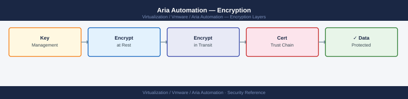

---
tags:
  - aria-automation
  - security
  - vmware
description: "Encryption reference covering Secrets and Encrypted Properties, TLS Certificate Management, Data at Rest Encryption, Kubernetes Secret Management."
---
# Aria Automation — Encryption

<div class="kb-summary">
Encryption reference covering Secrets and Encrypted Properties, TLS Certificate Management, Data at Rest Encryption, Kubernetes Secret Management.

*Applies to: Aria Automation 8.x*
</div>


## Before you begin

- **Access:** vCenter Administrator role
- **Change management:** security changes require CAB approval in most environments
- **Rollback plan:** document current state before any security control change
- **Testing:** validate in a non-production environment first where possible

---

## Secrets and Encrypted Properties

Sensitive values (passwords, API tokens, SSH keys) must not be stored as plaintext in cloud templates. Use one of the following methods:

### Encrypted Property Groups

Encrypted Property Groups store sensitive key-value pairs at the Aria Automation level. Values are encrypted at rest and never appear in deployment event logs or API responses.

Provide:
- Vault URL: `https://vault.example.local:8200`
- Authentication method: AppRole or Kubernetes JWT
- AppRole Role ID and Secret ID

Reference Vault secrets in cloud templates:

```yaml
resources:
  vm:
    type: Cloud.vSphere.Machine
    properties:
      cloudConfig: |
        #cloud-config
        runcmd:
          - DB_PASS=$(vault kv get -field=password secret/app/db) && configure-app.sh
```

### ABX Action Secrets

For ABX actions, store secrets as **Action Constants** (encrypted at rest):

```text
Extensibility → Actions → select action → Constants → Add
```

Constants are injected as environment variables at runtime:

```python
def handler(context, inputs):
    api_key = context.getSecret(inputs["apiKeyConstant"])
    # Never log or return secrets
```

---

## TLS Certificate Management

### Replacing the UI Certificate

**Via LCM (recommended for LCM-managed deployments):**

1. Import the new certificate into LCM Locker
2. **LCM → Lifecycle Operations → Aria Automation product → Replace Certificate**
3. LCM applies the certificate to all Aria Automation nodes

**Via vracli (standalone deployments):**

```bash
ssh root@vra-prod-01.example.local

# Import certificate files
vracli certificate import \
  --cert /tmp/vra-prod-01.pem \
  --key /tmp/vra-prod-01.key \
  --ca /tmp/chain.pem

# Verify the certificate is active
echo | openssl s_client -connect vra-prod-01.example.local:443 2>/dev/null | \
  openssl x509 -noout -subject -dates -issuer
```


```text title="Expected output"
root@vra-prod-01:~# vracli certificate import \
>   --cert /tmp/vra-prod-01.pem \
>   --key /tmp/vra-prod-01.key \
>   --ca /tmp/chain.pem
Certificate import initiated...
Validating certificate chain...
Installing certificate to keystore...
Certificate successfully imported and installed.
Services will be restarted to apply changes.
Waiting for services to stabilize... (this may take 2-3 minutes)
Services restarted successfully.

subject=CN = vra-prod-01.example.local, O = Example Corp, C = US
notBefore=Jan 15 10:22:33 2024 GMT
notAfter=Jan 15 10:22:33 2025 GMT
issuer=CN = Example Corp Intermediate CA, O = Example Corp, C = US
```

!!! warning "Common errors"
    | Error | Fix |
    |---|---|
    | `error: certificate file not found: /tmp/vra-prod-01.pem` | Verify the certificate file exists and the path is correct with `ls -la /tmp/vra-prod-01.pem`. |
    | `error: certificate and key do not match` | Ensure the certificate and private key pair are from the same CSR by comparing their modulus with `openssl x509 -noout -modulus -in /tmp/vra-prod-01.pem | openssl md5` and `openssl rsa -noout -modulus -in /tmp/vra-prod-01.key | openssl md5`. |
    | `error: CA certificate chain is invalid or incomplete` | Verify the chain file contains all intermediate certificates in the correct order (leaf to root) and is in PEM format with `openssl crl2pkcs7 -nocrl -certfile /tmp/chain.pem | openssl pkcs7 -print_certs -text -noout`. |
### Certificate Requirements

| Requirement | Value |
|---|---|
| Algorithm | RSA 4096-bit (minimum RSA 2048-bit) |
| Signature | SHA-256 |
| SAN entries | All node FQDNs + load balancer VIP (if deployed behind an LB) |
| Maximum validity | 2 years; 1 year preferred |
| Private key | Unencrypted PEM (no passphrase) |
| Chain | Full chain — leaf + intermediate(s) + root in single PEM |

### Tracking Certificate Expiry

```bash
# Check expiry for all cluster nodes
for node in vra-prod-01 vra-prod-02 vra-prod-03; do
  echo -n "$node.example.local: "
  echo | openssl s_client -connect "$node.example.local:443" 2>/dev/null | \
    openssl x509 -noout -enddate 2>/dev/null
done
```


```text title="Expected output"
vra-prod-01.example.local: notAfter=Dec 15 14:32:18 2025 GMT
vra-prod-02.example.local: notAfter=Dec 15 14:32:18 2025 GMT
vra-prod-03.example.local: notAfter=Dec 15 14:32:18 2025 GMT
```

!!! warning "Common errors"
    | Error | Fix |
    |---|---|
    | `unable to get local issuer certificate` | Add `-showcerts` to capture the full chain, or disable verification with `-servername` and check against your internal CA bundle. |
    | `Connection refused` | Verify the node hostname resolves correctly with `nslookup node.example.local` and confirm port 443 is listening with `netstat -tlnp | grep 443` on the target node. |
Set a calendar reminder or monitoring alert 60 days before expiry.

---

## Data at Rest Encryption

Aria Automation stores all state in its embedded PostgreSQL database. Native application-level encryption of the database is not included. Apply encryption at the storage layer:

- **vSAN Data-at-Rest Encryption**: enable on the datastore hosting Aria Automation VMs
- **SAN/NAS volume encryption**: enable at the array level for external storage
- **vSphere VM Encryption**: encrypt VM virtual disks via a vSphere encryption storage policy

```powershell
# PowerCLI — verify VM disk encryption
Get-VM | Where-Object { $_.Name -like "vra-*" } | Get-HardDisk |
  Select-Object @{N="VM";E={$_.Parent.Name}}, Name,
  @{N="Encrypted";E={$_.ExtensionData.Backing.KeyId -ne $null}}
```

---

## Kubernetes Secret Management

Aria Automation stores internal service credentials in Kubernetes secrets. These are base64-encoded by default — not encrypted at rest unless the Kubernetes data store (etcd) has encryption at rest enabled.

```bash
# List Kubernetes secrets in the prelude namespace (admin access only)
kubectl get secrets -n prelude

# Never expose Kubernetes secrets externally — they contain internal service credentials
```


```text title="Expected output"
NAME                                    TYPE                                  DATA   AGE
default-token-abc123                    kubernetes.io/service-account-token   3      45d
aria-db-credentials                     Opaque                                2      30d
aria-tls-cert                           kubernetes.io/tls                     2      28d
vmware-registry-secret                  kubernetes.io/dockercfg               1      25d
prelude-api-key                         Opaque                                1      20d
```

!!! warning "Common errors"
    | Error | Fix |
    |---|---|
    | `error: You must be logged in to the server (Unauthorized)` | Verify your kubeconfig is valid and your user has cluster-admin or namespace-level permissions with `kubectl auth can-i get secrets -n prelude`. |
    | `Error from server (Forbidden): secrets is forbidden: User "system:serviceaccount:default:viewer" cannot list resource "secrets" in API group "" in the namespace "prelude"` | Request cluster-admin to grant your service account the `list` and `get` verbs on secrets via a ClusterRole or Role binding. |
The embedded Kubernetes cluster on Aria Automation appliances does not expose etcd encryption configuration to administrators. Protect the appliance disk using storage-layer encryption as the primary control.

## See also

- [Aria Automation — Hardening](../hardening/)
- [Aria Automation — Health Checks](../../operations/health-checks/)
