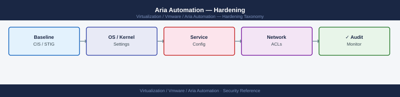

---
tags:
  - aria-automation
  - security
  - vmware
description: "Hardening reference covering Default Account Hardening, Certificate Replacement, Service Account Principle of Least Privilege, SSH and Console Access..."
---
# Aria Automation — Hardening

<div class="kb-summary">
Hardening reference covering Default Account Hardening, Certificate Replacement, Service Account Principle of Least Privilege, SSH and Console Access, Kubernetes Security and 3 more sections.

*Applies to: Aria Automation 8.x*
</div>


## Before you begin

- **Access:** vCenter Administrator role
- **Change management:** security changes require CAB approval in most environments
- **Rollback plan:** document current state before any security control change
- **Testing:** validate in a non-production environment first where possible

---

## Default Account Hardening

The `admin` account is a local system account in the VIDM System Domain. Change its password immediately after deployment:

**Via vracli (standalone deployments):**

```bash
ssh root@vra-prod-01.example.local

# Import certificate
vracli certificate import \
  --cert /tmp/vra-prod-01.pem \
  --key /tmp/vra-prod-01.key \
  --ca /tmp/chain.pem

# Verify the certificate is active
echo | openssl s_client -connect vra-prod-01.example.local:443 2>/dev/null | \
  openssl x509 -noout -subject -issuer -dates
```


```text title="Expected output"
root@vra-prod-01:~# vracli certificate import \
>   --cert /tmp/vra-prod-01.pem \
>   --key /tmp/vra-prod-01.key \
>   --ca /tmp/chain.pem
Certificate import initiated...
Validating certificate chain...
Installing certificate to keystore...
Certificate successfully imported and activated.
Restarting services: nginx, tomcat
Service restart completed successfully.

subject=CN = vra-prod-01.example.local, O = Example Corp, C = US
issuer=CN = Example Corp Intermediate CA, O = Example Corp, C = US
notBefore=Jan 15 09:23:45 2024 GMT
notAfter=Jan 14 09:23:45 2025 GMT
```

!!! warning "Common errors"
    **`Certificate import initiated... Error: Unable to read certificate file /tmp/vra-prod-01.pem`** — Verify the certificate file exists and is readable with `ls -la /tmp/vra-prod-01.pem`.
    **`Error: Private key does not match certificate`** — Ensure the key and certificate were generated as a pair; regenerate both or use the correct matching key file.
    **`Error: Certificate chain validation failed - untrusted root`** — Verify the CA chain file contains all intermediate and root certificates in the correct order from leaf to root.
---

## Service Account Principle of Least Privilege

The vCenter service account used for Aria Automation cloud accounts should have only the required permissions — not the `Administrator` role:

| Permission | Scope |
|---|---|
| Virtual Machine — Create New | Target folders/clusters |
| Virtual Machine — Power (on/off/reset) | All VMs in project scope |
| Virtual Machine — Config (all) | All VMs in project scope |
| Datastore — Allocate Space | Target datastores |
| Network — Assign Network | Target port groups |
| Resource — Assign VM to Pool | Target resource pools |
| vApp — Import | Datacenter |

Create a dedicated service account: `svc-vra@vsphere.local` or a domain account `svc-vra@corp.local`. Store the password in the enterprise vault and rotate annually (or after any staff change).

---

## SSH and Console Access

```bash
# Restrict SSH access to management network CIDR
echo "sshd: 10.0.1.0/24" >> /etc/hosts.allow
echo "ALL: ALL" >> /etc/hosts.deny

# Disable root password login — require key-based SSH
# Edit /etc/ssh/sshd_config:
PermitRootLogin prohibit-password
systemctl restart sshd
```


```text title="Expected output"
(no output — command completes silently)
(no output — command completes silently)
(no output — command completes silently)
```

!!! warning "Common errors"
    **`Job for sshd.service failed because the control process exited with error code.`** — Verify `/etc/ssh/sshd_config` syntax with `sshd -t` before restarting the service.
    **`Permission denied (publickey,password).`** — Ensure your SSH public key is installed in `~/.ssh/authorized_keys` on the target host before disabling password authentication.
For the VAMI (port 5480), restrict access to the management network at the firewall level — VAMI does not natively support IP-based access control.

---

## Kubernetes Security

The embedded Kubernetes cluster should not be accessible outside the appliance:

```bash
# Verify kubectl is only usable from within the appliance (localhost)
kubectl config view | grep "server:"
# Should show: server: https://127.0.0.1:<port>
```


```text title="Expected output"
server: https://127.0.0.1:6443
```

!!! warning "Common errors"
    **`error: unable to read client-key /root/.kube/config for user "kubernetes-admin": permission denied`** — Ensure the kubeconfig file has correct permissions with `chmod 600 ~/.kube/config`.
    **`The connection to the server 127.0.0.1:6443 was refused - did you mean to run "minikube start"?`** — Verify the Kubernetes API server is running on the appliance with `kubectl cluster-info` or restart the service.
Do not expose the Kubernetes API port externally. All management is done via `kubectl` on the appliance SSH session or via the Aria Automation REST API.

---

## Network Firewall Rules

| Source | Destination | Port | Protocol | Purpose |
|---|---|---|---|---|
| Admin workstations | vra-prod-* | 443 | TCP | Web UI and API |
| Admin workstations | vra-prod-* | 5480 | TCP | VAMI (restrict to admins only) |
| Admin workstations | vra-prod-* | 22 | TCP | SSH |
| vra-prod-* | vCenter | 443 | TCP | vSphere cloud account |
| vra-prod-* | NSX Manager | 443 | TCP | NSX cloud account |
| vra-prod-* | VIDM | 443 | TCP | SSO |
| vra-prod-* | SMTP relay | 25/587 | TCP | Notifications |
| vra-prod-* | DNS | 53 | UDP | Name resolution |
| vra-prod-* | NTP | 123 | UDP | Time sync |
| vra-prod-* | Code repo (GitHub/GitLab) | 443 | TCP | Blueprint Git sync (if enabled) |

Block all other inbound traffic, especially direct access to internal Kubernetes ports.

---

## Audit and Compliance

Aria Automation logs all deployment requests, approval decisions, and administrative actions in the audit log.

```bash
# Access audit events via API
TOKEN=<your-token>
curl -sk -H "Authorization: Bearer $TOKEN" \
  "https://vra-prod-01.example.local/audit/api/events?size=100&sort=timestamp,desc" | \
  jq '.content[] | {type: .type, user: .principal, resource: .resource, time: .timestamp}'
```


```text title="Expected output"
{
  "type": "RESOURCE_ACTION",
  "user": "admin@example.local",
  "resource": "/resources/deployments/dep-a7f2c9e1-4b3d",
  "time": "2024-01-15T14:32:18.456Z"
}
{
  "type": "POLICY_UPDATE",
  "user": "policy-svc@example.local",
  "resource": "/policies/governance/pol-8d2f1a9c",
  "time": "2024-01-15T14:28:05.123Z"
}
{
  "type": "BLUEPRINT_DEPLOY",
  "user": "devops-team@example.local",
  "resource": "/blueprints/prod-web-tier/bp-3c6e2f41",
  "time": "2024-01-15T14:15:42.789Z"
}
{
  "type": "USER_LOGIN",
  "user": "svc-automation@example.local",
  "resource": "/auth/sessions",
  "time": "2024-01-15T14:02:19.234Z"
}
{
  "type": "RESOURCE_DELETE",
  "user": "admin@example.local",
  "resource": "/resources/vms/vm-prod-db-02",
  "time": "2024-01-15T13:45:33.567Z"
}
```

!!! warning "Common errors"
    **`curl: (60) SSL certificate problem: self signed certificate`** — Add `-k` flag to skip certificate verification, or import the vRA server's CA certificate into your system trust store.
    **`jq: parse error: Cannot index string with string "content"`** — Verify the API endpoint returns valid JSON and check that your TOKEN is valid by testing with `curl -sk -H "Authorization: Bearer $TOKEN" "https://vra-prod-01.example.local/audit/api/events?size=1"` first.
    **`401 Unauthorized`** — Ensure the TOKEN variable is set correctly and has not expired; regenerate a new API token from the vRA console under Administration > API Tokens.
Forward syslog to Aria Ops for Logs or SIEM for centralised audit trail:

```bash
echo '*.* @@vrli-prod-01.example.local:514' > /etc/rsyslog.d/vra-audit.conf
systemctl restart rsyslog
```


```text title="Expected output"
(no output — command completes silently)
(no output — command completes silently)
```

!!! warning "Common errors"
    **`Permission denied`** — Run the commands with `sudo` or as the root user.
    **`Failed to restart rsyslog: Unit rsyslog.service not found.`** — Install rsyslog with `sudo apt-get install rsyslog` (Debian/Ubuntu) or `sudo yum install rsyslog` (RHEL/CentOS), or use the correct service name for your distribution.
---

## Hardening Checklist

- [ ] Admin password changed and stored in vault
- [ ] Self-signed certificate replaced with CA-signed certificate
- [ ] VIDM AD integration configured; AD groups mapped to Aria Automation roles
- [ ] Local admin account not used for day-to-day access
- [ ] vCenter service account follows least privilege — not using Administrator role
- [ ] SSH restricted to management network CIDR
- [ ] VAMI (port 5480) access restricted at firewall to admin team
- [ ] Blueprint Git content source uses a service account with read-only repository access
- [ ] Encrypted Property Groups used for all secrets in cloud templates — no plaintext passwords
- [ ] Syslog forwarding to Aria Ops for Logs or SIEM configured
- [ ] Aria Automation software at current patch level (verify via LCM or VAMI)
- [ ] Certificate expiry tracked and renewal scheduled before 30-day warning
- [ ] NTP configured and synchronised: `chronyc tracking` on each appliance node

## See also

- [Aria Automation — Access Control](../access-control/)
- [Aria Automation — Authentication](../authentication/)
- [Aria Automation — Health Checks](../../operations/health-checks/)
