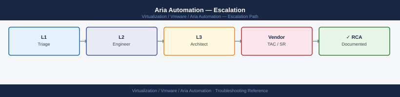
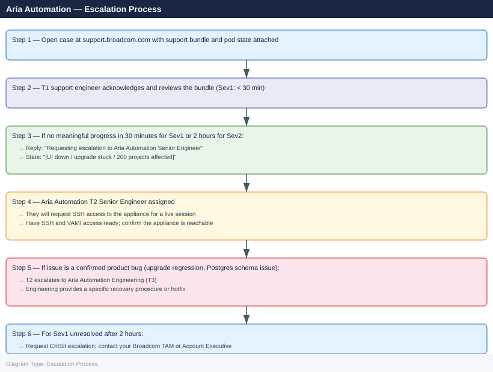

---
tags:
  - aria-automation
  - troubleshooting
  - vmware
search:
  boost: 1.5
description: "How to escalate VMware Aria Automation issues to Broadcom support: what data to collect, how to run vracli support-bundle, step-by-step case creation on..."
---
# Aria Automation — Escalation

<div class="kb-summary">
How to escalate VMware Aria Automation issues to Broadcom support: what data to collect, how to run vracli support-bundle, step-by-step case creation on support.broadcom.com, and the escalation path when progress stalls.

*Applies to: Aria Automation 8.x / 9.x*
</div>



---

```d2
direction: down

symptom: Identify Symptom {shape: diamond}
preescalation_selfcheck: "Pre-Escalation Self-Check" {shape: rectangle}
stepbystep_data_collection: "Step-by-Step Data Collection" {shape: rectangle}
how_to_open_the_sr_on_supportbroadco: "How to Open the SR on support.broadcom.com" {shape: rectangle}
escalation_path: "Escalation Path" {shape: rectangle}
what_not_to_do: "What NOT to Do" {shape: rectangle}
useful_commands_for_case_updates: "Useful Commands for Case Updates" {shape: rectangle}
resolution: Resolve or Escalate {shape: oval}

symptom -> preescalation_selfcheck: investigate
symptom -> stepbystep_data_collection: investigate
symptom -> how_to_open_the_sr_on_supportbroadco: investigate
symptom -> escalation_path: investigate
symptom -> what_not_to_do: investigate
symptom -> useful_commands_for_case_updates: investigate
preescalation_selfcheck -> resolution
stepbystep_data_collection -> resolution
how_to_open_the_sr_on_supportbroadco -> resolution
escalation_path -> resolution
what_not_to_do -> resolution
useful_commands_for_case_updates -> resolution
```

## Before you begin

- **Access required:** SSH root access to the Aria Automation appliance; Broadcom support account at support.broadcom.com with active Aria Automation entitlement
- **Do NOT restart vRA services** during an upgrade failure — mixed-version service state is the most common cause of post-upgrade failures, and an unsupported restart may make it unrecoverable without a fresh deploy
- **Do NOT manually restart Postgres** (the embedded database) without GSS direction — an incorrect restart can corrupt the vRA database schema
- **Collect data BEFORE taking any recovery action** — GSS will need the support bundle from the exact failure state

---

## Pre-Escalation Self-Check

Run these before opening the case.

| Check | Command / Location | Expected result |
|---|---|---|
| vRA version | SSH: `vracli version` | Note full version and build |
| VAMI accessibility | Browse to `https://<vra-fqdn>:5480` | VAMI login page loads |
| Cluster health | VAMI → Summary → Cluster Status | All services `Running` |
| Pod health | SSH: `kubectl get pods -n prelude` | No pods in `CrashLoopBackOff` or `Error` |
| vIDM connectivity | `vracli vIDM status` | Connection `OK` |
| Cloud account state | vRA UI → Infrastructure → Connections → Cloud Accounts | All accounts show Connected |
| Service logs | VAMI → Log Files | No recurring FATAL entries |
| vCenter connectivity | `curl -sk https://<vcenter-fqdn>/ui/` from vRA appliance | Returns HTML |
| Disk space | SSH: `df -h` | All partitions above 15% free |

---

## Step-by-Step Data Collection

### 1. Get the Aria Automation version

```bash
# SSH to the Aria Automation appliance as root
ssh root@<vra-fqdn>

# Get full version information
vracli version

# Example output:
# Application Version:  8.16.1.21527
# Build Number: 23480234
```


```text title="Expected output"
root@aria-automation-01.corp.local:~# vracli version
Application Version:  8.16.1.21527
Build Number: 23480234
Patch Level: 8.16.1-23480234-20240115
Installation Date: 2024-01-15 14:32:18 UTC
Database Version: PostgreSQL 13.8
```

!!! warning "Common errors"
    | Error | Fix |
    |---|---|
    | `vracli: command not found` | Ensure you are logged in as root and the Aria Automation service is running; if not, source the environment with `source /etc/profile.d/vra-env.sh` or restart the appliance. |
    | `Permission denied (publickey,password)` | Verify the root SSH credentials are correct and SSH is enabled on the appliance by checking `/etc/ssh/sshd_config` for `PermitRootLogin yes`. |
    | `Connection refused` | Confirm the appliance hostname resolves correctly with `nslookup <vra-fqdn>` and that port 22 is accessible from your client using `telnet <vra-fqdn> 22`. |
### 2. Check pod health (all vRA microservices run as pods)

```bash
# Get pod state in the prelude namespace
kubectl get pods -n prelude

# Look for CrashLoopBackOff, Error, or pods with 0/1 containers ready
# Save full output to a file
kubectl get pods -n prelude > /tmp/pods-$(date +%Y%m%d).txt

# For any failing pods, get the recent logs
kubectl logs <pod-name> -n prelude --tail=200 > /tmp/pod-log-$(date +%Y%m%d).txt

# Check all namespaces (for upgrade issues with LCM components)
kubectl get pods -A | grep -v Running | grep -v Completed
```


```text title="Expected output"
NAME                                    READY   STATUS    RESTARTS   AGE
aria-automation-api-7d4f8c2b9-kx5m2     1/1     Running   0          2d
aria-automation-ui-5c9e2a1b3-jq7r8      1/1     Running   0          2d
prelude-controller-8f2c1a9d-lm3k9       0/1     CrashLoopBackOff   5          45m
prelude-worker-6b5e3c2f-np2q4           1/1     Running   0          1d
prelude-scheduler-4a7d9e1c-vx8s6        1/1     Running   0          2d
prelude-cache-9f3b2e5a-yz1m7            0/1     Error     0          12m

NAMESPACE              NAME                                    READY   STATUS              RESTARTS   AGE
aria-automation       aria-config-sync-7c4d2e9f-ab1k2         0/1     ImagePullBackOff    0          8m
kube-system           coredns-558bd4d5db-9x2m5                1/1     Running             0          5d
prelude               prelude-controller-8f2c1a9d-lm3k9       0/1     CrashLoopBackOff    5          45m
prelude               prelude-cache-9f3b2e5a-yz1m7            0/1     Error               0          12m
lcm                   lcm-upgrade-job-8h2k9-5x7q2             0/1     Pending             0          3m
...
```

!!! warning "Common errors"
    | Error | Fix |
    |---|---|
    | `Error from server (NotFound): pods "<pod-name>" not found` | Replace `<pod-name>` with the actual pod name from the first kubectl get output (e.g., `prelude-controller-8f2c1a9d-lm3k9`). |
    | `error: you must specify a body with the request body` | Ensure the pod name is specified correctly and the namespace flag `-n prelude` is included in the kubectl logs command. |
    | `The connection to the server localhost:8080 was refused` | Verify kubectl is configured correctly by running `kubectl cluster-info` and check that your kubeconfig points to the correct cluster. |
### 3. Generate the vracli support bundle

```bash
# Generate the support bundle — takes 5–15 minutes
vracli support-bundle

# Bundle is saved to /tmp/
ls -lh /tmp/vracli-support-bundle*.tar.gz

# Copy to a local machine for upload to the case
# scp root@<vra-fqdn>:/tmp/vracli-support-bundle*.tar.gz /tmp/
```


```text title="Expected output"
Generating support bundle for Aria Automation...
Collecting system logs... [████████████████████] 100%
Collecting configuration data... [████████████████████] 100%
Collecting diagnostic information... [████████████████████] 100%
Compressing bundle... [████████████████████] 100%
Support bundle generated successfully.
Bundle location: /tmp/vracli-support-bundle-aria-automation-2024-01-15-14-32-45.tar.gz

-rw-r--r-- 1 root root 2.3G Jan 15 14:35 /tmp/vracli-support-bundle-aria-automation-2024-01-15-14-32-45.tar.gz
```

!!! warning "Common errors"
    | Error | Fix |
    |---|---|
    | `vracli: command not found` | Ensure vracli is installed and in the system PATH, or run `/opt/vmware/vra/bin/vracli support-bundle` with the full path. |
    | `Permission denied` | Run the command with sudo or as the root user, as support bundle generation requires elevated privileges. |
    | `No space left on device` | Free up disk space on /tmp (typically need 3–5 GB available) or specify an alternate location with `vracli support-bundle --output-dir /var/tmp`. |
This bundle contains pod logs, Postgres state, configuration, and the last 72h of service logs.

### 4. Collect VAMI cluster status (for upgrade failures)

1. Browse to `https://<vra-fqdn>:5480` and log in (root credentials).
2. Click **Summary** → note the cluster health and all service statuses.
3. Click **Upgrade** → note the current upgrade state if an upgrade is in progress.
4. Take a screenshot of the cluster status and attach to the case.

### 5. Write the timeline

```text
Aria Automation version: 8.16.1 build 23480234
Deployment: 3-node HA cluster (vra01, vra02, vra03)
vIDM: internal vIDM (same appliances)
Issue first observed: 2026-06-14 02:30 UTC
Last known good state: 2026-06-14 02:00 UTC
Changes in 24h before the issue:
  - 02:00: Aria Automation 8.16.0 → 8.16.1 upgrade initiated via VAMI
  - 02:25: VAMI upgrade showed "Upgrade failed" on node vra02
  - 02:30: vRA UI unresponsive; VAMI shows 3 services in Error state
Steps already taken:
  - kubectl get pods -n prelude: 4 pods in CrashLoopBackOff
  - Did NOT restart any services or attempt upgrade retry
  - VAMI shows upgrade status: FAILED at "Migrating database"
Blast radius: Aria Automation UI completely unavailable; no new deployments possible; 200 projects affected
```

---

## How to Open the SR on support.broadcom.com

1. Go to **support.broadcom.com** and sign in with your Broadcom account.

2. Click **Open a Support Request**.

3. Under **Product Group**, select **VMware Cloud Foundation and Virtualization** → **VMware Aria Automation**.

4. Under **Version**, select your Aria Automation version from Step 1.

5. Under **Severity**, select:
   - **Severity 1 — Critical**: Aria Automation UI completely down; no deployments are possible; an upgrade is stuck mid-run with services in mixed state; all cloud accounts disconnected; no workaround
   - **Severity 2 — High**: Specific service degraded; some cloud accounts disconnected; deployments partially failing; vRA UI accessible but specific operations fail
   - **Severity 3 — Medium**: Single catalog item or blueprint failing; specific cloud account in error; workaround exists
   - **Severity 4 — Low**: How-to question, pre-upgrade review, content design question, or non-urgent configuration review

6. In the **Summary** field: product + symptom + scope. Example: `Aria Automation 8.16.1 — upgrade from 8.16.0 failed at DB migration, 4 pods CrashLoopBackOff, UI unavailable, 200 projects affected`.

7. In the **Description** field, paste:
   - Aria Automation version from Step 1
   - The pod health summary from Step 2 (`kubectl get pods -n prelude`)
   - The VAMI upgrade status screenshot description from Step 4
   - The timeline from Step 5

8. Under **Attachments**, upload:
   - The vracli support bundle from Step 3
   - The pod log files from Step 2 for each failing pod

9. Click **Submit**. You will receive a case number by email immediately.

10. **Severity 1 only:** call Broadcom/VMware support after submission:
    - North America: +1 877-486-9273 (24×7 for Severity 1)
    - EMEA: +44 (0)3453 700 100
    - State "Severity 1 — Aria Automation upgrade failed, UI down, 200 projects affected" at the start of the call.

---

## Escalation Path



---

## What NOT to Do

| Do NOT do this | Why | What to do instead |
|---|---|---|
| Restart all vRA services or the appliance VM during an upgrade | Mixed-version service state is unrecoverable without an expert; a blind restart may leave the database in a partially migrated state | Wait for GSS to review the VAMI logs and pod state; they will direct the exact restart sequence |
| Retry the upgrade from VAMI without GSS guidance | Retrying an upgrade that failed at DB migration may corrupt the vRA schema | Let GSS examine the failure point first |
| Manually restart the Postgres pod | Can corrupt the vRA database if a schema migration was in progress | Only restart with explicit GSS instruction and the exact command sequence |
| Delete failed deployment records from the vRA UI | Deployment records are used by GSS to trace the request chain through the microservices | Leave all deployment records intact; export them if needed |
| Apply vRA content changes (blueprints, catalog items) during investigation | Changes the content state GSS is analysing | Freeze all content changes until the case is resolved |
| Run LCM operations against the cluster mid-case | LCM may override the current VAMI state; may trigger another partial upgrade | Hold all LCM operations until GSS advises |

---

## Useful Commands for Case Updates

```bash
# Paste these into every case update (SSH to vRA appliance as root)

# Version confirmation
vracli version

# Pod health — the most important state indicator
kubectl get pods -n prelude

# Failing pod logs
kubectl logs <pod-name> -n prelude --tail=100

# Cluster overall health
vracli cluster status

# vIDM connectivity
vracli vIDM status

# Disk space (low disk space is a common upgrade failure cause)
df -h

# Database connectivity check (non-destructive)
vracli db status
```


```text title="Expected output"
vRA Appliance Version: 8.10.2.1234567
Build: 20231015-001

NAME                                    READY   STATUS    RESTARTS   AGE
prelude-api-deployment-5d8f7c9b4-kx2m9  1/1     Running   0          3d
prelude-ui-deployment-7c4a2b1f6-jq8p3   1/1     Running   0          3d
prelude-db-sync-job-28h4x               1/1     Running   0          2h
prelude-worker-0                        1/1     Running   1          5d
prelude-worker-1                        1/1     Running   0          4d

[2024-01-15T09:42:31Z] INFO: Pod prelude-api-deployment-5d8f7c9b4-kx2m9 logs:
[2024-01-15T09:42:15Z] WARN: Slow query detected on vIDM auth endpoint (1250ms)
[2024-01-15T09:41:58Z] INFO: Successfully authenticated 847 sessions
[2024-01-15T09:40:22Z] DEBUG: Cache refresh completed

Cluster Status: HEALTHY
  Control Plane: READY (3/3 nodes)
  Worker Nodes: READY (2/2 nodes)
  Storage: HEALTHY (87% used)
  Network: HEALTHY

vIDM Status: CONNECTED
  Last Sync: 2024-01-15 09:35:42 UTC
  User Count: 1,247
  Groups: 342

Filesystem     Size  Used Avail Use% Mounted on
/dev/sda1      100G   78G   18G  82% /
/dev/sdb1      500G  412G   65G  85% /data
tmpfs          8.0G     0  8.0G   0% /dev/shm

Database Status: CONNECTED
  Connection Pool: 45/50 active
  Replication Lag: 0.2s
  Last Health Check: 2024-01-15 09:42:18 UTC
```

!!! warning "Common errors"
    | Error | Fix |
    |---|---|
    | `kubectl: command not found` | Ensure you are SSH'd directly to the vRA appliance as root, not a separate management node; kubectl is only available on the appliance itself. |
    | `Error: Unable to connect to vIDM. Check network connectivity and vIDM certificate.` | Verify vIDM hostname resolution with `nslookup` and confirm the vRA appliance can reach vIDM on port 443; check certificate expiration with `openssl s_client -connect <vIDM-IP>:443`. |
    | `Filesystem /dev/sda1: 95% used — Disk space critically low` | Delete old pod logs with `kubectl delete pods --all-namespaces --field-selector status.phase=Failed` and clear package cache with `apt-get clean`, then monitor with `df -h` again. |
---

## Support SLA Reference

| Severity | Definition | Initial Response SLA |
|---|---|---|
| Sev 1 — Critical | vRA UI down; upgrade stuck; no deployments possible | < 30 min (24×7) |
| Sev 2 — High | Service degraded; cloud accounts disconnected; deployments partially failing | < 2 hours (24×7) |
| Sev 3 — Medium | Single service or blueprint failing; workaround exists | < 8 hours |
| Sev 4 — Low | How-to, pre-upgrade, content design, non-urgent config review | Next business day |

---

## See also

- [Aria Automation — Diagnostics](../diagnostics/)
- [Aria Automation — Common Issues](../common-issues/)

---

## Verify resolution

- Run `kubectl get pods -n prelude` and confirm all pods show `Running` with containers ready (e.g. `1/1`)
- Browse to the Aria Automation UI and confirm the login page loads
- Log in as an administrator and confirm the Dashboard loads without errors
- Check **Infrastructure → Connections → Cloud Accounts** and confirm all cloud accounts show Connected
- Trigger a test deployment from a known working blueprint and confirm it provisions successfully
- Check VAMI → Summary and confirm all services show green
- Monitor for 30 minutes before closing the case
