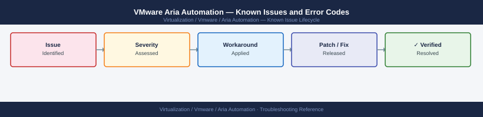

---
tags:
  - troubleshooting
  - aria-automation
  - vmware
  - known-issues
---
# VMware Aria Automation — Known Issues and Error Codes

<div class="kb-summary">
Catalog of known Aria Automation (vRA) bugs, error codes, and workarounds covering catalog deployments, integration endpoints, and cluster issues.

*Applies to: Aria Automation 8.x / 8.16+*
</div>



```d2
direction: down

symptom: Identify Symptom {shape: diamond}
catalog_and_deployments: "Catalog and Deployments" {shape: rectangle}
integrations: "Integrations" {shape: rectangle}
cluster_and_services: "Cluster and Services" {shape: rectangle}
resolution: Resolve or Escalate {shape: oval}

symptom -> catalog_and_deployments: investigate
symptom -> integrations: investigate
symptom -> cluster_and_services: investigate
catalog_and_deployments -> resolution
integrations -> resolution
cluster_and_services -> resolution
```

## Before you begin

- Aria Automation errors appear in `Infrastructure → Activity → Requests` — expand failed request for machine detail.
- Logs: `vracli log list` on the Aria Automation appliance; key log is `catalog-service.log`.
- Most deployment failures are vCenter endpoint credential issues or vCenter resource pool quota violations.

## Catalog and Deployments

| Error / Symptom | Affected Versions | Cause | Workaround / Fix | Fixed In |
|---|---|---|---|---|
| Deployment request fails: `Insufficient memory in cluster` | Aria 8.x | vCenter cluster has insufficient free memory for requested VM size | Reduce deployment template size; or add capacity to cluster | N/A |
| `Error: Cannot clone template — snapshot consolidation needed` | Aria 8.x | Source template VM has unconsolidated snapshots | Consolidate snapshots on source template in vCenter before deploying | N/A |
| Cloud template YAML validation passes but deployment fails on VCSA | Aria 8.x | Template references a compute resource name with special characters | Rename resource pool or cluster in vCenter to remove special characters | N/A |
| `Lease expired — deployment deleted` unexpectedly | Aria 8.x | Default project lease policy too aggressive | Increase or disable lease expiry in project settings | N/A |

## Integrations

| Error / Symptom | Affected Versions | Cause | Workaround / Fix | Fixed In |
|---|---|---|---|---|
| vCenter Cloud Account shows `Connection failed` after vCenter certificate change | Aria 8.x | Aria Automation cached old vCenter thumbprint | Edit Cloud Account → re-enter credentials → accept new certificate thumbprint | N/A |
| Git integration fails: `Cannot clone repository` | Aria 8.x | SSH key not added to Git repository or SSH port blocked | Add Aria Automation public key to Git server; verify TCP 22 or 443 from Aria to Git | N/A |
| `NSX-T Cloud Account error — cannot list segments` | Aria 8.x | NSX Manager API credentials expired or NSX not reachable | Update NSX credentials in Cloud Account; verify 443 connectivity | N/A |

## Cluster and Services

| Error / Symptom | Affected Versions | Cause | Workaround / Fix | Fixed In |
|---|---|---|---|---|
| Aria Automation cluster shows `Degraded` — 3-node | Aria 8.x | RabbitMQ split-brain after node failure | SSH to each node: `vracli cluster status`; rejoin degraded node | N/A |
| `catalog-service` OOM on large catalog (>1000 items) | Aria 8.14 | Memory leak in catalog indexing | Apply 8.16 patch; or increase Kubernetes memory limit for catalog pod | 8.16 |

## See also

- [VMware Aria Automation — Common Issues](../common-issues/)
- [VMware Aria Suite Lifecycle — Known Issues](../../aria-suite-lifecycle/troubleshooting/known-issues.md)
- [VMware vCenter — Known Issues](../../vcenter/troubleshooting/known-issues.md)
