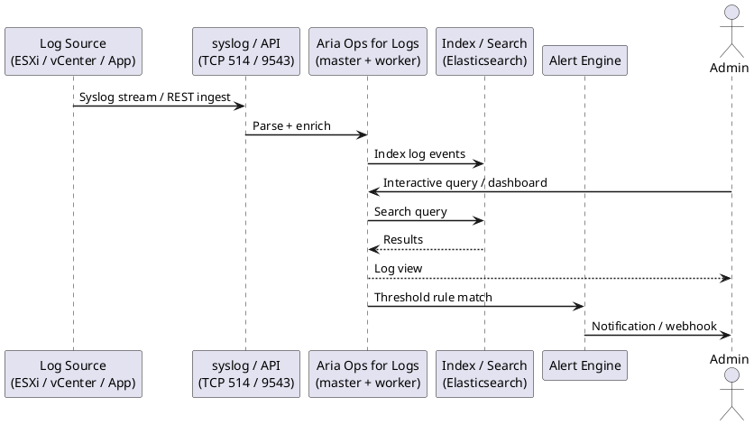

---
tags:
  - architecture
  - aria-logs
  - vmware
---
# Aria Operations for Logs — How It Works

<div class="kb-summary">
How It Works reference covering Overview, Log Pipeline Architecture, ESXi Syslog Configuration.

*Applies to: Aria Operations for Logs 8.x*
</div>




## Overview

Aria Operations for Logs (formerly vRealize Log Insight) collects, indexes, and correlates log data from VMware infrastructure and other sources. It provides real-time search, pattern-based alerting, content pack dashboards, and bidirectional launch-in-context integration with Aria Operations. Logs are retained in a hot Cassandra index and optionally archived to NFS for long-term storage.

## Log Pipeline Architecture

```d2
direction: right

SRC1: "ESXi / vCenter syslog" {shape: rectangle}
SRC2: "NSX / VMs syslog" {shape: rectangle}
SRC3: "Linux / Windows agent" {shape: rectangle}
VRLI: "Aria Operations for Logs\n(Log Intelligence cluster" {shape: rectangle}
IDX: "Log Index\nhot + warm retention" {shape: rectangle}
ADMIN: "Operator" {shape: rectangle}

SRC1 -> SRC2
SRC2 -> SRC3
SRC3 -> VRLI
VRLI -> IDX
ADMIN -> VRLI
```

## See also

- [Aria Ops for Logs — Standards](../design-standards/)
- [Aria Operations for Logs — Deploy](../../deploy/)
- [Aria Ops for Logs — Integrations](../integrations/)
