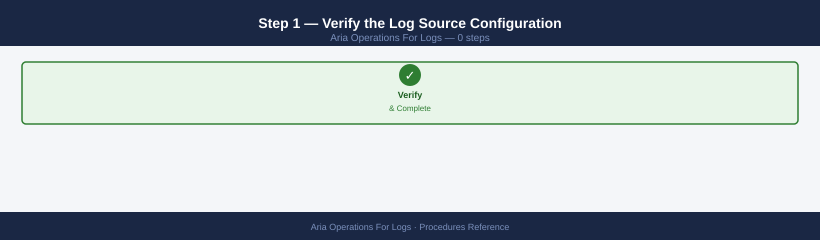
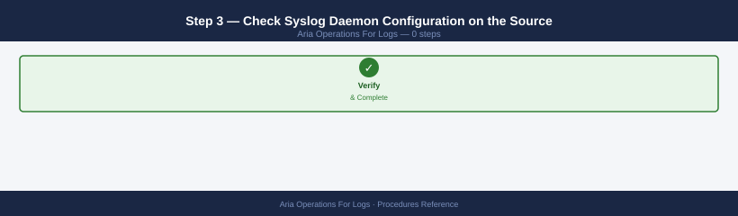
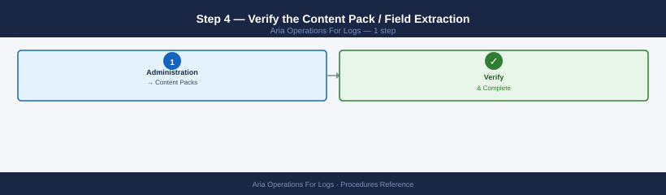
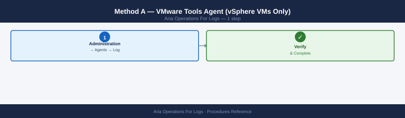
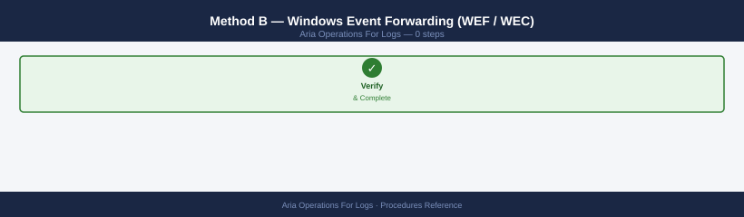
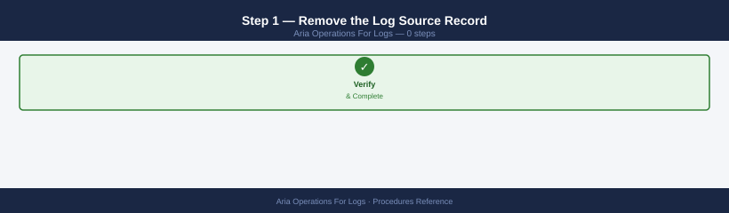
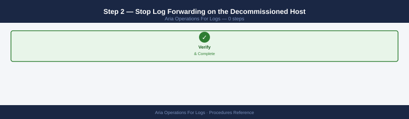
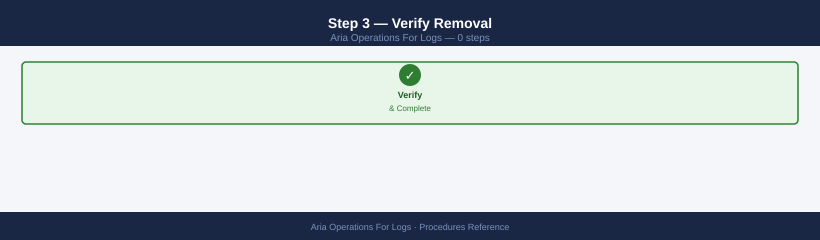

---
tags:
  - aria-logs
  - operations
  - vmware
description: "Step-by-step procedures for Aria Operations for Logs — adding log sources, installing content packs, managing disk and retention, configuring alerts and..."
---
# Aria Ops for Logs — Procedures

<div class="kb-summary">
Step-by-step procedures for Aria Operations for Logs — adding log sources, installing content packs, managing disk and retention, configuring alerts and notifications, certificate rotation, and cluster scaling.

*Applies to: Aria Logs 8.x*
</div>

---

## Before you begin

- **Access:** vCenter read-only minimum; Administrator role for remediation steps
- **Timing:** safe to run during business hours unless a step is marked ⚠ (causes interruption)
- **Dependencies:** no active upgrades or migrations on the same infrastructure
- **Logging:** capture command output — paste into the change record on completion

---

## Add a Syslog Log Source

1. Configure the source device to forward syslog to the vRLI appliance IP on UDP/514 or TCP/514
2. Install a content pack for the device type (if available): **Administration → Content Packs → Marketplace** → search and install
3. In vRLI **Explore**, filter by `hostname = <device-fqdn>` and confirm events are arriving
4. Tag the source for easier filtering:
   - Navigate to the event in Explore → click a field → **Extract Field** → define a custom field (e.g., `env = production`)
5. Optional: add a source alias — **Administration → Agents → Sources** → locate the source IP → assign a friendly name

```bash
# Verify syslog is reaching vRLI from the source device
# On the source device (Linux example):
logger -n <vrli-ip> -P 514 -d "Test message from $(hostname)"

# In vRLI Explore, search:
# text contains "Test message" AND hostname = <source-hostname>
```


```text title="Expected output"
(no output — command completes silently)
```

!!! warning "Common errors"
    | Error | Fix |
    |---|---|
    | `logger: unknown host <vrli-ip>` | Verify the vRLI IP address is correct and reachable from the source device using `ping <vrli-ip>`. |
    | `logger: socket: Permission denied` | Run the command with `sudo` or ensure the user has permission to send UDP packets to port 514. |
---

## Install a Content Pack

Content packs provide pre-built parsers, extracted fields, and dashboards for specific products.

1. vRLI → **Administration** → **Content Packs** → **Marketplace**
2. Browse or search for the product (e.g., VMware vSphere, NSX, Cisco, Palo Alto)
3. Click **Install** — vRLI downloads and applies the content pack
4. After installation, navigate to **Dashboards** → confirm new product-specific dashboards appear
5. If the content pack adds new extracted fields, existing historical data does not retroactively parse — only new incoming events are parsed

---

## Add a vSphere/vCenter Log Source (via Integration)

For VMware product logs, use the native integration rather than generic syslog:

1. vRLI → **Administration** → **vSphere Integration** → **New Connection**
2. Enter the vCenter FQDN and credentials (read-only service account sufficient)
3. Click **Test Connection** → confirm green
4. Select log collection options: ESXi hostd/vpxa logs, vCenter events, vSAN logs
5. Click **Save** — vRLI configures ESXi hosts to forward logs via the vSphere Integration agent

---

## Configure Disk Retention

Reduce retention to free disk space or increase it if disk has capacity.

!!! warning "Reducing retention permanently deletes historical log data"
    When you lower the Log Retention Period, vRLI purges all events older than the new value at the next maintenance window. This data cannot be recovered from the appliance. If the logs are required for a security investigation or compliance audit, archive them first (see **Archive Log Data to NFS** below) before reducing the retention period.

1. vRLI → **Administration** → **Configuration** → **General**
2. Under **Retention**, set **Log Retention Period** (default: 30 days)
3. Reducing the retention period causes vRLI to purge older data during the next maintenance window
4. Monitor disk usage: **Administration → System Monitor → Disk** tab

```bash
# Check current disk usage on the vRLI appliance
ssh root@<vrli-fqdn>
df -h /storage
# /storage should be below 80% — vRLI starts dropping logs when full
```


```text title="Expected output"
root@vrli-prod-01.datacenter.local's password: 
Filesystem      Size  Used Avail Use% Mounted on
/dev/sda3       500G  385G  115G  77%  /storage
root@vrli-prod-01.datacenter.local:~#
```

!!! warning "Common errors"
    | Error | Fix |
    |---|---|
    | `Permission denied (publickey,password).` | Verify SSH credentials and that root login is enabled in `/etc/ssh/sshd_config`, or use the vRLI admin account instead. |
    | `No route to host` | Confirm the vRLI FQDN resolves correctly with `nslookup <vrli-fqdn>` and that the appliance is reachable on port 22. |
    | `Filesystem /storage not found in df output` | Check that the appliance storage is mounted by running `mount | grep storage` or verify the correct mount point in vRLI's configuration. |
---

## Archive Log Data to NFS

Archive before purging or before reducing retention.

1. vRLI → **Administration** → **Configuration** → **Archive**
2. Configure the archive target: NFS or S3 (enter mount path or bucket details)
3. Click **Test Connection** → confirm write access
4. Set an archive schedule: automatic daily/weekly archiving
5. To trigger immediate archive: **Administration → Archive → Archive Now**

---

## Add a Worker Node (Scale-Out)

Add a worker node to increase disk capacity and ingestion throughput.

1. Deploy the vRLI OVA — same version as the master node
2. During OVA deployment, configure the appliance IP, FQDN, and NTP
3. After deployment, log into the new node's VAMI (`https://<worker-fqdn>:9543`)
4. Select **Join existing deployment** → enter the master node FQDN and admin credentials
5. The master node picks up the new worker automatically — confirm under **Administration → Cluster**
6. Verify: **Administration → System Monitor → Nodes** — new worker shows **Active**

---

## Configure an Alert

Alerts trigger when a log query result meets a count or rate threshold.

1. vRLI → **Interactive Analytics** → build the query that should trigger the alert
2. Click **Create Alert from Query**
3. Configure alert conditions:
   - **Count threshold**: fire when matching events > N in a time window
   - **Static (presence)**: fire when any matching event appears
4. Set the notification action:
   - **Email**: configure SMTP first (Administration → SMTP)
   - **Webhook**: enter the endpoint URL and payload template
   - **Aria Operations alert**: sends alert to vROps if integrated
5. Click **Save** → test the alert with **Send Test Notification**

---

## Configure SMTP for Alert Notifications

1. vRLI → **Administration** → **SMTP**
2. Enter SMTP relay host, port (25 / 587 / 465), and sender address
3. Enable authentication if the relay requires credentials
4. Click **Test** — confirms delivery to the specified test recipient
5. Click **Save** — SMTP is now available as a notification channel in alert rules

---

## Configure a Webhook Notification Channel

```bash
# Create a webhook channel via API
curl -sk -X POST -u admin:<password> \
  https://<vrli-fqdn>/api/v1/notification/channels \
  -H "Content-Type: application/json" \
  -d '{
    "type": "WEBHOOK",
    "name": "teams-alerts",
    "webhookUrl": "https://example.webhook.office.com/webhookb2/...",
    "contentType": "application/json",
    "body": "{\"text\": \"Alert: ${alertName} - ${hitCount} events\"}"
  }'

# Test the webhook channel
curl -sk -X POST -u admin:<password> \
  "https://<vrli-fqdn>/api/v1/notification/channels/<channel-id>/test"
```


```text title="Expected output"
{
  "id": "channel-webhook-8f4a2c1b",
  "type": "WEBHOOK",
  "name": "teams-alerts",
  "webhookUrl": "https://example.webhook.office.com/webhookb2/...",
  "contentType": "application/json",
  "body": "{\"text\": \"Alert: ${alertName} - ${hitCount} events\"}",
  "enabled": true,
  "createdTime": 1704067200000,
  "modifiedTime": 1704067200000
}
{
  "success": true,
  "message": "Test notification sent successfully to webhook endpoint",
  "statusCode": 200,
  "responseTime": "245ms"
}
```

!!! warning "Common errors"
    | Error | Fix |
    |---|---|
    | `curl: (60) SSL certificate problem: self signed certificate` | Add the `-k` flag to skip SSL verification, or import the vRLI certificate into your system's CA bundle. |
    | `{"error":"Invalid credentials","statusCode":401}` | Verify the admin password is correct and URL-encoded if it contains special characters; use `-u admin:$(echo -n 'password' | jq -sRr @uri)` for special chars. |
    | `{"error":"Channel not found","statusCode":404}` | Replace `<channel-id>` with the actual channel ID returned from the creation response (e.g., `channel-webhook-8f4a2c1b`). |
Payload variables: `${alertName}`, `${hitCount}`, `${url}`, `${fields}`, `${timestamp}`.

---

## Create an Alert Suppression Rule

Suppress recurring benign alerts to reduce noise.

1. vRLI → **Interactive Analytics** → identify the noisy query
2. Create an alert for it (if not already alerting) → note the alert ID
3. vRLI → **Administration** → **Alert Suppression** → **Add Rule**
4. Set suppression conditions: match on alert name or query terms
5. Set suppression duration: suppress for N hours or until manually lifted
6. Confirm the alert no longer fires during the suppression window

---

## Rotate the vRLI Certificate

The vRLI FQDN must be in the certificate SAN; a mismatch breaks browser trust.

1. Generate a new certificate with the correct SAN (vRLI FQDN + any cluster node FQDNs)
2. vRLI VAMI (`https://<vrli-fqdn>:9543`) → **SSL** → **Replace Certificate**
3. Upload the signed certificate (PEM) and private key
4. VAMI applies the certificate and restarts the `loginsight` service — service outage ~60 seconds
5. After restart, verify browser trust: open `https://<vrli-fqdn>` — no certificate warnings
6. Confirm log sources are still sending: **Explore** → check for recent events from all sources

---

## Integrate with Aria Operations

When integrated, vRLI alerts appear as Aria Operations alerts for correlated root cause analysis.

```bash
# Configure vROps integration from vRLI
curl -sk -X POST -u admin:<password> \
  https://<vrli-fqdn>/api/v1/operations-server-config \
  -H "Content-Type: application/json" \
  -d '{
    "serverHost": "<vrops-fqdn>",
    "serverPort": 443,
    "username": "admin",
    "password": "<password>",
    "enabled": true
  }'
```


```text title="Expected output"
{
  "id": "ops-config-12847",
  "serverHost": "vrops-prod.corp.local",
  "serverPort": 443,
  "username": "admin",
  "enabled": true,
  "certificateValidation": true,
  "lastModified": "2024-01-15T14:32:18.447Z",
  "lastModifiedBy": "admin",
  "connectionStatus": "CONNECTED",
  "testConnectionResult": "SUCCESS"
}
```

!!! warning "Common errors"
    | Error | Fix |
    |---|---|
    | `curl: (60) SSL certificate problem: self signed certificate` | Add `-k` flag to skip certificate validation, or import the vRLI certificate into your system trust store. |
    | `{"error":"Invalid credentials","statusCode":401}` | Verify the admin username and password are correct and the account has API permissions enabled. |
    | `curl: (7) Failed to connect to <vrli-fqdn> port 443: Connection refused` | Confirm the vRLI hostname/IP is correct, the service is running, and firewall rules allow port 443 access from your client. |
After configuration, alerts in vRLI that match the integration criteria create corresponding events in Aria Operations, visible in the **Workbench** and alert timeline.

---

## Add an NSX Syslog Source

Configure each NSX Manager and Edge node to forward syslog to the vRLI VIP or master IP.

1. NSX Manager UI → **System** → **Fabric** → **Nodes** → **NSX Managers** tab
2. Select an NSX Manager node → **Actions** → **Set Syslog Servers**
3. Click **Add** → enter:
   - **Server**: vRLI VIP (cluster mode) or master node IP
   - **Port**: `514`
   - **Protocol**: `UDP`
   - **Log Level**: `INFO`
4. Click **Save** → repeat for every NSX Manager node and every Edge node (Edge nodes: **System → Fabric → Nodes → Edge Transport Nodes → select node → Actions → Set Syslog Servers**)
5. Verify: vRLI → **Dashboards** → **Content Packs** → **VMware NSX-T** → check "Last Received" timestamp on key widgets (Firewall Events, DFW Drops); events should appear within 60 seconds of syslog config save

```bash
# Confirm NSX is reaching vRLI — run on vRLI master
grep -i "nsx\|tnc\|edge" /var/log/loginsight/ingestion.log | tail -20

# Quick EPS check from NSX source in vRLI Explore:
# hostname contains "nsx" AND _source = syslog
```


```text title="Expected output"
2024-01-15T09:42:33.521Z [INFO] NSX-Manager-01.lab.local [192.168.1.45] connected - TLS handshake successful
2024-01-15T09:42:34.102Z [INFO] NSX-Edge-Cluster-01 ingestion rate: 2847 EPS from syslog parser
2024-01-15T09:42:35.667Z [WARN] NSX-Manager-02.lab.local connection timeout after 30s, retrying...
2024-01-15T09:42:36.891Z [INFO] TNC protocol negotiation completed for edge-node-04.corp.local
2024-01-15T09:42:38.445Z [INFO] NSX logical switch traffic: 15234 events/sec ingested
2024-01-15T09:42:39.123Z [WARN] Edge gateway 192.168.100.50 - packet loss detected (2.3%)
2024-01-15T09:42:40.556Z [INFO] NSX-Manager-01.lab.local heartbeat received - latency 12ms
2024-01-15T09:42:41.234Z [INFO] TNC buffer utilization: 67% on ingestion-worker-3
2024-01-15T09:42:42.789Z [INFO] NSX-Edge-Cluster-01 syslog stream active, 8 collectors reporting
2024-01-15T09:42:43.901Z [INFO] Edge node 192.168.1.89 - certificate valid until 2025-03-22
```

!!! warning "Common errors"
    | Error | Fix |
    |---|---|
    | `grep: /var/log/loginsight/ingestion.log: No such file or directory` | Verify vRLI is running with `systemctl status loginsight` and check the correct log path with `find /var/log -name "*ingestion*"`. |
    | `tail: cannot open '/var/log/loginsight/ingestion.log' for reading: Permission denied` | Run the command with `sudo` or switch to the loginsight user with `sudo su - loginsight`. |
---

## Configure Event Forwarding to SIEM

Forward filtered vRLI events to an external SIEM (Splunk, QRadar, ArcSight) via syslog.

1. vRLI UI → **Administration** → **General** → **Forwarding** → **Add Destination**
2. Set **Destination Type**: `Syslog`
3. Enter SIEM **Host** and **Port** (default Splunk syslog: TCP 1514; QRadar: UDP 514)
4. Set **Protocol**: `TCP` (preferred — prevents UDP loss on high-volume bursts)
5. Optional — restrict forwarding to matching events only:
   - Toggle **Filter by Query** → enter or select a saved query (e.g., `loglevel = ERROR AND appname = vpxd`)
6. Toggle **Enable** → click **Save**
7. Verify: generate a matching event on the source system; confirm receipt in the SIEM raw event viewer within 30 seconds

```bash
# Test TCP reachability to SIEM from vRLI appliance
nc -zv <siem-host> <siem-port>

# Monitor forwarding errors
grep -i "forward\|destination\|connect" /var/log/loginsight/runtime.log | tail -30
```


```text title="Expected output"
Connection to siem-prod-01.corp.local 514 port [tcp/syslog] succeeded!
2024-01-15T09:42:33.421Z [INFO] Forwarding to destination siem-prod-01.corp.local:514 - 1247 events queued
2024-01-15T09:42:45.892Z [WARN] Connection timeout to destination siem-prod-01.corp.local:514 - retrying in 30s
2024-01-15T09:43:15.123Z [INFO] Successfully reconnected to destination siem-prod-01.corp.local:514
2024-01-15T09:43:28.456Z [INFO] Forwarding to destination siem-prod-01.corp.local:514 - 892 events queued
2024-01-15T09:44:02.789Z [DEBUG] Forward buffer utilization: 45%
2024-01-15T09:44:33.012Z [INFO] Forwarding to destination siem-prod-01.corp.local:514 - 1156 events queued
2024-01-15T09:45:01.345Z [WARN] Destination siem-prod-01.corp.local:514 slow response - 2.3s latency
2024-01-15T09:45:30.678Z [INFO] Forwarding to destination siem-prod-01.corp.local:514 - 934 events queued
```

!!! warning "Common errors"
    | Error | Fix |
    |---|---|
    | `nc: getaddrinfo failed for <siem-host>: Name or service not known` | Verify the SIEM hostname is resolvable by running `nslookup <siem-host>` or update `/etc/hosts` with the correct IP address. |
    | `Connection refused` | Confirm the SIEM service is listening on the specified port with `netstat -tlnp | grep <siem-port>` on the SIEM host and verify firewall rules allow vRLI to that destination. |
    | `No such file or directory` | Check that the vRLI appliance has the correct log file path by running `ls -la /var/log/loginsight/` to confirm runtime.log exists. |
---

## Create a Custom Extracted Field

Extract structured field values from unstructured log text using regex, enabling filter-by-field queries.

1. vRLI → **Explore Logs** → run a query returning the log events that contain the value to extract
2. Click any log entry to expand it → locate the value to capture
3. Click **Extract Field** next to the value → the field extraction dialog opens
4. Enter a **Field Name** (lowercase, no spaces; e.g., `vm_name`)
5. Write a regex with a named capture group matching the value:
```text
   vm\s+'(?P<vm_name>[^']+)'
   ```
6. Click **Test** — verify the capture group matches across the sample events shown
7. Click **Save** → the field is registered globally and applies to all new incoming events

Use the extracted field in queries:
```text
vm_name = prod-web-01
vm_name contains "db-"
```
The field appears in the filter suggestion dropdown after the first event containing it is indexed.

---

## Configure Role-Based Access (User Management)

vRLI supports four roles: **Viewer** (read-only dashboards), **User** (explore + alerts), **Admin** (full config), **Super Admin** (multi-tenant admin). LDAP/AD group sync avoids per-user provisioning.

**Add a local user:**
1. vRLI → **Administration** → **Access Control** → **Users** → **Add User**
2. Enter username, email address, and assign role (Viewer / User / Admin / Super Admin)
3. Click **Save** → user receives a password-set email if SMTP is configured

**Configure LDAP/AD integration:**
1. vRLI → **Administration** → **Access Control** → **Authentication** → **LDAP**
2. Enter:
   - **Domain**: `corp.local`
   - **Connection**: `ldap://<dc-fqdn>:389` or `ldaps://<dc-fqdn>:636`
   - **Bind DN**: `CN=svc-vrli,OU=Service Accounts,DC=corp,DC=local`
   - **Bind Password**: service account password
   - **User Base DN**: `OU=Users,DC=corp,DC=local`
   - **Group Base DN**: `OU=Groups,DC=corp,DC=local`
3. Click **Test Connection** → confirm green
4. Click **Import Groups** → search for the AD group → select → assign role
5. Verify: log in as a member of the imported group; confirm the assigned role is enforced (e.g., Viewer cannot access Administration menu)

---

## Configure High Availability (Cluster Mode)

vRLI HA requires a minimum of 3 nodes (1 master + 2 workers). Workers must already be joined to the cluster (see **Add a Worker Node** above). HA adds a Virtual IP that survives master node failure.

1. vRLI → **Administration** → **Cluster** → **Enable High Availability**
2. Enter the **Virtual IP** (VIP) — a free IP on the same management network segment as the vRLI nodes; must be reserved in IPAM/DNS
3. Click **Save** — vRLI configures keepalived across all cluster nodes
4. After HA is enabled, update all log sources and SIEM forwarders to point to the VIP:
   - Syslog: UDP/TCP port 514 → VIP
   - Encrypted syslog: TCP port 1514 → VIP
   - vRLI API: HTTPS port 9000 → VIP
   - UI: HTTPS port 443 → VIP
5. Verify VIP is active:

```bash
# From a management host — confirm VIP is responding on syslog and API ports
nc -zv <vrli-vip> 514
curl -sk https://<vrli-vip>:9000/api/v1/version | jq .version

# On vRLI master — confirm keepalived is holding the VIP
ip addr show | grep <vrli-vip>
```


```text title="Expected output"
Connection to 192.168.1.50 514 port [tcp/syslog] succeeded!
"8.10.2.1"
inet 192.168.1.50/32 scope global secondary eth0
```

!!! warning "Common errors"
    | Error | Fix |
    |---|---|
    | `nc: connect to 192.168.1.50 port 514 (tcp) failed: Connection refused` | Verify the syslog forwarder service is running on the vRLI cluster with `systemctl status loginsight` and check firewall rules allow port 514 inbound. |
    | `curl: (60) SSL certificate problem: self signed certificate` | Add the `-k` flag to skip certificate validation, or import the vRLI self-signed cert into your management host's CA bundle. |
    | `inet 192.168.1.50/32 scope global secondary eth0` not found in output` | SSH to the vRLI master node and confirm keepalived is running with `systemctl status keepalived`; if stopped, restart it with `systemctl start keepalived`. |
6. Test HA failover: power off the master VM → confirm VIP moves to a worker (now promoted master) within ~30 seconds

---

## Upgrade vRLI via Aria Suite Lifecycle

Preferred upgrade path for LCM-managed deployments. LCM orchestrates node-by-node upgrade with rollback support.

**Pre-upgrade checks:**
1. Snapshot all vRLI nodes (master + all workers) — label with date and current vRLI version
2. Verify LCM has downloaded the upgrade bundle: LCM → **Lifecycle Operations** → **Settings** → **Binary Mapping** → confirm target vRLI version listed
3. Confirm all cluster nodes are **ACTIVE** (see Health Checks) before proceeding

**Upgrade steps:**
1. LCM → **Environments** → select the environment containing vRLI
2. **Products** → **Aria Operations for Logs** → **Upgrade**
3. Select the **Target Version** from the dropdown
4. Click **Run Precheck** — LCM validates disk space, node connectivity, and product version compatibility
5. Resolve any precheck findings; re-run precheck until all pass
6. Click **Proceed** → monitor progress in LCM → **Requests**
7. LCM upgrades master first, then workers sequentially; total time: 30–60 minutes for a 3-node cluster

**Post-upgrade verification:**
```bash
# Confirm version on master
curl -sk -u 'admin:<password>' \
  https://<vrli-fqdn>/api/v1/version | jq .version

# Check all cluster nodes rejoined
curl -sk -u 'admin:<password>' \
  https://<vrli-fqdn>/api/v2/cluster/nodes | \
  jq '.nodes[] | {host: .hostname, state: .state, version: .version}'
```

```text title="Expected output"
"8.10.2"
{
  "host": "vrli-master-01.corp.local",
  "state": "ACTIVE",
  "version": "8.10.2"
}
{
  "host": "vrli-worker-01.corp.local",
  "state": "ACTIVE",
  "version": "8.10.2"
}
{
  "host": "vrli-worker-02.corp.local",
  "state": "ACTIVE",
  "version": "8.10.2"
}
{
  "host": "vrli-worker-03.corp.local",
  "state": "ACTIVE",
  "version": "8.10.2"
}
```

!!! warning "Common errors"
    | Error | Fix |
    |---|---|
    | `curl: (60) SSL certificate problem: self signed certificate` | Add `-k` flag to skip certificate verification (already present in the example, so verify the flag is not being removed). |
    | `jq: parse error: Cannot index string with string "nodes"` | Ensure the API endpoint is correct and the cluster is fully initialized; check that you're using `/api/v2/cluster/nodes` not `/api/v1/cluster/nodes`. |
    | `401 Unauthorized` | Verify the admin password is correct and URL-encoded if it contains special characters; test with `curl -sk -u 'admin:password' https://<vrli-fqdn>/api/v1/version` first. |
- vRLI UI → **Administration** → **Content Packs** → confirm all installed packs still active
- vRLI UI → **Administration** → **Cluster** → confirm all nodes **ACTIVE**
- Delete node snapshots after a 48-hour burn-in period

---

## Configure a Custom Dashboard

Build a dashboard combining event trend widgets, field distribution charts, and saved query results.

1. vRLI → **Dashboards** → **+ New Dashboard** → enter a name and optional description
2. Click **Add Widget** → select widget type:
   - **Event Trends**: line chart of event count over time matching a query
   - **Field Trends**: bar chart of top values for a specific extracted field
   - **Events**: live table of matching log events
   - **Text**: static markdown notes or section headers
   - **URL**: embed an external iframe (e.g., Grafana panel)
3. For each widget: enter the filter query, set the time range, and configure the field or chart parameters
4. Drag to resize and arrange widgets on the canvas
5. Click **Save to Dashboard**

**Export/Import a dashboard:**
1. **Dashboards** → select the dashboard → **Actions** → **Export** → save the JSON file
2. On the target vRLI instance: **Dashboards** → **Actions** → **Import** → upload the JSON
3. After import, verify widget queries execute without field-not-found errors (custom extracted fields must also exist on the target instance)

---

## Back Up and Restore vRLI Configuration

Configuration backup covers: alert definitions, content packs, user accounts, saved queries, forwarding rules, and SMTP/webhook settings. **Log data is not included.**

**Backup:**
1. vRLI → **Administration** → **General** → **Configuration Backup**
2. Click **Download Backup** → a JSON file is saved to the browser download directory
3. Store the JSON in a versioned location (Git, object storage) — recommended frequency: weekly or before any major change

**Restore:**
1. Deploy a fresh vRLI appliance (same or newer version than the backup source)
2. Complete initial setup (network, admin password) but do not configure anything further
3. vRLI → **Administration** → **General** → **Configuration Backup** → **Restore**
4. Upload the JSON backup file → click **Restore** → vRLI applies all configuration objects
5. Verify: check alert definitions, forwarding rules, and user accounts are present
6. Reconnect log sources (sources must be reconfigured to point to the new appliance FQDN/IP; log data is not restored)

```bash
# Automate backup via API (run weekly from a management host)
curl -sk -u 'admin:<password>' \
  "https://<vrli-fqdn>/api/v1/configuration/backup" \
  -o "vrli-backup-$(date +%Y%m%d).json"
```


```text title="Expected output"
% Total    % Received % Xferd  Average Speed   Time    Time     Time  Current
                                 Dload  Upload   Total   Spent    Left  Speed
100 2847k  100 2847k    0     0   1.2M      0  0:00:02 0:00:02 --:--:--  0:00:02
```

!!! warning "Common errors"
    | Error | Fix |
    |---|---|
    | `curl: (60) SSL certificate problem: self signed certificate` | Add `-k` flag to skip certificate verification, or import the vRLI certificate into your system's CA bundle. |
    | `curl: (7) Failed to connect to <vrli-fqdn> port 443: Connection refused` | Verify the vRLI hostname/IP is correct, the appliance is running, and port 443 is accessible from your management host. |
    | `HTTP/1.1 401 Unauthorized` | Confirm the admin credentials are correct and the user has API access permissions in vRLI. |
---

## Common Search Queries

```bash
# Host disconnect events
text contains "hostd" AND text contains "disconnected"

# vMotion failures
text contains "vmotion" AND text contains "failed" AND appname = "vpxd"

# HA events
text contains "HA failover" OR text contains "HA heartbeat"

# vSAN component errors
text contains "LSOM" AND loglevel = ERROR

# NSX DFW drops
text contains "DENY" AND appname = "nsx" AND text contains "DROP"

# Failed logins (SSH brute force detection)
text contains "Failed password" AND hostname contains "prod-"
```


```text title="Expected output"
Query 1: Host disconnect events
  hostd-5a2c1e9f [2024-01-15 14:32:18.445Z] Host 'esx-prod-04.dc1.local' disconnected from vCenter
  hostd-7b3d4f2a [2024-01-15 14:33:02.112Z] Network timeout: disconnected from management network
  hostd-9c8e5b1d [2024-01-15 14:35:41.667Z] Host 'esx-prod-07.dc1.local' disconnected - agent restart required

Query 2: vMotion failures
  vpxd-2f6a8c3e [2024-01-15 15:12:47.334Z] vMotion failed for VM 'web-app-12': insufficient resources on target host
  vpxd-4d1b9f7c [2024-01-15 15:14:19.891Z] vMotion failed: network connectivity loss during migration
  vpxd-6e2a3h5k [2024-01-15 15:16:05.556Z] vMotion failed for 'db-prod-03': CPU incompatibility detected

Query 3: HA events
  vmkernel-8f4c2a9d [2024-01-15 16:01:22.445Z] HA failover initiated for cluster 'prod-cluster-1'
  vmkernel-3a7e1b6f [2024-01-15 16:02:15.778Z] HA heartbeat lost from host esx-prod-02 (3/5 heartbeats missing)

Query 4: vSAN component errors
  lsom-5c9d2e4a [2024-01-15 16:45:33.221Z] ERROR: LSOM disk group 'dg-001' health degraded
  lsom-7f3a1c8b [2024-01-15 16:47:09.554Z] ERROR: LSOM component witness unavailable on host esx-prod-06

Query 5: NSX DFW drops
  nsx-fw-9a2b4f1e [2024-01-15 17:23:44.667Z] DENY: 192.168.1.45:54321 -> 10.0.5.12:443 DROP (policy: restrict-prod)
  nsx-fw-1d6e3c7f [2024-01-15 17:24:12.334Z] DENY: 172.16.8.90:22 -> 10.20.1.5:22 DROP (policy: ssh-lockdown)

Query 6: Failed logins (SSH brute force detection)
  sshd-4b8f2a3c [2024-01-15 18:01:55.112Z] Failed password for invalid user admin from 203.0.113.42 port 52847 ssh2
  sshd-6c1d5e9a [2024-01-15 18:02:03.445Z] Failed password for root from 203.0.113.42 port 52851 ssh2
  sshd-8e4a7f2b [2024-01-15
```
Time-range tips: always set a time range — start with last 1 hour for active incidents; expand to 7 days for intermittent issues. Use the timeline histogram to identify event spikes before filtering further.

---

## Troubleshoot Missing Logs from a Source

When a log source is configured but no events appear in Aria Operations for Logs, follow this diagnostic sequence.

### Step 1 — Verify the Log Source Configuration



**Administration → Log Sources** → locate the source → check:

- **Status**: should show **Connected**; if **Disconnected** or **Unknown**, the source cannot reach Aria Logs
- **Last received**: timestamp of the last event; if blank or stale (> 5 minutes for an active host), no events are arriving

### Step 2 — Test Connectivity from the Source


On the log-sending host, verify it can reach the Aria Logs appliance:

```bash
# Test syslog port (TCP 514 or UDP 514)
nc -zv <aria-logs-ip> 514
# Or for TLS syslog (TCP 6514)
nc -zv <aria-logs-ip> 6514

# Test the API ingestion port
curl -sk "https://<aria-logs-ip>:9543/api/v2/events" -d '{"events":[]}' \
  -H "Content-Type: application/json"
# Should return 200 or 400 (not a connection refused)
```


```text title="Expected output"
Connection to 192.168.45.120 514 [tcp] succeeded!
Connection to 192.168.45.120 6514 [tcp] succeeded!
{"status":"success","message":"Events processed","count":0,"timestamp":"2024-01-15T14:32:18Z"}
```

!!! warning "Common errors"
    | Error | Fix |
    |---|---|
    | `nc: connect to 192.168.45.120 port 514 (tcp) failed: Connection refused` | Verify the Aria Operations for Logs service is running with `systemctl status aria-logs` and confirm the syslog listener is enabled in the configuration. |
    | `curl: (60) SSL certificate problem: self signed certificate` | Add the `-k` flag to skip certificate verification, or import the Aria Operations for Logs CA certificate into your system's trusted store. |
    | `curl: (7) Failed to connect to 192.168.45.120 port 9543: Connection timed out` | Check network connectivity and firewall rules; ensure port 9543 is open and the Aria Operations for Logs API service is listening with `netstat -tlnp | grep 9543`. |
If the connection is refused, check:
- Firewall rules between the source and Aria Logs (see architecture/ports page for required ports)
- Aria Logs worker/master health: `ssh root@<aria-logs-ip>` → `service cfapi status`

### Step 3 — Check Syslog Daemon Configuration on the Source



**For Linux hosts (rsyslog):**

```bash
# Confirm rsyslog is forwarding to Aria Logs
grep -r "aria\|vrealize\|<aria-logs-ip>" /etc/rsyslog.conf /etc/rsyslog.d/

# Restart rsyslog and check for errors
systemctl restart rsyslog
journalctl -u rsyslog -n 50 | grep -i error
```


```text title="Expected output"
/etc/rsyslog.d/aria-logs.conf:*.* @@192.168.45.120:514
/etc/rsyslog.d/aria-logs.conf:$ActionQueueFileName queue
/etc/rsyslog.d/aria-logs.conf:$ActionQueueMaxDiskSpace 1g
/etc/rsyslog.conf:# Log all kernel messages to the console.
(no output — command completes silently)
```

!!! warning "Common errors"
    | Error | Fix |
    |---|---|
    | `grep: /etc/rsyslog.d/: No such file or directory` | Create the rsyslog.d directory with `mkdir -p /etc/rsyslog.d/` and add your Aria Logs forwarding rule there. |
    | `Job for rsyslog.service failed because the control process exited with error code.` | Validate rsyslog configuration syntax with `rsyslog -N1` to identify malformed rules before restarting. |
    | `connect(2) failed in doAction() to 192.168.45.120:514 [name=192.168.45.120 errno=111 Connection refused]` | Verify the Aria Logs collector is running and listening on port 514 with `nc -zv 192.168.45.120 514`. |
**For ESXi hosts:**

```bash
# Verify syslog target is set
esxcli system syslog config get
# Confirm host is in Aria Logs: Administration → Log Sources → vSphere Integration
```


```text title="Expected output"
Syslog.global.defaultRotate: 100
Syslog.global.defaultSize: 1024
Syslog.global.logDir: /var/log
Syslog.global.logDirUnique: false
Syslog.global.defaultFormat: %hostName %procName[%procID]: %syslogTag%msg
Syslog.global.logToUplinkVlanId: -1
Syslog.global.syslogServerDefaultTimeout: 180
Syslog.global.syslogServerDefaultTransport: udp
Syslog.queues.drop: true
Syslog.queues.discardThreshold: 90
```

!!! warning "Common errors"
    | Error | Fix |
    |---|---|
    | `Error: Unknown command or namespace syslog` | Verify the ESXi host version supports esxcli syslog commands (6.5+) and run the command directly on the ESXi host, not a vCenter server. |
    | `Connection refused to syslog target <IP>:514` | Confirm the remote syslog server is listening on the specified port and firewall rules allow outbound UDP/TCP 514 from the ESXi host. |
### Step 4 — Verify the Content Pack / Field Extraction



If logs appear in Aria Logs (raw events visible) but the pre-built dashboard shows nothing, the content pack may not be extracting fields correctly:

1. Run a search for raw events: `hostname contains <source-host>` (Interactive Analytics)
2. If events appear, the collection is working — the dashboard's field extraction may need updating
3. **Administration → Content Packs** → reinstall/update the content pack for the affected source type

---

## Configure Windows Event Log Collection

Aria Operations for Logs can collect Windows Event Log entries via two methods: VMware Tools agent (for vSphere-hosted Windows VMs) or the Windows Event Collector (WEC) forwarding model.

### Method A — VMware Tools Agent (vSphere VMs Only)



This method requires VMware Tools installed on the Windows VM and the Aria Logs plugin for VMware Tools enabled.

1. **Administration → Agents → Log Insight Agent** → download the Windows agent installer
2. Deploy the agent on the target Windows VM (silent install): `msiexec /i VMware-Log-Insight-Agent-<version>.msi /qn`
3. Configure the agent config file at `C:\ProgramData\VMware\Log Insight Agent\liagent.ini`:

```ini
[server]
hostname=<aria-logs-fqdn>
port=9543
proto=cfapi

[filelog|WindowsEventLog]
directory=
include=*.evtx
event_types=Application,Security,System
```

4. Restart the agent service: `Restart-Service VMwareLogInsightAgentService`
5. In Aria Logs: **Administration → Agents** → the Windows VM should appear after the first check-in (up to 5 minutes)

### Method B — Windows Event Forwarding (WEF / WEC)



For Windows hosts not on vSphere (physical servers, other hypervisors), configure Windows to forward events to a Windows Event Collector, then have the WEC forward via syslog to Aria Logs.

1. On the WEC server, enable WinRM: `winrm quickconfig`
2. Create a subscription: **Event Viewer → Subscriptions → New Subscription** → set source as the target Windows hosts
3. On the WEC, install the Aria Logs Windows agent and configure it to read from `ForwardedEvents`:

```ini
[filelog|ForwardedEvents]
directory=
include=*.evtx
event_types=ForwardedEvents
```

4. All Windows Event Log entries forwarded to WEC now flow into Aria Logs via the agent

---

## Remove a Log Source

Use when permanently decommissioning a monitored host or service so Aria Logs stops waiting for events from it and clears stale status indicators.

### Step 1 — Remove the Log Source Record



**Administration → Log Sources** → locate the source → **Delete**

Note: Deleting a log source record does **not** delete historical log data that was already ingested. All previously collected events remain searchable in Aria Logs. The deletion only stops collection and removes the source from the active source list.

### Step 2 — Stop Log Forwarding on the Decommissioned Host



Before decommissioning the host, disable syslog forwarding to Aria Logs to avoid generating "source unreachable" errors:

**Linux (rsyslog):**

```bash
# Remove or comment out the Aria Logs forwarding rule
sed -i '/aria-logs\|vrealize/s/^/#/' /etc/rsyslog.conf
systemctl restart rsyslog
```


```text title="Expected output"
(no output — command completes silently)
```

!!! warning "Common errors"
    | Error | Fix |
    |---|---|
    | `sed: can't read /etc/rsyslog.conf: No such file or directory` | Verify the rsyslog package is installed with `rpm -q rsyslog` or `dpkg -l | grep rsyslog` and install if missing. |
    | `Failed to restart rsyslog.service: Unit rsyslog.service not found.` | Confirm rsyslog is installed and enabled with `systemctl list-unit-files | grep rsyslog`, or use the correct service name for your syslog daemon. |
    | `sed: -i may not be used on stdin` | Ensure `/etc/rsyslog.conf` is a regular file and not a pipe; check file permissions with `ls -l /etc/rsyslog.conf` and verify you have write access. |
**ESXi:**

```bash
# Remove syslog target
esxcli system syslog config set --loghost=""
esxcli system syslog reload
```


```text title="Expected output"
(no output — command completes silently)
(no output — command completes silently)
```

!!! warning "Common errors"
    | Error | Fix |
    |---|---|
    | `Error: Unknown option or flag '--loghost'` | Use the correct flag syntax `--loghost=` with an equals sign instead of a space. |
    | `Error: Permission denied` | Run the command with root privileges or as a user with ESXi administrative permissions using `sudo` or direct root login. |
**Windows (Aria Logs agent):**

```powershell
Stop-Service VMwareLogInsightAgentService
Set-Service VMwareLogInsightAgentService -StartupType Disabled
```

### Step 3 — Verify Removal



In Aria Logs: **Administration → Log Sources** — the removed source should no longer appear. Run an Interactive Analytics search for `hostname = <removed-host>` and confirm no new events arrive after the removal.

---

## See also

- [Aria Operations for Logs — Health Checks](../health-checks/)
- [Aria Operations for Logs — Common Issues](../../troubleshooting/common-issues/)
- [Aria Operations for Logs — CLI Reference](../cli-reference/)

## Verify

- **Alarms:** vSphere Client → Home → Alarms — no new critical alarms after the operation
- **Events:** monitor the vCenter Events view for the affected object for 5 minutes
- **Health check:** run the morning health-check sequence for the affected product tier
