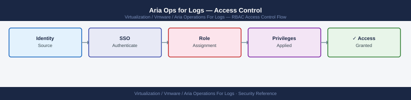

---
tags:
  - aria-logs
  - security
  - vmware
---
# Aria Ops for Logs — Access Control

<div class="kb-summary">
Access Control reference covering RBAC Roles, Configuring Active Directory Integration, AD Group-Based Role Assignment, Local User Accounts, API Authentication for Automation and 1 more sections.

*Applies to: Aria Logs 8.x*
</div>


## Before you begin

- **Access:** vCenter Administrator role
- **Change management:** security changes require CAB approval in most environments
- **Rollback plan:** document current state before any security control change
- **Testing:** validate in a non-production environment first where possible

---

## RBAC Roles

Aria Operations for Logs uses a simple two-tier RBAC model: users are either administrators or users. More granular access control is applied through Active Directory group assignment and, in Advanced/Enterprise editions, through **user roles** with object-level scoping.

| Role | Capabilities |
|---|---|
| **Super Admin** | Full access: cluster management, user accounts, alert definitions, content packs, archiving, all log data |
| **Admin** | Manage content (dashboards, queries, alerts) and users — no cluster infrastructure settings |
| **User** | Access the Interactive Analytics UI and dashboards — view only; cannot modify alert definitions or system configuration |

---

## Configuring Active Directory Integration

| AD Group | Aria Ops for Logs Role |
|---|---|
| `GG-VRLI-Admins` | Super Admin |
| `GG-VRLI-Operators` | Admin |
| `GG-VRLI-ReadOnly` | User |

Users who are members of multiple groups receive the highest-privilege role from the combined membership.

---

## Local User Accounts

Local accounts are used for break-glass access and service accounts. Manage via:

```text
Administration → Authentication → Local Users → Add User
```

| Account | Role | Purpose |
|---|---|---|
| `admin` | Super Admin | Break-glass; change password immediately post-deployment |
| `svc-vrli-api` | Admin | API automation (alert management, queries) |
| `svc-monitoring` | User | Read-only monitoring queries from external systems |

Password requirements for local accounts:
- Minimum 12 characters
- Mixed case, numbers, and at least one symbol
- Store in enterprise vault — not shared documents

---

## API Authentication for Automation

```bash
# Authenticate — Aria Ops for Logs uses HTTP Basic auth; no separate token endpoint
# All API calls use: -u 'admin:<password>' or -u 'svc-vrli-api:<password>'

# Test API authentication
curl -sk -u 'svc-vrli-api:<password>' \
  "https://vrli-prod-01.example.local/api/v2/version" | jq '.'
# Expected: {"version": "8.x.y.zzz", ...}
```


```text title="Expected output"
{
  "version": "8.14.2.23456789",
  "buildNumber": "23456789",
  "productName": "VMware Aria Operations for Logs",
  "releaseDate": "2024-01-15T00:00:00Z",
  "buildTimestamp": 1705276800000
}
```

!!! warning "Common errors"
    **`curl: (60) SSL certificate problem: self signed certificate`** — Add the `-k` flag (already present in example) or import the CA certificate into your system trust store.
    **`curl: (7) Failed to connect to vrli-prod-01.example.local port 443: Connection refused`** — Verify the VRLI hostname/IP is correct, the service is running (`systemctl status vrli` on the appliance), and network connectivity exists.
    **`{"error":"Unauthorized","statusCode":401}`** — Confirm the password is correct and the service account `svc-vrli-api` exists; reset credentials in VRLI Administration > Users if needed.
For service accounts: assign the minimum required role — use the `User` role for scripts that only query logs; use the `Admin` role for scripts that create or modify alert definitions.

---

## Session and Access Logging

All authentication events are logged to the runtime log:

```bash
# View login and authentication events
grep -i "login\|authenticated\|logout\|failed" /var/log/loginsight/runtime.log | tail -100

# View admin operations (alert create/delete, user changes)
grep -i "admin\|user\|alert\|content" /var/log/loginsight/runtime.log | \
  grep -i "create\|update\|delete" | tail -100
```


```text title="Expected output"
2024-01-15 09:23:47.123 [INFO] User 'admin' authenticated successfully from 192.168.1.45
2024-01-15 09:24:12.456 [INFO] User 'svc_monitor' login attempt failed - invalid credentials
2024-01-15 09:25:33.789 [INFO] User 'analyst01' authenticated successfully from 10.50.22.18
2024-01-15 09:26:01.234 [INFO] User 'admin' logout event recorded
2024-01-15 09:27:15.567 [INFO] Alert 'CPU_THRESHOLD' created by user 'admin'
2024-01-15 09:28:42.890 [INFO] User 'readonly_user' authentication failed - account locked
2024-01-15 09:29:55.123 [INFO] Content pack 'VMware-Default' updated by 'admin'
2024-01-15 09:31:08.456 [INFO] User 'analyst02' authenticated successfully from 172.16.5.33
2024-01-15 09:32:19.789 [INFO] Alert 'MEMORY_SPIKE' deleted by user 'admin'
2024-01-15 09:33:44.012 [INFO] User 'svc_monitor' authenticated successfully from 10.50.22.19
```

!!! warning "Common errors"
    **`grep: /var/log/loginsight/runtime.log: No such file or directory`** — Verify the Aria Operations for Logs service is running with `systemctl status loginsight` and confirm the correct log path for your deployment version.
    **`grep: /var/log/loginsight/runtime.log: Permission denied`** — Run the command with `sudo` or ensure your user is in the `loginsight` group with `groups $USER`.
Forward these logs to a SIEM or dedicated audit log store by configuring the appliance's syslog output:

```bash
# Forward syslog from the Aria Ops for Logs appliance to an external SIEM
echo '*.* @@siem.example.local:514' > /etc/rsyslog.d/vrli-audit.conf
systemctl restart rsyslog
```


```text title="Expected output"
(no output — command completes silently)
```

!!! warning "Common errors"
    **`Permission denied`** — Run the commands with `sudo` or as the root user.
    **`Unit rsyslog.service not found.`** — Verify rsyslog is installed with `apt install rsyslog` (Debian/Ubuntu) or `yum install rsyslog` (RHEL/CentOS), then retry the restart.
## See also

- [Aria Ops for Logs — Authentication](../authentication/)
- [Aria Ops for Logs — Hardening](../hardening/)
