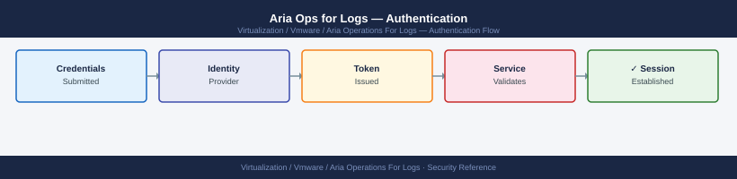

---
tags:
  - aria-logs
  - security
  - vmware
---
# Aria Ops for Logs — Authentication

<div class="kb-summary">
Authentication reference covering Authentication Methods, Active Directory / LDAP Configuration, Workspace ONE Access (VIDM) Integration, Verify LDAP Authentication from CLI, Session Policies and 2 more sections.

*Applies to: Aria Logs 8.x*
</div>


## Before you begin

- **Access:** vCenter Administrator role
- **Change management:** security changes require CAB approval in most environments
- **Rollback plan:** document current state before any security control change
- **Testing:** validate in a non-production environment first where possible

---

## Authentication Methods

| Method | Use Case | Configuration Location |
|---|---|---|
| **Local** | Break-glass admin; lab | Built-in; admin account created during setup wizard |
| **Active Directory (LDAPS)** | Production enterprise users | Administration → Authentication → Active Directory |
| **Workspace ONE Access (VIDM)** | SSO when deployed with LCM | Administration → Authentication → VMware Identity Manager |

---

## Active Directory / LDAP Configuration

Use LDAPS (port 636) for production — plain LDAP (port 389) is not acceptable as it transmits bind credentials in cleartext.

**Import the domain CA certificate first:**

- VMware Identity Manager FQDN: `vidm.example.local`
- Enable redirect to VIDM login page

After configuration, the Aria Ops for Logs login page shows a "VMware Identity Manager" button. Users authenticate via VIDM and are assigned roles based on their AD group membership (mapped in the AD group configuration).

---

## See also

- [Aria Ops for Logs — Access Control](../access-control/)
- [Aria Ops for Logs — Hardening](../hardening/)

## Verify LDAP Authentication from CLI

```bash
# Test LDAP bind from the Aria Ops for Logs appliance
ldapsearch -H ldaps://dc01.example.local:636 \
  -D "CN=svc-vrli-ldap,OU=Service Accounts,DC=corp,DC=local" \
  -w '<password>' \
  -b "DC=corp,DC=local" \
  "(sAMAccountName=testuser)" \
  sAMAccountName mail memberOf

# Test SSL connection to domain controller
openssl s_client -connect dc01.example.local:636 -CAfile /tmp/corp-ca.pem 2>&1 | \
  grep -E "Verify return code|subject="
# Expected: Verify return code: 0 (ok)
```


```text title="Expected output"
# LDAP bind search result
dn: CN=testuser,OU=Users,DC=corp,DC=local
sAMAccountName: testuser
mail: testuser@corp.local
memberOf: CN=VR-Admins,OU=Groups,DC=corp,DC=local
memberOf: CN=Domain Users,OU=Groups,DC=corp,DC=local

# SSL connection verification
Verify return code: 0 (ok)
subject=CN = dc01.example.local, O = Corp, C = US
```

!!! warning "Common errors"
    **`ldap_bind: Invalid credentials (49)`** — Verify the service account password is correct and the account is not locked in Active Directory.
    **`Can't open /tmp/corp-ca.pem, No such file or directory`** — Export the domain controller's CA certificate to `/tmp/corp-ca.pem` or update the `-CAfile` path to the correct location.
    **`ldap_sasl_bind(SIMPLE): Can't contact LDAP server (-1)`** — Confirm DNS resolution for `dc01.example.local` and that port 636 is open from the Aria Ops appliance to the domain controller.
---

## Session Policies

| Setting | Default | Notes |
|---|---|---|
| UI session timeout | 10 hours | No configurable timeout in standard edition |
| API authentication | HTTP Basic (per-request) | No session token; credentials sent each request |
| AD group sync | On login | Group membership re-evaluated at each login |
| Failed login lockout | Enforced at AD level | No built-in lockout for local accounts |

---

## Forcing HTTPS

Aria Ops for Logs listens on port 80 (HTTP) and 443 (HTTPS). HTTP automatically redirects to HTTPS — this is the default behaviour and should not be changed. Verify:

```bash
curl -sI http://vrli-prod-01.example.local/ | grep "Location:"
# Expected: Location: https://vrli-prod-01.example.local/
```


```text title="Expected output"
Location: https://vrli-prod-01.example.local/
```

!!! warning "Common errors"
    **`curl: (7) Failed to connect to vrli-prod-01.example.local port 80: Connection refused`** — Verify the vRealize Log Insight appliance is running and HTTP port 80 is accessible; check firewall rules and appliance network connectivity.
    **`curl: (6) Could not resolve host: vrli-prod-01.example.local`** — Ensure DNS resolution is working by testing `nslookup vrli-prod-01.example.local` or update your `/etc/hosts` file with the correct IP address.
Ensure the firewall permits inbound TCP 443 and TCP 80 from admin workstations. Block all other inbound ports except those required for log ingestion (514, 1514, 9543).
---

## Related Reference

- [Standard LDAP Integration](../../../../../security/ldap-integration/index.md) — field reference, service account standards, TLS requirements, and connectivity testing
- [Standard SAML Configuration](../../../../../security/saml-configuration/index.md) — SP/IdP setup, Azure AD and Okta steps, attribute mapping, and security requirements
