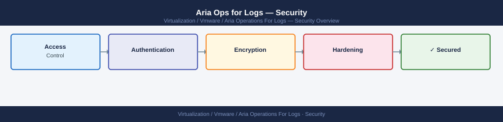

---
tags:
  - aria-logs
  - security
  - vmware
description: "Aria Ops for Logs hardening — RBAC, TLS configuration, syslog source authentication, and audit logging."
---
# Aria Ops for Logs — Security

Aria Ops for Logs hardening — RBAC, TLS configuration, syslog source authentication, and audit logging.

*Applies to: Aria Logs 8.x*

<a class="kb-card" href="authentication/">
  <strong>Authentication</strong>
  SSO, LDAP, local accounts, and identity sources.
</a>

<a class="kb-card" href="access-control/">
  <strong>Access Control</strong>
  Roles, permissions, and least privilege access.
</a>

<a class="kb-card" href="encryption/">
  <strong>Encryption</strong>
  TLS certificate management and log data encryption.
</a>

<a class="kb-card" href="hardening/">
  <strong>Hardening</strong>
  Security baselines and compliance configuration.
</a>

