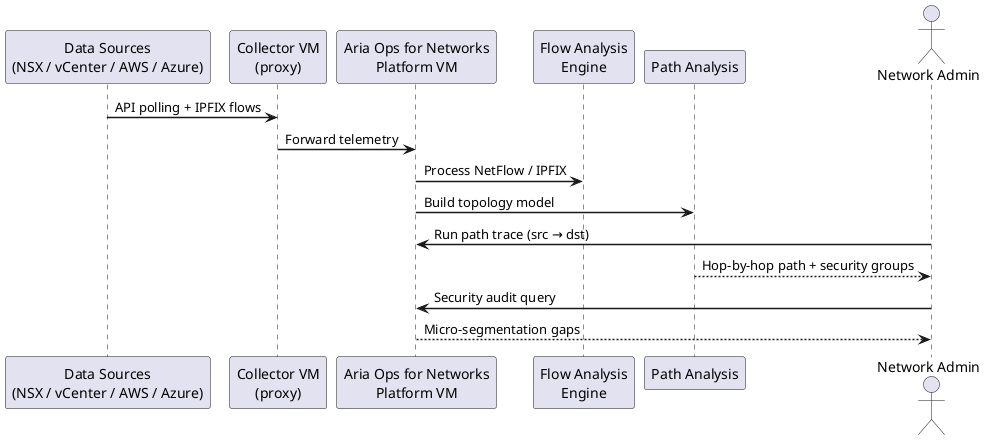
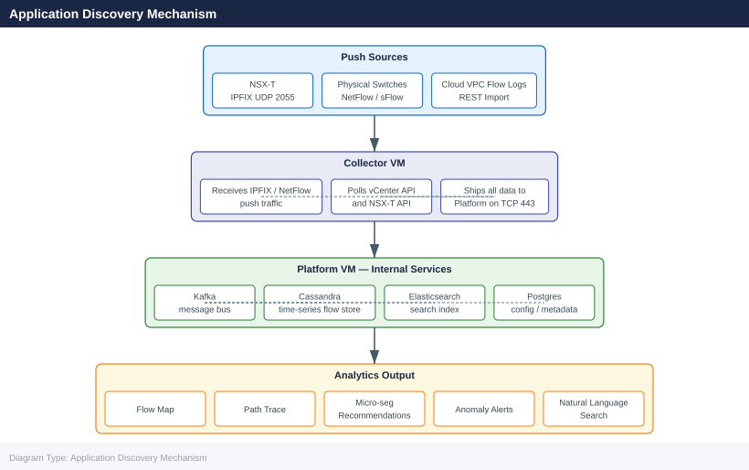

---
tags:
  - architecture
  - aria-networks
  - vmware
description: "How It Works reference covering Deployment Model, Application Discovery Mechanism, Flow Data Retention Defaults, Internal Service Architecture."
---
# Aria Operations for Networks — How It Works

How It Works reference covering Deployment Model, Application Discovery Mechanism, Flow Data Retention Defaults, Internal Service Architecture.

*Applies to: Aria Operations for Networks 6.x*

## Deployment Model

Aria Operations for Networks (AON, formerly vRealize Network Insight / VRNi) consists of two distinct VM roles deployed from separate OVAs:

| Component | Role | Count |
|---|---|---|
| **Platform VM** | UI, analytics engine, data store, API endpoint | 1 per deployment |
| **Collector VM** | Data collection agent — communicates with data sources | 1–N (one per NSX-T/vCenter site recommended) |

Collectors maintain a persistent TLS connection back to the Platform VM on TCP 443. All raw flow data, API-pulled topology, and parsed configs are shipped from Collector to Platform for indexing. The Platform VM is the sole persistent data store — Collectors hold no long-term state.

### AON Flow Data Pipeline

### Stage 4: Push to NSX

Recommendations can be exported or pushed directly:
- **Export**: Download as CSV or JSON for manual review before applying
- **Push to NSX**: AON calls the NSX-T API to create security groups and DFW rules directly (requires NSX-T integration with write permissions — separate from the read-only data source)

## Application Discovery Mechanism

AON's application discovery uses three methods:

1. **Flow-based clustering**: VMs that communicate with each other above a configurable threshold are grouped as candidate application tiers.
2. **DNS/hostname pattern matching**: VM names are parsed with configurable regex patterns to auto-label tiers (e.g., `web-`, `app-`, `db-`).
3. **NSX tag import**: Existing NSX tags on VMs are imported and mapped to application definitions.

Discovery results appear under: **Plan & Assess → Applications → Discovered Applications**

## Flow Data Retention Defaults

| Data Type | Default Retention | Configurable |
|---|---|---|
| Raw flow records (full detail) | 30 days | Yes (dependent on disk) |
| Aggregated flow summaries | 6 months | Yes |
| Topology snapshots | 30 days | No |
| Security recommendations | Until manually cleared | — |
| Problem/alert history | 90 days | No |
| Audit logs | 90 days | No |

Retention is disk-constrained. Platform VM disk usage is monitored and old data is purged when disk utilization exceeds 80% of the data partition.

To check current retention configuration:
**UI**: Settings → Infrastructure → Platform → Data Retention

## Internal Service Architecture

The Platform VM runs a set of internal services on Ubuntu:

| Service | Function |
|---|---|
| `vrni-platform` | Core application service (Spring Boot) |
| `cassandra` | Time-series flow data store |
| `kafka` | Internal message bus between collector and platform |
| `elasticsearch` | Search index for topology and flows |
| `nginx` | Reverse proxy for HTTPS UI and API |
| `postgres` | Configuration and metadata database |

Collectors run a lightweight agent that communicates only outbound to the Platform on TCP 443 — no listening ports are required on the Collector beyond those for flow ingestion (UDP 2055, UDP 6343).

## See also

- [Aria Operations for Networks — Design Standards](../design-standards/)
- [Aria Operations for Networks — Deploy](../../deploy/)
- [vRNI Integrations](../integrations/)
