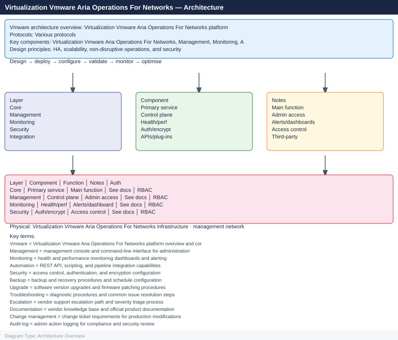

---
tags:
  - architecture
  - aria-networks
  - vmware
---
# Aria Operations for Networks — Architecture

Aria Operations for Networks (formerly vRealize Network Insight) provides network visibility, flow analysis, and micro-segmentation planning across NSX-T, physical switches, and cloud environments.

*Applies to: Aria Operations for Networks 6.x*

<a class="kb-card" href="how-it-works/"><strong>How It Works</strong>Architecture overview, topology, and how it fits in the stack.</a>
<a class="kb-card" href="integrations/"><strong>Integrations</strong>Integration with other platforms and services.</a>
<a class="kb-card" href="design-standards/"><strong>Design Standards</strong>Naming conventions, design rules, and configuration baselines.</a>

