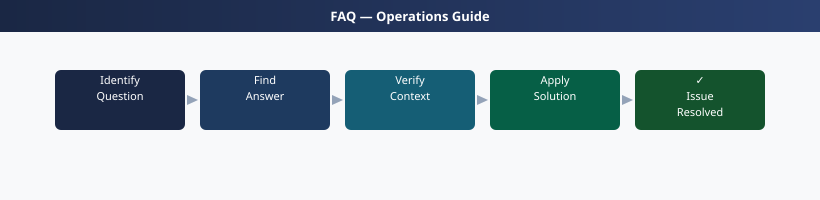

---
tags:
  - aria-ops-networks
  - faq
  - operations
description: "Common questions about VMware Aria Operations for Networks operations, configuration, and troubleshooting. For step-by-step procedures, see the Operations..."
---
# VMware Aria Operations for Networks — Frequently Asked Questions

*Applies to: VMware Aria 8.x*

Common questions about VMware Aria Operations for Networks operations, configuration, and troubleshooting. For step-by-step procedures, see the <a href="index.md">Operations</a> section.

## General

**Q: What Aria Operations for Networks version is recommended?**
A: Aria Operations for Networks 6.12.x is the current recommendation. Check via Administration → Overview → Product Version.

**Q: How do I check the current VMware Aria Operations for Networks version?**
A: `Administration → Overview → Product Version`

## Configuration

**Q: What is the default flow data collection interval?**
A: IPFIX flow data is collected every 60 seconds by default. Reduce to 30 seconds for faster anomaly detection. Increase to 120 seconds for large environments where 60-second polling causes performance overhead.

**Q: How do I enable NSX Intelligence integration with Aria Operations for Networks?**
A: Administration → Data Sources → Add NSX-T Manager. Enable flow collection. Also enable NSX Intelligence (separate licence) for ML-based anomaly detection. Both sources appear as separate data streams in the UI.

## Operations

**Q: How do I upgrade Aria Operations for Networks without losing flow history?**
A: Flow history is stored on the appliance data disk which persists through upgrades. Use the UI-based upgrade: Administration → Overview → Update. Platform node upgrades first, then collector nodes.

**Q: What is the correct procedure to add a new vCenter as a data source?**
A: Administration → Data Sources → Add vCenter Server. Provide FQDN and read-only credentials. Aria OpN discovers all VMs, hosts, and port groups. Flow data begins appearing within 10 minutes if IPFIX is configured on vSphere Distributed Switches.

## Troubleshooting

**Q: Aria Operations for Networks shows 'Flow data missing for entity X'. What does it mean?**
A: IPFIX flow export is not configured or has stopped for the VDS associated with the entity. Check the VDS IPFIX configuration in vCenter → Distributed Switch → Edit Settings → IPFIX → verify collector IP matches the Aria OpN collector.

**Q: Aria Operations for Networks UI is slow when querying large time ranges — where do I start?**
A: Reduce query time range. Use the search filters to narrow scope (specific VMs or flows). For bulk queries, use the REST API with pagination. Consider adding a dedicated collector node for high-volume environments.

## Backup and Recovery

**Q: How often should I back up Aria Operations for Networks?**
A: Weekly configuration export (Administration → System → Backup). Flow data is telemetry and not typically backed up. Configuration backup includes data sources, dashboards, and alert definitions.

**Q: Can I recover flow data from before an Aria Operations for Networks rebuild?**
A: No — flow data stored on the appliance is lost if the appliance is rebuilt. Take VM-level snapshots before upgrades if historical flow data preservation is critical. Flow data is regenerated from IPFIX sources going forward.

## See Also

- [VMware Aria Operations for Networks Operations](index.md)
- [VMware Aria Operations for Networks Troubleshooting](../troubleshooting/index.md)
