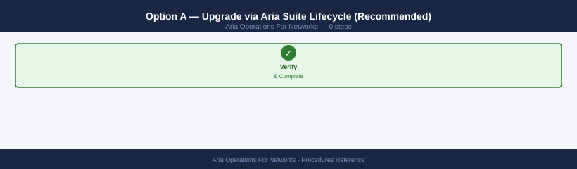
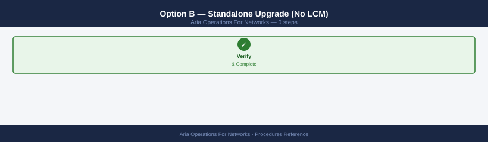
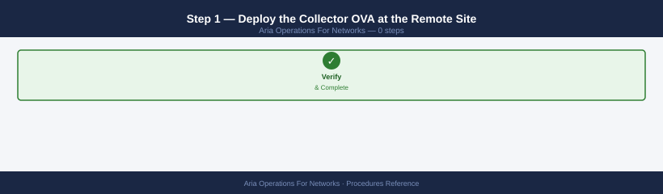
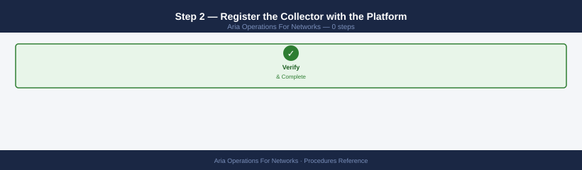
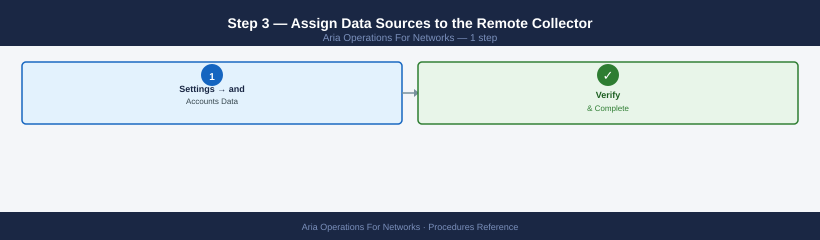
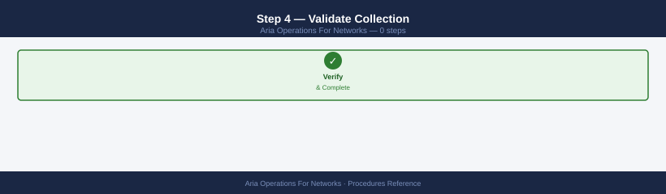
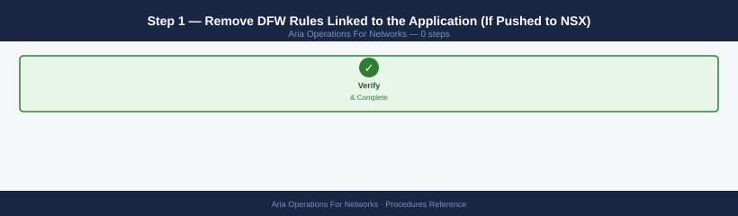
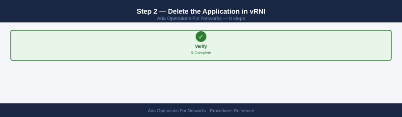
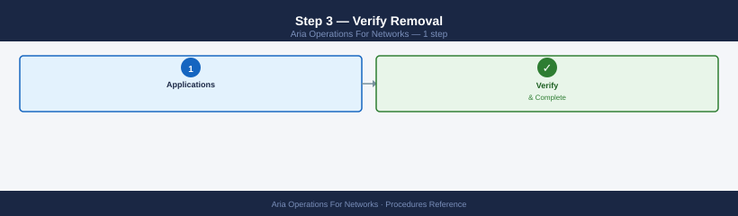

---
tags:
  - aria-networks
  - operations
  - vmware
---
# AON Operational Procedures

<div class="kb-summary">
Day-2 procedures for VMware Aria Operations for Networks — data source management, application discovery, micro-segmentation planning, flow investigation, alerts, and reporting.

*Applies to: Aria Networks 6.x*
</div>

---

## Before you begin

- **Access:** vCenter read-only minimum; Administrator role for remediation steps
- **Timing:** safe to run during business hours unless a step is marked ⚠ (causes interruption)
- **Dependencies:** no active upgrades or migrations on the same infrastructure
- **Logging:** capture command output — paste into the change record on completion

---

## Data Sources and Collection

---

## Add a vCenter Data Source

Adds a vCenter Server as a data source so AON can collect VM inventory, network adapter details, and distributed switch configuration.

**Prerequisites:** A read-only service account in vCenter with Browse Datastore and Read-only role at the root. Firewall must allow TCP 443 from the AON Collector to vCenter.

1. Navigate to **Settings → Infrastructure → Data Sources**.
2. Click **Add Source** → select **VMware vCenter**.
3. Enter the vCenter FQDN or IP address.
4. Enter the service account credentials (`svc-aon@vsphere.local`).
5. Select the **Collector** node that has network line-of-sight to vCenter.
6. Click **Test Connection** — wait for the green tick.
7. Click **Save**. Initial sync takes 5–15 minutes depending on inventory size.

**Verify:** Settings → Data Sources → locate the vCenter entry → status column shows **Enabled / Green**.

**Via API:**

```bash
TOKEN="<your-token>"
PLATFORM="https://aon.example.local"

curl -sk -X POST "${PLATFORM}/api/ni/datasources/vcenter" \
  -H "Authorization: NetworkInsight ${TOKEN}" \
  -H "Content-Type: application/json" \
  -d '{
    "nickname": "vCenter-ProdDC",
    "credentials": {
      "ip": "vcenter.example.local",
      "username": "svc-aon@vsphere.local",
      "password": "PASSWORD"
    },
    "collector_id": "collector-001",
    "enabled": true
  }' | python3 -m json.tool
```


```text title="Expected output"
{
  "id": "datasource-vcenter-prod-001",
  "nickname": "vCenter-ProdDC",
  "type": "vcenter",
  "ip": "vcenter.example.local",
  "username": "svc-aon@vsphere.local",
  "collector_id": "collector-001",
  "enabled": true,
  "status": "PENDING_VALIDATION",
  "last_updated": "2024-01-15T09:42:33.847Z",
  "connection_status": "UNKNOWN",
  "certificate_valid": false
}
```

!!! warning "Common errors"
    **`curl: (60) SSL certificate problem: self signed certificate`** — Add `-k` flag to skip certificate verification, or import the platform's CA certificate into your system trust store.
    **`{"error": "Invalid token", "code": 401}`** — Verify the TOKEN variable is set correctly and has not expired; regenerate it from the Aria Operations for Networks UI if needed.
    **`{"error": "Collector not found", "code": 404}`** — Confirm the collector_id "collector-001" exists and is registered in the platform by running a datasource list query first.
---

## Add an NSX-T Data Source

Adds NSX-T Manager as a data source to collect DFW rule inventory, security groups, and flow data from the NSX data plane.

**Prerequisites:** An NSX-T account with the Auditor role (read-only). For micro-segmentation push, the account needs the Security Engineer role.

1. Navigate to **Settings → Infrastructure → Data Sources**.
2. Click **Add Source** → select **VMware NSX-T**.
3. Enter the NSX-T Manager FQDN or VIP.
4. Enter credentials. Select the Collector node.
5. Click **Test Connection** → click **Save**.
6. AON discovers NSX segments, transport zones, and DFW rules within 10 minutes.

**Verify:** Run a flow search — NSX-T flow data should appear in results within one polling cycle (~5 min).

**Via API:**

```bash
curl -sk -X POST "${PLATFORM}/api/ni/datasources/nsxt" \
  -H "Authorization: NetworkInsight ${TOKEN}" \
  -H "Content-Type: application/json" \
  -d '{
    "nickname": "NSX-T-ProdMgr",
    "credentials": {
      "ip": "nsxt-mgr.example.local",
      "username": "svc-aon-nsxt",
      "password": "PASSWORD"
    },
    "collector_id": "collector-001",
    "enabled": true
  }' | python3 -m json.tool
```


```text title="Expected output"
{
  "id": "datasource-8f4c2a91-7e3d-4b2c-9a1f-6d8e5c3b2a1f",
  "nickname": "NSX-T-ProdMgr",
  "type": "nsxt",
  "credentials": {
    "ip": "nsxt-mgr.example.local",
    "username": "svc-aon-nsxt"
  },
  "collector_id": "collector-001",
  "enabled": true,
  "status": "PENDING",
  "last_updated": "2024-01-15T14:32:18Z",
  "connection_status": "UNKNOWN"
}
```

!!! warning "Common errors"
    **`curl: (60) SSL certificate problem: self signed certificate`** — Add `-k` flag to skip certificate verification (already present; if still failing, verify PLATFORM variable points to correct HTTPS endpoint).
    **`{"error": "Invalid token", "code": 401}`** — Ensure TOKEN environment variable contains a valid NetworkInsight API token with datasource creation permissions.
    **`{"error": "Collector not found", "code": 404}`** — Verify the collector_id "collector-001" exists and is registered in Aria Operations for Networks before creating the datasource.
---

## Add a Physical Switch (NetFlow/IPFIX)

Configures AON to receive NetFlow v5/v9 or IPFIX records from a physical switch or router, giving visibility into north-south and inter-VLAN flows.

**Prerequisites:** The physical switch must support NetFlow export. The Collector appliance must be reachable from the switch on UDP 2055 (NetFlow) or 4739 (IPFIX).

1. Navigate to **Settings → Infrastructure → Data Sources**.
2. Click **Add Source** → select **Physical Switch (IPFIX/NetFlow)**.
3. Enter the switch management IP and a nickname.
4. Confirm the Collector that will receive the flow records.
5. Click **Save**.
6. On the switch, configure flow export pointing to the Collector IP:

```bash
# Cisco IOS example — export NetFlow v9 to AON Collector
ip flow-export version 9
ip flow-export destination <collector-ip> 2055
ip flow-export source Loopback0

interface GigabitEthernet0/1
  ip flow ingress
  ip flow egress
```


```text title="Expected output"
(no output — command completes silently)
```

!!! warning "Common errors"
    **`% Invalid input detected at '^' marker.`** — Verify the collector IP address is in valid dotted-decimal format (e.g., 192.168.1.100) and replace `<collector-ip>` with an actual IP.
    **`% Interface GigabitEthernet0/1 does not exist`** — Confirm the interface name matches your device's actual interfaces by running `show ip interface brief` and use the correct interface identifier.
7. Verify flow reception on the Collector:

```bash
sudo tcpdump -i eth0 -n udp port 2055 -c 20
```


```text title="Expected output"
tcpdump: verbose output suppressed, use -v or -vv for full protocol decode
listening on eth0, link-type EN10MB (Ethernet), snapshot length 262144 bytes
14:32:15.847392 IP 192.168.1.105.54821 > 192.168.1.10.2055: UDP, length 1472
14:32:15.892104 IP 192.168.1.106.54822 > 192.168.1.10.2055: UDP, length 1472
14:32:16.103847 IP 192.168.1.107.54823 > 192.168.1.10.2055: UDP, length 1456
14:32:16.245621 IP 192.168.1.105.54824 > 192.168.1.10.2055: UDP, length 1472
14:32:16.389156 IP 192.168.1.108.54825 > 192.168.1.10.2055: UDP, length 1472
14:32:16.521843 IP 192.168.1.106.54826 > 192.168.1.10.2055: UDP, length 1464
14:32:16.634512 IP 192.168.1.109.54827 > 192.168.1.10.2055: UDP, length 1472
14:32:16.778234 IP 192.168.1.107.54828 > 192.168.1.10.2055: UDP, length 1472
...
20 packets captured
20 packets received by filter
0 packets dropped by kernel
```

!!! warning "Common errors"
    **`tcpdump: eth0: No such device`** — Verify the correct interface name with `ip link show` and replace eth0 with the actual interface (e.g., ens0, enp0s3).
    **`tcpdump: Permission denied`** — Run the command with `sudo` or add your user to the tcpdump group with `sudo usermod -aG tcpdump $USER`.
    **`tcpdump: can't parse filter expression: syntax error`** — Check the filter syntax; use quotes around the entire filter expression if it contains special characters.
**Verify in AON:** Search `flows where source = physical and time_range = "last 15 minutes"` — physical flows should appear within one collection cycle.

---

## Add an AWS VPC Flow Log Source

Connects AON to an AWS VPC Flow Log stream so cloud workload flows appear alongside on-premises traffic in a single pane.

**Prerequisites:** An IAM role or access key with read access to the S3 bucket or CloudWatch log group where VPC Flow Logs are published.

1. Navigate to **Settings → Infrastructure → Data Sources**.
2. Click **Add Source** → select **Amazon Web Services**.
3. Select flow log delivery method: **S3** or **CloudWatch Logs**.
4. Enter the AWS Access Key ID and Secret Access Key (or paste an IAM Role ARN for cross-account access).
5. Enter the S3 bucket name or CloudWatch log group name.
6. Select the AWS region.
7. Click **Test Connection** → **Save**.

AON begins ingesting VPC Flow Logs on the next scheduled poll (default 5 minutes).

**Verify:** Search `flows where source = aws` — AWS VPC flows appear within 10 minutes of first successful poll.

---

## Configure IPFIX Export from NSX-T

Enables IPFIX export on NSX-T host transport nodes so the AON Collector receives fine-grained per-flow records directly from the hypervisor data plane.

**Prerequisites:** NSX-T 3.x or later. AON Collector IP must be reachable from ESXi hosts on UDP 4739.

1. In NSX-T Manager, navigate to **Networking → IP Address Management → IPFIX Profiles**.
2. Click **Add** → select **IPFIX Switch Profile**.
3. Set **Collector IP** to the AON Collector appliance IP and **Port** to `4739`.
4. Set **Active Flow Timeout** to `60` seconds and **Idle Flow Timeout** to `15` seconds.
5. Apply the profile to the desired **Transport Zone** or individual **Logical Switches**.
6. In AON, navigate to **Settings → Data Sources** → open the NSX-T source → enable **IPFIX Collection**.

**Verify:** Run a path trace between two VMs on NSX-T segments — the flow records should show per-packet-level detail rather than sampled estimates.

---

## Trigger Manual Inventory Sync

Forces AON to re-poll a data source immediately rather than waiting for the next scheduled collection cycle. Useful after VM migrations, DFW rule changes, or adding new segments.

1. Navigate to **Settings → Infrastructure → Data Sources**.
2. Locate the data source to sync. Click the **Actions** (three-dot) menu.
3. Select **Sync Now**.
4. Monitor the **Last Sync** timestamp — it updates within 2–5 minutes.

**Via API:**

```bash
DS_ID="datasource-vcenter-001"

curl -sk -X POST "${PLATFORM}/api/ni/datasources/${DS_ID}/sync" \
  -H "Authorization: NetworkInsight ${TOKEN}" \
  | python3 -m json.tool
```


```text title="Expected output"
{
  "id": "sync-job-8f4a2c91-7e3d-4b1a-9f2e-5d8c3a1b6e4f",
  "datasourceId": "datasource-vcenter-001",
  "status": "RUNNING",
  "startTime": "2024-01-15T14:32:18.456Z",
  "estimatedCompletionTime": "2024-01-15T14:47:18.456Z",
  "progress": 0,
  "syncType": "FULL",
  "lastSyncTime": "2024-01-15T13:15:42.123Z",
  "message": "Synchronization initiated for vCenter datasource"
}
```

!!! warning "Common errors"
    **`curl: (60) SSL certificate problem: self signed certificate`** — Add `-k` flag to skip SSL verification (already present in example; if error persists, verify `${PLATFORM}` URL is correct).
    **`curl: (7) Failed to connect to <host>: Connection refused`** — Confirm the Aria Operations for Networks API endpoint is running and accessible at `${PLATFORM}` (default: `https://localhost`).
    **`jq: parse error: Invalid JSON text at line 1`** — Verify the API returned valid JSON by removing the `python3 -m json.tool` pipe temporarily to inspect raw response; check that `${TOKEN}` is valid and not expired.
Expected response: `{"status": "sync_triggered"}`.

---

## Remove or Disable a Data Source

Disabling stops collection but preserves historical data. Removing deletes the source and purges its collected data after the retention window.

**Disable (preserve data):**

1. Navigate to **Settings → Infrastructure → Data Sources**.
2. Click the **Actions** menu next to the source → **Edit**.
3. Toggle **Enabled** to off → **Save**.

**Remove permanently:**

!!! warning "Historical flow data is permanently deleted"
    Removing a data source purges all flow records collected from it within 24 hours. If you need this data for a security investigation, compliance audit, or capacity planning, export it via the CSV export before deleting.

1. Click the **Actions** menu → **Delete**.
2. Confirm the deletion dialog. Data purge occurs within 24 hours per the retention policy.

**Verify no remaining assignments before removing a Collector:**

```bash
COLLECTOR_ID="collector-001"

curl -sk "${PLATFORM}/api/ni/datasources" \
  -H "Authorization: NetworkInsight ${TOKEN}" \
  | python3 -c "
import sys,json
for d in json.load(sys.stdin).get('results',[]):
    if d.get('collector_id') == '${COLLECTOR_ID}':
        print(f\"WARNING: {d.get('nickname')} still assigned to this collector\")
"
```


```text title="Expected output"
WARNING: vSphere-Cluster-01 still assigned to this collector
WARNING: NSX-Manager-Primary still assigned to this collector
WARNING: vRealize-Automation still assigned to this collector
```

!!! warning "Common errors"
    **`curl: (60) SSL certificate problem: self signed certificate`** — Add the `-k` flag to skip SSL verification (already present in the example, but ensure `${PLATFORM}` uses `https://`).
    **`jq: command not found`** — Install `python3-json` or use the provided Python JSON parser instead of piping to `jq`.
    **`bash: ${PLATFORM}: unbound variable`** — Export the `PLATFORM` variable before running the script (e.g., `export PLATFORM="https://aria-ops.example.com"`).
Reassign or remove all listed sources before decommissioning the Collector.

---

## Application Discovery and Definition

---

## Run Application Discovery

AON can automatically group VMs into application tiers by analysing flow patterns and VM naming conventions.

1. Navigate to **Applications → Discover Applications**.
2. Select scope: **All VMs** or a specific **vCenter folder / NSX Tag**.
3. Click **Discover**. AON runs a clustering algorithm on observed flows (typically 2–5 minutes).
4. Review discovered applications in the results list.
5. For each proposed application, click **Review** → inspect the suggested tiers (Web, App, DB).
6. Click **Accept** to save the application, or **Edit** to adjust tier membership before saving.

Accepted applications appear under **Applications → My Applications** and are immediately available for Flow Map and micro-segmentation workflows.

---

## Define an Application Manually

Use manual definition when VM naming or flow patterns are insufficient for automatic discovery, or when the application boundary is policy-driven rather than traffic-driven.

1. Navigate to **Applications → Add Application**.
2. Enter an **Application Name** (e.g., `CRM-Prod`).
3. Click **Add Tier** → name the tier (e.g., `Web`).
4. Add members by VM name, IP address, or NSX Security Group tag.
5. Repeat for each tier (App, DB, Management).
6. Click **Save**. The application appears in the Flow Map immediately.

---

## Add VMs to an Application Tier

Adds newly deployed VMs to an existing application without redefining the whole application.

1. Navigate to **Applications → My Applications** → click the target application.
2. Click the target tier name → **Edit Tier**.
3. In the **Members** section, search for the VM by name or IP → click **Add**.
4. Click **Save Tier**.

**Via API:**

```bash
APP_ID="application-12345"
TIER_ID="tier-web-001"

curl -sk -X PUT "${PLATFORM}/api/ni/groups/applications/${APP_ID}/tiers/${TIER_ID}" \
  -H "Authorization: NetworkInsight ${TOKEN}" \
  -H "Content-Type: application/json" \
  -d '{
    "members": [
      {"entity_type": "VirtualMachine", "ip": "10.10.1.55"},
      {"entity_type": "VirtualMachine", "ip": "10.10.1.56"}
    ]
  }' | python3 -m json.tool
```


```text title="Expected output"
{
  "id": "tier-web-001",
  "name": "web-tier",
  "application_id": "application-12345",
  "members": [
    {
      "entity_type": "VirtualMachine",
      "ip": "10.10.1.55",
      "entity_id": "vm-4521",
      "hostname": "web-server-01.prod.local"
    },
    {
      "entity_type": "VirtualMachine",
      "ip": "10.10.1.56",
      "entity_id": "vm-4522",
      "hostname": "web-server-02.prod.local"
    }
  ],
  "created_at": "2024-01-15T09:32:18Z",
  "updated_at": "2024-01-15T14:47:52Z",
  "member_count": 2
}
```

!!! warning "Common errors"
    **`curl: (60) SSL certificate problem: self signed certificate`** — Add the `-k` flag to skip SSL verification, or import the platform's CA certificate into your system trust store.
    **`{"error": "Unauthorized", "message": "Invalid or expired token"}`** — Verify the `${TOKEN}` variable is set correctly and has not expired by checking your authentication credentials.
    **`{"error": "Not Found", "message": "Application application-12345 not found"}`** — Confirm the `APP_ID` exists in Aria Operations for Networks by listing applications with a GET request to `/api/ni/groups/applications`.
---

## Export Application Map to CSV

Exports the full list of flows belonging to an application for offline analysis or firewall rule authoring.

1. Navigate to **Applications → My Applications** → click the target application.
2. Open the **Flow Map** tab.
3. Click **Export → CSV**.
4. Select the time range and whether to include internal-only flows.
5. Click **Export**. The browser downloads a CSV with columns: Source IP, Destination IP, Port, Protocol, Bytes, Packets, Flow Count.

---

## Micro-Segmentation Planning

---

## Generate a Micro-Segmentation Recommendation

AON analyses observed flows for an application and generates a least-privilege DFW rule set that would allow only the observed traffic.

1. Navigate to **Applications → My Applications** → click the target application.
2. Select the **Security** tab → **Recommended Firewall Rules**.
3. Select the **time range** to base the recommendation on (minimum 7 days recommended for stable production traffic).
4. Click **Generate Recommendations**. Processing takes 1–3 minutes.
5. AON displays a rule table: Source Tier → Destination Tier → Port/Protocol → Action (Allow).
6. An implicit **Deny All** row is shown at the bottom — confirm this is acceptable before pushing.

---

## Review and Approve Recommended DFW Rules

Before pushing rules to NSX, review each recommendation to remove false positives and add any known-good flows not observed in the sample window.

1. From the **Recommended Firewall Rules** view, scan each row.
2. For rules sourced from management jump hosts or monitoring agents, verify the source IP/group is correct.
3. Remove any rules that represent one-off administrative flows not required in steady state — click the **trash** icon on that row.
4. Click **Add Rule** to insert manually authored rules for flows not observed but known to be required (e.g., backup agent ports).
5. Review the **Deny All** baseline — if any required flows are missing, add them before proceeding.
6. Click **Approve** to lock the rule set for push.

---

## Push Rules to NSX (with write permissions)

!!! danger "Implicit deny-all will block any traffic not covered by the generated rules"
    The recommended rule set ends with an implicit **Deny All**. If any required flow was absent during the observation window — a batch job, a disaster recovery path, a monitoring agent — it will be silently blocked the moment the policy is pushed. Use a minimum 7-day observation window, manually verify known-good flows are present in the rule table, and have rollback access to NSX-T Manager ready before pushing to production.

Publishes the approved DFW rule set directly into NSX-T as a new security policy. Requires the NSX-T data source credential to have the **Security Engineer** role.

1. From the approved rule set view, click **Push to NSX**.
2. Select the target **NSX-T Manager** (if multiple NSX sources are configured).
3. Select the **DFW Policy Section** where the rules will be inserted, or create a new section named after the application.
4. Click **Confirm Push**.
5. AON creates the NSX Security Groups and DFW rules via the NSX API. Monitor progress in the **Push Status** panel.

**Via API:**

```bash
APP_ID="application-12345"

# Get the NSX-T data source ID
NSX_ID=$(curl -sk "${PLATFORM}/api/ni/datasources" \
  -H "Authorization: NetworkInsight ${TOKEN}" \
  | python3 -c "
import sys,json
for d in json.load(sys.stdin).get('results',[]):
    if 'NSX' in d.get('datasource_type','') and d.get('enabled'):
        print(d['entity_id'])
        break
")

echo "NSX DS ID: $NSX_ID"

# Push recommendations
curl -sk -X POST "${PLATFORM}/api/ni/applications/${APP_ID}/security-groups/export" \
  -H "Authorization: NetworkInsight ${TOKEN}" \
  -H "Content-Type: application/json" \
  -d "{\"nsx_manager_id\": \"${NSX_ID}\"}" \
  | python3 -m json.tool
```


```text title="Expected output"
NSX DS ID: datasource-nsx-t-prod-01
{
  "task_id": "task-export-sg-78a9f2c1",
  "status": "ACCEPTED",
  "application_id": "application-12345",
  "nsx_manager_id": "datasource-nsx-t-prod-01",
  "created_at": "2024-01-15T14:32:18Z",
  "estimated_completion": "2024-01-15T14:35:18Z",
  "message": "Security group export job queued successfully"
}
```

!!! warning "Common errors"
    **`curl: (60) SSL certificate problem: self signed certificate`** — Add `-k` flag to curl command (already present) or import the CA certificate into your system trust store.
    **`jq: command not found`** — Install python3-json or use `python3 -m json.tool` instead of piping to jq.
    **`Authorization header missing or invalid`** — Verify `${TOKEN}` variable is set with a valid NetworkInsight API token via `echo $TOKEN`.
**Post-push validation:** In NSX-T Manager, navigate to Security → Distributed Firewall → locate the new policy section and confirm rules are present and in the correct order.

---

## Flow Queries and Investigation

---

## Search for Flows Between Two VMs (Natural Language)

AON supports a natural-language query interface for flow searches, which translates plain queries into its structured flow query language.

1. Navigate to the **Search** bar at the top of the AON UI.
2. Type a natural language query:
3. AON resolves VM names to IPs and runs the equivalent structured query.
4. Results show flow records with Source, Destination, Port, Protocol, Bytes, and Packets.

**Equivalent structured query:**
5. Apply a time range filter using the **Time Range** selector (Last 1h, Last 24h, Custom).
6. Click any flow row for per-flow detail including first-seen / last-seen timestamps.

---

## Find All Flows to a Specific Port or Service

Identifies all source IPs communicating to a given destination port — useful for auditing service exposure or confirming segmentation.

1. Navigate to the **Search** bar.
2. Enter a port-based query:
3. To scope to a specific application:
4. Review results. Group by **Source IP** or **Source Application** to identify unexpected callers.
5. To save the query for recurring use, click **Save Search** → enter a name (e.g., `MySQL-All-Sources`).

**Create an alert from a saved search (SSH from internet example):**

- Navigate to **Settings → Alerts → Add Alert**.

| Field | Value |
|---|---|
| Name | `Critical-Flows-SSH-External` |
| Condition | `flows where destination port = 22 and source = internet` |
| Threshold | Count > 0 |
| Severity | Critical |
| Notification | Email / Webhook / Syslog |

---

## Run a Path Trace Between Two Endpoints

Path Trace walks the network path between two IPs, showing each hop (physical or virtual), the forwarding decision at each hop, and whether a firewall rule would block the flow.

1. Navigate to **Plan → Path Trace** (or **Troubleshoot → Path Trace** depending on AON version).
2. Enter the **Source IP** and **Destination IP**.
3. Enter the **Protocol** (TCP/UDP/ICMP) and **Destination Port**.
4. Click **Trace**.
5. AON displays a hop-by-hop diagram:
    - Green hops: traffic is forwarded.
    - Red hops: traffic is blocked by a firewall rule (the blocking rule is identified).
    - Grey hops: topology data unavailable for this segment.
6. Click any hop for details: interface, MTU, forwarding table entry, or DFW rule match.

Use Path Trace to confirm that new DFW rules allow the required traffic before decommissioning legacy firewall rules.

---

## Export Flow Data as CSV

Exports raw flow records for a query result set for use in external SIEM, spreadsheet analysis, or compliance evidence.

1. Run the desired flow search query.
2. Once results are displayed, click **Export → CSV** (top-right of the results panel).
3. Select the time range and maximum row count (default 10,000; maximum 100,000).
4. Click **Export**. The browser downloads `flow-export-<timestamp>.csv`.

CSV columns: Source IP, Destination IP, Source Port, Destination Port, Protocol, Flow Start, Flow End, Bytes, Packets, VNI/VLAN, Source VM, Destination VM, NSX Rule ID.

---

## Alerts and Anomalies

---

## Acknowledge an AON Alert

Acknowledging an alert signals that the condition has been reviewed and is being actioned, removing it from the active alert queue without suppressing future firings.

1. Navigate to **Alerts → Active Alerts**.
2. Locate the alert by name, severity, or time.
3. Click the alert row to open the detail panel.
4. Click **Acknowledge**. Optionally enter a comment (e.g., ticket number).
5. The alert moves to the **Acknowledged** tab. It will re-enter the active queue if the condition recurs after the acknowledgement window expires.

---

## Configure an Alert Threshold

Adjusts the sensitivity of an existing built-in alert to reduce noise or tighten detection.

1. Navigate to **Settings → Alerts**.
2. Locate the built-in alert to modify (e.g., **High East-West Traffic Volume**).
3. Click **Edit**.
4. Adjust the **Threshold** value (e.g., change from 1 Gbps to 500 Mbps).
5. Adjust the **Duration** — the condition must remain true for this period before the alert fires (reduces transient spikes from alerting).
6. Adjust the **Notification** channel if required.
7. Click **Save**.

---

## Create a Custom Problem Definition

Custom problem definitions trigger alerts on any flow search condition that AON does not cover with a built-in alert.

1. Navigate to **Settings → Alerts → Add Alert**.
2. Enter an **Alert Name** (e.g., `Lateral-Movement-SMB`).
3. In the **Condition** field, enter a flow search query:
4. Set the **Threshold**: Count > 50 within 5 minutes.
5. Set **Severity**: High.
6. Set **Notification**: select an existing notification profile (email, webhook, or syslog) or click **Add Notification** to create one.
7. Optionally restrict the alert scope to a specific **Application** or **Network Segment**.
8. Click **Save**.

The new alert appears in **Settings → Alerts** and begins evaluating immediately.

---

## Reports

---

## Generate Compliance Report

Runs a compliance assessment against a built-in framework (PCI DSS, HIPAA, or NIST) and outputs a gap report with remediation guidance.

Supported frameworks:

- **PCI DSS**: checks for cardholder data environment segmentation
- **HIPAA**: checks for PHI data flow segmentation
- **NIST**: checks for segmentation consistent with NIST SP 800-53

**Steps:**

1. Navigate to **Plan & Assess → Compliance**.
2. Select the compliance framework.
3. Select the **Scope**: an application group, NSX tag, or entire inventory.
4. Click **Generate Report**.
5. Review the output:
    - Compliant controls (green tick)
    - Non-compliant controls (red cross) with finding details
    - Recommended remediation actions per finding
6. Export the report: click **Download PDF** or **Download CSV**.

**Via API:**

```bash
curl -sk -X POST "${PLATFORM}/api/ni/compliance/check" \
  -H "Authorization: NetworkInsight ${TOKEN}" \
  -H "Content-Type: application/json" \
  -d '{
    "compliance_template": "PCI_DSS",
    "scope": {"application_id": "application-12345"}
  }' | python3 -m json.tool
```


```text title="Expected output"
{
  "compliance_id": "compliance-78a9f2e1-4c2b-11ed-bda1-0050569b3d4d",
  "template": "PCI_DSS",
  "scope": {
    "application_id": "application-12345"
  },
  "status": "IN_PROGRESS",
  "created_at": "2024-01-15T09:47:23Z",
  "results": {
    "total_checks": 42,
    "passed": 38,
    "failed": 4,
    "warnings": 0
  },
  "failed_checks": [
    {
      "check_id": "pci_dss_6_2",
      "description": "Ensure security patches are applied",
      "severity": "HIGH"
    },
    {
      "check_id": "pci_dss_8_1",
      "description": "Restrict access to system components",
      "severity": "MEDIUM"
    }
  ]
}
```

!!! warning "Common errors"
    **`curl: (60) SSL certificate problem: self signed certificate`** — Add the `-k` flag to skip certificate verification (already present in the example, but ensure it's not removed in production without proper CA setup).
    **`error: Authorization header missing or invalid`** — Verify the `${TOKEN}` variable is set correctly with `echo $TOKEN` and regenerate the API token if expired.
    **`jq: command not found`** — Install `python3-json` or use `python3 -m json.tool` as shown; alternatively install `jq` with your package manager if preferred.
Expected response includes a `job_id`. Poll the job until `status = completed`, then retrieve the report:

```bash
JOB_ID="compliance-job-abc123"

curl -sk "${PLATFORM}/api/ni/compliance/check/${JOB_ID}" \
  -H "Authorization: NetworkInsight ${TOKEN}" \
  | python3 -m json.tool
```


```text title="Expected output"
{
  "jobId": "compliance-job-abc123",
  "status": "COMPLETED",
  "startTime": "2024-01-15T09:32:14Z",
  "endTime": "2024-01-15T09:47:22Z",
  "totalChecks": 247,
  "passedChecks": 231,
  "failedChecks": 16,
  "results": [
    {
      "checkId": "SEC-001",
      "checkName": "VLAN Segmentation",
      "status": "PASSED",
      "severity": "HIGH"
    },
    {
      "checkId": "SEC-012",
      "checkName": "Unused Ports",
      "status": "FAILED",
      "severity": "MEDIUM",
      "affectedDevices": 3
    },
    {
      "checkId": "SEC-018",
      "checkName": "BGP Authentication",
      "status": "FAILED",
      "severity": "HIGH",
      "affectedDevices": 1
    }
  ],
  "complianceScore": 93.5
}
```

!!! warning "Common errors"
    **`curl: (60) SSL certificate problem: self signed certificate`** — Add `-k` flag to skip SSL verification, or import the platform's CA certificate into your system trust store.
    **`curl: (7) Failed to connect to <PLATFORM>: Name or service not known`** — Verify the `${PLATFORM}` variable is set correctly (e.g., `export PLATFORM="https://aria-ops.example.com"`) and the host is reachable.
    **`jq: parse error: Invalid JSON at line 1`** — Ensure the `${TOKEN}` is valid and the API endpoint exists; check the response with `curl -sk "${PLATFORM}/api/ni/compliance/check/${JOB_ID}" -H "Authorization: NetworkInsight ${TOKEN}"` without piping to see the actual error message.
---

## Schedule a Recurring Report

Automates report delivery on a daily, weekly, or monthly cadence so stakeholders receive up-to-date compliance or flow summaries without manual intervention.

1. Navigate to **Reports → Scheduled Reports**.
2. Click **Add Schedule**.
3. Select the **Report Type**:
    - Compliance Report (select framework and scope)
    - Flow Summary Report (select application or segment)
    - Top Talkers Report
4. Set the **Schedule**: Daily at 06:00, Weekly on Monday, or Monthly on the 1st.
5. Set the **Output Format**: PDF or CSV.
6. Enter the **Recipients** email addresses (comma-separated).
7. Optionally configure an **SMTP notification profile** under **Settings → Notifications** if not already set up.
8. Click **Save Schedule**.

The scheduled report appears in the **Scheduled Reports** list with next-run timestamp. Reports are also retained under **Reports → Report History** for 90 days.

---

## Upgrade Aria Operations for Networks

Aria Operations for Networks (vRNI) is upgraded via Aria Suite Lifecycle for managed deployments, or directly via the vRNI admin UI for standalone deployments.

### Option A — Upgrade via Aria Suite Lifecycle (Recommended)



Follow the standard LCM upgrade procedure: LCM → Lifecycle Operations → Environments → select the environment → **Upgrade** → select Aria Operations for Networks. See the [Aria Suite Lifecycle — Upgrade a Product via LCM](../../../aria-suite-lifecycle/operations/procedures/#upgrade-a-product-via-lcm) procedure for full steps.

### Option B — Standalone Upgrade (No LCM)



1. Download the upgrade bundle from the Broadcom portal (file extension `.pak`)
2. Log in to the vRNI admin UI at `https://<platform-ip>:8443`
3. Navigate to **Settings → Infrastructure → Software Update**
4. Click **Upload Bundle** → upload the `.pak` file
5. After upload, click **Update** — the Platform and Collector VMs are upgraded in sequence

!!! warning "Collector VMs must be on the same version as the Platform after upgrade"
    vRNI enforces version parity. If the Platform upgrades successfully but a Collector fails, the Collector will appear as **Disconnected** until it is upgraded to the matching version. Upgrade Collectors immediately after the Platform.

### Step — Monitor and Validate


```bash
# After upgrade, verify versions match
curl -sk -u 'admin@local:password' \
  "https://<platform-ip>/api/ni/info/version" | jq '.version'

# Check all Collectors are connected and on the same version
# vRNI UI: Settings → Infrastructure → Collectors → verify all show Connected and matching version
```


```text title="Expected output"
"6.10.0.1234567"
```

!!! warning "Common errors"
    **`curl: (60) SSL certificate problem: self signed certificate`** — Add the `-k` flag to skip SSL verification, or import the platform's certificate into your CA bundle.
    **`jq: command not found`** — Install jq with `apt-get install jq` (Debian/Ubuntu) or `yum install jq` (RHEL/CentOS), or pipe to `grep` instead.
    **`curl: (401) Unauthorized`** — Verify the admin credentials are correct and the user has API access permissions in vRNI.
- [ ] Platform shows new version in admin UI
- [ ] All Collector VMs show Connected and same version
- [ ] Data sources show **Active** status (may take 1 collection cycle, ~10 minutes)
- [ ] Flow data visible in vRNI UI for a known VM pair

---

## Deploy a Remote Collector for a Remote Data Centre

Remote Collectors allow a single vRNI Platform to collect data from multiple sites without routing all traffic through the WAN. Each site gets a local Collector VM that processes data locally and sends only summarised data to the Platform.

### Step 1 — Deploy the Collector OVA at the Remote Site



1. Download the vRNI Collector OVA from the Broadcom portal
2. Deploy to the remote site's vCenter: right-click cluster → **Deploy OVF Template**
3. In the OVA wizard:
   - Assign an IP on the remote site management network
   - Set DNS, NTP, and default gateway for the remote site
   - Do not power on yet — SSH access must be configured first

### Step 2 — Register the Collector with the Platform



1. Power on the Collector VM
2. SSH to the Collector: `ssh consoleuser@<collector-ip>` (default password: `ark1nc0ns0l3`)
3. Register with the Platform:

```bash
# On the Collector VM
sudo python /home/ubuntu/registration.py --platform-ip <platform-ip> \
  --platform-username admin@local --platform-password <password>
```


```text title="Expected output"
Registering Collector with Aria Operations for Networks...
Platform IP: 192.168.1.45
Username: admin@local
Connecting to platform at https://192.168.1.45:443...
Authentication successful.
Retrieving collector configuration...
Collector UUID: a7f3c2e1-9b4d-47e8-b2f1-6d8c4a9e5f12
Registering collector node-collector-01...
Registration completed successfully.
Collector is now active and ready to collect data.
Sync interval set to 300 seconds.
```

!!! warning "Common errors"
    **`ERROR: Connection refused (111) — Verify the platform IP is correct and the Aria Operations for Networks platform is running and accessible on port 443.`** — Verify the platform IP is correct and the Aria Operations for Networks platform is running and accessible on port 443.
    **`ERROR: Authentication failed: Invalid credentials`** — Confirm the platform-username and platform-password are correct and the admin@local user exists on the platform.
    **`ERROR: /home/ubuntu/registration.py: No such file or directory`** — Ensure the registration.py script exists at the specified path on the Collector VM, or provide the correct path to the script.
4. In the vRNI Platform UI: **Settings → Infrastructure → Collectors** — the new Collector should appear as **Pending Registration**; click **Approve**

### Step 3 — Assign Data Sources to the Remote Collector



After registration, assign the remote site's vCenter and NSX to the new Collector:

1. **Settings → Accounts and Data Sources** → **Add vCenter**
2. In the **Collector** dropdown, select the new remote Collector (not the default Platform)
3. Add the remote vCenter FQDN/IP and credentials → Save
4. Repeat for NSX-T and any physical switches at the remote site

### Step 4 — Validate Collection



```bash
# Verify Collector is collecting from the remote vCenter
# vRNI UI → Search: "Virtual Machine where Data Center = <remote-dc>"
# Should return VMs from the remote site within one collection cycle (~10 minutes)
```

---

## Remove an Application Definition

Use when a monitored application has been decommissioned or is no longer relevant. Removing an application definition does not delete the underlying VMs — it removes only the logical grouping and associated micro-segmentation recommendations.

### Step 1 — Remove DFW Rules Linked to the Application (If Pushed to NSX)



If micro-segmentation recommendations for this application were pushed to NSX DFW, remove them first:

1. In NSX Manager: **Security → Distributed Firewall** → filter rules by the application's security group
2. Review and delete the DFW rules that were generated from vRNI recommendations for this application
3. Verify no production traffic flows are broken before proceeding

### Step 2 — Delete the Application in vRNI



1. vRNI UI → **Applications** → locate the application → click to open
2. Click **Actions → Delete Application**
3. Confirm — vRNI removes the application definition and all tier groupings

!!! note "Historical flow data is retained"
    Deleting the application removes only the logical grouping (tiers and VM assignments). All historical flow data for the VMs that were in the application remains available in vRNI's flow search. The application name label will no longer appear in flow search results.

### Step 3 — Verify Removal



1. **Applications** page — the deleted application should no longer appear
2. Run a flow search for one of the former application VMs — flows are still visible but no longer tagged with the application name
3. If security groups in NSX were created specifically for this application: clean them up in NSX Manager → **Inventory → Groups**

---

## See also

- [vRNI Health Checks](../health-checks/)
- [vRNI Common Issues](../../troubleshooting/common-issues/)
- [vRNI CLI Reference](../cli-reference/)

## Verify

- **Alarms:** vSphere Client → Home → Alarms — no new critical alarms after the operation
- **Events:** monitor the vCenter Events view for the affected object for 5 minutes
- **Health check:** run the morning health-check sequence for the affected product tier
