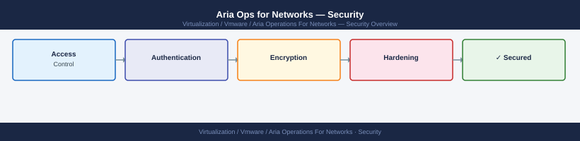

---
tags:
  - aria-networks
  - security
  - vmware
description: "Encryption reference covering Data at Rest, Data in Transit, Certificate Management, TLS Cipher Hardening, Credential Storage."
---
# Aria Operations for Networks — Encryption

<div class="kb-summary">
Encryption reference covering Data at Rest, Data in Transit, Certificate Management, TLS Cipher Hardening, Credential Storage.

*Applies to: Aria Networks 6.x*
</div>


---

## Before you begin

- **Access:** vCenter Administrator role
- **Change management:** security changes require CAB approval in most environments
- **Rollback plan:** document current state before any security control change
- **Testing:** validate in a non-production environment first where possible

---

## Data at Rest

| Component | Encryption | Method |
|---|---|---|
| Platform VM disks | Optional | vSphere VM Encryption or encrypted datastore |
| Collector VM disks | Optional | vSphere VM Encryption or encrypted datastore |
| Stored credentials (vCenter/NSX) | Yes | AES-256, Platform VM keystore |
| Flow database | Datastore-level | Encrypt underlying datastore (vSAN encrypted storage policy) |

Apply vSphere VM Encryption to Platform and Collector VMs via an encrypted storage policy if the datastore does not use hardware encryption.

---

## Data in Transit

| Traffic Path | Encryption | Notes |
|---|---|---|
| Browser → Platform UI | TLS 1.2+ HTTPS | TCP 443 |
| REST API client → Platform | TLS 1.2+ HTTPS | TCP 443 |
| Collector → Platform | TLS 1.2+ HTTPS | TCP 443 |
| Platform/Collector → vCenter | TLS 1.2+ HTTPS | TCP 443 |
| Platform/Collector → NSX Manager | TLS 1.2+ HTTPS | TCP 443 |
| Switches → Collector (NetFlow/IPFIX) | None | UDP — unencrypted by protocol design |

NetFlow/IPFIX is inherently unencrypted. Mitigate by placing Collector VMs on a dedicated management or replication VLAN with no routing from untrusted segments.

---

## Certificate Management

vRNI ships with a self-signed certificate. Replace with a CA-signed certificate for production.

### Replace via UI

---

## TLS Cipher Hardening

Restrict to strong ciphers by editing the Nginx config on the Platform VM:

```bash
ssh ubuntu@vrni.example.local
sudo vim /etc/nginx/nginx.conf

# Find and update ssl_* directives:
ssl_protocols TLSv1.2 TLSv1.3;
ssl_ciphers ECDHE-ECDSA-AES256-GCM-SHA384:ECDHE-RSA-AES256-GCM-SHA384:ECDHE-ECDSA-AES128-GCM-SHA256:ECDHE-RSA-AES128-GCM-SHA256;
ssl_prefer_server_ciphers on;

sudo nginx -t && sudo systemctl reload nginx
```


```text title="Expected output"
ubuntu@vrni.example.local's password: 
nginx: the configuration file /etc/nginx/nginx.conf syntax is ok
nginx: configuration file /etc/nginx/nginx.conf test is successful
```

!!! warning "Common errors"
    **`nginx: [error] open() "/var/run/nginx.pid" failed (2: No such file or directory)`** — Start nginx with `sudo systemctl start nginx` before attempting to reload.
    **`[sudo] password for ubuntu: sudo: no password is required, but a password was given`** — Remove the password prompt by configuring passwordless sudo or use `ssh-keygen` for key-based authentication instead.
Verify:
```bash
nmap --script ssl-enum-ciphers -p 443 vrni.example.local
# Confirm: no TLS 1.0/1.1, no RC4/DES/3DES
```


```text title="Expected output"
Starting Nmap 7.92 ( https://nmap.org ) at 2024-01-15 14:32:18 UTC
Nmap scan report for vrni.example.local (192.168.1.45)
Host is up (0.0042s latency).

PORT    STATE SERVICE
443/tcp open  https

| ssl-enum-ciphers:
|   TLSv1.2:
|     ciphers:
|       TLS_ECDHE_RSA_WITH_AES_256_GCM_SHA384 (secp256r1) - A
|       TLS_ECDHE_RSA_WITH_AES_128_GCM_SHA256 (secp256r1) - A
|       TLS_RSA_WITH_AES_256_GCM_SHA384 - A
|     least strength: A
|   TLSv1.3:
|     ciphers:
|       TLS_AES_256_GCM_SHA384 - A
|       TLS_CHACHA20_POLY1305_SHA256 - A
|     least strength: A
|_  least strength: A

Nmap done at 2024-01-15 14:32:22 UTC; 1 IP address (1 host up) scanned in 4.23 seconds
```

!!! warning "Common errors"
    **`Nmap done at ... 0 hosts up scanned`** — Verify the hostname resolves correctly with `nslookup vrni.example.local` and confirm the appliance is reachable on port 443 with `telnet vrni.example.local 443`.
    **`SCRIPT ENGINE ERROR: ... ssl-enum-ciphers.nse not found`** — Install the nmap-scripts package with `apt-get install nmap` or `yum install nmap` to ensure all NSE scripts are available.
    **`SSL: CERTIFICATE_VERIFY_FAILED`** — This is informational; the script still enumerates ciphers even with self-signed certificates, but if you need to suppress warnings, add `--script-args ssl.version=all` to the command.
---

## Credential Storage

vRNI encrypts all data source credentials (vCenter, NSX, physical device passwords) in its internal database. The encryption key is tied to the Platform VM instance. Do not copy the Platform VM VMDK to another host — credentials will not decrypt without the original key material.

Update stored credentials when source system passwords change:
```text
Settings → Data Sources → [source] → Edit → update password → Save
```

## See also

- [vRNI Security Hardening](../hardening/)
- [vRNI Health Checks](../../operations/health-checks/)
