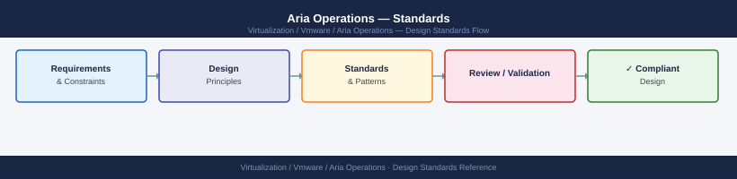

---
tags:
  - architecture
  - aria-operations
  - vmware
---
# Aria Operations — Standards

Standards reference covering Naming Conventions, Build Baseline, Configuration Checklist, Alert Policy Standards, Related Sections.

*Applies to: Aria Operations 8.x*

## Naming Conventions

| Object | Convention | Example |
|--------|-----------|---------|
| Primary node | `aria-ops-primary-<site>` | `aria-ops-primary-dc1` |
| Replica node | `aria-ops-replica-<site>` | `aria-ops-replica-dc1` |
| Data node | `aria-ops-data-<site>-<nn>` | `aria-ops-data-dc1-01` |
| Remote collector | `aria-rc-<site>` | `aria-rc-remote01` |
| Cloud proxy | `aria-cp-<cloud>-<region>` | `aria-cp-aws-eu-west` |
| vCenter adapter | `<vcenter-fqdn>` | `vcsa01.domain.local` |

---

## Build Baseline

### Node Configuration (per role)

| Role | vCPU | RAM | OS Disk | Data Disk |
|------|------|-----|---------|-----------|
| Primary (medium) | 8 | 32 GB | 100 GB | 500 GB |
| Replica (medium) | 8 | 32 GB | 100 GB | 500 GB |
| Data Node | 8 | 32 GB | 100 GB | 1 TB |
| Remote Collector | 2 | 4 GB | 60 GB | — |

### Required Infrastructure

- DNS A record and reverse (PTR) for every node
- NTP configured on all nodes (drift < 1 second within cluster)
- Valid TLS certificate (CA-signed recommended; see [Security](../security/index.md))
- SMTP relay configured for alert email delivery
- AD/LDAP group mapped for RBAC roles

---

## Configuration Checklist

### Pre-deployment

- [ ] DNS A + PTR records created for all nodes
- [ ] NTP source configured and reachable
- [ ] vCenter service account created with read-only role (minimum) or Administrator for full remediation actions
- [ ] NSX service account created
- [ ] SMTP relay details available
- [ ] AD/LDAP bind account and group DNs documented

### Post-deployment

- [ ] Cluster status shows **Online** in Administration > Cluster Management
- [ ] All adapter instances show **Collecting** (green)
- [ ] Alert definitions reviewed and tuned (disable noisy defaults)
- [ ] Super Metrics / custom dashboards imported
- [ ] Notification rules configured (email, webhook, ITSM)
- [ ] Backup/snapshot schedule confirmed
- [ ] TLS certificate replaced with CA-signed cert
- [ ] LDAP auth configured and tested

---

## Alert Policy Standards

- Default alert policies are inherited; create **custom alert policies** per object type.
- Set criticality thresholds per environment (prod vs. non-prod groups).
- Suppress alerts during maintenance windows using Maintenance Schedules.

---

## Related Sections

- [Architecture](index.md) — node roles and sizing
- [Operations](../operations/index.md) — daily checks and health monitoring
- [Security](../security/index.md) — RBAC roles and TLS

## Alert Naming Convention

Alerts follow the pattern `ENV-OBJECT_TYPE-CONDITION` to ensure consistent filtering and automated routing.

Examples:
- `PROD-VM-CPU_CONTENTION`
- `PROD-HOST-MEMORY_BALLOON`
- `NONPROD-DATASTORE-CAPACITY_WARN`

Alert names must be unique across all alert definitions. Use ALL_CAPS for the condition segment.

## Alert Policy Hierarchy

Policies are applied from broadest to most specific; the most specific policy wins.

| Policy Level | Scope | Example |
|---|---|---|
| Global Default | All objects, all environments | Base CPU/memory thresholds |
| Environment Policy | Prod or non-prod object groups | Tighter thresholds for PROD |
| Cluster Policy | Specific cluster or workload group | DB cluster, VDI cluster |

Always document the rationale for any threshold that deviates from the Global Default policy.

## Super Metric Standards

- Prefix: `SM_` followed by a descriptive camelCase name
- Examples: `SM_AvgClusterCpuUsage`, `SM_VMStorageLatencyP95`
- Super metrics must include a description field explaining the formula
- Review super metric accuracy after any vCenter or adapter upgrade

## Dashboard Naming Convention

Dashboards use the format `TEAM-Topic-Scope`.

| Segment | Rule | Example |
|---|---|---|
| TEAM | Owning team prefix | `INFRA`, `DBA`, `NETWORK` |
| Topic | Functional area | `Capacity`, `Performance`, `Alerts` |
| Scope | Breadth of data | `Overview`, `Cluster`, `VM` |

Examples:
- `INFRA-Capacity-Overview`
- `DBA-Performance-SQLCluster`
- `NETWORK-Alerts-NSXEdge`

Shared dashboards visible to all users should be placed in the **Shared** folder. Team-specific dashboards go in the relevant team folder.

## Custom Group Naming

Custom groups follow `ENV-ObjectType`.

- `PROD-ComputeCluster`
- `NONPROD-VM`
- `PROD-Datastore`

Dynamic groups should use membership criteria that automatically includes new objects (e.g., objects in a named vCenter folder or cluster).

## Report Schedules

| Report | Schedule | Audience |
|---|---|---|
| Capacity Overview | Weekly, Monday 07:00 | Infra team |
| Top-N VMs by Contention | Weekly, Monday 07:00 | Infra + App teams |
| Monthly Executive Capacity Summary | Monthly, 1st working day | Management |
| Alert Trend Report | Weekly | Ops team |

Reports are distributed via email and archived in the shared drive capacity folder.

## Threshold Reference

| Metric | Warning | Critical |
|---|---|---|
| VM CPU Usage | 80% | 95% |
| VM Memory Usage | 85% | 95% |
| Host CPU Contention | 5% | 10% |
| Host Memory Balloon | 1% | 5% |
| Datastore Capacity Used | 75% | 85% |
| Datastore Latency (ms) | 10 | 20 |

## See also

- [Aria Operations — How It Works](../how-it-works/)
- [Aria Operations — Deploy](../../deploy/)
