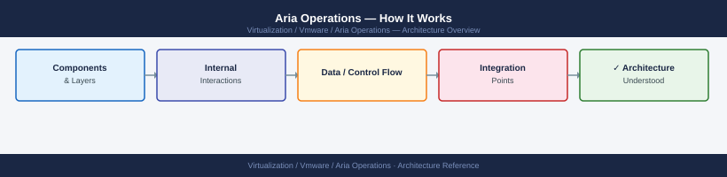
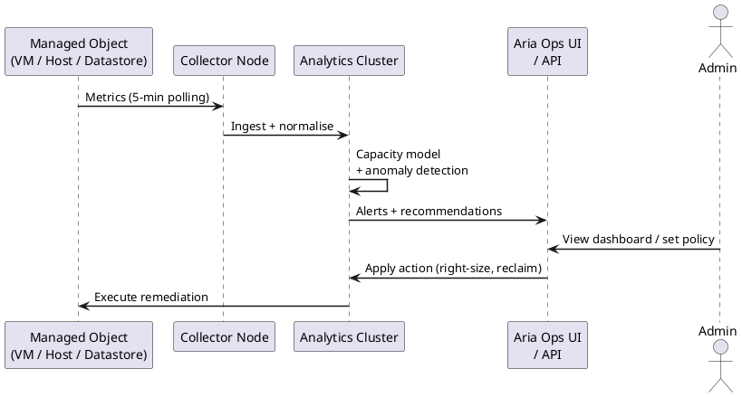
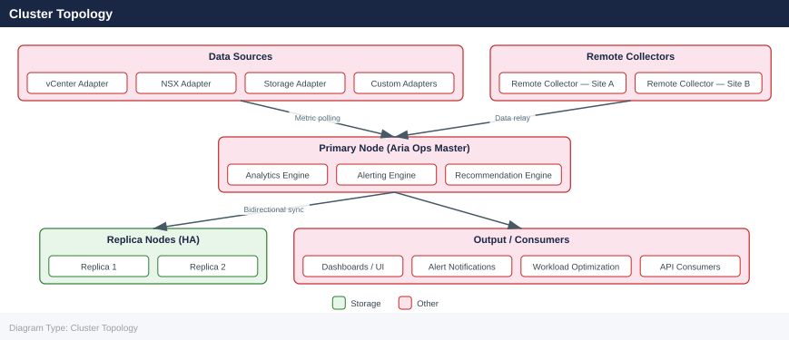

---
tags:
  - architecture
  - aria-operations
  - vmware
description: "How It Works reference covering Overview, Cluster Topology, Node Roles, Sizing, Core Internal Services and 3 more sections."
---
# Aria Operations — How It Works

How It Works reference covering Overview, Cluster Topology, Node Roles, Sizing, Core Internal Services and 3 more sections.

*Applies to: Aria Operations 8.x*

## Overview

Aria Operations (formerly vRealize Operations) is an analytics cluster that collects metrics, events, and properties from vSphere, NSX, storage, and cloud endpoints. Adapters (solutions/management packs) feed data into the cluster. Remote collectors extend monitoring reach into remote sites or DMZs without requiring firewall holes back to the primary cluster.

## Cluster Topology

## Node Roles

| Node Role | Description |
|---|---|
| Primary | Hosts the UI, analytics controller, and cluster coordination |
| Primary Replica | Hot standby — automatically promoted if Primary fails |
| Data | Scale-out metric ingestion and storage nodes |
| Remote Collector | Lightweight proxy for remote sites/DMZs; forwards to cluster without joining it |
| Cloud Proxy | SaaS-hosted proxy for VMware Cloud on AWS integrations |

## Sizing

| Size | Nodes | vCPUs | RAM | Monitored Objects |
|---|---|---|---|---|
| Extra Small | Primary only | 4 | 16 GB | Up to 500 VMs |
| Small | Primary only | 8 | 32 GB | Up to 1,500 VMs |
| Medium | Primary + Replica | 16 | 48 GB | Up to 3,500 VMs |
| Large | Primary + Replica + 2 Data | 16 | 48 GB | Up to 10,000 VMs |
| Extra Large | Primary + Replica + 4+ Data | 24 | 64 GB | 10,000+ VMs |

Remote Collector: 2 vCPUs, 4 GB RAM per site.

## Core Internal Services

| Service | Process | Role |
|---|---|---|
| Analytics | `vmware-vcops-analytics` | Metric processing, anomaly detection, capacity analytics |
| Collector | `vmware-vcops-collector` | Adapter framework; manages adapter instances |
| Web UI (Casa) | `vmware-casa` | REST API and web application server |
| GemFire | `vmware-vcops-gemfire` | In-memory distributed data grid — real-time metric cache |
| Cassandra | `vmware-vcops-cassandra` | Long-term time-series metric storage |
| Postgres | `vmware-vcops-postgres` | Configuration, alert, and deployment metadata |
| Watchdog | `vmware-vcops-watchdog` | Restarts failed services automatically |

## Adapters

| Adapter | Monitored Objects |
|---|---|
| vSphere Solution (built-in) | vCenter, ESXi, VMs, datastores, clusters |
| NSX-T Solution | NSX-T managers, transport nodes, logical switches |
| vSAN Adapter (built-in) | vSAN cluster, disk groups, storage policies |
| Storage Devices Pack | Pure Storage, NetApp, vSAN |
| OS Management Pack | Windows, Linux via agent or WMI |
| AWS / Azure / GCP | Cloud resource monitoring |

## Persistent Storage

| Path | Purpose | Minimum Size |
|---|---|---|
| `/storage/db` | Cassandra time-series metric data | 300 GB (large) |
| `/storage/log` | Application and collector logs | 100 GB |
| `/storage/core` | OS and application binaries | 50 GB |

## Network Ports

| Port | Protocol | Direction | Purpose |
|---|---|---|---|
| 443 | TCP | Inbound | Web UI and REST API |
| 22 | TCP | Inbound | SSH admin access |
| 4505/4506 | TCP | Inbound | Salt master — Remote Collector registration and data |
| 443 | TCP | Outbound | vCenter, NSX, cloud adapters |
| 9543 | TCP | Cluster-internal | Inter-node data replication |
| 10010 | TCP | Cluster-internal | GemFire distributed data grid |

## See also

- [Aria Operations — Standards](../design-standards/)
- [Aria Operations — Deploy](../../deploy/)
- [Aria Operations Integrations](../integrations/)
