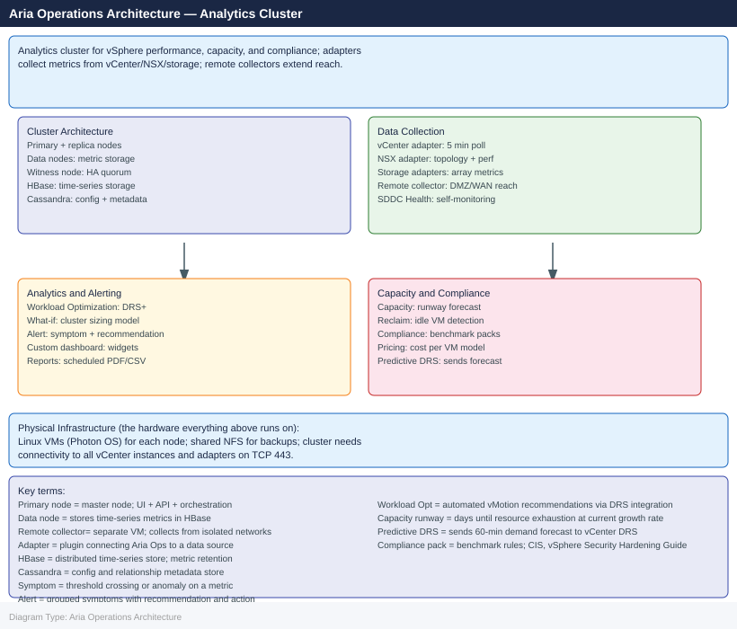
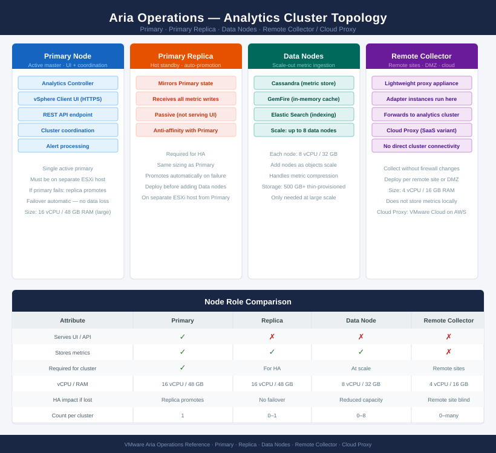

---
tags:
  - architecture
  - aria-operations
  - vmware
---
# Aria Operations — Architecture

Analytics cluster for vSphere performance, capacity, and compliance monitoring. Adapters collect metrics from vCenter, NSX, and storage; remote collectors extend reach into remote sites and DMZs without direct cluster connectivity.

*Applies to: Aria Operations 8.x*

<a class="kb-card" href="how-it-works/"><strong>How It Works</strong>How it works, integrations, and design standards.</a>
<a class="kb-card" href="integrations/"><strong>Integrations</strong>Integration with vCenter, NSX, storage, and external monitoring tools.</a>
<a class="kb-card" href="design-standards/"><strong>Design Standards</strong>Sizing guidelines, adapter configuration, and cluster design best practices.</a>

## Node Roles

| Node Role | Description |
|---|---|
| Primary | Hosts the UI, analytics controller, and cluster coordination |
| Primary Replica | Hot standby — automatically promoted if Primary fails |
| Data | Scale-out metric ingestion and storage nodes |
| Remote Collector | Lightweight proxy for remote sites/DMZs; forwards to cluster without joining it |
| Cloud Proxy | SaaS-hosted proxy for VMware Cloud on AWS integrations |

## Deployment Sizing

| Deployment Size | Nodes | Use Case |
|---|---|---|
| Small (xSmall) | 1 node | Lab / proof-of-concept |
| Medium | Primary + Replica | Up to ~3,000 VMs |
| Large | Primary + Replica + 2–4 Data Nodes | Up to ~10,000 VMs |
| Extra Large | Primary + Replica + 4+ Data Nodes | Enterprise fleet |

---

## Analytics Cluster Topology
