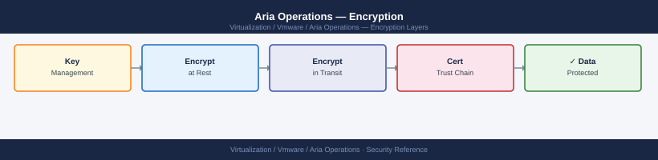

---
tags:
  - aria-operations
  - security
  - vmware
description: "Encryption reference covering TLS Certificate Replacement, Cluster-Internal TLS, Data at Rest Encryption, Credential Encryption in Adapters, Certificate..."
---
# Aria Operations — Encryption

<div class="kb-summary">
Encryption reference covering TLS Certificate Replacement, Cluster-Internal TLS, Data at Rest Encryption, Credential Encryption in Adapters, Certificate Expiry Monitoring and 1 more sections.

*Applies to: Aria Ops 8.x*
</div>


## Before you begin

- **Access:** vCenter Administrator role
- **Change management:** security changes require CAB approval in most environments
- **Rollback plan:** document current state before any security control change
- **Testing:** validate in a non-production environment first where possible

---

## TLS Certificate Replacement

Aria Operations ships with a self-signed certificate. Replace with a CA-signed certificate for production to avoid browser warnings, API trust failures, and integration issues with other Aria products.

**Via UI:**

---

## Data at Rest Encryption

Aria Operations does not natively encrypt metric data at rest. Apply encryption at the storage layer:

- **vSAN**: enable vSAN Data-at-Rest Encryption on the datastore hosting Aria Operations VMs
- **External storage (SAN/NAS)**: enable volume-level encryption on the LUN or NFS export
- **VM-level encryption**: vSphere VM Encryption can encrypt the VM's virtual disks independently of the storage layer

Verify VM encryption status:

```powershell
# PowerCLI — check if Aria Operations VMs have encrypted disks
Get-VM "vrops-prod-01" | Get-HardDisk | Select-Object Name, StorageFormat,
  @{N="Encrypted";E={$_.ExtensionData.Backing.KeyId -ne $null}}
```

---

## Credential Encryption in Adapters

Adapter credentials (vCenter, NSX, storage) are stored encrypted in the Aria Operations Postgres database. The encryption key is derived from the node's unique identifier.

- Do not move adapter credentials between cluster deployments by copying the database directly
- After a restore, re-enter all adapter credentials via the UI — they cannot be decrypted on a different cluster instance

---

## Certificate Expiry Monitoring

Check certificate expiry from the command line or via API:

```bash
# Check expiry of the current UI certificate
echo | openssl s_client -connect vrops-prod-01.example.local:443 2>/dev/null | \
  openssl x509 -noout -dates

# Check expiry of each cluster node's certificate
for node in vrops-prod-01 vrops-prod-02 vrops-prod-03; do
  echo -n "$node.example.local: "
  echo | openssl s_client -connect "$node.example.local:443" 2>/dev/null | \
    openssl x509 -noout -enddate 2>/dev/null
done
```


```text title="Expected output"
notBefore=Jan 15 08:23:47 2023 GMT
notAfter=Jan 15 08:23:47 2025 GMT
vrops-prod-01.example.local: notAfter=Jan 15 08:23:47 2025 GMT
vrops-prod-02.example.local: notAfter=Jan 14 10:45:22 2024 GMT
vrops-prod-03.example.local: notAfter=Jan 15 08:23:47 2025 GMT
```

!!! warning "Common errors"
    | Error | Fix |
    |---|---|
    | `connect: Connection refused` | Verify the vROps node is running and port 443 is accessible; check firewall rules and service status with `systemctl status vmware-vcopssvc`. |
    | `unable to load certificate` | The node may be using a self-signed certificate or the connection was interrupted; retry the command or check node connectivity with `ping`. |
    | `Name or service not known` | Ensure DNS resolution is working for the vROps hostnames; verify `/etc/hosts` entries or DNS server configuration. |
Set a monitoring alert in Aria Operations itself for the synthetic metric `ssl_certificate_days_until_expiry` on the self-monitoring adapter.

---

## FIPS Mode

Aria Operations 8.x supports FIPS 140-2 compliant cryptography. Enable FIPS only at deployment time — it cannot be enabled on an existing cluster without redeployment.

If FIPS is required:
- Deploy a new cluster with FIPS mode selected in the OVA deployment wizard
- All management pack integrations must also support FIPS — verify compatibility before enabling
- Note: FIPS mode disables some cipher suites and hash algorithms — test all adapter connections after deployment

## See also

- [Aria Operations Security Hardening](../hardening/)
- [Aria Operations Health Checks](../../operations/health-checks/)
