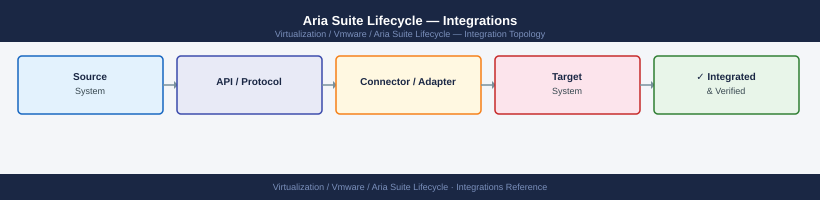

---
tags:
  - architecture
  - aria-lcm
  - vmware
description: "Integrations reference covering vCenter Server, NSX-T Integration (Optional), SMTP Configuration, NFS Binary Repository, Proxy / Offline Depot and 2 more..."
---
# Aria Suite Lifecycle — Integrations

<div class="kb-summary">
Integrations reference covering vCenter Server, NSX-T Integration (Optional), SMTP Configuration, NFS Binary Repository, Proxy / Offline Depot and 2 more sections.

*Applies to: Aria Suite Lifecycle 8.x*
</div>


  LCM Integration Map

## NSX-T Integration (Optional)

If LCM-deployed products require new overlay segments:
1. LCM → Settings → NSX-T → Add NSX-T Manager
2. Provide NSX-T Manager FQDN and credentials
3. LCM can auto-provision overlay segments for Aria product deployment

## SMTP Configuration

Configure email notifications for upgrade alerts and certificate expiry warnings:
1. LCM → Settings → My VMware → SMTP Settings
2. Enter relay host, port (25/587), and credentials if required
3. Set a sender address and notification recipient list

Test SMTP: LCM → Settings → SMTP → Send Test Email.

## NFS Binary Repository

LCM stores downloaded product bundles on an NFS share:

```bash
# Verify NFS mount from LCM appliance
df -h /data
mount | grep /data
# Should show: <nfs-server>:/lcm-repo on /data type nfs

# Check available space (requires > 50 GB free per product version)
du -sh /data/*
```


```text title="Expected output"
Filesystem      Size  Used Avail Use% Mounted on
nfs-prod-01:/lcm-repo  500G  320G  180G  64% /data

nfs-prod-01:/lcm-repo on /data type nfs4 (rw,relatime,vers=4.1,rsize=1048576,wsize=1048576,namlen=255,hard,proto=tcp,timeo=600,retrans=2,sec=sys,clientaddr=10.50.12.45,local_lock=none,addr=10.50.12.10)

4.2G	/data/aria-automation-8.12.0
6.8G	/data/aria-operations-8.14.1
5.1G	/data/aria-suite-lifecycle-2.3.0
3.9G	/data/aria-orchestrator-8.11.2
2.4G	/data/patches
```

!!! warning "Common errors"
    **`mount: /data: special device nfs-prod-01:/lcm-repo does not contain a colon`** — Verify the NFS server hostname and path are correctly formatted as `server:/path` in your mount configuration.
    **`df: /data: No such file or directory`** — Create the mount point with `mkdir -p /data` and ensure the NFS mount is active before running diagnostics.
    **`No space left on device`** — Free up space on the NFS server or add additional storage; LCM requires at least 50 GB free per product version.
If NFS becomes unavailable: LCM upgrades will fail. Ensure NFS server HA (or VMware datastore-backed NFS).

## Proxy / Offline Depot

For environments without direct internet access:

**Proxy**:
1. LCM → Settings → System Details → Proxy → configure HTTP proxy IP and port
2. Add proxy bypass for vCenter, NSX, and all Aria product FQDNs

**Offline Depot** (no internet):
1. Download product bundles from Broadcom Support Portal (*.pak files)
2. Upload to LCM: Lifecycle Operations → Settings → Binary Mapping → Upload Product Binaries
3. Map binaries before initiating upgrade

## Active Directory / LDAP

AD integration is handled through Workspace ONE Access, not LCM directly:
1. VIDM console → Connector → Active Directory → Add AD connector
2. Configure sync scope: OUs containing admin groups
3. Map AD groups to LCM roles in LCM → Settings → Access Control

## Aria Automation Integration

After LCM deploys Aria Automation:
1. LCM → My Services → Aria Automation → Connect to vCenter
2. Configure cloud accounts in Aria Automation for each vCenter under management

## See also

- [Aria Suite Lifecycle — How It Works](../how-it-works/)
- [Aria Suite Lifecycle — Deploy](../../deploy/)
