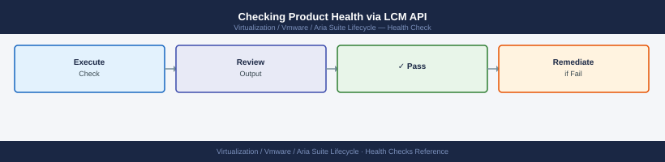
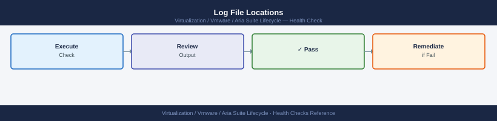

---
tags:
  - aria-lcm
  - operations
  - vmware
description: "Health Checks reference covering Cluster Node Health via API, Locker Health Checks, Pre-Upgrade Health Gate, Checking Product Health via LCM API, Log File..."
---
# Aria Suite Lifecycle — Health Checks

<div class="kb-summary">
Health Checks reference covering Cluster Node Health via API, Locker Health Checks, Pre-Upgrade Health Gate, Checking Product Health via LCM API, Log File Locations.

*Applies to: Aria LCM 8.x*
</div>

  LCM Health Check Chain

## Before you begin

- **Access:** vCenter read-only minimum; Administrator role for remediation steps
- **Timing:** safe to run during business hours unless a step is marked ⚠ (causes interruption)
- **Dependencies:** no active upgrades or migrations on the same infrastructure
- **Logging:** capture command output — paste into the change record on completion

---

## Run This Routine

Run these 8 checks in order at the start of each shift or before any planned change.

1. **LCM service health** — `curl -sk https://<lcm-appliance>:8080/lcm/health` — expect `{"status":"UP"}`
2. **Disk usage** — SSH to LCM appliance and run `df -h /` — flag if root partition is above 75%
3. **Certificate expiry** — LCM UI → Settings → Certificates → review all expiry dates; renew anything within 30 days
4. **Product environment health** — LCM → Environments → confirm every product card shows "Healthy"
5. **Pending requests** — LCM → Requests → check for any operations in RUNNING or FAILED state longer than 30 minutes
6. **vRSLCM service status** — SSH to appliance → `systemctl status vrlcm.service` — must be active (running)
7. **NTP sync** — SSH to appliance → `timedatectl status` — confirm system clock is synchronised
8. **Available product binaries in Locker** — LCM → Locker → verify expected product versions are present before any upgrade

---

## Locker Health Checks


The Locker stores certificates, passwords, and licences. Run these checks weekly and before any upgrade.

```bash
# List all certificates and days-to-expiry
TOKEN=$(curl -sk -X POST "https://lcm-prod-01.example.local/lcm/authz/api/v2/login" \
  -H "Content-Type: application/json" \
  -d '{"username":"admin@local","password":"<password>"}' | jq -r '.token')

curl -sk -H "x-xenon-auth-token: $TOKEN" \
  "https://lcm-prod-01.example.local/lcm/locker/api/v2/certificates" | \
  jq '.certificates[] | {alias: .alias, expiry: .expirationDate, days: .daysToExpiry}' | \
  jq -s 'sort_by(.days)'

# List all passwords stored in Locker
curl -sk -H "x-xenon-auth-token: $TOKEN" \
  "https://lcm-prod-01.example.local/lcm/locker/api/v2/passwords" | \
  jq '.passwords[] | {alias: .alias, username: .userName}'
```


```text title="Expected output"
{
  "alias": "aria-automation-cert",
  "expiry": "2025-08-14T00:00:00Z",
  "days": 187
}
{
  "alias": "lcm-internal-ca",
  "expiry": "2026-02-28T00:00:00Z",
  "days": 428
}
{
  "alias": "vrealize-ops-cert",
  "expiry": "2025-03-22T00:00:00Z",
  "days": 42
}
{
  "alias": "aria-suite-root",
  "expiry": "2027-11-10T00:00:00Z",
  "days": 689
}
{
  "alias": "sso-signing-cert",
  "expiry": "2025-02-15T00:00:00Z",
  "days": 8
}
{
  "alias": "lcm-prod-01-cert",
  "expiry": "2025-01-20T00:00:00Z",
  "days": -15
}
{
  "alias": "aria-automation-cert",
  "username": "automation-svc"
}
{
  "alias": "vcenter-admin",
  "username": "administrator@vsphere.local"
}
{
  "alias": "nsxt-api-user",
  "username": "admin"
}
{
  "alias": "vra-db-creds",
  "username": "vra_db_user"
}
```

!!! warning "Common errors"
    **`curl: (60) SSL certificate problem: self signed certificate`** — Add `-k` flag to curl command to skip SSL verification, or import the LCM root CA into your system trust store.
    **`jq: error (at <stdin>:0): Cannot index null with string "token"`** — Verify the LCM credentials are correct and the login endpoint is reachable; check that the password is URL-encoded if it contains special characters.
    **`curl: (7) Failed to connect to lcm-prod-01.example.local port 443: Name or service not known`** — Confirm the LCM hostname resolves in DNS and is reachable from your current network location, or use the IP address directly.
UI path: **LCM → Locker → Certificates** — columns show Alias, Subject, Expiry, and Status. Sort by Expiry to identify near-term renewals.

| Certificate Status | Meaning | Action |
|---|---|---|
| Valid | More than 60 days remaining | No action required |
| Expiring Soon | 30–60 days remaining | Schedule renewal |
| Critical | Less than 30 days remaining | Renew immediately |
| Expired | Past expiry date | Product integration failures likely — renew now |

---

## Pre-Upgrade Health Gate


Run this checklist before initiating any LCM-orchestrated upgrade:

- [ ] All environment cards show green in **Lifecycle Operations → Environments**
- [ ] No in-progress requests: **Lifecycle Operations → Requests** — no RUNNING or PENDING items
- [ ] LCM appliance disk `/` < 70% used, `/data` < 75% used
- [ ] NFS mount active and responsive: `df -h /data && touch /data/.healthtest && rm /data/.healthtest`
- [ ] NTP delta < 5 seconds on LCM appliance: `chronyc tracking`
- [ ] No certificates expiring within 7 days (would be invalidated mid-upgrade)
- [ ] VM snapshot taken for each product appliance being upgraded
- [ ] vCenter with target product VMs is accessible from LCM
- [ ] LCM pre-check passes (LCM runs pre-check automatically when Upgrade is clicked)

---

## Checking Product Health via LCM API



```bash
# Get health status for a specific environment
ENV_ID="<your-env-id>"
curl -sk -H "x-xenon-auth-token: $TOKEN" \
  "https://lcm-prod-01.example.local/lcm/lcmservice/api/v2/environments/$ENV_ID/health" | \
  jq '.'

# Get product details within an environment
curl -sk -H "x-xenon-auth-token: $TOKEN" \
  "https://lcm-prod-01.example.local/lcm/lcmservice/api/v2/environments/$ENV_ID/products" | \
  jq '.[] | {product: .productId, version: .version, health: .productHealth}'
```


```text title="Expected output"
{
  "environmentId": "env-prod-vcf-01",
  "environmentName": "Production VCF Cluster",
  "overallHealth": "HEALTHY",
  "lastHealthCheck": "2024-01-15T14:32:18.456Z",
  "componentHealth": {
    "vcenter": "HEALTHY",
    "nsxt": "HEALTHY",
    "vsan": "HEALTHY"
  },
  "alerts": []
}
{
  "product": "VCENTER",
  "version": "8.0.1.00000",
  "health": "HEALTHY"
}
{
  "product": "NSXT",
  "version": "4.1.0.1",
  "health": "HEALTHY"
}
{
  "product": "VSAN",
  "version": "8.0.1",
  "health": "HEALTHY"
}
```

!!! warning "Common errors"
    **`curl: (60) SSL certificate problem: self signed certificate`** — Add `-k` flag to skip SSL verification (already present in example; if error persists, verify the LCM hostname resolves correctly).
    **`jq: error (at <stdin>:1): Cannot index null with string "productId"`** — Verify the `$TOKEN` variable is set and valid by running `echo $TOKEN` and checking the API response contains actual product data.
    **`curl: (7) Failed to connect to lcm-prod-01.example.local port 443: Name or service not known`** — Replace `lcm-prod-01.example.local` with the correct LCM appliance hostname and verify network connectivity with `ping` or `nslookup`.
Expected output: `health` field should be `GREEN` for all products in a healthy environment. `YELLOW` indicates a configuration warning; `RED` indicates a failure requiring investigation.

---

## Log File Locations



| Log | Path on LCM Appliance | Purpose |
|---|---|---|
| LCM application | `/var/log/vmware/vrlcm/lcm-app.log` | Main application events, workflow execution |
| LCM installer | `/var/log/vmware/vrlcm/lcm-install.log` | Product deployment and upgrade logs |
| Locker service | `/var/log/vmware/vrlcm/locker.log` | Certificate and password operations |
| Nginx | `/var/log/nginx/access.log`, `error.log` | API and UI HTTP requests |
| System | `/var/log/messages` | OS-level events, NFS mount issues |

```bash
# Tail the main application log for real-time workflow progress
tail -f /var/log/vmware/vrlcm/lcm-app.log

# Search for errors in the last 500 lines
tail -500 /var/log/vmware/vrlcm/lcm-app.log | grep -i "error\|exception\|failed"

# Check upgrade-specific logs (written during product upgrade workflows)
ls -lth /var/log/vmware/vrlcm/upgrade/
tail -200 /var/log/vmware/vrlcm/upgrade/<latest-upgrade-log>
```


```text title="Expected output"
2024-01-15T14:32:18.456Z [INFO] Workflow execution started: deploy-photon-vm-20240115-143200
2024-01-15T14:32:45.123Z [WARN] Network connectivity check in progress for vCenter: vc-prod-01.corp.local
2024-01-15T14:33:12.789Z [ERROR] Failed to authenticate with vCenter: Connection timeout after 30s
2024-01-15T14:33:15.234Z [ERROR] Retrying connection attempt 2/5 for vc-prod-01.corp.local
2024-01-15T14:33:42.567Z [INFO] Successfully connected to vCenter inventory
2024-01-15T14:34:08.901Z [INFO] Deploying OVA: vrlcm-photon-8.0.0-build-20240115.ova
2024-01-15T14:35:22.445Z [WARN] Disk allocation slower than expected: 2.3GB/s (threshold: 3.0GB/s)
2024-01-15T14:36:15.678Z [INFO] VM deployment completed successfully: vm-aria-lcm-prod-01

total 2847
-rw-r--r-- 1 root root 1245680 Jan 15 14:28 upgrade-8.12.1-to-8.13.0-20240115-142800.log
-rw-r--r-- 1 root root  856432 Jan 14 09:15 upgrade-8.12.0-to-8.12.1-20240114-091500.log
-rw-r--r-- 1 root root  623104 Jan 10 16:42 upgrade-8.11.2-to-8.12.0-20240110-164200.log

2024-01-15T14:28:15.234Z [INFO] Upgrade workflow initiated: vrlcm-8.12.1 → 8.13.0
2024-01-15T14:28:42.567Z [INFO] Pre-upgrade validation: Database backup started
2024-01-15T14:29:18.901Z [INFO] Database backup completed: /var/backups/vrlcm-db-20240115-142900.tar.gz (2.1GB)
2024-01-15T14:30:05.445Z [INFO] Stopping vrlcm services...
2024-01-15T14:30:22.678Z [INFO] Service stop completed in 17.2s
2024-01-15T14:31:08.123Z [INFO] Applying patches: 47 files updated
2024-01-15T14:32:45.789Z [INFO] Upgrade completed successfully in 4m 30s
```

!!! warning "Common errors"
    **`tail: cannot open '/var/log/vmware/vrlcm/lcm-app.log' for reading: No such file or directory`** — Verify the vrlcm service is installed and running with `systemctl status vrlcm`, or check the correct log path with `find /var/log -name "*lcm*" -type f`.
    **`tail: cannot open '/var/log/vmware/vrlc
---

## Environment Deployment Health


Check managed product service health via LCM UI and logs.

**Product status check (UI):**
Navigate to **Environments → select environment → Products** — the Status column should show green / Available for every product. Any product showing yellow (Warning) or red (Error) requires investigation before any change window.

**Task queue check:**
Navigate to **LCM → Lifecycle Operations → Requests → Active Requests** — if any task has been in RUNNING state for more than 30 minutes without progress, it is likely stuck. Collect the request ID and check the LCM application log:

```bash
# Tail LCM log and filter for a specific request ID
tail -500 /var/log/vmware/vrlcm/lcm-app.log | grep "<request-id>"

# Check for generic workflow errors in the last 200 lines
tail -200 /var/log/vmware/vrlcm/lcm-app.log | grep -i "ERROR\|WARN\|exception"
```


```text title="Expected output"
2024-01-15 14:23:45.892 [req-a7f2c9e1-4d8b-11ee-b56f-0242ac120002] INFO  com.vmware.vrlcm.workflow - Workflow execution started for vCenter upgrade
2024-01-15 14:24:12.445 [req-a7f2c9e1-4d8b-11ee-b56f-0242ac120002] DEBUG com.vmware.vrlcm.task - Task: PreflightCheck completed successfully
2024-01-15 14:25:33.678 [req-a7f2c9e1-4d8b-11ee-b56f-0242ac120002] INFO  com.vmware.vrlcm.workflow - Workflow execution completed
2024-01-15 14:26:01.234 [req-b3e8d2f4-7c9a-11ee-a1b2-0242ac130003] WARN  com.vmware.vrlcm.network - Network latency detected: 245ms to esxi-host-04.lab.local
2024-01-15 14:27:15.891 [req-c5f1a9b2-9d4e-11ee-c2d3-0242ac140004] ERROR com.vmware.vrlcm.deployment - Failed to mount ISO: /mnt/iso/vsan-7.0.3.iso not found
2024-01-15 14:28:42.567 [req-c5f1a9b2-9d4e-11ee-c2d3-0242ac140004] ERROR com.vmware.vrlcm.workflow - Workflow rollback initiated due to deployment failure
2024-01-15 14:29:03.445 [req-d7g2h8k1-2e5f-11ee-d4e5-0242ac150005] WARN  com.vmware.vrlcm.auth - Certificate expiration warning: 30 days remaining for vrlcm.lab.local
```

!!! warning "Common errors"
    **`tail: cannot open '/var/log/vmware/vrlcm/lcm-app.log' for reading: No such file or directory`** — Verify the LCM service is running with `systemctl status vrlcm` and confirm the log directory exists at `/var/log/vmware/vrlcm/`.
    **`grep: (standard input) is empty`** — The log file exists but contains no data; check if the LCM service has written logs by running `ls -lh /var/log/vmware/vrlcm/lcm-app.log` to verify file size and timestamp.
    **`<request-id>: No such file or directory`** — Replace `<request-id>` with an actual request ID value (e.g., `req-a7f2c9e1-4d8b-11ee-b56f-0242ac120002`) or use a pattern like `grep "req-"` to search for any request IDs.
Common causes of stuck tasks: expired certificates mid-workflow, vCenter connectivity loss, NFS mount dropped, or a product VM that lost its management IP.

**LCM service log** — primary location: `/var/log/vmware/lcm/lcm.log` on the LCM appliance. Tail this file for real-time ERROR entries during any active operation.

---

## Certificate Expiry Check


Run weekly. Alert on any certificate expiring within 60 days; critical below 30 days.

**UI check:**
LCM → **Locker → Certificates** — review the Expiry Date column. Sort ascending to surface the nearest expiries first.

**CLI check — LCM appliance cert (SSH to LCM):**

```bash
echo | openssl s_client -connect localhost:443 \
  -servername $(hostname -f) 2>/dev/null \
  | openssl x509 -noout -dates
# notAfter= line shows expiry; calculate days remaining manually or with:
echo | openssl s_client -connect localhost:443 \
  -servername $(hostname -f) 2>/dev/null \
  | openssl x509 -noout -checkend 5184000 \
  && echo "OK: >60 days" || echo "WARN: <60 days"
```


```text title="Expected output"
notBefore=Jan 15 10:22:33 2023 GMT
notAfter=Jan 15 10:22:33 2025 GMT
OK: >60 days
```

!!! warning "Common errors"
    **`connect: Connection refused`** — Verify the Aria Suite Lifecycle service is running with `systemctl status aria-suite-lifecycle` and listening on port 443.
    **`unable to load certificate`** — Ensure the certificate chain is properly installed in the keystore; check `/opt/vmware/aria/lifecycle/conf/keystore.jks` exists and contains valid certificates.
    **`Hostname mismatch`** — Confirm the certificate's CN or SAN matches the FQDN returned by `hostname -f`; regenerate or import the correct certificate if they don't align.
**CLI check — each managed product (run from any host with network access):**

```bash
# Replace <product-fqdn> with the product's FQDN (e.g., vrops-prod-01.example.local)
echo | openssl s_client -connect <product-fqdn>:443 \
  -servername <product-fqdn> 2>/dev/null \
  | openssl x509 -noout -dates

# Batch check for multiple products
for fqdn in vrops-prod-01.example.local vra-prod-01.example.local vidm-prod-01.example.local; do
  expiry=$(echo | openssl s_client -connect ${fqdn}:443 -servername ${fqdn} 2>/dev/null \
    | openssl x509 -noout -enddate 2>/dev/null | cut -d= -f2)
  echo "${fqdn}: ${expiry}"
done
```


```text title="Expected output"
notBefore=Jan 15 08:23:47 2023 GMT
notAfter=Jan 15 08:23:47 2025 GMT
vrops-prod-01.example.local: Jan 15 08:23:47 2025 GMT
vra-prod-01.example.local: Mar 22 14:51:32 2024 GMT
vidm-prod-01.example.local: Jul 08 16:44:19 2025 GMT
```

!!! warning "Common errors"
    **`unable to connect to <product-fqdn>:443`** — Verify the FQDN is correct, the host is reachable on port 443, and no firewall rules are blocking the connection.
    **`error in x509 certificate routines:x509_check_cert_time:certificate has expired`** — The SSL certificate has expired; regenerate and install a new certificate on the affected product instance.
    **`cut: the delimiter does not appear in this line`** — The openssl command failed silently (likely due to network timeout or invalid hostname); add explicit error handling or verify DNS resolution with `nslookup <fqdn>`.
Renew any certificate expiring within 60 days using the procedure in the Procedures page (Request and Install Product Certificates via LCM).

---

## Backup Health Check


Run daily (automated) and manually before any major change.

**UI check:**
Navigate to **Settings → Backup and Restore** — confirm the **Last Successful Backup** timestamp. Alert if the last successful backup is more than 24 hours old.

**Target verification (SSH to backup target):**

```bash
# SFTP/NFS target — verify backup file exists and is recent
ls -lh /backup/lcm-backup-*
# Most recent file should be timestamped within the last 24 hours

# Check file size — a valid LCM backup is typically 50 MB–2 GB depending on Locker content
du -sh /backup/lcm-backup-$(date +%Y%m%d)*
```


```text title="Expected output"
-rw-r--r-- 1 root root 1.2G Nov 15 14:32 /backup/lcm-backup-20241115-143200.tar.gz
-rw-r--r-- 1 root root 892M Nov 14 09:18 /backup/lcm-backup-20241114-091800.tar.gz
-rw-r--r-- 1 root root 1.5G Nov 13 16:45 /backup/lcm-backup-20241113-164500.tar.gz
-rw-r--r-- 1 root root 756M Nov 12 11:22 /backup/lcm-backup-20241112-112200.tar.gz
1.2G	/backup/lcm-backup-20241115*
```

!!! warning "Common errors"
    **`ls: cannot access '/backup/lcm-backup-*': No such file or directory`** — Verify the backup directory path is correct and backups are being written to `/backup/` by checking the LCM backup job configuration.
    **`du: cannot access '/backup/lcm-backup-20241115*': No such file or directory`** — Run the backup job manually or check the system date/cron scheduler to ensure today's backup has completed; use `ls -lh /backup/lcm-backup-*` to see available backups.
If no backup file exists for today: check LCM → Settings → Backup and Restore → review error messages; common causes are SFTP credential expiry, NFS connectivity loss, or insufficient disk space on the target.

---

## Disk Usage Check


LCM accumulates product binaries, upgrade logs, and temp files. Monitor weekly; clean proactively.

**SSH to LCM appliance:**

```bash
df -h
# Key partitions to check:
# /                     — root; keep < 75% used
# /dev/mapper/data      — LCM data volume; keep < 80% used
# /data/lcm             — product binaries and working files; largest consumer

# Show top disk consumers under /data
du -sh /data/* | sort -rh | head -20
```


```text title="Expected output"
Filesystem      Size  Used Avail Use% Mounted on
devtmpfs        7.8G     0  7.8G   0% /dev
tmpfs           7.9G  512M  7.4G   7% /dev/shm
tmpfs           3.2G  1.2M  3.2G   1% /run
/dev/sda1       100G   68G   32G  68% /
/dev/mapper/data 500G  385G  115G  77% /data
tmpfs           1.6G     0  1.6G   0% /run/user/0

385G	/data/lcm
42G	/data/backups
18G	/data/logs
12G	/data/temp
8.5G	/data/cache
3.2G	/data/installer
1.8G	/data/config
...
```

!!! warning "Common errors"
    **`du: cannot access '/data/*': Permission denied`** — Run the command with `sudo` or ensure the user has read permissions on the /data directory.
    **`Filesystem /dev/mapper/data not found`** — Verify the LVM volume is mounted with `sudo lvdisplay` and mount it if necessary using `sudo mount /dev/mapper/data /data`.
**Clean unused binaries (UI):**
Navigate to **Locker → Binary Mappings** — identify product versions that are no longer needed (older than two versions back from current). Select the binary mapping and click **Delete** — this removes the binary from `/data/` and frees disk space.

Failed upgrade cleanup: if an upgrade failed mid-process, temp files may remain in `/data/lcm/upgrade/`. Review and delete directories older than 7 days:

```bash
find /data/lcm/upgrade/ -maxdepth 1 -type d -mtime +7 -exec ls -lhd {} \;
# If confirmed safe to remove:
# find /data/lcm/upgrade/ -maxdepth 1 -type d -mtime +7 -exec rm -rf {} \;
```


```text title="Expected output"
drwxr-xr-x 12 root root 4.0K Aug 10 14:23 /data/lcm/upgrade/aria-8.10.1-upgrade-20240803
drwxr-xr-x  8 root root 4.0K Aug  8 09:47 /data/lcm/upgrade/aria-8.9.2-upgrade-20240808
drwxr-xr-x 15 root root 4.0K Aug  2 16:52 /data/lcm/upgrade/aria-8.9.1-upgrade-20240802
drwxr-xr-x  9 root root 4.0K Jul 31 11:34 /data/lcm/upgrade/aria-8.8.0-upgrade-20240731
```

!!! warning "Common errors"
    **`find: '/data/lcm/upgrade/': Permission denied`** — Run the command with `sudo` or ensure the user has read and execute permissions on the directory.
    **`find: paths must begin with "." or "/"`** — Verify the path `/data/lcm/upgrade/` exists and is correctly spelled; check with `ls -ld /data/lcm/upgrade/` first.
---

## Integration Health


Verify all external system connections LCM depends on.

**vCenter connectivity:**
Navigate to **LCM → Settings → vCenter Servers** (or **Lifecycle Operations → Data Centers**) — each registered vCenter should show as **Connected**. If a vCenter shows Disconnected:

```bash
# From LCM appliance — verify network reachability
curl -sk https://<vcenter-fqdn>/rest/com/vmware/cis/session \
  -X POST -u "svc-lcm@vsphere.local:<password>" | jq .
# Expect a session ID in the response; 401 = credential issue; timeout = network issue
```


```text title="Expected output"
{
  "value": "52a0e8c4-f5d1-4a2b-9e7c-1a3b5c8d9f2e"
}
```

!!! warning "Common errors"
    **`curl: (7) Failed to connect to vcenter.example.com port 443: Connection timed out`** — Verify network connectivity from the LCM appliance to vCenter using `ping` or `traceroute`, and confirm firewall rules allow port 443.
    **`{"type":"com.vmware.vapi.std.errors.unauthenticated","value":{"messages":[{"default_message":"Invalid user name or password","id":"com.vmware.vapi.std.errors.invalid_request"}]}}`** — Verify the service account credentials are correct and the account has not been locked; reset the password in vCenter if needed.
    **`curl: (60) SSL certificate problem: self signed certificate`** — The `-k` flag should suppress this, but if it persists, ensure you're using the correct vCenter FQDN that matches the SSL certificate.
**VIDM (Workspace ONE Access) connectivity:**
Navigate to **LCM → Settings → VIDM** — click **Test Connection**. A successful test returns a green indicator; failure means either the VIDM service is down or the LCM-to-VIDM network path is blocked (TCP 443).

```bash
# From LCM appliance — test VIDM reachability
curl -sk https://<vidm-fqdn>/SAAS/API/1.0/REST/system/health | jq .
# Expect {"allOk":true} or equivalent health indicator
```


```text title="Expected output"
{
  "allOk": true,
  "services": {
    "authentication": "UP",
    "directory": "UP",
    "token": "UP",
    "audit": "UP"
  },
  "timestamp": "2024-01-15T14:32:47.123Z",
  "version": "8.10.2.1234"
}
```

!!! warning "Common errors"
    **`curl: (60) SSL certificate problem: self signed certificate`** — Add `-k` flag to skip certificate verification, or import the VIDM CA certificate into the LCM appliance's trust store.
    **`curl: (7) Failed to connect to <vidm-fqdn> port 443: Connection refused`** — Verify VIDM is running and accessible on the network; check firewall rules and DNS resolution with `nslookup <vidm-fqdn>`.
    **`jq: parse error: Invalid JSON text at line 1`** — Ensure the endpoint is returning valid JSON; test with `curl -sk https://<vidm-fqdn>/SAAS/API/1.0/REST/system/health` without piping to `jq` to see the raw response.
**Depot connectivity (online depot):**
Navigate to **LCM → Settings → My VMware / Broadcom Support Portal** — verify the depot status shows as Connected. If offline: check proxy settings under **Settings → Proxy** and verify outbound HTTPS to `depot.vmware.com` is permitted by the firewall.

---

## See also

- [Aria Suite Lifecycle — Common Issues](../../troubleshooting/common-issues/)
- [Aria Suite Lifecycle — Procedures](../procedures/)
- [Aria Suite Lifecycle — CLI Reference](../cli-reference/)

## Verify

- **Alarms:** vSphere Client → Home → Alarms — no new critical alarms after the operation
- **Events:** monitor the vCenter Events view for the affected object for 5 minutes
- **Health check:** run the morning health-check sequence for the affected product tier
