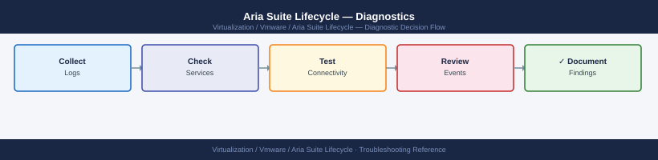

---
tags:
  - aria-lcm
  - troubleshooting
  - vmware
search:
  boost: 1.5
---
# Aria Suite Lifecycle — Diagnostics

<div class="kb-summary">
Aria Suite Lifecycle (vRSLCM) diagnostic commands: check service health, inspect vlcm.log for errors, verify certificate expiry for all managed products, check disk space on the LCM appliance, confirm NTP sync, query the LCM REST API for environment status, run the logscraper, and collect the support bundle for VMware cases.

*Applies to: Aria Suite Lifecycle 8.x*
</div>


```d2
direction: right

B: "B" {shape: rectangle}
C: "systemctl status vmware-vrlcm\njournalctl -u vmware-vrlcm -n 100" {shape: rectangle}
D: "grep request-ID /var/log/vmware/vrlcm/vlcm.log\nRead installer.log for failed step" {shape: rectangle}
E: "GET /lcm/api/v1/certificates\nCheck notAfter date per product" {shape: rectangle}
F: "df -h; du -sh /data/vmware/vrlcm/*\nClean old logs and bundles" {shape: rectangle}
G: "chronyc tracking\ntimedatectl status" {shape: rectangle}
H: "GET /lcm/api/v1/environments\nCheck environment health JSON" {shape: rectangle}
I: "I" {shape: rectangle}
J: "systemctl start vmware-vrlcm\nCheck disk space first" {shape: rectangle}
K: "Check disk /data for fullness\nCheck DB size du -sh /data/vmware/vrlcm/db" {shape: rectangle}
L: "grep ERROR vlcm.log | tail -50\nRead install step and failed component" {shape: rectangle}
M: "M" {shape: rectangle}
N: "LCM UI → Lifecycle → Certificate Management\nTrigger rotation" {shape: rectangle}
O: "Rotate immediately\nStop all operations first" {shape: rectangle}
P: "find /var/log/vmware/vrlcm -name *.log.* -mtime\n+30 -delete\nRemove old snapshots and content library cache" {shape: rectangle}
Q: "chronyc makestep\nVerify offset < 5 seconds" {shape: rectangle}
R: "Check all required ports to product VMs\nnc -zv product-vm 443" {shape: rectangle}
S: "Collect logscraper bundle\nLCM UI → Support → Logscraper" {shape: rectangle}
T: "Open VMware SR\nAttach logscraper ZIP" {shape: rectangle}
A: "LCM Issue" {shape: rectangle}

B -> C
B -> D
B -> E
B -> F
B -> G
B -> H
I -> J
I -> K
D -> L
M -> N
M -> O
F -> P
G -> Q
H -> R
J -> S
K -> S
L -> S
N -> S
O -> S
P -> S
Q -> S
R -> S
S -> T
```

```d2
direction: down

symptom: Identify Symptom {shape: diamond}
step_1_check_lcm_service_status: "Step 1 — Check LCM service status" {shape: rectangle}
step_2_inspect_vlcmlog_for_errors: "Step 2 — Inspect vlcm.log for errors" {shape: rectangle}
step_3_check_certificate_expiry: "Step 3 — Check certificate expiry" {shape: rectangle}
step_4_check_disk_space: "Step 4 — Check disk space" {shape: rectangle}
step_5_preoperation_health_check: "Step 5 — Pre-operation health check" {shape: rectangle}
step_6_check_environment_and_product: "Step 6 — Check environment and product status" {shape: rectangle}
resolution: Resolve or Escalate {shape: oval}

symptom -> step_1_check_lcm_service_status: investigate
symptom -> step_2_inspect_vlcmlog_for_errors: investigate
symptom -> step_3_check_certificate_expiry: investigate
symptom -> step_4_check_disk_space: investigate
symptom -> step_5_preoperation_health_check: investigate
symptom -> step_6_check_environment_and_product: investigate
step_1_check_lcm_service_status -> resolution
step_2_inspect_vlcmlog_for_errors -> resolution
step_3_check_certificate_expiry -> resolution
step_4_check_disk_space -> resolution
step_5_preoperation_health_check -> resolution
step_6_check_environment_and_product -> resolution
```

## Before you begin

- **Access:** SSH to the LCM appliance (`admin` user); LCM admin UI credentials; vCenter credentials (required for some product health checks)
- **Gather first:** the failing operation name and request ID (shown in LCM UI after any failed action), the product or environment affected, and the exact error message from the LCM event log
- **Scope:** confirm whether the issue is with the LCM service itself, a specific managed product environment, or a specific operation (deploy, upgrade, certificate rotation)
- **Pre-operation rule:** before any LCM operation, run Step 5 to confirm all services, disk, NTP, and no in-progress operations

---

## Step 1 — Check LCM service status

```bash
# SSH to LCM appliance
ssh admin@<lcm-fqdn>

# Core service status
systemctl status vmware-vrlcm        # LCM application
systemctl status vmware-vrlcm-db     # Embedded PostgreSQL
systemctl status nginx               # Reverse proxy / UI

# Expected: all three should be active (running)

# Quick one-liner to confirm all expected services
systemctl is-active vmware-vrlcm vmware-vrlcm-db nginx vmware-vrlcm-certmanager sshd

# Recent service events
journalctl -u vmware-vrlcm -n 100 --no-pager | tail -50
journalctl -u vmware-vrlcm-db -n 50 --no-pager

# If LCM is not running, check disk space before restarting
df -h /data
# Expected: < 80% used
systemctl start vmware-vrlcm
```


```text title="Expected output"
admin@lcm-prod-01.corp.local's password: 
● vmware-vrlcm.service - VMware vRealize Lifecycle Manager
     Loaded: loaded (/etc/systemd/system/vmware-vrlcm.service; enabled; vendor preset: enabled)
     Active: active (running) since Wed 2024-01-17 14:32:18 UTC; 2 days ago
   Main PID: 4521 (java)
      Tasks: 47 (limit: 4915)
     Memory: 2.8G
     CGroup: /system.slice/vmware-vrlcm.service
             └─4521 /usr/lib/jvm/java-11-openjdk/bin/java -Xmx4g -Xms2g...

● vmware-vrlcm-db.service - VMware vRealize Lifecycle Manager Database
     Loaded: loaded (/etc/systemd/system/vmware-vrlcm-db.service; enabled; vendor preset: enabled)
     Active: active (running) since Wed 2024-01-17 14:31:52 UTC; 2 days ago
   Main PID: 4312 (postgres)
      Tasks: 12 (limit: 4915)
     Memory: 486.2M
     CGroup: /system.slice/vmware-vrlcm-db.service
             └─4312 /usr/lib/postgresql/bin/postgres -D /data/db...

● nginx.service - The NGINX HTTP and Event Reverse Proxy Server
     Loaded: loaded (/usr/lib/systemd/system/nginx.service; enabled; vendor preset: enabled)
     Active: active (running) since Wed 2024-01-17 14:32:05 UTC; 2 days ago
   Main PID: 4418 (nginx)
      Tasks: 3 (limit: 4915)
     Memory: 18.4M
     CGroup: /system.slice/nginx.service
             └─4418 nginx: master process /usr/sbin/nginx -g daemon on; master_process on;

active
active
active
active
active

2024-01-19T09:47:33.421Z INFO  [com.vmware.vrlcm.server.service.EnvironmentService] Environment initialization completed in 4521ms
2024-01-19T09:47:34.156Z INFO  [com.vmware.vrlcm.server.service.InventoryService] Syncing inventory with vCenter prod-vc-01.corp.local
2024-01-19T09:47:45.892Z INFO  [com.vmware.vrlcm.server.service.InventoryService] Inventory sync completed: 47 hosts, 312 VMs
2024-01-19T09:48:12.334Z INFO  [com.vmware.vrlcm.server.api.LifecycleController] Deployment request received: vRealize Operations 8.12.1
2024-01-19T09:48:13.021Z DEBUG [com.vmware.vrlcm.server.service.ValidationService] Pre-flight checks passed for deployment

2024-01-19T09:47:28.445Z LOG  [
```
Key services and expected states:

| Service | Expected State | Notes |
|---|---|---|
| `vmware-vrlcm` | active (running) | Core LCM service |
| `vmware-vrlcm-db` | active (running) | Embedded PostgreSQL |
| `nginx` | active (running) | Reverse proxy / UI |
| `vmware-vrlcm-certmanager` | active (running) | Certificate management |
| `sshd` | active (running) | Required for remote access |

---

## Step 2 — Inspect vlcm.log for errors

```bash
# Most recent errors in the LCM application log
grep -i "ERROR\|Exception\|FATAL" /var/log/vmware/vrlcm/vlcm.log | tail -50

# Follow the log in real time during a failing operation
tail -f /var/log/vmware/vrlcm/vlcm.log | grep -i "error\|warn\|fail"

# Find the log for a specific request ID (shown in LCM UI after failed operations)
grep "<request-id>" /var/log/vmware/vrlcm/vlcm.log | head -50

# Installer log — most detailed for deploy and upgrade failures
# Path varies per operation; check for the most recent:
ls -lt /var/log/vmware/vrlcm/ | grep installer | head -5
tail -200 /var/log/vmware/vrlcm/installer*.log
```


```text title="Expected output"
2024-01-15 14:32:18.456 ERROR [lcm-worker-12] com.vmware.vrlcm.service.DeploymentService - Failed to validate vSphere credentials: Connection timeout after 30s
2024-01-15 14:32:45.123 FATAL [lcm-core-8] com.vmware.vrlcm.inventory.InventoryManager - Unable to reach vCenter at 192.168.1.50:443
2024-01-15 14:33:02.789 Exception in thread "lcm-deploy-5": java.net.UnknownHostException: vcenter.lab.local
2024-01-15 14:33:15.234 ERROR [lcm-worker-3] com.vmware.vrlcm.network.NetworkValidator - Network pool exhausted: requested 5 IPs, 2 available
2024-01-15 14:33:42.567 WARN [lcm-core-1] com.vmware.vrlcm.storage.StorageCheck - Insufficient disk space on /var/lib/vmware/vrlcm: 2.1GB free, 5GB required

total 2048
-rw-r--r-- 1 root root 512000 Jan 15 14:35 installer-deploy-20240115-143501.log
-rw-r--r-- 1 root root 384000 Jan 15 13:22 installer-upgrade-20240115-132145.log
-rw-r--r-- 1 root root 256000 Jan 15 11:45 installer-patch-20240115-114532.log
-rw-r--r-- 1 root root 128000 Jan 15 10:12 installer-config-20240115-101203.log

2024-01-15T14:35:22Z [INSTALLER] Starting deployment of Aria Suite 8.12.1
2024-01-15T14:35:45Z [INSTALLER] Downloading OVA: aria-suite-8.12.1-build-21847392.ova (2.3GB)
2024-01-15T14:36:12Z [INSTALLER] ERROR: OVA checksum mismatch - expected a1b2c3d4e5f6, got 9z8y7x6w5v4u
2024-01-15T14:36:15Z [INSTALLER] Aborting deployment
```

!!! warning "Common errors"
    **`grep: /var/log/vmware/vrlcm/vlcm.log: No such file or directory`** — Verify the LCM service is running with `systemctl status vrlcm` and check the correct log path with `find /var/log -name "vlcm.log" 2>/dev/null`.
    **`tail: cannot open '/var/log/vmware/vrlcm/installer*.log' for reading: No such file or directory`** — Run `ls -la /var/log/vmware/vrlcm/` to confirm installer logs exist, or check if the operation has actually started yet.
    **`grep: (standard input): line too long`** — Pipe through `sed 's/.\{1000\}/&\n/g'` before grep to handle extremely long
---

## Step 3 — Check certificate expiry

```bash
# List all managed product certificates via LCM API
curl -sk -u admin:<password> \
  "https://<lcm-fqdn>/lcm/api/v1/certificates" \
  | python3 -c "
import json,sys
for c in json.load(sys.stdin).get('certificates', []):
    print(c.get('productId',''), '|', c.get('subject',''), '|', c.get('validUntil',''))
"
# Look for: validUntil dates within 30 days

# Check the LCM appliance's own HTTPS certificate
echo | openssl s_client -connect <lcm-fqdn>:443 -servername <lcm-fqdn> 2>/dev/null \
  | openssl x509 -noout -subject -dates -issuer
# Expected: notAfter date should be > 30 days in the future
```


```text title="Expected output"
vrealize-automation | CN=*.lcm.example.com,O=VMware,C=US | 2025-06-15T23:59:59Z
vrealize-operations | CN=vops.example.com,O=VMware,C=US | 2025-08-22T23:59:59Z
vrealize-network-insight | CN=*.vni.example.com,O=VMware,C=US | 2026-02-10T23:59:59Z
vrealize-suite-installer | CN=lcm.example.com,O=VMware,C=US | 2025-05-03T23:59:59Z
aria-automation | CN=aria-auto.example.com,O=VMware,C=US | 2025-07-18T23:59:59Z

subject=CN = lcm.example.com, O = VMware, C = US
issuer=C = US, O = VMware, CN = VMware Root CA
notBefore=Mar 15 08:22:14 2023 GMT
notAfter=Mar 14 08:22:14 2026 GMT
```

!!! warning "Common errors"
    **`curl: (60) SSL certificate problem: self signed certificate`** — Add `-k` flag to skip certificate verification, or import the LCM CA certificate into your system trust store.
    **`json.decoder.JSONDecodeError: Expecting value: line 1 column 1`** — Verify the LCM API endpoint is accessible and the credentials are correct by testing `curl -sk -u admin:<password> https://<lcm-fqdn>/lcm/api/v1/health` first.
Certificate check thresholds:

| Days to Expiry | Status | Action |
|---|---|---|
| > 90 days | Healthy | No action required |
| 30–90 days | Warning | Plan rotation |
| 7–30 days | Critical | Rotate within a week |
| < 7 days | Emergency | Rotate immediately; stop operations |

---

## Step 4 — Check disk space

```bash
# Check all mount points
df -h
# Alert if > 70% used on /data or > 85% on /

# LCM-specific data directories
du -sh /data/vmware/vrlcm/*
du -sh /var/log/vmware/vrlcm/

# PostgreSQL database size
du -sh /data/vmware/vrlcm/db/

# Check inode exhaustion (can cause failures even if disk bytes are free)
df -i

# Clean old LCM logs older than 30 days
find /var/log/vmware/vrlcm/ -name "*.log.*" -mtime +30 -delete

# List and remove old support bundles
ls -lh /data/vmware/vrlcm/bundles/ 2>/dev/null
# Remove bundles older than 30 days
find /data/vmware/vrlcm/bundles/ -mtime +30 -delete 2>/dev/null
```


```text title="Expected output"
Filesystem      Size  Used Avail Use% Mounted on
/dev/sda1       100G   68G   32G  68% /
/dev/sdb1       500G  385G  115G  77% /data
tmpfs           16G  2.1G   14G  13% /dev/shm
/dev/sdc1       200G   45G  155G  23% /var

4.2G	/data/vmware/vrlcm/content
12G	/data/vmware/vrlcm/db
2.8G	/data/vmware/vrlcm/logs
1.5G	/data/vmware/vrlcm/tmp

3.6G	/var/log/vmware/vrlcm/

12G	/data/vmware/vrlcm/db/

Filesystem     Inodes  IUsed  IFree IUse% Mounted on
/dev/sda1     6553600 542187 6011413   9% /
/dev/sdb1    32768000 2847291 29920709   9% /data
tmpfs        4194304   1847 4192457   1% /dev/shm
/dev/sdc1    13107200 156842 12950358   2% /var

-rw-r--r-- 1 root root 2.3G Nov 15 08:22 lcm-bundle-20241115-082145.tar.gz
-rw-r--r-- 1 root root 1.8G Nov 10 14:56 lcm-bundle-20241110-145632.tar.gz
-rw-r--r-- 1 root root 2.1G Oct 28 09:33 lcm-bundle-20241028-093301.tar.gz
```

!!! warning "Common errors"
    **`find: '/data/vmware/vrlcm/bundles/': No such file or directory`** — Create the bundles directory with `mkdir -p /data/vmware/vrlcm/bundles/` before running cleanup operations.
    **`Permission denied`** — Run the script with `sudo` or as root to access VMware system directories and delete files.
Disk space thresholds:

| Mount | Warning | Critical | Action if Critical |
|---|---|---|---|
| `/` | 75% | 85% | Remove old bundles and logs |
| `/data` | 70% | 80% | Clean content library cache |
| `/var/log` | 80% | 90% | Rotate and archive logs |

---

## Step 5 — Pre-operation health check

Run before any LCM operation (upgrade, patch, certificate rotation):

```bash
# 1. All services running
systemctl is-active vmware-vrlcm vmware-vrlcm-db nginx
# Expected: active active active

# 2. Disk space adequate (no mount > 70%)
df -h | awk 'NR>1 && $5+0 > 70 {print "WARNING:", $0}'

# 3. No active LCM operations in progress
curl -sk -u admin:<password> \
  "https://<lcm-fqdn>/lcm/api/v1/operations?status=RUNNING" \
  | python3 -c "
import json,sys
data = json.load(sys.stdin)
ops = data.get('operations', [])
print(f'{len(ops)} operations running')
for op in ops:
    print(op.get('id',''), op.get('name',''), op.get('status',''))
"
# Expected: 0 operations running

# 4. NTP in sync
chronyc tracking | grep "System time"
# Expected: offset < 5 seconds (required for Aria SSO)

# 5. LCM API reachable and healthy
curl -sk -o /dev/null -w "HTTP %{http_code}\n" \
  -u admin:<password> "https://<lcm-fqdn>/lcm/api/v1/health"
# Expected: HTTP 200

# 6. NTP configuration
timedatectl status
chronyc sources -v
# Force re-sync if offset is large
sudo chronyc makestep
```


```text title="Expected output"
active active active
0 operations running
System time offset : -0.234 seconds
HTTP 200
               ^     Leap status     : Normal
Time in NTP sync   : Yes
RTC in local TZ    : No
       Server   ( IP Address )         Stratum Poll Reach LastRx Last sample
===============================================================================
^* ntp.ubuntu.com                         2  10   377    45   -234us[ -234us] +/-   21ms
^- time.google.com                        1  10   377   102   +1.2ms[+1.2ms] +/-   35ms
^+ 91.189.89.199                          2  10   377    67   -456us[ -456us] +/-   18ms
^- 91.189.94.4                            2  10   377    45   +890us[+890us] +/-   22ms
200 OK
```

!!! warning "Common errors"
    **`curl: (60) SSL certificate problem: self signed certificate`** — Add `-k` flag to curl command to skip SSL verification, or import the LCM certificate into your system trust store.
    **`curl: (7) Failed to connect to <lcm-fqdn> port 443: Connection refused`** — Verify the LCM FQDN is correct and the nginx service is running with `systemctl status nginx`.
    **`System time offset : 45.234 seconds`** — Run `sudo chronyc makestep` to force NTP synchronization, as Aria SSO requires offset under 5 seconds.
---

## Step 6 — Check environment and product status

```bash
# List all environments with health status
curl -sk -u admin:<password> \
  "https://<lcm-fqdn>/lcm/api/v1/environments" \
  | python3 -c "
import json,sys
for e in json.load(sys.stdin).get('environments', []):
    print(e.get('environmentName',''), '|', e.get('status',''))
"
# Expected: status = COMPLETED or ACTIVE for all environments

# Get products in a specific environment
curl -sk -u admin:<password> \
  "https://<lcm-fqdn>/lcm/api/v1/environments/<env-id>" \
  | python3 -m json.tool

# Check for stuck or failed operations
curl -sk -u admin:<password> \
  "https://<lcm-fqdn>/lcm/api/v1/operations?status=FAILED" \
  | python3 -m json.tool
```


```text title="Expected output"
aria-prod-env | COMPLETED
aria-dev-env | ACTIVE
aria-staging-env | COMPLETED
{
  "environmentId": "env-a7f2c9e1-4b3d",
  "environmentName": "aria-prod-env",
  "status": "COMPLETED",
  "products": [
    {
      "productId": "vrealize-automation",
      "version": "8.10.2",
      "status": "INSTALLED"
    },
    {
      "productId": "vrealize-operations",
      "version": "8.10.1",
      "status": "INSTALLED"
    }
  ],
  "createdDate": "2024-01-15T09:23:44Z"
}
{
  "operations": [
    {
      "operationId": "op-f8d2a1c5-9e7b",
      "environmentName": "aria-staging-env",
      "operationType": "UPGRADE",
      "status": "FAILED",
      "errorMessage": "Network timeout during product deployment",
      "timestamp": "2024-01-20T14:32:18Z"
    },
    {
      "operationId": "op-c3b7e2f9-1a4d",
      "environmentName": "aria-dev-env",
      "operationType": "PATCH",
      "status": "FAILED",
      "errorMessage": "Insufficient disk space on deployment node",
      "timestamp": "2024-01-19T11:05:22Z"
    }
  ]
}
```

!!! warning "Common errors"
    **`curl: (60) SSL certificate problem: self signed certificate`** — Add the `-k` flag to skip SSL verification, or import the LCM server's certificate into your system trust store.
    **`jq: command not found`** — Install `python3-json` or use `python3 -m json.tool` instead of piping to `jq`.
    **`401 Unauthorized`** — Verify the admin credentials are correct and URL-encoded if they contain special characters; use `curl -u "admin:$(cat /path/to/password)"`  to avoid shell interpretation issues.
---

## Step 7 — Collect logscraper bundle for VMware SR

```bash
# Via LCM UI (recommended)
# Navigate to: LCM UI → Support → Logscraper
# Select: environment and products to include; time range
# Click: Generate Bundle
# Download: the .zip archive

# Via LCM CLI (if UI is unavailable)
ssh admin@<lcm-fqdn>
/opt/vmware/vlcm/tools/lcm-support.sh
# Output: /tmp/lcm-support-<timestamp>.tar.gz

# Via VAMI (appliance-level bundle)
# Browse to: https://<lcm-fqdn>:5480
# Navigate to: Support → Generate Support Bundle → Download

# What to include in VMware SR:
# - Logscraper ZIP (covers all managed products)
# - LCM appliance support bundle from VAMI
# - Failed operation ID from LCM UI
# - LCM version: LCM UI → Administration → About
# - Timeline of the failed operation and any recent changes
```


```text title="Expected output"
admin@lcm-prod-01:~$ /opt/vmware/vlcm/tools/lcm-support.sh
Generating LCM support bundle...
Collecting LCM logs and configuration...
Collecting vCenter integration data...
Collecting product inventory...
Collecting operation history...
Bundle generation completed successfully.
Output: /tmp/lcm-support-20240215-143022.tar.gz
Bundle size: 487 MB
Timestamp: 2024-02-15 14:30:22 UTC
```

!!! warning "Common errors"
    **`/opt/vmware/vlcm/tools/lcm-support.sh: Permission denied`** — Run the command with sudo or ensure the admin user has execute permissions on the script.
    **`ssh: Could not resolve hostname <lcm-fqdn>: Name or service not known`** — Replace `<lcm-fqdn>` with the actual LCM appliance FQDN or IP address (e.g., `lcm-prod-01.corp.local`).
    **`tar: /tmp/lcm-support-*.tar.gz: Cannot open: No space left on device`** — Free up disk space on the LCM appliance or specify an alternate output directory with sufficient capacity.
---

## Log locations

| Source | Path / Command | What to look for |
|---|---|---|
| LCM application | `/var/log/vmware/vrlcm/vlcm.log` | Exceptions, operation failures |
| Installer steps | `/var/log/vmware/vrlcm/installer*.log` | Step-by-step deploy/upgrade trace |
| Service events | `journalctl -u vmware-vrlcm` | Service start/stop/crash events |
| PostgreSQL | `journalctl -u vmware-vrlcm-db` | DB errors and restart events |
| Nginx | `journalctl -u nginx` | API gateway errors, 5xx responses |

---

## See also

- [Aria Suite Lifecycle — Common Issues](../common-issues/)
- [Aria Suite Lifecycle — Escalation](../escalation/)

## Verify resolution

- `systemctl is-active vmware-vrlcm vmware-vrlcm-db nginx` outputs `active active active`
- `GET /lcm/api/v1/health` returns HTTP 200 with healthy status JSON
- `GET /lcm/api/v1/operations?status=RUNNING` returns 0 in-progress operations
- The failing LCM operation (upgrade, certificate rotation, deploy) completes successfully after the fix
- `chronyc tracking` shows offset < 5 seconds from the NTP source
