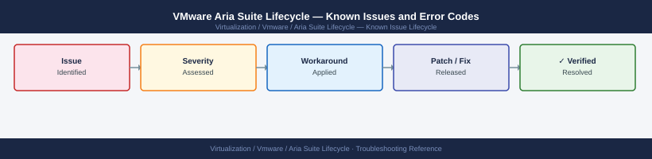

---
tags:
  - troubleshooting
  - aria-suite-lifecycle
  - vmware
  - known-issues
description: "Catalog of known Aria Suite Lifecycle (LCM) bugs, error codes, and workarounds covering product deployment, certificate management, and upgrade operations."
---
# VMware Aria Suite Lifecycle — Known Issues and Error Codes

<div class="kb-summary">
Catalog of known Aria Suite Lifecycle (LCM) bugs, error codes, and workarounds covering product deployment, certificate management, and upgrade operations.

*Applies to: Aria Suite Lifecycle 8.x*
</div>



```d2
direction: down

symptom: Identify Symptom {shape: diamond}
product_deployment: "Product Deployment" {shape: rectangle}
certificate_management: "Certificate Management" {shape: rectangle}
upgrade: "Upgrade" {shape: rectangle}
resolution: Resolve or Escalate {shape: oval}

symptom -> product_deployment: investigate
symptom -> certificate_management: investigate
symptom -> upgrade: investigate
product_deployment -> resolution
certificate_management -> resolution
upgrade -> resolution
```

## Before you begin

- Aria LCM errors appear in `Lifecycle Operations → Requests`.
- Logs: SSH to Aria LCM appliance; logs under `/var/log/vmware/vrlcm/`.
- NTP sync and DNS resolution are the most common root causes of Aria LCM deployment failures.

## Product Deployment

| Error / Symptom | Affected Versions | Cause | Workaround / Fix | Fixed In |
|---|---|---|---|---|
| Deployment fails: `OVF deploy error — datastore insufficient space` | LCM 8.x | Target datastore lacks space for thin-provisioned product VM | Free datastore space; or select different datastore in LCM environment settings | N/A |
| `Product health check failed after deployment` | LCM 8.x | Deployed product services not started within timeout (often NTP issue) | Verify NTP sync on all deployed VMs; retry health check | N/A |
| `Cannot connect to vCenter for OVF deploy` | LCM 8.x | Aria LCM cannot reach vCenter on port 443 | Check 443 from LCM appliance to vCenter; verify credentials in LCM → vCenter Inventory | N/A |

## Certificate Management

| Error / Symptom | Affected Versions | Cause | Workaround / Fix | Fixed In |
|---|---|---|---|---|
| Certificate replacement fails: `Product not in STARTED state` | LCM 8.x | Target product service degraded before cert rotation | Restore product to healthy state first; retry certificate operation | N/A |
| `VMCA certificate import failed` | LCM 8.x | VMCA root CA not imported into Aria LCM trust store | Import vCenter CA into Aria LCM: `Settings → Certificates → Add CA` | N/A |

## Upgrade

| Error / Symptom | Affected Versions | Cause | Workaround / Fix | Fixed In |
|---|---|---|---|---|
| Product upgrade fails: `Snapshot creation failed` | LCM 8.x | vCenter snapshot quota exceeded or vSAN space insufficient | Free vSAN space; increase snapshot max per VM in vCenter; retry | N/A |
| `Binary mapping not found` for upgrade | LCM 8.x | Product binary not loaded into LCM binary mapping | Upload product binary to LCM → Lifecycle Operations → Settings → Binary Mapping | N/A |

## See also

- [VMware Aria Suite Lifecycle — Common Issues](../common-issues/)
- [VMware Aria Automation — Known Issues](../../aria-automation/troubleshooting/known-issues.md)
- [VMware Aria Operations — Known Issues](../../aria-operations/troubleshooting/known-issues.md)
