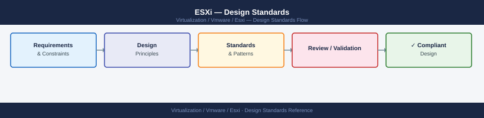

---
tags:
  - architecture
  - esxi
  - vmware
  - vsphere-8
---
# ESXi — Design Standards

<div class="kb-summary">
Design Standards reference covering BIOS / UEFI Baseline, VMkernel Adapter Layout, NTP Configuration, VIB Acceptance Levels, Storage Path Configuration and 3 more sections.

*Applies to: vSphere 7.x · 8.x*
</div>


ESXi Host Design Checklist — Standard Layout

---

## NTP Configuration

All ESXi hosts must synchronise to the same NTP sources as vCenter. Clock skew > 5 minutes causes authentication failures.

```bash
# Check NTP status
esxcli system time get
esxcli network ntp get

# Set NTP servers
esxcli system ntp set --server=ntp1.example.com --server=ntp2.example.com --enabled=true
```


```text title="Expected output"
2024-11-15T14:32:47.123456Z
Enabled: true
Servers: ntp1.example.com, ntp2.example.com
Poll Interval: 1024

(no output — command completes silently)
```

!!! warning "Common errors"
    **`Error: Unknown option --server`** — Use `--servers` (plural) instead: `esxcli system ntp set --servers=ntp1.example.com,ntp2.example.com --enabled=true`
    **`Error: Name or service not known`** — Verify NTP server hostnames are resolvable by running `esxcli network ip dns server list` and confirm DNS is configured on the ESXi host.
---

## VIB Acceptance Levels

ESXi enforces VIB acceptance levels. Production hosts should accept only:

| Level | Description | Production Use |
|---|---|---|
| VMwareCertified | VMware-signed and certified | Yes |
| VMwareAccepted | Partner-signed, VMware accepted | Yes |
| PartnerSupported | Vendor-signed only | Review case-by-case |
| CommunitySupported | No signing | Not in production |

```bash
# Check acceptance level
esxcli software acceptance get

# Set minimum to VMwareAccepted
esxcli software acceptance set --level=VMwareAccepted
```


```text title="Expected output"
Current Acceptance Level: PartnerSupported
(no output — command completes silently)
```

!!! warning "Common errors"
    **`Error: Unknown option or flag '--level=VMwareAccepted'`** — Use the correct flag syntax `--level VMwareAccepted` (space instead of equals) or check your ESXi version supports this acceptance level.
    **`Error: Permission denied`** — Run the command as root or with appropriate sudo privileges; acceptance level changes require administrative access.
---

## Storage Path Configuration

| Array Type | Recommended PSP | Notes |
|---|---|---|
| Pure Storage FlashArray | Round Robin | Set I/O ops limit to 1 (not 1000) for Pure |
| Dell PowerStore | Round Robin | |
| NetApp AFF | Round Robin | Use NetApp DSM for advanced features |
| EMC VMAX / PowerMax | Round Robin | |
| Active/Passive legacy | MRU | Do not use RR on A/P arrays |

```bash
# Configure Round Robin with I/O ops limit of 1
esxcli storage nmp psp roundrobin deviceconfig set -d <device-naa> --type=iops --iops=1
```


```text title="Expected output"
(no output — command completes silently)
```

!!! warning "Common errors"
    **`Error: Unknown option --iops`** — Use `--iopslimit` instead of `--iops` for the parameter name.
    **`Error: Device <device-naa> not found`** — Replace `<device-naa>` with an actual device identifier like `naa.60014056a6e5c3e5a5d4b8c9f0e1a2b3` (verify with `esxcli storage core device list`).
---

## Host Profile Baseline

Every cluster host must conform to the Host Profile applied from vCenter. A Host Profile captures:

- VMkernel adapter configuration (IP, services, MTU)
- NTP servers
- DNS settings
- Firewall ruleset
- VIB acceptance level
- SATP/PSP rules for storage
- SSH/ESXi Shell state (disabled in profile)
- Syslog server address

After any host change, run **Check Compliance** in vCenter before marking the change as complete.

---

## ESXi Shell and SSH Policy

| Service | Production State | Maintenance State |
|---|---|---|
| ESXi Shell | Stopped / Disabled | Allowed temporarily |
| SSH | Stopped / Disabled | Allowed temporarily |
| DCUI | Running | Running |

Set shell timeout to limit exposure if left enabled:

```bash
esxcli system settings advanced set -o /UserVars/ESXiShellTimeOut -i 600
esxcli system settings advanced set -o /UserVars/ESXiShellInteractiveTimeOut -i 300
```


```text title="Expected output"
(no output — command completes silently)
(no output — command completes silently)
```

!!! warning "Common errors"
    **`Error: Unknown option or setting '/UserVars/ESXiShellTimeOut'`** — Verify the exact parameter name matches your ESXi version (some versions use different paths like `/UserVars/ESXiShellTimeout` without the "Out" suffix).
    **`Error: Could not connect to the host`** — Ensure you are connected to the ESXi host via `esxcli` with proper credentials or SSH access before running configuration commands.
---

## Cluster Sizing Reference

| Cluster Type | Min Hosts | Storage | HA Capacity |
|---|---|---|---|
| Standalone | 1 | Any | None |
| Standard (N+1) | 3 | Shared SAN/NAS | Survive 1 host failure |
| Standard (N+2) | 5 | Shared SAN/NAS | Survive 2 host failures |
| vSAN (FTT=1 RAID-1) | 3 | Pooled (vSAN) | Survive 1 host failure |
| vSAN (FTT=1 RAID-5) | 4 | Pooled (vSAN) | Survive 1 host failure |
| vSAN (FTT=2 RAID-6) | 6 | Pooled (vSAN) | Survive 2 host failures |

**CPU overcommit guidance:** 4:1 vCPU:pCPU ratio for general workloads; 2:1 for latency-sensitive (databases, real-time). Monitor CPU Ready — sustained > 5% indicates overcommitment.

**Memory overcommit guidance:** Size physical RAM to cover peak active memory across all VMs. Balloon and swap are performance impacts, not design targets. Include 10–15% overhead for VMkernel and VM metadata.

## See also

- [ESXi — How It Works](../how-it-works/)
- [ESXi Host Deployment](../../deploy/)
