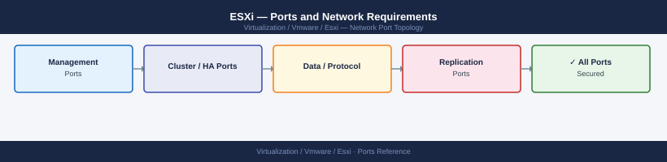

---
tags:
  - esxi
  - networking
  - firewall
  - ports
  - vsphere
  - vsphere-7
  - vsphere-8
description: "Firewall port reference for VMware ESXi hosts. Covers management, VM console, vMotion, Fault Tolerance, storage, and NSX overlay traffic. Use this when..."
---
# ESXi — Ports and Network Requirements

<div class="kb-summary">
Firewall port reference for VMware ESXi hosts. Covers management, VM console, vMotion, Fault Tolerance, storage, and NSX overlay traffic. Use this when building firewall change requests for host onboarding or network re-segmentation.

*Applies to: ESXi 7.x / 8.x*
</div>


## Before you begin

- ESXi has a built-in stateful firewall managed by `esxcli network firewall`; port table below reflects permitted directions from ESXi's perspective
- Each VMkernel adapter (management, vMotion, vSAN, FT, NSX TEP) should be on a dedicated VLAN
- Firewall rules between ESXi hosts (vMotion, FT, vSAN) are typically on a trusted internal network with no perimeter firewall — document any L3 boundary explicitly in the CR

---

## Inbound — Management Traffic to ESXi

| Port | Protocol | Source | Purpose |
|---|---|---|---|
| 443 | TCP | vCenter Server | vCenter → ESXi HTTPS API (host management) |
| 902 | TCP | vCenter Server | vmware-authd — required for vCenter to manage the host |
| 902 | TCP | Backup proxies | VADP — vStorage API for Data Protection |
| 903 | TCP | Admin workstations | VM Remote Console (VMRC) |
| 22 | TCP | Jump hosts | SSH — disable in production unless actively needed |
| 161 | UDP | Monitoring systems | SNMP polling |
| 5988 | TCP | IPMI/monitoring | CIM/WBEM (hardware monitoring — read-only) |
| 5989 | TCP | IPMI/monitoring | CIM/WBEM over HTTPS |
| 80 | TCP | Clients | HTTP — redirects to 443 |

---

## Outbound — ESXi to Infrastructure

| Port | Protocol | Destination | Purpose |
|---|---|---|---|
| 123 | UDP | NTP servers | Time synchronisation |
| 514 | UDP/TCP | Syslog server | Log forwarding |
| 162 | UDP | SNMP trap receiver | SNMP traps |
| 443 | TCP | vCenter Server | Host → vCenter (reverse agent channel, vSAN witness, etc.) |

---

## vMotion (ESXi to ESXi)

vMotion traffic moves live VMs between hosts. Must traverse the vMotion VMkernel network, not the management network.

| Port | Protocol | Between | Purpose |
|---|---|---|---|
| 8000 | TCP | ESXi hosts (vMotion VMkernel) | vMotion — VM memory and state transfer |

---

## Fault Tolerance (ESXi to ESXi)

| Port | Protocol | Between | Purpose |
|---|---|---|---|
| 2233 | TCP | ESXi hosts (FT VMkernel) | FT logging — continuous synchronisation between primary and secondary VMs |

---

## vSAN Traffic (ESXi to ESXi)

vSAN requires a dedicated VMkernel adapter. If vSAN traffic crosses L3 (stretched cluster, witness), open these ports on intervening firewalls.

| Port | Protocol | Between | Purpose |
|---|---|---|---|
| 12345 | UDP | vSAN VMkernel adapters | CMMDS — cluster membership and metadata |
| 12346 | UDP | vSAN VMkernel adapters | CMMDS — unicast heartbeat |
| 2233 | TCP | vSAN VMkernel adapters | RDT — Reliable Datagram Transport (vSAN I/O) |

See [vSAN — Ports](../../../vsan/architecture/ports/) for witness appliance and stretched cluster port requirements.

---

## NSX Overlay (ESXi as Transport Node)

When ESXi hosts participate in NSX-T as transport nodes, TEP (Tunnel Endpoint) traffic uses:

| Port | Protocol | Between | Purpose |
|---|---|---|---|
| 6081 | UDP | TEP VMkernel to TEP VMkernel | Geneve encapsulation — overlay network traffic |

TEP VMkernel adapters must be on a routed network (or same L2) that reaches other TEPs and NSX Edge TEPs.

---

## Storage Protocols

| Port | Protocol | Source | Destination | Purpose |
|---|---|---|---|---|
| 3260 | TCP | ESXi iSCSI VMkernel | iSCSI target (SAN) | iSCSI block storage |
| 2049 | TCP | ESXi NFS VMkernel | NAS server | NFS v3/v4 datastore |
| 111 | TCP/UDP | ESXi NFS VMkernel | NAS server | rpcbind (NFS portmapper) |
| 4420 | TCP | ESXi NVMe VMkernel | NVMe-oF/TCP target | NVMe over TCP (ESXi 7.0+) |

---

## vSphere Replication

| Port | Protocol | Source/Destination | Purpose |
|---|---|---|---|
| 31031 | TCP | vSphere Replication appliance → ESXi | Replication data transfer |
| 44046 | TCP | ESXi host → vSphere Replication | Replication incoming port (secondary site) |

---

## Firewall Zone Summary

| From | To | Ports | Notes |
|---|---|---|---|
| vCenter | ESXi hosts | 902, 443 | Core management — required everywhere |
| Admin clients | ESXi | 903, 22 | VMRC and SSH — jump host only |
| Backup proxies | ESXi | 902 | VADP for backup |
| ESXi hosts | ESXi hosts (vMotion) | 8000 | Dedicated VLAN, typically no firewall |
| ESXi hosts | ESXi hosts (FT) | 2233 | Dedicated VLAN |
| ESXi hosts | ESXi hosts (vSAN) | 12345 UDP, 12346 UDP, 2233 TCP | Dedicated VLAN; add to CR if L3 |
| ESXi TEP | ESXi/Edge TEP | 6081 UDP | NSX overlay; all transport nodes |
| ESXi iSCSI vmk | iSCSI SAN | 3260 | Per iSCSI VLAN |
| ESXi NFS vmk | NAS | 2049, 111 | Per NFS VLAN |

---

## Verify

```bash
# From vCenter or jump host — test management ports on ESXi host
nc -zv esxi01.corp.local 443
nc -zv esxi01.corp.local 902

# From ESXi SSH — test NTP
esxcli network ip connection list | grep 123
ntpq -p

# From ESXi SSH — view ESXi firewall rules
esxcli network firewall get
esxcli network firewall ruleset list

# From ESXi SSH — test iSCSI target reachability
esxcli iscsi networkportal list
nc -zv <iscsi-target-ip> 3260

# From ESXi SSH — test vMotion connectivity
vmkping -I vmk1 <destination-esxi-vmk1-ip>
```


```text title="Expected output"
Connection to esxi01.corp.local 443 port [tcp/https] succeeded!
Connection to esxi01.corp.local 902 port [tcp/*] succeeded!
vmk0 192.168.1.45 255.255.255.0 STATIC
     remote host name resolution timed out.
     remote host name resolution timed out.
     remote host name resolution timed out.
     remote host name resolution timed out.
     remote host name resolution timed out.

     remote host name resolution timed out.

Enabled
Enabled
Enabled

Name                                    Enabled  Implicit
CMMDS                                   true     false
NFC                                     true     false
DHCPv6                                  true     false
iSCSI                                   true     false
Syslog                                  true     false
...

Adapter  PortalGroup  Name                Portal
vmhba64  iSCSIPort    iSCSI_Portal_1      192.168.50.12:3260
vmhba64  iSCSIPort    iSCSI_Portal_2      192.168.50.13:3260

Connection to 192.168.50.12 port [tcp/iscsi-target] succeeded!

PING 192.168.100.67 (192.168.100.67): 56 data bytes
64 bytes from 192.168.100.67: icmp_seq=0 time=1.234 ms
64 bytes from 192.168.100.67: icmp_seq=1 time=1.156 ms
64 bytes from 192.168.100.67: icmp_seq=2 time=1.289 ms
```

!!! warning "Common errors"
    **`nc: getaddrinfo: Name or service not known`** — Verify the ESXi hostname resolves in DNS or use the IP address directly.
    **`Connection refused`** — Confirm the ESXi management port (443/902) is open and the ESXi host is powered on and reachable.
    **`vmkping: Unknown virtual network adapter`** — Verify vmk1 exists on the ESXi host with `esxcli network ip interface list` and use the correct VMkernel interface name.
---

## See also

- [vCenter — Ports](../../vcenter/architecture/ports.md)
- [vSAN — Ports](../../vsan/architecture/ports.md)
- [NSX — Ports](../../nsx/architecture/ports.md)
- [ESXi — Architecture](../how-it-works/)
- [ESXi — Deploy](../../deploy/)
