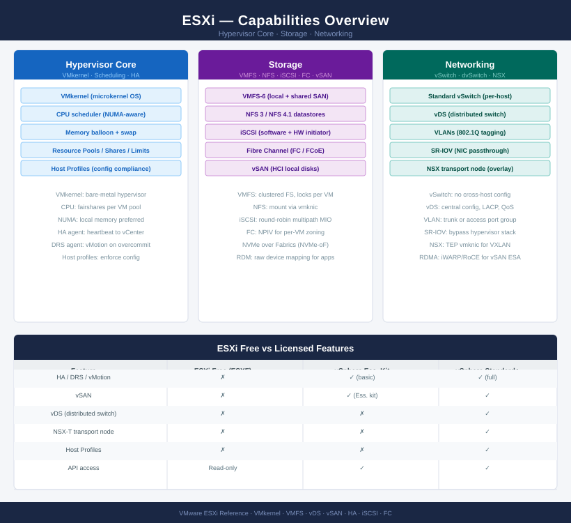
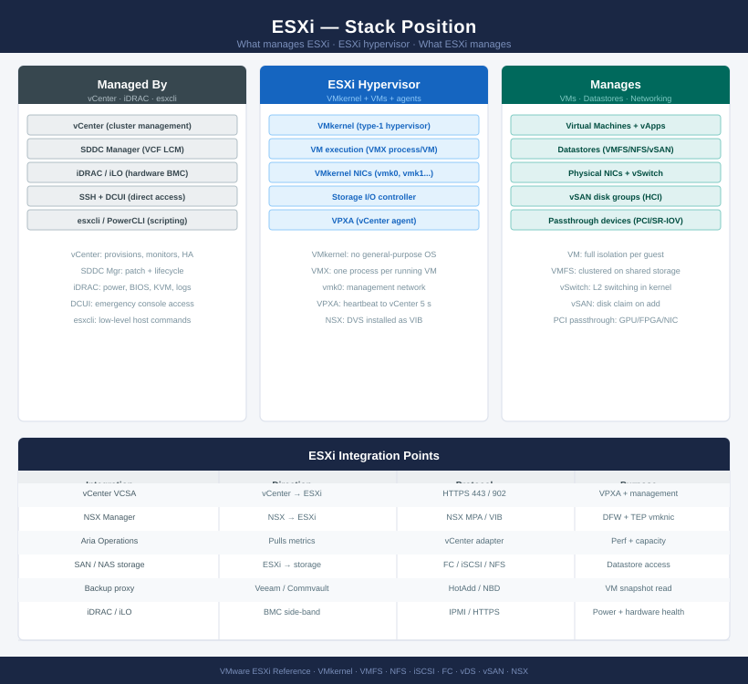

# ESXi

<div class="kb-summary">
Technical and operational reference for VMware ESXi. Covers host architecture, networking, storage paths, patching, security hardening, and troubleshooting for ESXi hosts managed by vCenter.

*Applies to: vSphere 7.x · 8.x*
</div>





```text
┌────────────────────────────────── ESXi Host — Installation Sequence ──────────────────────────────────┐
│                                                                                                       │
│  Step 1 · Physical Host Readiness                                                                     │
│  ─────────────────────────────────────────────────────────────────────────────────────────            │
│  Firmware: server BIOS, HBA, and NIC at vendor-recommended minimum versions                           │
│  BIOS: VT-x/AMD-V on  ·  Hyperthreading on  ·  NUMA topology visible to OS                            │
│  Cabling: dedicated NICs for management, vMotion, vSAN, VM traffic (or LACP)                          │
│  DNS: A + PTR records for host FQDN created before ESXi install                                       │
│  NTP sources reachable  ·  IPMI/iDRAC configured for out-of-band access                               │
│                                                                                                       │
│                                        │  boot from ESXi ISO or PXE                                   │
│                                        ▼                                                              │
│  Step 2 · ESXi Installation                                                                           │
│  ─────────────────────────────────────────────────────────────────────────────────────────            │
│  Boot from ISO (USB, PXE, iDRAC virtual media)  ·  Select install datastore                           │
│  Set keyboard/locale  ·  Accept EULA  ·  Target disk confirmed                                        │
│  Set root password  ·  Installation completes  ·  Reboot to ESXi                                      │
│  Configure management IP, subnet, gateway via DCUI (F2)                                               │
│  Set hostname (FQDN)  ·  DNS servers  ·  NTP servers  ·  SSH enabled for setup                        │
│                                                                                                       │
│                                        │  configure networking                                        │
│                                        ▼                                                              │
│  Step 3 · Network Configuration                                                                       │
│  ─────────────────────────────────────────────────────────────────────────────────────────            │
│  Assign vmnic(s) to vSwitch0 (management)  ·  vSwitch0: vmk0 IP confirmed                             │
│  Create vMotion VMkernel on dedicated vSwitch or portgroup  ·  MTU 9000 if jumbo                      │
│  Create vSAN VMkernel on dedicated portgroup  ·  MTU 9000  ·  vSAN traffic tagged                     │
│  Additional vSwitches for VM traffic  ·  Uplink teaming policy set (LB / LACP)                        │
│  Verify connectivity: ping gateway, vCenter FQDN, NTP, DNS from each VMkernel                         │
│                                                                                                       │
│                                        │  configure storage paths                                     │
│                                        ▼                                                              │
│  Step 4 · Storage Configuration                                                                       │
│  ─────────────────────────────────────────────────────────────────────────────────────────            │
│  iSCSI: software initiator enabled  ·  target IPs bound to vmk  ·  CHAP set                           │
│  Fibre Channel: HBA WWPNs noted  ·  zoning confirmed by storage team                                  │
│  Multipathing: PSP Round Robin for active-active arrays  ·  MRU for active-passive                    │
│  Local datastore visible  ·  Shared datastores mounted and accessible                                 │
│  VAAI plugin installed if array supports hardware acceleration                                        │
│                                                                                                       │
│                                        │  add to vCenter                                              │
│                                        ▼                                                              │
│  Step 5 · Add to vCenter                                                                              │
│  ─────────────────────────────────────────────────────────────────────────────────────────            │
│  In vCenter: Add Host wizard  ·  Enter FQDN  ·  Accept thumbprint  ·  Credentials                     │
│  Assign licence  ·  Select datacenter and cluster  ·  Confirm placement                               │
│  Host profile applied if cluster baseline exists  ·  Remediate if needed                              │
│  HA agent installed automatically  ·  DRS enabled  ·  Host enters Connected state                     │
│  vSAN disk claim if applicable  ·  Verify host contributes to cluster health                          │
│                                                                                                       │
│                                        │  harden and validate                                         │
│                                        ▼                                                              │
│  Step 6 · Hardening & Baseline                                                                        │
│  ─────────────────────────────────────────────────────────────────────────────────────────            │
│  Lockdown mode: normal lockdown enabled  ·  SSH disabled post-config                                  │
│  Host certificates replaced with CA-signed cert or confirmed thumbprint                               │
│  NTP service policy: Start and stop with host  ·  NTP confirmed synced                                │
│  Syslog forwarded to Aria Ops for Logs / syslog server  ·  Log level set                              │
│  Baseline remediation: patches applied via vSphere Lifecycle Manager                                  │
│                                                                                                       │
└───────────────────────────────────────────────────────────────────────────────────────────────────────┘
```


<div class="kb-grid kb-grid-3">

<a class="kb-card" href="architecture/">
  <strong>Architecture</strong>
  <span>How it works, integrations, and design standards.</span>
</a>

<a class="kb-card" href="deploy/">
  <strong>Deploy</strong>
  <span>Step-by-step initial ESXi host deployment and vCenter join.</span>
</a>

<a class="kb-card" href="operations/">
  <strong>Operations</strong>
  <span>CLI reference, health checks, procedures, lifecycle, backup, and scripts.</span>
</a>

<a class="kb-card" href="security/">
  <strong>Security</strong>
  <span>Authentication, access control, encryption, and hardening.</span>
</a>

<a class="kb-card" href="troubleshooting/">
  <strong>Troubleshooting</strong>
  <span>Common issues, diagnostics, and escalation.</span>
</a>

</div>
