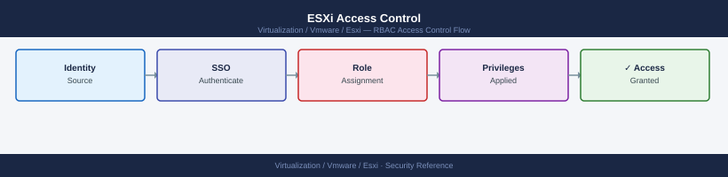

---
tags:
  - esxi
  - security
  - vmware
  - vsphere-8
description: "ESXi Access Control reference covering Exception Users, Local Account Management, vCenter Role-Based Access Control, ESXi Shell and SSH Access Controls..."
---
# ESXi Access Control

<div class="kb-summary">
ESXi Access Control reference covering Exception Users, Local Account Management, vCenter Role-Based Access Control, ESXi Shell and SSH Access Controls, Firewall Ruleset Management and 1 more sections.

*Applies to: vSphere 7.x / 8.x*
</div>


ESXi Access Control Model

## Before you begin

- **Access:** vCenter Administrator role
- **Change management:** security changes require CAB approval in most environments
- **Rollback plan:** document current state before any security control change
- **Testing:** validate in a non-production environment first where possible

---

## Exception Users

Exception users in Normal Lockdown can still connect directly to the host via SSH. Keep this list minimal:

- One named break-glass local account
- No shared accounts

Configure via vCenter: **Host → Configure → Security Profile → Exception Users → Add**

### Strict Lockdown Considerations

Use Strict Lockdown only if vCenter is highly available (HA'd appliance or VCF). If vCenter is unavailable in Strict Lockdown, the only recovery path is physical IPMI/iDRAC console access to the DCUI, which itself does not permit root login under Strict Lockdown — a second local account with DCUI access must be pre-configured.

---

## Local Account Management

Minimise local accounts. Production ESXi hosts should have at most two local accounts:

| Account | Purpose | State |
|---|---|---|
| `root` | Primary break-glass | Enabled; strong unique password per host |
| Break-glass named account | Secondary break-glass | Enabled; in exception users list |
| All other accounts | Application-specific (deprecated) | Delete or disable |

### View Local Accounts

```bash
# Via ESXCLI (SSH or shell)
esxcli system account list

# Via vSphere API (PowerCLI)
(Get-VMHost "esxi-01.example.local").ExtensionData.Config.LocalAccountManager.QueryUserList()
```


```text title="Expected output"
UserID  UserName                 Description
------  --------                 -----------
    0   root                     Administrator
  100   ntp                      NTP Daemon Account
  101   vpxuser                  vCenter Server Account
  102   dcui                     DCUI User
  103   vsan                     vSAN Daemon Account
  104   vsanmgmt                 vSAN Management Account

Id     Name                     Description
--     ----                     -----------
0      root                     Administrator
100    ntp                      NTP Daemon Account
101    vpxuser                  vCenter Server Account
102    dcui                     DCUI User
103    vsan                     vSAN Daemon Account
```

!!! warning "Common errors"
    **`Connect to localhost:443 failed: Connection refused`** — Ensure SSH is enabled on the ESXi host and the firewall rule for SSH is active in the ESXi security profile.
    **`The term 'Get-VMHost' is not recognized`** — Install VMware PowerCLI module using `Install-Module -Name VMware.PowerCLI -Force` and import it with `Import-Module VMware.PowerCLI`.
    **`Permission denied`** — Verify you are logged in as root or a user with administrative privileges; use `whoami` to confirm your current user.
### Add a Local Account

```bash
esxcli system account add \
  -i "breakglass" \
  -p "Str0ngP@ssw0rd!!" \
  -d "Break-glass account"

# Set role on the account
esxcli system permission set -i "breakglass" -r Admin
```


```text title="Expected output"
(no output — command completes silently)
(no output — command completes silently)
```

!!! warning "Common errors"
    **`Error: The account already exists`** — Delete the existing account with `esxcli system account remove -i "breakglass"` before recreating it.
    **`Error: Password does not meet complexity requirements`** — Use a password with at least 8 characters including uppercase, lowercase, numbers, and special characters.
    **`Error: Unknown role name Admin`** — Replace `Admin` with the correct role identifier `admin` (lowercase).
### Delete an Unused Local Account

```bash
esxcli system account remove -i <username>
```


```text title="Expected output"
(no output — command completes silently)
```

!!! warning "Common errors"
    **`Error: The object has invalid or missing key member 'key'.`** — Verify the username exists by running `esxcli system account list` before attempting removal.
    **`Error: Permission denied.`** — Ensure you are logged in as root or a user with Administrator privileges on the ESXi host.
### Set Root Password

```bash
# Interactively
passwd root

# Via PowerCLI (across all hosts)
Get-VMHost | ForEach-Object {
    $hostObj = $_
    $spec = New-Object VMware.Vim.HostAccountSpec
    $spec.id = "root"
    $spec.password = "NewRootPassword!!"
    $hostObj.ExtensionData.ConfigManager.AccountManager.UpdateUser($spec)
    Write-Host "Root password updated: $($hostObj.Name)"
}
```


```text title="Expected output"
Changing password for user root.
New password: 
Retype new password: 
passwd: password updated successfully

Root password updated: esx-prod-01.lab.local
Root password updated: esx-prod-02.lab.local
Root password updated: esx-prod-03.lab.local
```

!!! warning "Common errors"
    **`passwd: Authentication token manipulation error`** — Ensure the root account is unlocked with `pam_unix(passwd:chauthtok): authentication token lock busy` and retry after a few seconds.
    **`You do not have permission to run this command`** — Verify your PowerCLI session has Administrator privileges on the vCenter Server with `Get-VIPrivilege -Role Admin`.
    **`Unable to cast object of type 'System.String' to type 'VMware.Vim.HostAccountSpec'`** — Ensure you are connected to vCenter with `Connect-VIServer` before running the ForEach-Object loop.
---

## vCenter Role-Based Access Control

Roles assigned in vCenter propagate to ESXi hosts — this is the primary access control mechanism for day-to-day operations.

### Standard Role Hierarchy

| vCenter Role | ESXi Permissions | Typical Assignee |
|---|---|---|
| Administrator | Full host access | Named admin users only |
| Read-only | Host monitoring, no changes | NOC, L1 teams |
| VM Operator (custom) | Power ops on VMs only | App team |
| Network Admin (custom) | vSwitch and port group management | Network team |

Create custom roles in vCenter with only the privileges required for the specific use case.

### Assign a Role (PowerCLI)

```powershell
# Create a custom role
New-VIRole -Name "VM-Operator" -Privilege (Get-VIPrivilege "VirtualMachine.Interact.*")

# Assign role to a user on a specific cluster
New-VIPermission -Entity (Get-Cluster "CL-PROD") \
    -Principal "CORP\vm-operators" \
    -Role "VM-Operator" \
    -Propagate $true
```

### Least-Privilege Assignment Checklist

- [ ] No AD accounts assigned the built-in `Administrator` role at the vCenter root level
- [ ] Break-glass `administrator@vsphere.local` account password in vault; not used for daily work
- [ ] Custom roles scoped to specific clusters or objects — not the vCenter root
- [ ] AD group memberships reviewed and documented
- [ ] Service accounts (backup, monitoring) assigned read-only or the minimum required role

---

## ESXi Shell and SSH Access Controls

The ESXi Shell and SSH service provide direct command-line access to the host. Both must be disabled in production and enabled only during maintenance or break-glass.

### Disable Shell and SSH

```bash
# Via ESXCLI on the host
vim-cmd hostsvc/disable_ssh
vim-cmd hostsvc/disable_esx_shell

# Via PowerCLI across a cluster
Get-VMHost | Get-VMHostService | Where-Object {$_.Key -in "TSM-SSH","TSM"} | Stop-VMHostService -Confirm:$false
Get-VMHost | Get-VMHostService | Where-Object {$_.Key -in "TSM-SSH","TSM"} | Set-VMHostService -Policy Off
```


```text title="Expected output"
Services for host 'esx-prod-01.lab.local' have been disabled.
SSH has been disabled.
ESX Shell has been disabled.

Name                 State    Running   Policy
----                 -----    -------   ------
SSH                  Stopped  False     Off
ESX Shell            Stopped  False     Off
```

!!! warning "Common errors"
    **`vim-cmd: Unknown command`** — Ensure you are running vim-cmd directly on the ESXi host console or via SSH, not from a vCenter server.
    **`The term 'Get-VMHost' is not recognized`** — Install VMware PowerCLI module using `Install-Module -Name VMware.PowerCLI -Force` and import it with `Import-Module VMware.PowerCLI`.
    **`Connect-VIServer : The server certificate could not be validated`** — Add `-SkipCertificateCheck` to your `Connect-VIServer` command or set `Set-PowerCLIConfiguration -InvalidCertificateAction Ignore -Confirm:$false` before connecting.
### Set Shell Timeout

If ESXi Shell or SSH must remain enabled temporarily:

```bash
# Shell auto-closes after 10 minutes of inactivity
esxcli system settings advanced set -o /UserVars/ESXiShellTimeOut -i 600

# Interactive shell sessions timeout after 5 minutes
esxcli system settings advanced set -o /UserVars/ESXiShellInteractiveTimeOut -i 300
```


```text title="Expected output"
(no output — command completes silently)
(no output — command completes silently)
```

!!! warning "Common errors"
    **`Error: Unknown option or setting '/UserVars/ESXiShellTimeOut'`** — Verify the parameter name is correct; use `esxcli system settings advanced list | grep -i timeout` to confirm available timeout settings.
    **`Error: Permission denied`** — Run the commands as root or with appropriate ESXi administrative privileges; non-root users cannot modify system settings.
### Restrict SSH Access by IP

Use the ESXi built-in firewall to limit SSH access to specific source IPs:

```bash
esxcli network firewall ruleset set --ruleset-id sshServer --allowed-all false
esxcli network firewall ruleset allowedip add --ruleset-id sshServer --ip-address 10.0.1.0/24

# Verify
esxcli network firewall ruleset allowedip list --ruleset-id sshServer
```


```text title="Expected output"
(no output — command completes silently)
(no output — command completes silently)
Ruleset: sshServer
   Allowed IP Addresses: 10.0.1.0/24
```

!!! warning "Common errors"
    **`Error: Unknown option or flag '--ruleset-id sshServer'`** — Use the correct flag syntax: `esxcli network firewall ruleset set --rulesetid sshServer` (no hyphen between ruleset and id).
    **`Error: The IP address 10.0.1.0/24 is invalid`** — Verify the CIDR notation is correct and the network address matches the subnet (e.g., use `10.0.1.0/24` not `10.0.1.5/24`).
---

## Firewall Ruleset Management

ESXi's host-based firewall controls which services are accessible and from which source IPs.

### Review Current State

```bash
# All rulesets and their state
esxcli network firewall ruleset list

# Specific ruleset detail
esxcli network firewall ruleset get --ruleset-id sshServer
esxcli network firewall ruleset get --ruleset-id webAccess
esxcli network firewall ruleset get --ruleset-id vSphereClient
```


```text title="Expected output"
Ruleset                             Enabled
----------------------------------  -------
sshServer                           true
webAccess                           true
vSphereClient                       true
vMotion                             false
faultTolerance                      false
vSAN                                false
NFC                                 false
...

Name: sshServer
Enabled: true
Implicit Allow: false
Logging Enabled: false
Description: SSH access to ESXi host

Name: webAccess
Enabled: true
Implicit Allow: false
Logging Enabled: false
Description: vSphere Web Client access

Name: vSphereClient
Enabled: true
Implicit Allow: false
Logging Enabled: false
Description: vSphere Client access
```

!!! warning "Common errors"
    **`Error: Unknown option or malformed command`** — Verify the exact ruleset name with `esxcli network firewall ruleset list` and use the correct spelling (case-sensitive).
    **`Error: Unable to connect to the host`** — Ensure you are connected to the ESXi host via SSH or have proper credentials configured in your vSphere client.
### Minimum Required Rulesets (Production)

| Ruleset | Port | Required For |
|---|---|---|
| `vpxHeartbeats` | TCP 80 | vCenter HA heartbeat |
| `vSphereClient` | TCP 443, 902 | vCenter API access |
| `ntpClient` | UDP 123 | NTP outbound |
| `syslog` | UDP/TCP 514 | Log forwarding |
| `vSANTransport` | TCP/UDP various | vSAN if enabled |
| `CIMHttpsServer` | TCP 5989 | Hardware monitoring (if CIM used) |

All other rulesets (FTP, telnet, etc.) should be disabled:

```bash
# Disable an unused ruleset
esxcli network firewall ruleset set --enabled false --ruleset-id ftpClient
```


```text title="Expected output"
(no output — command completes silently)
```

!!! warning "Common errors"
    **`Error: Unknown option or flag '--ruleset-id'.`** — Use the correct flag name `--ruleset-id` or check your ESXi version; some versions use `--rulesetid` without the hyphen.
    **`Error: Ruleset 'ftpClient' not found.`** — Verify the exact ruleset name with `esxcli network firewall ruleset list` before disabling, as ruleset IDs are case-sensitive.
### Host Profile Enforcement

Firewall ruleset configuration is captured in Host Profiles. Changes on individual hosts that drift from the profile are flagged as non-compliant. Use **Check Compliance** after any firewall change to confirm the host profile still matches.

---

## Auditing ESXi Access Events

### Key Log Files for Access Events

| Log | Path | Content |
|---|---|---|
| auth.log | `/var/log/auth.log` | SSH logins, PAM authentication |
| shell.log | `/var/log/shell.log` | Commands entered in ESXi Shell |
| hostd.log | `/var/log/hostd.log` | API calls, vCenter agent actions |
| vobd.log | `/var/log/vobd.log` | DCUI logins, hardware events |

```bash
# Find all SSH login events (successful and failed)
grep -i "sshd\|Accepted\|Failed\|Invalid" /var/log/auth.log | tail -30

# Find shell commands executed
grep -i "exec\|cmd" /var/log/shell.log | tail -20

# Find DCUI logins
grep -i "dcui\|login" /var/log/vobd.log | tail -20
```


```text title="Expected output"
2024-01-15T09:23:47Z sshd[2847]: Accepted publickey for root from 192.168.1.105 port 54321 ssh2: RSA SHA256:aBcD1234efGH5678ijKL9012mnOP3456qrST7890uv
2024-01-15T09:15:22Z sshd[2801]: Failed password for invalid user admin from 10.50.12.44 port 49876 ssh2
2024-01-15T09:12:11Z sshd[2756]: Invalid user testuser from 172.16.0.88 port 38291
2024-01-15T09:08:45Z sshd[2698]: Accepted publickey for vmware from 192.168.1.110 port 52134 ssh2: ECDSA SHA256:xYz9876aBcD5432efGH1234ijKL5678mnOP9012qr
2024-01-15T08:54:33Z sshd[2512]: Failed password for root from 203.0.113.5 port 41203 ssh2
2024-01-15T08:42:19Z sshd[2401]: Accepted publickey for root from 192.168.1.105 port 51847 ssh2: RSA SHA256:pQrS1234tUvW5678xyZA9012bcDE3456fgHI7890jk
2024-01-15T08:31:05Z sshd[2287]: Invalid user oracle from 198.51.100.22 port 37654
2024-01-15T08:19:47Z sshd[2156]: Failed password for root from 192.168.1.200 port 45123 ssh2
2024-01-15T08:07:22Z sshd[2045]: Accepted publickey for root from 192.168.1.105 port 50912 ssh2: RSA SHA256:lMnO5678pQrS9012tUvW3456xyZA7890bcDE1234fg
2024-01-15T07:55:11Z sshd[1934]: Failed password for root from 10.20.30.40 port 33456 ssh2
2024-01-15T07:43:08Z sshd[1823]: Accepted publickey for root from 192.168.1.105 port 49765 ssh2: RSA SHA256:iJkL1234mNoP5678qRsT9012uvWX3456yzAB7890cd
2024-01-15T07:31:44Z sshd[1712]: Invalid user guest from 203.0.113.15 port 42891
2024-01-15T07:19:33Z sshd[1601]: Failed password for root from 192.168.1.50 port 38765 ssh2
2024-01-15T07:08:19Z sshd[1490]: Accepted publickey for root from 192.168.1.105 port 48901 ssh2: RSA SHA256:eFgH5678ijKL9012mnOP3456qRsT7890uvWX
```
### Syslog Forwarding

All access events must be forwarded to a central SIEM. Logs stored only in ESXi ramdisk are lost on reboot.

```bash
# Configure syslog forwarding
esxcli system syslog config set --loghost="tcp://syslog.example.local:514"
esxcli system syslog reload

# Verify
esxcli system syslog config get | grep loghost
```


```text title="Expected output"
(no output — command completes silently)
(no output — command completes silently)
loghost = tcp://syslog.example.local:514
```

!!! warning "Common errors"
    **`Connect to syslog.example.local failed`** — Verify the syslog server hostname/IP is reachable and listening on port 514 with `ping syslog.example.local` and `nc -zv syslog.example.local 514`.
    **`Unknown option loghost`** — Ensure you're running this command on ESXi 6.0 or later; older versions use different syslog configuration syntax.
    **`Permission denied`** — Run the command as root or with appropriate ESXi administrative privileges via SSH or vSphere Client.
Configure via Host Profile to enforce consistently across all cluster hosts.

## See also

- [ESXi — Authentication](../authentication/)
- [ESXi — Hardening](../hardening/)
