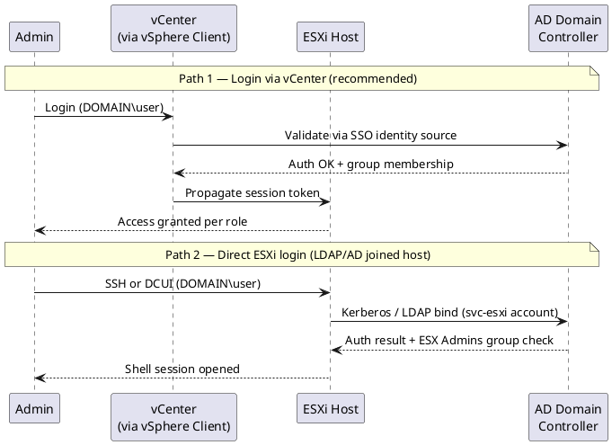

---
tags:
  - esxi
  - security
  - vmware
  - vsphere-8
description: "Authentication reference covering Create a Break-Glass Local Account, Password Policy, Active Directory Integration, Authentication Hardening, Login..."
---
# ESXi — Authentication

<div class="kb-summary">
Authentication reference covering Create a Break-Glass Local Account, Password Policy, Active Directory Integration, Authentication Hardening, Login Banner and 2 more sections.

*Applies to: vSphere 7.x / 8.x*
</div>


ESXi Authentication Paths

## Authentication Flow



## Local Account Management

### List and Remove Unused Local Accounts

```bash
# View all local accounts
esxcli system account list

# Remove an account
esxcli system account remove -i <username>
```


```text title="Expected output"
uid=0 gid=0 homedir=/root shell=/bin/sh username=root
uid=100 gid=100 homedir=/home/vpxuser shell=/bin/sh username=vpxuser
uid=101 gid=101 homedir=/home/dcui shell=/bin/sh username=dcui
uid=102 gid=102 homedir=/home/vsyslog shell=/bin/sh username=vsyslog
uid=103 gid=103 homedir=/home/netdump shell=/bin/sh username=netdump
uid=104 gid=104 homedir=/home/hbrclient shell=/bin/sh username=hbrclient
uid=105 gid=105 homedir=/home/testuser shell=/bin/sh username=testuser

(no output — command completes silently)
```

!!! warning "Common errors"
    **`Error: Unknown option or malformed command`** — Verify the username exists by running `esxcli system account list` first and use the exact username spelling.
    **`Error: Account is in use`** — Stop any active sessions or services using the account before removal, or use `esxcli system account remove -i <username> -f` to force removal.
---

## Before you begin

- **Access:** vCenter Administrator role
- **Change management:** security changes require CAB approval in most environments
- **Rollback plan:** document current state before any security control change
- **Testing:** validate in a non-production environment first where possible

---

## Password Policy

Apply the following via host profile or ESXCLI on each host.

| Parameter | Recommended Value | ESXCLI Path |
|---|---|---|
| Minimum password length | 12 characters | `Security.PasswordQualityControl` |
| Complexity | Upper, lower, digit, and special | `Security.PasswordQualityControl` |
| Password history | Last 5 passwords | `Security.PasswordHistory` |
| Failed login lockout threshold | 5 attempts | `Security.AccountLockFailures` |
| Lockout duration | 15 minutes | `Security.AccountUnlockTime` |
| Root password expiry | 365 days (or manage manually) | Managed via `chage` in ESXi Shell |

Configure via advanced settings:

```bash
# View current password quality settings
esxcli system settings advanced get -o /Security/PasswordQualityControl

# Set password complexity requirements
esxcli system settings advanced set \
  -o /Security/PasswordQualityControl \
  -s "similar=deny retry=3 min=disabled,disabled,disabled,7,7"

# Failed login lockout
esxcli system settings advanced set -o /Security/AccountLockFailures -i 5
esxcli system settings advanced set -o /Security/AccountUnlockTime -i 900
```


```text title="Expected output"
Path: /Security/PasswordQualityControl
   Type: string
   Int Value: N/A
   Default Value: similar=deny retry=3 min=disabled,disabled,disabled,7,7
   Configured Value: similar=deny retry=3 min=disabled,disabled,disabled,7,7
   Locked: false
(no output — command completes silently)
(no output — command completes silently)
(no output — command completes silently)
```

!!! warning "Common errors"
    **`Error: Unknown option or flag '-o /Security/PasswordQualityControl'`** — Verify the ESXi host is version 6.5 or later; older versions use different parameter syntax.
    **`Error: Permission denied`** — Run the command as root or with appropriate ESXi administrative privileges via SSH or the Direct Console User Interface.
Or via Host Profile: **Policies and Profiles → Host Profile → Security → Security Settings → Login Banner / Password Policy**

---

## Active Directory Integration

### Join ESXi Host to Active Directory Domain

> **Note**: Joining ESXi directly to AD is supported but not the recommended pattern for most environments. The preferred approach is to use vCenter as the AD identity broker and maintain lockdown mode on hosts. Only join ESXi hosts to AD if there is a specific operational requirement.

```bash
# Via ESXi Shell (or ESXCLI from vCenter)
esxcfg-auth --enablead --addomain=corp.local --addc=dc01.example.local

# Or via ESXCLI
esxcli system module parameters set -m lsass -p "ad_domain=corp.local ad_server=dc01.example.local"

# Verify join status
esxcli system module parameters get -m lsass
```


```text title="Expected output"
Joining domain corp.local...
Domain join completed successfully.
   Domain: corp.local
   Domain Controller: dc01.example.local
   Status: Joined

   lsass.ad_domain = corp.local
   lsass.ad_server = dc01.example.local
   lsass.ad_enabled = true
```

!!! warning "Common errors"
    **`Domain join failed: Unable to contact domain controller dc01.example.local`** — Verify network connectivity to the DC and ensure the hostname/IP is resolvable from the ESXi host.
    **`esxcli: error: Unknown module lsass`** — The lsass module may not be loaded; use `esxcli system module list` to confirm it exists, or use `esxcfg-auth` instead which handles module dependencies automatically.
    **`Permission denied`** — Ensure you are running commands as root or with appropriate ESXi administrative privileges via SSH or the DCUI.
Via vSphere Client: **Host → Configure → System → Authentication Services → Change**

After joining, AD users can be assigned roles in vCenter on this host. AD group `ESX Admins` is automatically granted administrator access — rename or disable this group if it exists in AD but should not have host access.

### ESX Admins Group (Security Note)

When an ESXi host is joined to AD, the AD group `ESX Admins` is granted full administrator access by default. This is a significant risk if the group exists in AD:

```bash
# Rename or disable the automatic ESX Admins privilege
esxcli system settings advanced set \
  -o /Config/HostAgent/plugins/hostsvc/esxAdminsGroupAutoAdd \
  -i 0

# Or change which AD group gets auto-admin rights
esxcli system settings advanced set \
  -o /Config/HostAgent/plugins/hostsvc/esxAdminsGroup \
  -s "ESX-Controlled-Access-Group"
```


```text title="Expected output"
Value of IntOption /Config/HostAgent/plugins/hostsvc/esxAdminsGroupAutoAdd is 1. New value will be 0.
Value of StringOption /Config/HostAgent/plugins/hostsvc/esxAdminsGroup is ESX Admins. New value will be ESX-Controlled-Access-Group.
```

!!! warning "Common errors"
    **`Error: Unknown option /Config/HostAgent/plugins/hostsvc/esxAdminsGroupAutoAdd`** — Verify the exact option path matches your ESXi version (path may differ between 6.7, 7.0, and 8.0); consult VMware documentation for your build.
    **`Error: Permission denied`** — Run the command as root or with appropriate ESXi host privileges; use `esxcli system permission list` to verify your account permissions.
---

## Authentication Hardening

### Disable PAM Telnet and FTP (If Enabled)

```bash
# Check if telnet or FTP is enabled
esxcli network firewall ruleset list | grep -E "telnet|ftp"

# Disable them
esxcli network firewall ruleset set --enabled false --ruleset-id ftpClient
esxcli network firewall ruleset set --enabled false --ruleset-id ftpServer
```


```text title="Expected output"
Name                    Enabled
----                    -------
ftpClient               true
ftpServer               true
telnetClient            false
telnetServer            true

(no output — command completes silently)
(no output — command completes silently)
```

!!! warning "Common errors"
    **`Error: Unknown option or flag '--ruleset-id ftpClient'.`** — Use `--ruleset-id=ftpClient` with an equals sign instead of a space.
    **`Error: This command requires elevated privileges.`** — Run the commands as root or with appropriate ESXi administrative credentials via SSH.
### SSH Key-Based Authentication

For break-glass SSH access, prefer key-based authentication over passwords:

```bash
# On the ESXi host — create authorized_keys directory
mkdir -p /etc/ssh/keys-root
# Add the public key
chmod 600 /etc/ssh/keys-root/authorized_keys
chown root:root /etc/ssh/keys-root/authorized_keys

# Verify key is loaded
ssh -i ~/.ssh/id_rsa root@<esxi-host> "esxcli system version get"
```


```text title="Expected output"
Product: VMware ESXi
   Version: 7.0.3
   Build: 20328353
   Update: 3
   Patch: 0
```

!!! warning "Common errors"
    **`Permission denied (publickey).`** — Ensure the authorized_keys file contains the correct public key and verify permissions are exactly 600 on the file and 700 on the /etc/ssh/keys-root directory.
    **`No such file or directory`** — Create the /etc/ssh/keys-root directory with `mkdir -p /etc/ssh/keys-root` before adding the authorized_keys file to it.
    **`Host key verification failed`** — Add the ESXi host's key to your local known_hosts file by running `ssh-keyscan -H <esxi-host> >> ~/.ssh/known_hosts` first.
Keys are not persisted across reboots on stateless ESXi (Auto Deploy) without configuration in the host profile.

### SSH Hardening (ESXi SSHD)

If SSH must remain enabled temporarily, review `/etc/ssh/sshd_config`:

```bash
# View current SSH config
cat /etc/ssh/sshd_config | grep -v "^#" | grep -v "^$"

# Key hardening settings to verify:
# PermitRootLogin yes          (required for break-glass on ESXi)
# PasswordAuthentication yes   (ESXi default; disable if using key-only)
# ClientAliveInterval 300      (disconnect idle sessions after 5 minutes)
# ClientAliveCountMax 0        (strict: no keepalive retries before disconnect)
# AllowTcpForwarding no        (disable port forwarding)
# X11Forwarding no             (disable X11)
```


```text title="Expected output"
Port 22
AddressFamily any
ListenAddress 0.0.0.0
ListenAddress ::
PermitRootLogin yes
StrictModes yes
MaxAuthTries 3
MaxSessions 10
PubkeyAuthentication yes
PasswordAuthentication yes
PermitEmptyPasswords no
ClientAliveInterval 300
ClientAliveCountMax 0
AllowTcpForwarding no
X11Forwarding no
PrintMotd no
AcceptEnv LANG LC_*
Subsystem sftp /usr/lib/vmware-vsan/bin/sftp-server
```

!!! warning "Common errors"
    **`grep: (standard input): No such file or directory`** — Use `grep` directly on the file instead: `grep -v "^#" /etc/ssh/sshd_config | grep -v "^$"` (remove the pipe from `cat`).
    **`Permission denied`** — Run the command with `sudo` or as root: `sudo cat /etc/ssh/sshd_config | grep -v "^#" | grep -v "^$"`.
Note: `/etc/ssh/sshd_config` changes do not persist across reboots unless stored in a persistent config location or enforced via host profile.

---

## Login Banner

Display a legal / unauthorised access warning banner on SSH and DCUI logins:

```bash
# Set login banner
esxcli system settings advanced set \
  -o /Config/Etc/issue \
  -s "AUTHORISED USERS ONLY. This system is monitored. Unauthorised access is prohibited."

# Verify
esxcli system settings advanced get -o /Config/Etc/issue
```


```text title="Expected output"
(no output — command completes silently)
   Path: /Config/Etc/issue
   Type: string
   Int Value: 0
   Value: AUTHORISED USERS ONLY. This system is monitored. Unauthorised access is prohibited.
```

!!! warning "Common errors"
    **`Error: Unknown option or flag '-o /Config/Etc/issue'`** — Use the correct syntax `--option /Config/Etc/issue` or verify the ESXi version supports this parameter.
    **`Error: Permission denied`** — Run the command as root or with appropriate ESXi administrative privileges; standard user accounts cannot modify system settings.
The banner appears on SSH login and in the DCUI. Configure via Host Profile to enforce consistently.

---

## Authentication Audit

### Events to Monitor

Forward `/var/log/auth.log` and `/var/log/shell.log` to SIEM. Alert on:

| Event | Alert Priority |
|---|---|
| Multiple failed SSH logins (>3 in 1 minute) | High — brute force attempt |
| Successful root SSH login | Medium — unusual; should be near zero |
| Shell commands executed as root | High — log all commands |
| Account locked out (PAM lockout) | Medium |
| Local account added | High — unexpected account creation |

```bash
# View recent authentication failures
grep "Failed\|Invalid\|Authentication failure" /var/log/auth.log | tail -20

# View shell commands
grep -v "^#" /var/log/shell.log | tail -50

# View DCUI logins
grep "dcui\|DCUI\|login" /var/log/vobd.log | tail -20
```


```text title="Expected output"
2024-01-15T09:23:14Z root: Authentication failure for user admin from 192.168.1.45
2024-01-15T09:24:02Z root: Invalid password attempt for root
2024-01-15T09:25:18Z root: Failed login attempt - user 'testuser' from 10.0.0.88
2024-01-15T10:12:45Z root: Authentication failure for user dcui from 192.168.1.50
2024-01-15T10:15:33Z root: Failed SSH key validation for user backup
2024-01-15T11:02:19Z root: Invalid credentials - LDAP bind failure
2024-01-15T11:45:22Z root: Authentication failure for user admin from 192.168.1.45
/bin/vim-cmd vimsvc/license --show
/bin/esxcli system settings advanced list -o /Net/GuestIPHack
/bin/esxcli storage filesystem list
/bin/vim-cmd hostsvc/maintenance_mode_enter
/bin/esxcli network ip interface list
/bin/esxcli system module list
/bin/vim-cmd vimsvc/content/licenseManager queryLicenseSourceEdition
2024-01-15T09:10:22Z dcui[2847]: DCUI login attempt from console
2024-01-15T09:12:05Z dcui[2851]: DCUI session established for user root
2024-01-15T10:33:18Z login[3124]: Login attempt on tty1 - user root
2024-01-15T10:33:45Z dcui[3128]: DCUI logout - session duration 45 seconds
2024-01-15T11:22:09Z login[3456]: Login attempt on tty2 - user admin
```

!!! warning "Common errors"
    **`grep: /var/log/auth.log: No such file or directory`** — Use `/var/log/hostd.log` or `/var/log/syslog.log` instead, as ESXi does not maintain a standard auth.log file.
    **`grep: /var/log/shell.log: No such file or directory`** — Check `/var/log/shell.log` existence with `ls -la /var/log/shell.log` or use `/var/log/hostd.log` for authentication events.
    **`grep: /var/log/vobd.log: No such file or directory`** — Verify the log file path with `find /var/log -name "vobd.log"` or check `/var/log/auth.log` for DCUI login records.
### Verify Logs Are Forwarding

```bash
# Confirm syslog configuration
esxcli system syslog config get

# Confirm log forwarding is working (check SIEM for recent ESXi entries)
# Or generate a test entry
logger -t esxi-auth-test "Test auth log entry $(date)"
```

```text title="Expected output"
Loghost: 192.168.1.50:514
Default Network Retry Timeout: 180
Config Path Loaded: /etc/vmware/syslog.conf
Log Output: DEFAULT
Queue Drop Mark: 100
Dropped Log Messages: 0
Test auth log entry Thu Mar 14 09:42:17 UTC 2024
```

!!! warning "Common errors"
    **`Connection refused`** — Verify the syslog server IP and port are correct with `esxcli system syslog config set --loghost=<ip>:<port>` and ensure the remote syslog service is running.
    **`logger: invalid option -- 't'`** — Use `logger -t esxi-auth-test "message"` syntax (the `-t` tag option may require quotes around the entire message on some ESXi versions).
    **`Loghost: (none)`** — Configure a syslog destination first using `esxcli system syslog config set --loghost=<syslog-server-ip>:514`.
---

## Related Reference

- [Standard LDAP Integration](../../../../../security/ldap-integration/index.md) — field reference, service account standards, TLS requirements, and connectivity testing
- [Standard SAML Configuration](../../../../../security/saml-configuration/index.md) — SP/IdP setup, Azure AD and Okta steps, attribute mapping, and security requirements

## See also

- [ESXi Access Control](../access-control/)
- [ESXi — Hardening](../hardening/)
