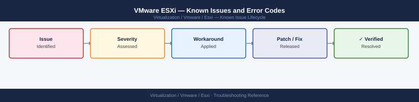

---
tags:
  - troubleshooting
  - esxi
  - vmware
  - known-issues
  - vsphere-8
description: "Catalog of known ESXi bugs, error codes, and workarounds. Each entry includes the affected version range, cause, and resolution status."
---
# VMware ESXi — Known Issues and Error Codes

<div class="kb-summary">
Catalog of known ESXi bugs, error codes, and workarounds. Each entry includes the affected version range, cause, and resolution status.

*Applies to: ESXi 7.x / 8.x*
</div>



```d2
direction: down

symptom: Identify Symptom {shape: diamond}
purple_screen_of_death_psod: "Purple Screen of Death (PSOD)" {shape: rectangle}
network: "Network" {shape: rectangle}
storage: "Storage" {shape: rectangle}
memory_and_performance: "Memory and Performance" {shape: rectangle}
upgrade_and_patching: "Upgrade and Patching" {shape: rectangle}
resolution: Resolve or Escalate {shape: oval}

symptom -> purple_screen_of_death_psod: investigate
symptom -> network: investigate
symptom -> storage: investigate
symptom -> memory_and_performance: investigate
symptom -> upgrade_and_patching: investigate
purple_screen_of_death_psod -> resolution
network -> resolution
storage -> resolution
memory_and_performance -> resolution
upgrade_and_patching -> resolution
```

## Before you begin

- ESXi bugs are tracked in VMware/Broadcom Release Notes and KB articles at `kb.broadcom.com`.
- Run `esxcli system version get` to confirm your exact build before applying workarounds.
- PSOD (Purple Screen of Death) dumps are stored in `/var/core/` and should be uploaded to GSS.

## Purple Screen of Death (PSOD)

| Error / Symptom | Affected Versions | Cause | Workaround / Fix | Fixed In |
|---|---|---|---|---|
| PSOD on NVMe driver during boot | ESXi 7.0 U1–U2 | nvme_pcie driver race condition on certain NVMe controllers | Apply ESXi 7.0 U3 or disable NVMe in BIOS temporarily | 7.0 U3 |
| PSOD `vmk_stress_counter` during vSAN resync | ESXi 7.0 | vSAN I/O path race under high resync load (KB 83795) | Apply patch; reduce concurrent resync bandwidth | 7.0 U2 |
| PSOD after USB NIC driver load | ESXi 8.0 | USB-NIC community driver conflict with v8 kernel | Remove USB NIC driver; use supported NIC | N/A |

## Network

| Error / Symptom | Affected Versions | Cause | Workaround / Fix | Fixed In |
|---|---|---|---|---|
| `vmnic0: no link` after upgrade | ESXi 7.0 → 8.0 | NIC driver not included in ESXi 8.0 base ISO | Install VIB from Broadcom support; use offline bundle | Varies by NIC vendor |
| vMotion fails with `Lost connection` mid-migration | ESXi 7.x | MTU mismatch on vMotion VMkernel network | Ensure MTU consistent (typically 9000) across all switches and vMotion portgroup | N/A |
| LACP NIC team splits after host reboot | ESXi 7.x / 8.x | `lacp.fast` PDU interval not maintained after reboot | Set `lacp.fast = TRUE` in port group config; verify VDS settings | N/A |

## Storage

| Error / Symptom | Affected Versions | Cause | Workaround / Fix | Fixed In |
|---|---|---|---|---|
| iSCSI datastore loses path after NIC failover | ESXi 7.x | VMkernel IP binding lost after NIC link flap | Re-bind iSCSI VMkernel adapter after failover; script with alarm | N/A |
| `NMP: nmp_ThrottleLogForDevice` logged repeatedly | ESXi 7.x / 8.x | Storage device sending BUSY / QUEUE FULL SCSI status | Reduce queue depth on affected storage device | N/A |
| NFS datastore shows `Dead` after network interruption | ESXi 7.x | NFS heartbeat timeout defaults too short for WAN-connected NAS | Increase `NFS.HeartbeatTimeout` and `NFS.HeartbeatFrequency` | N/A |

## Memory and Performance

| Error / Symptom | Affected Versions | Cause | Workaround / Fix | Fixed In |
|---|---|---|---|---|
| `Memory overcommit` warnings on host with free RAM | ESXi 7.x | VM balloon driver inflating due to memory reservation mismatch | Check VM memory reservations; disable balloon driver only if RAM truly sufficient | N/A |
| High CPU ready time on low-load VMs | ESXi 7.x / 8.x | NUMA imbalance — VMs scheduled across NUMA nodes | Set NUMA affinity or use `latencySensitivity = high` for latency-sensitive VMs | N/A |

## Upgrade and Patching

| Error / Symptom | Affected Versions | Cause | Workaround / Fix | Fixed In |
|---|---|---|---|---|
| `VIB cannot be installed — signature check failed` | ESXi 8.x | Host in Secure Boot mode; unsigned VIB rejected | Sign VIB or disable Secure Boot; enforce acceptance level | N/A |
| Lifecycle Manager (vLCM) remediation stuck at 10% | ESXi 7.x | Host in maintenance mode with DRS disabled | Ensure DRS set to Fully Automated during remediation | N/A |
| Upgrade from 6.7 fails: `BOOT module missing` | ESXi 6.7 → 7.0 | USB/SD boot device too small for 7.0 boot partition | Boot from larger USB (≥8 GB) or migrate to M.2 | N/A |

## See also

- [VMware ESXi — Common Issues](../common-issues/)
- [VMware vCenter — Known Issues](../../vcenter/troubleshooting/known-issues.md)
- [VMware vSAN — Known Issues](../../vsan/troubleshooting/known-issues.md)
