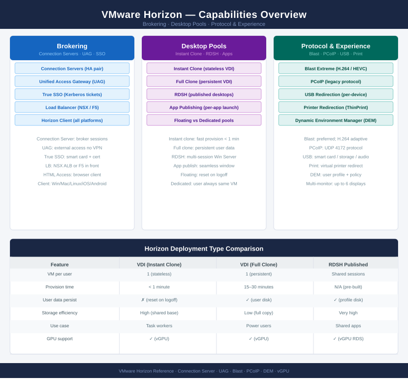
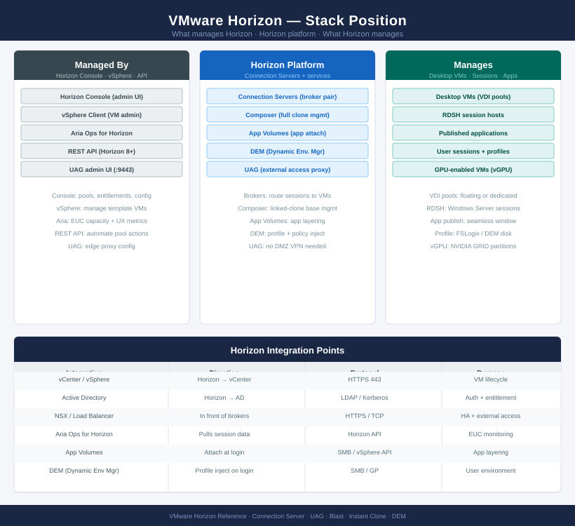

---
tags:
  - horizon
  - vmware
description: "Horizon knowledge base — architecture, operations, deploy, CLI references, security, and troubleshooting."
---
# Horizon (VDI)

<div class="kb-summary">
Horizon knowledge base — architecture, operations, deploy, CLI references, security, and troubleshooting.

*Applies to: Horizon 8.x*
</div>





```text
┌───────────────────────────── VMware Horizon VDI — Installation Sequence ──────────────────────────────┐
│                                                                                                       │
│  Step 1 · Pre-Requisites                                                                              │
│  ─────────────────────────────────────────────────────────────────────────────────────────            │
│  Active Directory: OUs for VDI computers  ·  Service accounts for Horizon + AD                        │
│  vCenter with shared storage and adequate compute for VM pools                                        │
│  SQL Server (or PostgreSQL) for Horizon Events DB and App Volumes DB                                  │
│  Load balancer VIP for Connection Server pool  ·  Certs from CA ready                                 │
│  DNS: A-records for UAG FQDNs, Connection Server pool VIP, Horizon FQDN                               │
│                                                                                                       │
│                                        │  install Connection Server (primary)                         │
│                                        ▼                                                              │
│  Step 2 · Connection Server — Primary                                                                 │
│  ─────────────────────────────────────────────────────────────────────────────────────────            │
│  Install Horizon Connection Server on Windows Server 2019/2022                                        │
│  Select role: Standard Server (first/primary)  ·  Enter FQDN + admin creds                            │
│  Set data recovery password (LDAP backup passphrase)                                                  │
│  Apply Horizon licence key  ·  Connect vCenter and vCenter-linked View Composer                       │
│  Confirm vCenter trust  ·  Connection Server admin console accessible                                 │
│                                                                                                       │
│                                        │  install replica Connection Servers                          │
│                                        ▼                                                              │
│  Step 3 · Connection Server — Replicas                                                                │
│  ─────────────────────────────────────────────────────────────────────────────────────────            │
│  Install 2+ Replica Connection Server instances for HA                                                │
│  During install: select Replica role  ·  Enter primary CS FQDN                                        │
│  Replica joins AD LDS (internal LDAP) cluster  ·  Config replicated automatically                     │
│  Add all CS instances to load balancer pool  ·  Health checks configured                              │
│  Verify LDAP replication: any change on primary appears on replica within 1 min                       │
│                                                                                                       │
│                                        │  deploy Unified Access Gateway                               │
│                                        ▼                                                              │
│  Step 4 · Unified Access Gateway (UAG)                                                                │
│  ─────────────────────────────────────────────────────────────────────────────────────────            │
│  Deploy UAG OVA  ·  Configure admin, internet-facing, and backend NICs                                │
│  Set edge service: Horizon (Blast, PCoIP, HTML Access tunnels)                                        │
│  Upload Horizon CA certificate to UAG  ·  Configure thumbprint or cert trust                          │
│  SAML auth: integrate with Workspace ONE Access for SSO if required                                   │
│  Verify external URL resolves to UAG VIP  ·  Test connection from external client                     │
│                                                                                                       │
│                                        │  create desktop pools and farms                              │
│                                        ▼                                                              │
│  Step 5 · Desktop Pools & RDSH Farms                                                                  │
│  ─────────────────────────────────────────────────────────────────────────────────────────            │
│  Golden image: create master VM  ·  Install Horizon Agent  ·  Snapshot (parent)                       │
│  Instant clone pool: define pool  ·  Parent VM + snapshot  ·  Provisioning count                      │
│  RDSH farm: create farm on RDSH server VMs  ·  Install Horizon Agent (RDSH role)                      │
│  Application pool: publish apps from RDSH farm to Horizon catalogue                                   │
│  Entitlements: assign pools/apps to AD users or groups  ·  Verify user access                         │
│                                                                                                       │
│                                        │  configure App Volumes and DEM                               │
│                                        ▼                                                              │
│  Step 6 · App Volumes & Dynamic Environment Manager                                                   │
│  ─────────────────────────────────────────────────────────────────────────────────────────            │
│  App Volumes Manager: deploy appliance  ·  Register with vCenter + Horizon                            │
│  AppStacks: capture application packages (MSI/legacy)  ·  Assign to AD groups                         │
│  Writable Volumes: per-user volumes for profile and user-installed apps                               │
│  DEM: deploy DEM agent in golden image  ·  Configure file share for user settings                     │
│  DEM policies: map printers, drives, environment variables  ·  Loopback GPO                           │
│                                                                                                       │
└───────────────────────────────────────────────────────────────────────────────────────────────────────┘
```


<div class="kb-grid kb-grid-3">

<a class="kb-card" href="architecture/">
  <strong>Architecture</strong>
  <span>How it works, integrations, and design standards.</span>
</a>

<a class="kb-card" href="deploy/">
  <strong>Deploy</strong>
  <span>Phase-by-phase deployment from Connection Server install through UAG, desktop pools, and App Volumes.</span>
</a>

<a class="kb-card" href="operations/">
  <strong>Operations</strong>
  <span>CLI reference, health checks, procedures, lifecycle, backup, and scripts.</span>
</a>

<a class="kb-card" href="security/">
  <strong>Security</strong>
  <span>Authentication, access control, encryption, and hardening.</span>
</a>

<a class="kb-card" href="troubleshooting/">
  <strong>Troubleshooting</strong>
  <span>Common issues, diagnostics, and escalation.</span>
</a>

</div>
