---
tags:
  - horizon
  - operations
  - vmware
description: "Day-2 Horizon procedures — managing desktop and RDS pools, user entitlements, session operations, instant clone recompose, certificate renewal, UAG..."
---
# Horizon — Procedures

<div class="kb-summary">
Day-2 Horizon procedures — managing desktop and RDS pools, user entitlements, session operations, instant clone recompose, certificate renewal, UAG configuration, True SSO, App Volumes, DEM, and pool decommission.

*Applies to: Horizon 8.x*
</div>

  Common Operational Procedures

ool] → Entitlements → Add** — add AD groups

```powershell
# Verify pool provisioning status via PowerCLI
Connect-HVServer -Server horizon-cs-01.corp.local -Credential (Get-Credential)
Get-HVPool -PoolName "pool-ic-win11" | Select-Object -ExpandProperty AutomatedDesktopData |
  Select-Object MinimumCount, MaximumCount, SpareCount
Get-HVMachine -PoolName "pool-ic-win11" | Group-Object State | Select-Object Name, Count
```

## Before you begin

- **Access:** vCenter read-only minimum; Administrator role for remediation steps
- **Timing:** safe to run during business hours unless a step is marked ⚠ (causes interruption)
- **Dependencies:** no active upgrades or migrations on the same infrastructure
- **Logging:** capture command output — paste into the change record on completion

---

## Create an RDS Farm and Application Pool

RDS farms deliver published desktops and RemoteApp applications from Windows Server RDSH hosts.

```powershell
# 1. Verify Horizon Agent with RDS role is installed on RDSH hosts
Get-HVFarm | Where-Object { $_.Type -eq "AUTOMATED" }

# 2. Create a manual RDS farm (add existing RDSH servers)
# Horizon Console → Farm → Add → Manual Farm
# Add RDSH hosts by FQDN — Horizon registers them as RDS hosts

# 3. Create an Application Pool from the farm
# Horizon Console → Catalog → Application Pools → Add
# Select farm, browse installed applications, publish selected apps

# 4. Verify farm health
Get-HVFarm -FarmName "farm-rdsh-apps" | Select-Object -ExpandProperty RDSFarmSummaryData
Get-HVFarmHealth -FarmName "farm-rdsh-apps"
```

RDSH hosts must have at least 1 licensed RDS CAL per concurrent user. Check licensing via `licmgr.exe` on a host.

## Add or Remove User Entitlement from a Pool

```powershell
Connect-HVServer -Server horizon-cs-01.corp.local -Credential (Get-Credential)

# Add an AD group entitlement to a pool
$pool = Get-HVPool -PoolName "pool-ic-win11"
$group = Get-HVQueryResult -EntityType ADUserOrGroupSummaryView |
  Where-Object { $_.Base.Name -eq "VDI-Users" }
New-HVEntitlement -ResourceType Desktop -ResourceId $pool.Id -UserOrGroupId $group.Id

# Remove an entitlement
$entitlement = Get-HVEntitlement -ResourceType Desktop -ResourceName "pool-ic-win11" |
  Where-Object { $_.UserOrGroupData.Name -eq "VDI-Users" }
Remove-HVEntitlement -Id $entitlement.Id

# List all entitlements for a pool
Get-HVEntitlement -ResourceType Desktop -ResourceName "pool-ic-win11" |
  Select-Object { $_.UserOrGroupData.Name }, { $_.UserOrGroupData.GroupMembershipCount }
```

## Force Logoff or Reset a User Session

```powershell
Connect-HVServer -Server horizon-cs-01.corp.local -Credential (Get-Credential)

# Find active sessions for a user
Get-HVLocalSession | Where-Object { $_.NamesData.UserName -eq "jsmith" } |
  Select-Object Id, @{N='Desktop';E={$_.NamesData.MachineOrRDSServerDNS}}, SessionState

# Force logoff a specific session
Get-HVLocalSession | Where-Object { $_.NamesData.UserName -eq "jsmith" } |
  Invoke-HVSessionLogoff

# Reset (hard reboot) a stuck desktop
Get-HVMachine -MachineName "ic-win11-0042" | Reset-HVMachine

# Disconnect without logoff (session persists, user can reconnect)
Get-HVLocalSession | Where-Object { $_.NamesData.UserName -eq "jsmith" } |
  Invoke-HVSessionDisconnect
```

## Recompose an Instant Clone Pool

Recompose pushes a new golden image snapshot to all desktops in the pool. Sessions are terminated; desktops are rebuilt from the new parent.

```powershell
Connect-HVServer -Server horizon-cs-01.corp.local -Credential (Get-Credential)

# 1. Confirm new snapshot exists on the parent VM
Get-VM "GoldenImage-Win11" | Get-Snapshot | Select-Object Name, Created

# 2. Initiate recompose (schedule for maintenance window)
$pool = Get-HVPool -PoolName "pool-ic-win11"
$snapshot = Get-HVQueryResult -EntityType BaseImageSnapshotInfo |
  Where-Object { $_.Name -eq "Snap-2026-06-Win11-Patched" }

# Recompose immediately (use -ScheduleTime for deferred)
Update-HVPool -PoolId $pool.Id -ParentVMPath $snapshot.Path -SnapshotPath $snapshot.SnapshotPath

# 3. Monitor progress
Get-HVMachine -PoolName "pool-ic-win11" | Group-Object State | Select-Object Name, Count
# States cycle: Maintenance → Deleting → Provisioning → Available
```

## Renew Certificate on Connection Servers

Horizon Connection Servers use TLS certificates for client connections and inter-component trust.

```powershell
# 1. Import new certificate into the Windows certificate store on each CS
# Run on each Connection Server:
Import-PfxCertificate -FilePath "C:\certs\horizon-cs.pfx" `
  -CertStoreLocation "Cert:\LocalMachine\My" `
  -Password (ConvertTo-SecureString "pfx-password" -AsPlainText -Force)

# 2. Find the certificate thumbprint
Get-ChildItem "Cert:\LocalMachine\My" | Where-Object { $_.Subject -match "horizon-cs" } |
  Select-Object Subject, Thumbprint, NotAfter

# 3. Set the Horizon vdm alias to use the new certificate
# Run in elevated cmd on each CS:
# certutil -repairstore My "<thumbprint>"

# 4. Restart the VMware Horizon View Connection Server service
Restart-Service -Name "WSNM" -Force
# Service name may also be "wsbroker" depending on Horizon version

# 5. Verify from a Horizon Client — confirm certificate CN and expiry match new cert
# Horizon Console → Settings → Servers → Connection Servers → [server] → Certificate
```

Repeat on all Connection Servers and Replica Servers before the old certificate expires.

## Configure Horizon Event Database

The event database records audit, session, and error events for reporting and compliance.

```sql
-- Create a dedicated database on SQL Server or PostgreSQL
-- SQL Server:
CREATE DATABASE HorizonEvents;
CREATE LOGIN horizon_event_user WITH PASSWORD = 'StrongP@ss1';
USE HorizonEvents;
CREATE USER horizon_event_user FOR LOGIN horizon_event_user;
ALTER ROLE db_owner ADD MEMBER horizon_event_user;
```

```powershell
# Configure in Horizon Console:
# Settings → Event Configuration → Event Database
# Type: Microsoft SQL Server (or PostgreSQL)
# Server: <db-server-fqdn>
# Port: 1433
# Database: HorizonEvents
# User: horizon_event_user
# Table prefix: hv_ (optional, allows sharing one DB for multiple pods)

# Verify events are flowing — check after any user session:
# Reports → Events → Recent Events should show session events
```

Event data is retained per the configured purge schedule (default 30 days). Increase for compliance requirements.

## Push a Golden Image Update to an Instant Clone Pool

Update the parent VM with patches or application changes, take a new snapshot, then push it to all instant clone desktops in the pool. Existing sessions are terminated during the push.

```powershell
Connect-HVServer -Server horizon-cs-01.corp.local -Credential (Get-Credential)

# 1. Power on the parent (golden image) VM and apply changes
Start-VM -Name "GoldenImage-Win11"
# --- install patches / apps on VM via vCenter console, then shut down ---
Stop-VM -Name "GoldenImage-Win11" -Confirm:$false

# 2. Take a new snapshot (parent must be powered off for instant clones)
New-Snapshot -VM "GoldenImage-Win11" -Name "Snap-2026-06-Patched" -Description "June patch cycle"

# 3. Push the new snapshot via PowerCLI
$pool     = Get-HVPool -PoolName "pool-ic-win11"
$snapshot = Get-HVQueryResult -EntityType BaseImageSnapshotInfo |
              Where-Object { $_.Name -eq "Snap-2026-06-Patched" }
Update-HVPool -PoolId $pool.Id -SnapshotPath $snapshot.SnapshotPath

# Or via Horizon Console:
# Catalog → Desktop Pools → [pool] → Maintenance → Push Image
# Select new snapshot; set schedule (immediate or deferred maintenance window)

# 4. Monitor progress — states cycle: Maintenance → Deleting → Provisioning → Available
Get-HVMachine -PoolName "pool-ic-win11" | Group-Object State | Select-Object Name, Count

# 5. Handle stuck VMs that do not leave Provisioning state
Get-HVMachine -PoolName "pool-ic-win11" |
  Where-Object { $_.Base.BasicState -eq "PROVISIONING_ERROR" } |
  Remove-HVMachine -DeleteFromDisk $true
# Horizon re-provisions replacement VMs automatically to meet SpareCount
```

After the push completes, log in to a new desktop and confirm the OS patch level and installed applications match the updated snapshot.

## Add a New Connection Server Replica

A replica Connection Server joins an existing pod to increase capacity and availability. All replicas share the same LDAP configuration database replicated from the primary.

```powershell
# Pre-checks on the new server (run as local Administrator on the new host)
Test-ComputerSecureChannel -Repair           # confirm AD domain membership
nslookup horizon-cs-01.corp.local            # verify existing CS is DNS-resolvable
Test-NetConnection -ComputerName horizon-cs-01.corp.local -Port 443   # connectivity check

# 1. Run the Horizon Connection Server installer on the new Windows Server host
#    Installer wizard → select "Add a Replica Server"
#    Primary Connection Server field: horizon-cs-01.corp.local
#    Installer copies the LDAP config and registers the new replica automatically

# 2. After installation — confirm the CS service is running
Get-Service -Name "WSNM" | Select-Object Name, Status
# Service name may be "VMware Horizon View Connection Server" on older versions

# 3. Confirm pod membership in Horizon Console
#    Settings → Servers → Connection Servers
#    New server should appear with status "OK" and correct FQDN

# 4. Verify LDAP replication from the primary CS via PowerCLI
Connect-HVServer -Server horizon-cs-01.corp.local -Credential (Get-Credential)
Get-HVConnectionServer | Select-Object @{N='FQDN';E={$_.General.Name}},
                                       @{N='Status';E={$_.Health.Status}},
                                       @{N='Version';E={$_.General.Version}}

# 5. Update load balancer (F5 / NSX / HAProxy) to include the new replica
#    Add new CS IP/FQDN to the VIP pool, port 443
#    Health check: GET /broker/xml — expect HTTP 200 or 401
#    Test: curl -k https://<lb-vip>/broker/xml from outside the CS subnet
```

The TLS certificate on the new replica must include the load balancer VIP hostname in its SAN, or import the same wildcard PFX used by the existing servers.

## Configure UAG for External Access

Unified Access Gateway (UAG) is deployed in the DMZ to proxy external Horizon connections without exposing Connection Servers to the internet.

```powershell
# UAG is delivered as an OVA; deploy via vSphere Client

# 1. Deploy UAG OVA
#    File → Deploy OVF Template → select VMware-UAG-<version>.ova
#    Configure networking:
#      NIC0 (eth0) = internet-facing (public/DMZ IP, e.g., 203.0.113.10)
#      NIC1 (eth1) = internal (CS-reachable, e.g., 10.10.50.20)
#    Set admin password and optional TLS cert during the OVA wizard

# 2. Open UAG Admin UI: https://<uag-mgmt-ip>:9443/admin

# 3. Configure Edge Service — Horizon:
#    Edge Service Settings → Horizon → Enable
#    Connection Server URL: https://horizon-cs-01.corp.local
#    Enable Blast (port 8443), PCoIP (port 4172), Tunnel as required
#    Blast External URL: https://vdi.example.com:8443  (must match public DNS)

# 4. Upload TLS certificate (PEM format):
#    Advanced Settings → TLS Server Certificate → Upload
#    Paste PEM chain (server cert + intermediates), then paste private key

# 5. Configure SAML / Identity Provider (if using IdP for True SSO):
#    Identity Provider → Add → paste IdP metadata XML or enter metadata URL
#    Map SAML attribute: UPN → userPrincipalName

# 6. Test external connection from an off-network client:
#    Horizon Client → Server: vdi.example.com → authenticate → desktop should launch
#    Review UAG edge service logs for auth events:
#    /opt/vmware/gateway/logs/esmanager.log  (SSH to UAG management IP)
```

UAG requires outbound ports 22443 (Blast) and 4172 (PCoIP UDP) open from the DMZ to internal Connection Server hosts. Confirm firewall rules before testing.

## Enable True SSO

True SSO issues short-lived certificates at login so users who authenticated via a SAML IdP are not prompted for a Windows password when connecting to desktops.

```powershell
# Prerequisites: AD CS running in the environment, Enrollment Server Windows host
# joined to the domain, SAML IdP integrated with UAG

# 1. Install the VMware Horizon Enrollment Server on a domain-joined Windows Server
#    Horizon installer → select "Enrollment Server" role
#    The Enrollment Server communicates with AD CS to issue short-lived certs

# 2. Create an Enrollment Agent certificate template in AD CS (run on CA):
#    Duplicate built-in "Enrollment Agent" template → name: HorizonEnrollmentAgent
#    Permissions tab: grant the Enrollment Server computer account "Enroll" permission
#    Publish template on the CA

# 3. Register Enrollment Server in Horizon Console:
#    Settings → True SSO → Add Enrollment Server
#    FQDN: enrollment-srv-01.corp.local
#    Click Test Connection — status must show "OK" before proceeding

# 4. Configure True SSO Domain:
#    Settings → True SSO → Add Domain
#    Domain: corp.local
#    Enrollment Server: enrollment-srv-01.corp.local
#    Certificate template: HorizonEnrollmentAgent

# 5. Enable True SSO on each desktop pool:
#    Catalog → Desktop Pools → [pool] → Edit → Session → Single Sign-On → Enable True SSO

# 6. Verify via PowerCLI
Connect-HVServer -Server horizon-cs-01.corp.local -Credential (Get-Credential)
Get-HVPool -PoolName "pool-ic-win11" |
  Select-Object -ExpandProperty AutomatedDesktopData |
  Select-Object @{N='TrueSSO';E={$_.CustomizationSettings.EnableTrueSSO}}

# 7. Test: authenticate via Horizon Client using SAML IdP credentials through UAG
#    Desktop should open without a secondary Windows password prompt
```

If True SSO fails, check the Enrollment Server Application event log for certificate issuance errors and confirm the enrollment agent template has the correct Extended Key Usage (Certificate Request Agent OID).

## Add an App Volumes AppStack to a Pool

App Volumes AppStacks deliver applications as read-only VMDK packages attached at login, allowing apps to be updated independently of the golden image.

```powershell
# App Volumes Manager Admin UI: https://appvolumes-mgr.corp.local

# 1. Import AppStack into App Volumes Manager
#    AppStacks → Import → browse datastore → select AppStack-Acrobat-2025.vmdk
#    Enter display name (e.g., "Adobe Acrobat 2025"), description, and stage: Assignable

# 2. Assign AppStack to an AD group
#    AppStacks → [AppStack] → Assignments → Add Assignment
#    Type: Group  |  AD Group: VDI-Acrobat-Users
#    Members of this group receive the AppStack at every desktop login

# 3. Verify assignment via App Volumes PowerShell module
Import-Module AppVolumes
Connect-AppVolumesServer -Server appvolumes-mgr.corp.local -Credential (Get-Credential)
Get-AVAppStack -Name "Adobe Acrobat 2025" |
  Select-Object Name, Status, AssignmentCount, AgentVersion

# 4. Confirm attachment on a live desktop session
#    Log in as a member of VDI-Acrobat-Users on the pool
#    Open Event Viewer on the desktop → Application log → filter Source: svservice
#    Event ID 1001 = AppStack mounted; Event ID 1003 = mount complete

# 5. Update AppStack to a new version
#    Capture new AppStack VMDK using App Volumes Capture VM workflow
#    Import new version in App Volumes Manager
#    Set old version to Disabled (prevents new assignments; existing sessions unaffected)
#    Re-assign new version to the same AD group
```

AppStacks are read-only at runtime. User-installed applications or per-user data belong in Writable Volumes, which are separate per-user VMDKs assigned independently of the pool.

## Handle a Stuck Desktop in Error State

Desktops can become stuck in Provisioning Error, Customization Error, or Agent Unreachable states when instant clone creation or domain join fails.

```powershell
Connect-HVServer -Server horizon-cs-01.corp.local -Credential (Get-Credential)

# 1. Identify stuck desktops and capture the error detail
Get-HVMachine -PoolName "pool-ic-win11" |
  Where-Object { $_.Base.BasicState -in "ERROR","PROVISIONING_ERROR","CUSTOMIZATION_ERROR","AGENT_UNREACHABLE" } |
  Select-Object @{N='Name';E={$_.Base.Name}},
                @{N='State';E={$_.Base.BasicState}},
                @{N='OpState';E={$_.Base.OperationState}}

# 2. Check the underlying VM state in vCenter
Connect-VIServer -Server vcenter.corp.local
Get-VM | Where-Object { $_.Name -match "ic-win11-00" -and $_.PowerState -ne "PoweredOn" } |
  Select-Object Name, PowerState, Notes

# 3. Attempt force-delete from Horizon (removes from pool and deletes VM in vCenter)
Get-HVMachine -MachineName "ic-win11-0055" | Remove-HVMachine -DeleteFromDisk $true

# 4. If Remove-HVMachine fails (LDAP lock or API timeout):
#    Horizon Console → Catalog → Desktop Pools → [pool] → Machines
#    Select stuck machine → More Commands → Delete → check "Delete from disk"

!!! warning "Permanently deletes VM from disk — no recovery"
    `Remove-VM -DeletePermanently` deletes the VM and all VMDKs from the datastore with no recycle bin. Only run this after confirming the Horizon delete failed and the VM is a known orphan. Verify the VM name matches the stuck machine before executing.

# 5. Orphan cleanup in vCenter (if VM remains after Horizon delete)
Get-VM "ic-win11-0055" | Remove-VM -DeletePermanently -Confirm:$false

# 6. Allow Horizon to re-provision — provisioning restarts automatically to meet SpareCount
#    Monitor until the replacement VM reaches Available state:
Get-HVMachine -PoolName "pool-ic-win11" | Group-Object State | Select-Object Name, Count
```

Common root causes: domain join OU permission denied, SYSPREP timeout, or vCenter customization spec mismatch. Resolve the underlying issue before the pool re-provisions, otherwise the same error recurs on every new clone.

## Set DEM Configuration Migration Policy

Dynamic Environment Manager (DEM) migration policies carry user flex-config profile settings from one OS version to another, preserving personalisation across desktop upgrades.

```powershell
# DEM migration policies are authored in the DEM Management Console (MMC snap-in)
# connected to the DEM configuration share

# 1. Open DEM Management Console on the DEM admin workstation
#    File → Connect → \\fileserver\DEM-Config  (your organisation's DEM config share)

# 2. Navigate to: User Environment → Application Migration → Add Migration Policy

# 3. Configure source/target OS mapping:
#    Source OS:  Windows 10  (build range 10.0.19041 – 19045)
#    Target OS:  Windows 11  (build 10.0.22621 and later)
#    Migration scope: select the flex-config profiles to migrate
#      e.g., Microsoft Office, Google Chrome, custom in-house apps
#    Action: Copy  (retains source settings — safe for rollback)
#             or Move  (removes source after migration)

# 4. Set migration trigger:
#    Trigger: First login to target OS
#    DEM detects the OS version change and applies the selected profiles automatically
#    Optional: set an expiry date after which the migration policy no longer fires

# 5. Test with a pilot user:
#    Log the user into a Windows 11 desktop in the pool
#    Check DEM log on the desktop: %TEMP%\DEM_Log_<username>.log
#    Look for "Migration applied" entries for each migrated profile

# 6. Verify via DEM Helpdesk Console:
#    DEM Management Console → Support → Helpdesk → search by username
#    Profile Actions → Show imported flex configs
#    Migrated profiles appear with a source-OS tag confirming migration ran
```

Migration policies are one-time per user per OS transition. The migration stamp is written to the user's profile store; to force a re-run, delete the stamp entry in the DEM profile store folder for that user.

## Decommission a Desktop Pool

Safely remove a pool from production by draining sessions, notifying users, removing entitlements, and deleting VMs in the correct order.

```powershell
Connect-HVServer -Server horizon-cs-01.corp.local -Credential (Get-Credential)

# 1. Disable provisioning to stop new VM creation immediately
$pool = Get-HVPool -PoolName "pool-ic-win11-old"
Set-HVPool -PoolId $pool.Id -Disable

# 2. Send advance warning to all active sessions (repeat daily during notice period)
Get-HVLocalSession |
  Where-Object { $_.NamesData.DesktopPoolCN -eq "pool-ic-win11-old" } |
  Send-HVSessionMessage -MessageType WARNING `
    -Message "This pool is being decommissioned on 2026-07-01. Please save work and migrate to pool-ic-win11-v2."

# 3. Monitor session drain
Get-HVLocalSession |
  Where-Object { $_.NamesData.DesktopPoolCN -eq "pool-ic-win11-old" } |
  Select-Object @{N='User';E={$_.NamesData.UserName}}, SessionState, @{N='Idle';E={$_.IdleDuration}}

# 4. Force-logoff remaining sessions after the drain deadline
Get-HVLocalSession |
  Where-Object { $_.NamesData.DesktopPoolCN -eq "pool-ic-win11-old" } |
  Invoke-HVSessionLogoff

# 5. Remove all entitlements from the pool
Get-HVEntitlement -ResourceType Desktop -ResourceName "pool-ic-win11-old" |
  ForEach-Object { Remove-HVEntitlement -Id $_.Id }

# 6. Delete the pool and all VMs
#    Horizon Console → Catalog → Desktop Pools → [pool] → Delete
#    Check "Delete all virtual machines from disk" → confirm
#    Or via PowerCLI:
Remove-HVPool -PoolId $pool.Id -DeleteFromDisk $true

# 7. Verify no orphaned VMs remain in vCenter
Connect-VIServer -Server vcenter.corp.local
Get-VM | Where-Object { $_.Name -match "ic-win11-old" }
```

Retain the parent VM and its snapshots for 30 days post-decommission before permanent deletion, in case a rollback or compliance audit is required.

## Create an Instant Clone Desktop Pool

Create a new instant clone pool from a prepared parent (golden image) VM. Instant clones are provisioned in seconds by forking a running parent VM.

```powershell
Connect-HVServer -Server horizon-cs-01.corp.local -Credential (Get-Credential)
Connect-VIServer  -Server vcenter.corp.local

# 1. Prepare the golden image VM
#    Install VMware Horizon Agent on the parent VM
#      — select "Instant Clone" feature during agent install wizard
#    Run VMware OS Optimization Tool (OSOT) to disable unnecessary services
#    Shut down VM; take baseline snapshot:
New-Snapshot -VM "GoldenImage-Win11-v2" -Name "Snap-2026-06-Baseline" `
             -Description "Initial pool creation baseline"
Stop-VM -Name "GoldenImage-Win11-v2" -Confirm:$false   # parent must be powered off

# 2. Create the pool via Horizon Console:
#    Catalog → Desktop Pools → Add
#    Type: Automated Desktop Pool
#    User assignment: Floating (or Dedicated for persistent desktops)
#    vCenter Server: vcenter.corp.local
#    Desktop type: Instant Clone
#    Parent VM:   GoldenImage-Win11-v2
#    Snapshot:    Snap-2026-06-Baseline
#    VM folder / cluster / datastore: target vSphere objects
#    Naming pattern:  ic-win11-{n:fixed=4}   → produces ic-win11-0001, ic-win11-0002 ...
#    Minimum machines: 10  |  Maximum: 50  |  Spare (headroom): 5
#    Domain join OU: OU=VDI-Desktops,OU=Computers,DC=corp,DC=local

# 3. Entitle an AD group to the new pool
$pool  = Get-HVPool -PoolName "pool-ic-win11-v2"
$group = Get-HVQueryResult -EntityType ADUserOrGroupSummaryView |
           Where-Object { $_.Base.Name -eq "VDI-Users" }
New-HVEntitlement -ResourceType Desktop -ResourceId $pool.Id -UserOrGroupId $group.Id

# 4. Verify pool provisioning
Get-HVMachine -PoolName "pool-ic-win11-v2" | Group-Object State | Select-Object Name, Count
# Expected progression: Provisioning → Customizing → Available

# 5. Test: log in as a member of VDI-Users and confirm the desktop launches,
#    OS version is correct, and Horizon Agent shows Connected in the Console
```

Set the minimum machine count to cover expected peak concurrency plus the spare headroom count. Provisioning 50 instant clones typically completes within 10-15 minutes on a well-resourced vSAN cluster.

---

## Upgrade Horizon Connection Server

Connection Server upgrades must be done in a rolling fashion — one replica at a time — to maintain availability for active sessions during the upgrade window.

!!! warning "Sessions are not disconnected during rolling upgrade, but reconnection requires a connection server at the new version"
    Users with active sessions will see their desktop remain active during the upgrade. However, if their connection server replica goes offline during its upgrade, the Horizon Client reconnects to another replica automatically. Users connecting fresh must connect to a CS on the same or newer version. Upgrade replicas in sequence — never start the next until the previous is fully healthy.

### Step 1 — Pre-Upgrade Checks

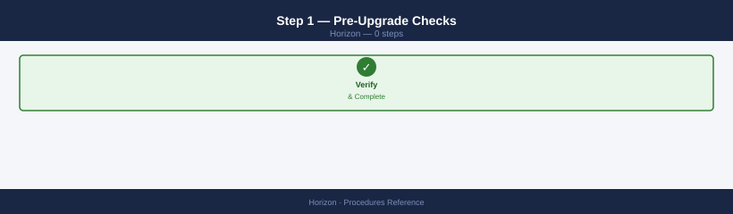

- [ ] All Connection Servers show green in Horizon Admin Console → **Servers → Connection Servers**
- [ ] Horizon Events database is reachable and up to date
- [ ] Active session count is low (best to upgrade during off-peak hours)
- [ ] vCenter and ESXi are on a compatible version (check VMware Compatibility Guide)
- [ ] Backup the Connection Server LDAP configuration: `C:\Program Files\VMware\VMware View\Server\tools\bin\vdmexport.exe -f backup.ldif`

### Step 2 — Download the Installer


Download the Horizon Connection Server installer from the Broadcom portal. The file name is typically `VMware-viewconnectionserver-x86_64-<version>.exe`.

### Step 3 — Upgrade the First Replica (Non-Primary)

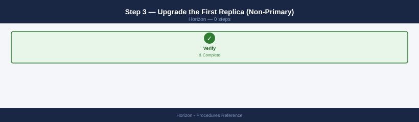

Start with a replica (not the primary Connection Server) to preserve the primary as fallback:

1. RDP to the replica server
2. Run the installer with admin rights: double-click `VMware-viewconnectionserver-x86_64-<version>.exe`
3. Select **Upgrade** (the installer detects the existing installation)
4. Accept the EULA and follow the wizard — the CS service restarts at the end
5. Wait for the Connection Server to return to green in the Horizon Admin Console (2–5 minutes)
6. Verify in Horizon Admin Console → **Servers** — the upgraded server shows the new version

### Step 4 — Upgrade Remaining Replicas and Primary

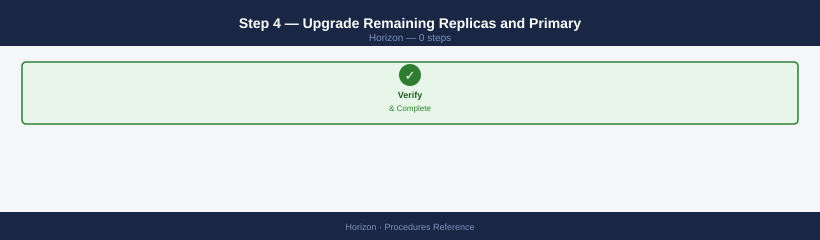

Repeat Step 3 for each additional replica, then for the primary Connection Server. Always verify green status after each upgrade before starting the next.

### Step 5 — Upgrade Horizon Agents (Optional — Separate Window)

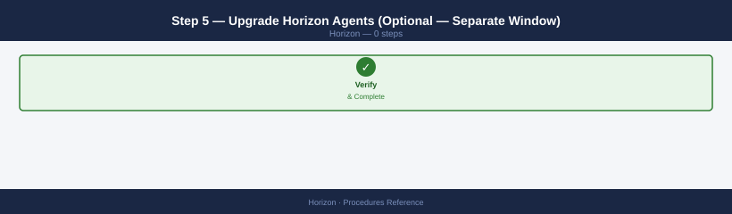

Horizon Agent (on the golden images or RDS servers) can be upgraded independently:

1. Update the golden image VM: install new Horizon Agent, shut down, take a snapshot
2. Recompose the desktop pool from the new snapshot (see [Recompose an Instant Clone Pool](#recompose-an-instant-clone-pool) above)
3. For RDS farms: update the RDSH server and restart the farm

### Step 6 — Post-Upgrade Validation

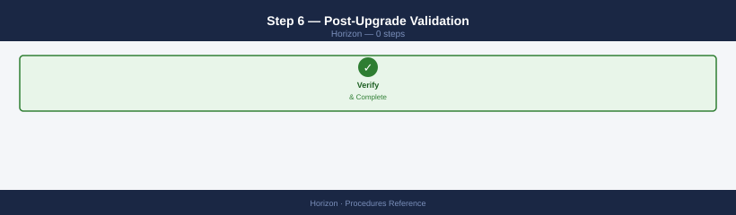

- [ ] All Connection Servers show green at the new version
- [ ] Test a desktop launch from Horizon Client — full session must connect successfully
- [ ] Verify app pools and RDS farms are operational
- [ ] Check Horizon Admin Console → **Events** — no new errors after upgrade

---

## Configure Power Policy on a Desktop Pool

Power policies control when Horizon powers VMs on and off to balance cost (fewer running VMs) against session startup latency. Misconfigured power policies cause users to wait minutes for desktops to boot.

1. Horizon Admin Console → **Catalog → Desktop Pools** → select the target pool → **Edit**
2. Navigate to **Provisioning Settings** (for full clone) or **Desktop Pool Settings** (for instant clone)
3. Set **Power Policy**:

| Policy | Behaviour | Best for |
|---|---|---|
| **Always on** | VMs remain powered on at all times | Low-latency requirement; cost not a concern |
| **Take no power action** | Horizon does not manage VM power; admin controls it | Manually managed pools |
| **Suspend** | VMs are suspended between sessions | Not recommended; slow resume for users |
| **Power off** | VMs are powered off between sessions | Shift-based environments; lower VM count required |

4. Set **Minimum number of ready (provisioned) desktops**: number of VMs to keep powered on and in a Ready state at all times (pre-warmed pool)
5. Set **Number of spare (powered on) machines**: additional VMs powered on but not yet assigned — absorbs sudden demand
6. Set **Peak hours** schedule if available: increase spare count during business hours, reduce overnight

!!! tip "For instant clone pools: set minimum ready desktops ≥ expected peak concurrent users × 1.1"
    Instant clones boot fast (~30 seconds) but "power off" between sessions means a brief wait. Setting minimum ready desktops to slightly above expected peak concurrent users ensures most users get an instant clone immediately without waiting for provisioning.

7. Save — changes apply to new sessions; existing sessions are unaffected

---

## Configure Cloud Pod Architecture (Multi-Site Federation)

Cloud Pod Architecture (CPA) joins multiple Horizon pods across sites into a federated Global Entitlements layer — users are assigned to a pod that has available desktops, enabling cross-site load balancing and DR failover.

### Prerequisites

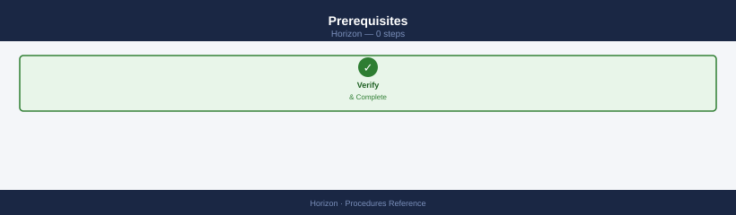

- Two or more Horizon pods, each with at least one Connection Server
- Connectivity between all Connection Servers in all pods (TCP 22389, TCP 8472, TCP 32111)
- All pods must have the same version of Horizon (within one minor version)

### Step 1 — Initialize CPA on the First Pod

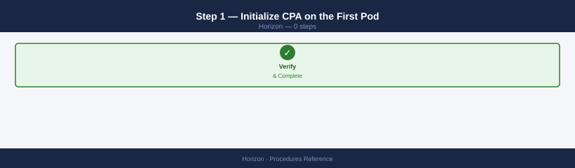

1. Horizon Admin Console on Pod 1 → **View Configuration → Cloud Pod Architecture → Initialize Cloud Pod Architecture**
2. This creates the federated LDAP layer and elects the first pod as the CPA primary

### Step 2 — Join the Second Pod to the Federation

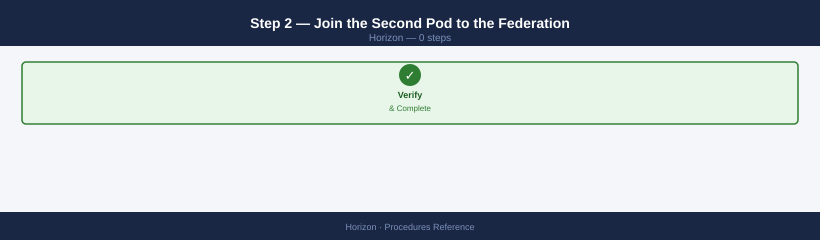

1. Horizon Admin Console on Pod 2 → **View Configuration → Cloud Pod Architecture → Join Cloud Pod Architecture**
2. Provide the FQDN of any Connection Server in Pod 1 and an admin credential
3. Confirm — Pod 2's Connection Servers join the federation and replicate global entitlement data

### Step 3 — Create a Global Entitlement

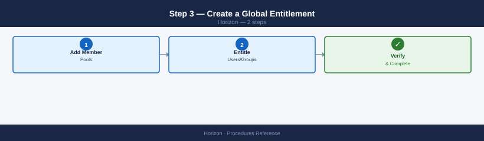

A Global Entitlement maps a user or group to desktops across all federated pods:

1. In either pod's Admin Console → **Catalog → Global Desktop Entitlements → Add**
2. Set the entitlement name (this is what users see in Horizon Client)
3. **Add Member Pools**: add the desktop pool from Pod 1 and the desktop pool from Pod 2
4. Set **User Assignment Policy**: Dedicated (same pod every time) or Floating (first available)
5. **Entitle Users/Groups** → save

### Step 4 — Configure Global Load Balancing DNS

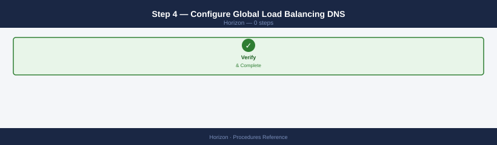

Users must connect to a single URL that resolves to a Connection Server in their nearest pod. Use a Global Server Load Balancer (GSLB) or manual DNS:

- `horizon.example.com` → GSLB VIP that routes to Pod 1 (Site A) or Pod 2 (Site B) based on latency
- Configure the Horizon URL to match: **Horizon Admin Console → View Configuration → Servers → Connection Server → edit → External URL**

### Step 5 — Test Global Entitlement

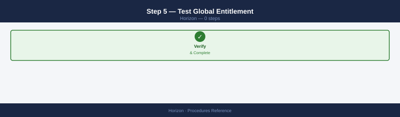

1. Connect to `horizon.example.com` from a client in Site A — confirm assignment from Pod 1 pool
2. Disconnect and reconnect from Site B — confirm assignment from Pod 2 pool
3. Simulate Pod 1 Connection Server unavailability — confirm Horizon Client automatically reconnects via Pod 2

---

## See also

- [VMware Horizon — Health Checks](../health-checks/)
- [VMware Horizon — Common Issues](../../troubleshooting/common-issues/)
- [Horizon — CLI Reference](../cli-reference/)

## Verify

- **Alarms:** vSphere Client → Home → Alarms — no new critical alarms after the operation
- **Events:** monitor the vCenter Events view for the affected object for 5 minutes
- **Health check:** run the morning health-check sequence for the affected product tier
