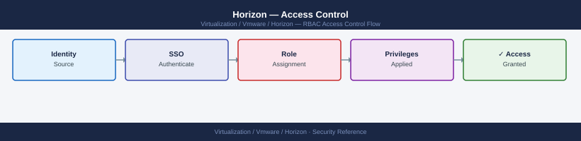

---
tags:
  - horizon
  - security
  - vmware
---
# Horizon — Access Control

<div class="kb-summary">
Access Control reference covering Pool-Level Admin Delegation, Desktop Pool Entitlements, App Volumes Permission Model, UAG Access Control, Service Account for vCenter and 1 more sections.

*Applies to: Horizon 8.x*
</div>


  RBAC: AD Groups → Entitlements → Pools

This limits the admin to only the pools in the assigned Access Group.

---

## Before you begin

- **Access:** vCenter Administrator role
- **Change management:** security changes require CAB approval in most environments
- **Rollback plan:** document current state before any security control change
- **Testing:** validate in a non-production environment first where possible

---

## Desktop Pool Entitlements

Control which users can access which pool:

```text
Horizon Console → Inventory → Desktops → [pool] → Entitlements
  Add: CORP\Horizon-Pool-Win10 (AD security group)
  Remove users or groups who should no longer have access
```

---

## App Volumes Permission Model

App Volumes AppStacks are assigned to:
- AD Users
- AD Groups (preferred)
- OUs
- Computers

```yaml
App Volumes Manager → AppStacks → [AppStack] → Assignments
  Add Assignment
    Type: Group
    Name: CORP\AppStack-AdobeReader
    Delivery: On Login
```

Writable volumes (user data disks) are assigned per-user or per-group with storage quotas.

---

## UAG Access Control

Restrict external UAG access by source IP (if applicable):

```text
UAG Admin UI (port 9443) → Advanced Settings → Source IP Rules
  Allow: <corporate VPN IP range>
  Deny: All other
```

DMZ firewall rules:
- Internet → UAG: TCP 443, TCP 8443 (Blast), TCP/UDP 4172 (PCoIP)
- UAG → Connection Server: TCP 443 only
- UAG → desktop VMs: TCP/UDP required for tunneled traffic (if tunnel is configured)

---

## Service Account for vCenter

Horizon Connection Server connects to vCenter with a dedicated service account:

```yaml
vCenter → Administration → Global Permissions → Add
  User: svc-horizon-vc@corp.local
  Role: Horizon Administrator (custom role with required privileges)
  Propagate: Yes
```

Required vCenter privileges for Horizon service account: documented in VMware Horizon documentation — covers virtual machine operations, datastore access, and folder management for the pools.

---

## Audit Log Access

```text
Horizon Console → Monitor → Events
  Filter by: Administrator, type: Configuration Change
```

For long-term audit storage, configure an Events database (SQL Server) during Connection Server setup. The embedded H2 database retains only limited history.

## See also

- [Horizon — Authentication](../authentication/)
- [Horizon — Hardening](../hardening/)
