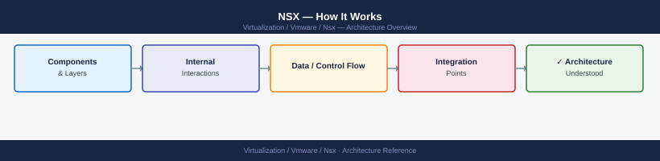
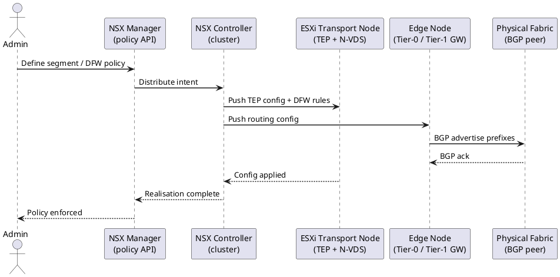
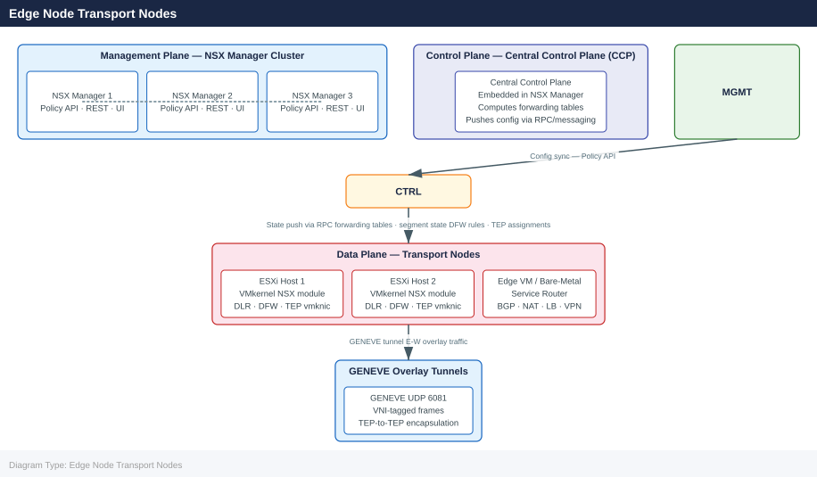

---
tags:
  - architecture
  - nsx
  - nsx-4
  - vmware
description: "How It Works reference covering API Surfaces, Transport Nodes, Geneve Encapsulation, Transport Zones, Gateway Architecture — T0 and T1 and 7 more sections."
---
# NSX — How It Works

<div class="kb-summary">
How It Works reference covering API Surfaces, Transport Nodes, Geneve Encapsulation, Transport Zones, Gateway Architecture — T0 and T1 and 7 more sections.

*Applies to: NSX-T 3.x · NSX 4.x*
</div>




## Control and Data Plane

### NSX 3-Plane Architecture



### Edge Node Transport Nodes

Edge nodes are NSX-deployed VMs or bare-metal appliances hosting north-south gateway functions.

| Interface | Name | Purpose |
|---|---|---|
| Management | eth0 | SSH, NSX Manager communication |
| Uplink 0 | fp-eth0 | Physical router-facing (BGP peer) |
| Uplink 1 | fp-eth1 | Second physical path (HA or ECMP) |
| Overlay | nsx-geneve | Geneve encap for overlay within Edge |

```bash
# SSH to Edge node
get interfaces
get service dataplane   # Confirm dataplane is running
get service router      # Confirm routing engine is running
```


```text title="Expected output"
Interface    IP Address      Status    MTU
eth0         192.168.1.45    up        1500
eth1         10.0.0.12       up        1500
eth2         169.254.1.1     up        1500
lo           127.0.0.1       up        65536

Service dataplane is running (PID: 2847, uptime: 18d 4h 22m)
Service router is running (PID: 2851, uptime: 18d 4h 21m)
```

!!! warning "Common errors"
    **`Command 'get interfaces' not found`** — Ensure you are logged into the NSX Edge node CLI (not the host shell); use `ssh admin@<edge-ip>` and verify the prompt shows the Edge device name.
    **`Service dataplane is stopped`** — Restart the dataplane service with `restart service dataplane` and verify routing connectivity is restored.
    **`Service router is stopped`** — Restart the router service with `restart service router` and check for configuration errors in the routing table with `get route`.
---

## Geneve Encapsulation

NSX uses Geneve (port 6081) — not VXLAN. The VNI identifies which logical segment a packet belongs to.

```text
[Outer ETH][Outer IP: TEP-src → TEP-dst][UDP 6081][Geneve VNI=5001][Inner ETH][Inner IP: VM-src → VM-dst][Payload]
```

Geneve carries extensible metadata (security group tags, service chain IDs) inline — not possible with VXLAN.

```bash
# Verify tunnel health from NSX Manager CLI
nsxcli
get tunnel status
get tunnel status <remote-tep-ip>
```


```text title="Expected output"
NSX CLI (version 3.2.1.0)
> get tunnel status
Tunnel Status Summary:
  Total Tunnels: 24
  Up: 23
  Down: 1
  Degraded: 0

Tunnel Details:
  TEP IP: 192.168.100.45 | Remote TEP: 192.168.100.46 | Status: UP | RTT: 2.3ms
  TEP IP: 192.168.100.45 | Remote TEP: 192.168.100.47 | Status: UP | RTT: 2.1ms
  TEP IP: 192.168.100.45 | Remote TEP: 192.168.100.48 | Status: DOWN | RTT: N/A
  TEP IP: 192.168.100.45 | Remote TEP: 192.168.100.49 | Status: UP | RTT: 2.4ms
  ...

> get tunnel status 192.168.100.48
Tunnel Status for Remote TEP 192.168.100.48:
  Status: DOWN
  Last State Change: 2024-01-15 14:32:18 UTC
  Failure Reason: Network unreachable
  Packets Sent: 1245
  Packets Received: 0
  Packet Loss: 100%
```

!!! warning "Common errors"
    **`command not found: nsxcli`** — Ensure you are logged into an NSX Manager appliance via SSH and that the NSX CLI is available in the PATH.
    **`Error: Invalid remote TEP IP format`** — Verify the remote TEP IP address is valid and reachable; use `get tunnel status` without arguments first to list all tunnel endpoints.
---

## Transport Zones

Transport Zones define which transport nodes can host VMs on a given segment.

| Zone Type | Encapsulation | Hosts |
|---|---|---|
| Overlay TZ | Geneve (VNI-based) | ESXi hosts + Edge nodes |
| VLAN TZ | 802.1Q VLAN tagging | Edge nodes (uplinks to physical routers) |

A transport node can participate in multiple zones. ESXi hosts typically join one overlay TZ; Edge nodes join both overlay and VLAN TZs.

---

## Gateway Architecture — T0 and T1

### Tier-1 Gateway (Distributed Routing)

T1 gateways perform routing at the ESXi host level — east-west traffic between subnets on the same T1 never leaves the host.

- Runs as a logical router instance on every ESXi transport node
- Connects to segments via downlink interfaces (default gateway for VMs)
- Connects upward to T0 via an auto-created internal transit link

Route advertisement from T1 to T0 (configure in T1 settings):

| Route Type | Advertises |
|---|---|
| `TIER1_CONNECTED` | Subnets of directly connected segments |
| `TIER1_STATIC` | Static routes on the T1 |
| `TIER1_LB_VIP` | Load balancer VIP addresses |
| `TIER1_NAT` | NAT'ed addresses |

### Tier-0 Gateway (North-South Routing)

T0 gateways run on Edge nodes and peer with physical routers via BGP or static routes.

| HA Mode | Behaviour |
|---|---|
| Active/Standby | One Edge node active; other is hot standby |
| Active/Active | ECMP across all Edge nodes; requires equal-cost uplinks |

```bash
# Check HA state from Edge node
get edge-cluster status
set edge-cluster failover   # Force failover from active Edge
```


```text title="Expected output"
Edge Cluster Status:
  Cluster ID: edge-cluster-01
  Active Node: esg-edge-01.lab.local (192.168.1.45)
  Standby Node: esg-edge-02.lab.local (192.168.1.46)
  HA Status: ACTIVE
  Last Heartbeat: 2024-01-15 14:32:18 UTC
  Failover Count: 2
  Health: HEALTHY

Initiating failover from esg-edge-01 to esg-edge-02...
Failover in progress: 45%
Failover completed successfully
New Active Node: esg-edge-02.lab.local (192.168.1.46)
Standby Node: esg-edge-01.lab.local (192.168.1.45)
```

!!! warning "Common errors"
    **`Error: edge-cluster-01 not found in inventory`** — Verify the edge cluster name matches your NSX deployment with `list edge-clusters`.
    **`Error: Cannot failover - standby node is UNHEALTHY`** — Check standby node connectivity and NSX agent status before attempting failover.
    **`Error: Failover already in progress`** — Wait for the current failover operation to complete before issuing another failover command.
### Routing Flow — VM to External

```text
VM → vNIC → DFW filter → T1 distributed instance (same ESXi host)
  → T0 Service Router (Edge node) → Physical router (BGP peer) → Internet
```

---

## Edge Cluster

Edge clusters group Edge nodes for HA and gateway service assignment. Any T0 or T1 with services (NAT, LB, VPN) must reference an Edge cluster.

| Size | vCPU | Memory | Throughput | Use |
|---|---|---|---|---|
| Small | 2 | 8 GB | ~5 Gbps | Lab only |
| Medium | 4 | 16 GB | ~40 Gbps | Dev/test |
| Large | 8 | 32 GB | ~100 Gbps | Production |
| Bare Metal | Physical | 256 GB | Line rate | High-throughput edge |

Edge VMs must be deployed on hosts **separate** from compute workload hosts.

---

## Distributed Firewall (DFW)

The DFW runs as a kernel-level stateful firewall at every VM vNIC on every ESXi host. Traffic is intercepted before it enters or leaves the vNIC — even between two VMs on the same host.

### DFW Categories (evaluated top to bottom)

| Category | Priority | Typical Use |
|---|---|---|
| Ethernet | 1 | L2 / MAC-based rules |
| Emergency | 2 | Break-glass blocks |
| Infrastructure | 3 | Management, backup, monitoring allow rules |
| Environment | 4 | Inter-zone segmentation (prod/dev, PCI boundary) |
| Application | 5 | Application-specific micro-segmentation |

Default rule (65535): **DROP** — do not change.

### DFW Inspection on ESXi Host

```bash
# List all DFW filters (one per VM vNIC)
summarize-dvfilter

# Show rules applied to a vNIC filter
vsipioctl getrules -f nic-12345-eth0-vmware-sfw.2

# Show rule hit counts
vsipioctl getstats -f nic-12345-eth0-vmware-sfw.2

# Show security groups (address sets) in use
vsipioctl getaddrsets -f nic-12345-eth0-vmware-sfw.2
```


```text title="Expected output"
DFW Filter Summary:
  Filter: nic-12345-eth0-vmware-sfw.2 (VM: prod-web-01, vNIC: eth0)
  Filter: nic-12346-eth1-vmware-sfw.2 (VM: prod-web-02, vNIC: eth1)
  Filter: nic-12347-eth0-vmware-sfw.2 (VM: prod-db-01, vNIC: eth0)
  Total filters: 3

Rules for nic-12345-eth0-vmware-sfw.2:
  Rule 1: ALLOW TCP 10.0.0.0/8 -> 0.0.0.0/0 port 443
  Rule 2: ALLOW TCP 10.0.0.0/8 -> 0.0.0.0/0 port 80
  Rule 3: DROP IP 0.0.0.0/0 -> 0.0.0.0/0

Statistics for nic-12345-eth0-vmware-sfw.2:
  Rule 1: 2847392 hits
  Rule 2: 1923847 hits
  Rule 3: 156 hits

Address Sets for nic-12345-eth0-vmware-sfw.2:
  SG-WEB-TIER: 10.20.1.0/24, 10.20.2.0/24
  SG-APP-TIER: 10.30.0.0/24
  SG-MGMT: 192.168.1.0/25
```

!!! warning "Common errors"
    **`vsipioctl: command not found`** — Ensure you are running this command on an NSX Manager or ESXi host with NSX Agent installed, not a standard Linux VM.
    **`Error: filter nic-12345-eth0-vmware-sfw.2 not found`** — Verify the vNIC filter name matches exactly using `summarize-dvfilter` first, as filter names are case-sensitive and include the full suffix.
    **`Permission denied`** — Run the commands with `sudo` or as root, as DFW filter inspection requires elevated privileges.
---

## Segments

Segments are NSX Layer 2 logical networks. VMs on the same segment communicate without crossing a gateway, regardless of physical host.

| Type | Backing | Use Case |
|---|---|---|
| Overlay | Geneve (VNI) | VM workload networking |
| VLAN-backed | Physical VLAN | Management networks, Edge uplinks |

```bash
# Find the VNI of a segment
nsxcli
get logical-switch <segment-id> | grep VNI
```


```text title="Expected output"
NSX CLI (build 20230915.1.0.21213456)
Connected to: nsx-manager-01.lab.local (192.168.1.50)

segment-id: segment-web-prod
  VNI: 5000
  name: web-production
  transport-zone: tz-overlay-01
  admin-state: UP
  replication-mode: mtep
```

!!! warning "Common errors"
    **`segment <segment-id> not found`** — Verify the segment ID exists with `get logical-switch list` and use the correct identifier from the output.
    **`error: not authenticated`** — Ensure you have logged into NSX Manager with valid credentials before running nsxcli commands.
---

## IPAM and DHCP

NSX includes built-in IPAM for IP pool management and a distributed DHCP server running on ESXi hosts — no dedicated DHCP VM required.

```bash
# List IP pools
curl -sk -u 'admin:password' \
  "https://<nsx-manager>/api/v1/pools/ip-pools"

# Check pool allocations
curl -sk -u 'admin:password' \
  "https://<nsx-manager>/api/v1/pools/ip-pools/<pool-id>/ip-allocations"
```


```text title="Expected output"
{
  "results": [
    {
      "id": "pool-1",
      "display_name": "Management-Pool",
      "subnets": [
        {
          "cidr": "10.20.0.0/24",
          "allocation_ranges": [
            {
              "start": "10.20.0.10",
              "end": "10.20.0.250"
            }
          ]
        }
      ],
      "resource_type": "IpAddressPool"
    },
    {
      "id": "pool-2",
      "display_name": "Workload-Pool",
      "subnets": [
        {
          "cidr": "172.16.0.0/22",
          "allocation_ranges": [
            {
              "start": "172.16.0.5",
              "end": "172.16.3.250"
            }
          ]
        }
      ],
      "resource_type": "IpAddressPool"
    }
  ],
  "result_count": 2
}

{
  "results": [
    {
      "ip_address": "10.20.0.15",
      "allocation_id": "alloc-8f2c9a1b",
      "owner": "nsx-edge-node-01"
    },
    {
      "ip_address": "10.20.0.16",
      "allocation_id": "alloc-7d4e5f2a",
      "owner": "nsx-edge-node-02"
    },
    {
      "ip_address": "10.20.0.17",
      "allocation_id": "alloc-6b1a3c9d",
      "owner": "logical-router-dr-01"
    }
  ],
  "result_count": 3
}
```

!!! warning "Common errors"
    **`curl: (60) SSL certificate problem: self signed certificate`** — Add `-k` flag to skip certificate verification (already present; if error persists, verify NSX Manager hostname resolves correctly).
    **`{"error_code":401,"error_message":"Invalid credentials"}`** — Verify the admin username and password are correct and the user has API access permissions in NSX Manager.
    **`curl: (7) Failed to connect to <nsx-manager> port 443: Connection refused`** — Confirm NSX Manager is running and reachable at the specified hostname/IP on port 443.
---

## VPN Services

NSX supports IPsec site-to-site VPN and L2 VPN on Edge nodes (T0 or T1 with Edge cluster).

```bash
# Check IPsec sessions from Edge CLI
get vpn ipsec session list

# Check L2 VPN sessions
get vpn l2vpn session list
```


```text title="Expected output"
IPsec Sessions:
Session ID: ipsec-session-01
Peer IP: 192.168.100.50
Status: UP
Encryption: AES-256
Authentication: SHA-256
Bytes In: 1,847,293,456
Bytes Out: 2,156,734,821
Uptime: 45 days 12:34:56

Session ID: ipsec-session-02
Peer IP: 10.50.20.15
Status: DOWN
Encryption: AES-128
Authentication: SHA-1
Bytes In: 0
Bytes Out: 0
Uptime: 0 days 00:00:00

L2 VPN Sessions:
Session ID: l2vpn-session-01
Peer IP: 172.16.50.100
Status: UP
Stretched Network: vlan-100
MTU: 1500
Packets In: 5,234,821
Packets Out: 4,987,654
Uptime: 23 days 08:15:22
```

!!! warning "Common errors"
    **`error: vpn command not found`** — Verify you are connected to the NSX Edge CLI with proper administrative credentials and that VPN services are enabled on the edge device.
    **`error: session list unavailable - vpn service not running`** — Restart the VPN service on the NSX Edge using `restart vpn` or check edge device connectivity and licensing.
| IKE Setting | Recommended Value |
|---|---|
| IKE Version | IKEv2 |
| Encryption | AES-256 |
| Digest | SHA-256 |
| DH Group | Group 14 or Group 20 |

---

## NSX-T vs NSX-V

| Feature | NSX-T (current) | NSX-V (end-of-life) |
|---|---|---|
| Overlay protocol | Geneve | VXLAN |
| Control plane | Embedded in Manager cluster | Separate Controller VMs |
| Multi-hypervisor | Yes (ESXi, KVM) | ESXi only |
| VDS requirement | vDS 7.0+ | vDS 6.x |
| EoL status | Supported | **End-of-life — no security patches** |

NSX-V migrations are critical — NSX-V receives no patches.

---

## Ports and Logs

| Use | Protocol | Port |
|---|---|---|
| NSX Manager UI / API | HTTPS | 443 |
| Geneve overlay encapsulation | UDP | 6081 |
| BFD (path failure detection) | UDP | 3784 |
| BGP (T0 to physical router) | TCP | 179 |
| NSX Manager SSH | TCP | 22 |
| Syslog (TLS) | TCP | 6514 |

**Key log paths (NSX Manager):**

- `/var/log/vmware/nsx-manager/` — manager and policy service logs
- `/var/log/vmware/nsx-manager/audit.log` — admin actions, role changes
- `/var/log/vmware/nsx-controller/` — control plane logs

**Edge node logs (SSH):**

```bash
get log-file syslog follow   # live tail
get log-file auth.log        # authentication events
```


```text title="Expected output"
2024-01-15T14:32:18.456Z [NSX-MANAGER-01] nsx-manager: INFO: API request from 192.168.1.45 - GET /api/v1/transport-zones
2024-01-15T14:32:19.123Z [NSX-MANAGER-01] nsx-manager: DEBUG: TLS handshake completed with edge-node-03.lab.local
2024-01-15T14:32:20.789Z [NSX-MANAGER-01] nsx-manager: INFO: Fabric node heartbeat received from 10.0.50.12
2024-01-15T14:32:21.456Z [NSX-MANAGER-01] nsx-manager: WARNING: Connection timeout to controller-02 (attempt 2/3)
2024-01-15T14:32:22.234Z [NSX-MANAGER-01] nsx-manager: INFO: Logical switch ls-prod-01 status: UP
(following syslog — press Ctrl+C to exit)

Jan 15 14:32:15 nsx-manager-01 sshd[4521]: Accepted publickey for admin from 192.168.1.100 port 54321 ssh2: RSA SHA256:aBcD1234efGH5678ijKL9012mnOP3456qrST7890uv
Jan 15 14:32:18 nsx-manager-01 sudo: admin : TTY=pts/0 ; PWD=/home/admin ; USER=root ; COMMAND=/opt/vmware/nsx/bin/nsxcli
Jan 15 14:32:22 nsx-manager-01 sshd[4523]: Failed password for invalid user operator from 203.0.113.55 port 49876 ssh2
Jan 15 14:32:25 nsx-manager-01 sudo: admin : TTY=pts/0 ; PWD=/home/admin ; USER=root ; COMMAND=/opt/vmware/nsx/bin/get log-file auth.log
Jan 15 14:32:27 nsx-manager-01 sshd[4525]: Accepted publickey for root from 192.168.1.100 port 54322 ssh2: ECDSA SHA256:xYz9876aBcD5432efGH1098ijKL7654mnOP3210qrST
```

!!! warning "Common errors"
    **`Error: log file not found or insufficient permissions`** — Verify the user has admin/root privileges and the log file path exists with `ls -la /var/log/syslog`.
    **`Error: follow mode not supported on this platform`** — Remove the `follow` keyword and use `get log-file syslog | tail -f` instead for live tailing.
## See also

- [NSX — Design Standards](../design-standards/)
- [NSX — Deploy](../../deploy/)
- [NSX — Integrations](../integrations/)
