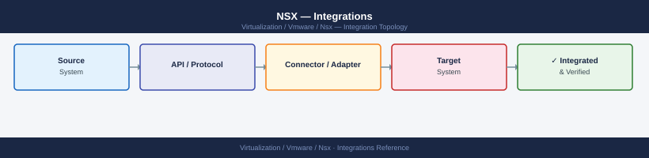

---
tags:
  - architecture
  - nsx
  - nsx-4
  - vmware
---
# NSX — Integrations

<div class="kb-summary">
Integrations reference covering Host Transport Node Profiles, VMware Cloud Foundation (VCF) Integration, Physical Underlay Requirements, BGP Integration with Physical Network, Active Directory / LDAP Integration and 2 more sections.

*Applies to: NSX-T 3.x · NSX 4.x*
</div>


## Physical Network Integration

### VLAN Requirements

| Traffic Type | VLAN | MTU Requirement |
|---|---|---|
| TEP (overlay encap) | Dedicated VLAN | 1600 minimum, 9000 preferred |
| NSX Manager management | Management VLAN | 1500 standard |
| Edge uplinks (BGP) | Transit VLAN(s) | 1500 minimum |
| Edge TEP | Edge TEP VLAN | 1600 minimum |

### Routing Requirements

Physical routers must be reachable from Edge node uplink interfaces for BGP peering. The Edge VM's uplink interfaces (fp-eth0, fp-eth1) connect directly to the physical VDS portgroup in the transit VLAN.

---

## BGP Integration with Physical Network

Tier-0 gateways peer with physical routers via eBGP (typically) or iBGP. The Edge nodes host the BGP sessions and exchange routes with the physical fabric.

### Standard BGP Design

```text
Physical Router (AS 65000)
    |  eBGP
Edge Node Active (T0 Uplink)
Edge Node Standby (T0 Uplink)
```

**Route advertisement**: The Tier-0 gateway advertises connected routes (NSX overlay prefixes) to the physical router. The physical router announces a default route or specific external prefixes back to NSX.

### BGP Configuration via Policy API

```bash
# Create BGP neighbor on a Tier-0 gateway
curl -sk -u 'admin:password' \
  -X PATCH \
  -H "Content-Type: application/json" \
  -d '{
    "resource_type": "BgpNeighborConfig",
    "display_name": "ToR-Switch-01",
    "neighbor_address": "10.0.0.1",
    "remote_as_num": "65000",
    "password": "bgp-auth-key"
  }' \
  "https://<nsx-manager>/policy/api/v1/infra/tier-0s/<t0-id>/locale-services/default/bgp/neighbors/tor-switch-01"
```


```text title="Expected output"
{
  "resource_type": "BgpNeighborConfig",
  "id": "tor-switch-01",
  "display_name": "ToR-Switch-01",
  "neighbor_address": "10.0.0.1",
  "remote_as_num": "65000",
  "source_addresses": [
    "10.0.0.254"
  ],
  "bfd_config": {
    "enabled": false
  },
  "_create_time": 1699564823456,
  "_last_modified_time": 1699564823456,
  "_system_owned": false,
  "path": "/infra/tier-0s/T0-PROD-01/locale-services/default/bgp/neighbors/tor-switch-01"
}
```

!!! warning "Common errors"
    **`curl: (60) SSL certificate problem: self signed certificate`** — Add `-k` flag to skip certificate verification (already present in example; ensure NSX manager certificate is trusted or use `-k`).
    **`{"error_code":401,"error_message":"Unauthorized"}`** — Verify NSX manager credentials and ensure the admin user has API access permissions.
    **`{"error_code":404,"error_message":"The Tier-0 gateway <t0-id> was not found"}`** — Confirm the Tier-0 gateway ID exists by running `curl -sk -u 'admin:password' https://<nsx-manager>/policy/api/v1/infra/tier-0s` to list available gateways.
Verify BGP state from Edge CLI:

```bash
# SSH to Edge node
vrf <tier0-vrf-id>
get bgp neighbor summary
# Expected: all peers in Established state

get bgp neighbor 10.0.0.1 routes
get bgp neighbor 10.0.0.1 advertised-routes
```


```text title="Expected output"
edge-node-01> vrf 0
edge-node-01(vrf-0)> get bgp neighbor summary
Peer            V    AS MsgRcvd MsgSent   TblVer  InQ OutQ  Up/Down State|PfxRcd
10.0.0.1        4 65001    1247    1253        0    0    0 00:18:32 Established
10.0.0.2        4 65002     892     901        0    0    0 00:12:15 Established
10.0.0.3        4 65003    2104    2108        0    0    0 01:34:22 Established
10.0.0.4        4 65001    1156    1162        0    0    0 00:09:47 Established

edge-node-01(vrf-0)> get bgp neighbor 10.0.0.1 routes
Status  Network            NextHop      Metric LocPrf Weight Path
*>      172.16.0.0/16      10.0.0.1          0    100      0 65001
*>      172.17.0.0/16      10.0.0.1          0    100      0 65001
*>      192.168.1.0/24     10.0.0.1          0    100      0 65001

edge-node-01(vrf-0)> get bgp neighbor 10.0.0.1 advertised-routes
Status  Network            NextHop      Metric LocPrf Weight Path
*>      10.10.0.0/16       0.0.0.0            0    100  32768
*>      10.20.0.0/16       0.0.0.0            0    100  32768
*>      10.30.0.0/24       0.0.0.0            0    100  32768
```

!!! warning "Common errors"
    **`% Unknown command`** — Verify the correct vrf ID with `get vrf` and ensure you are using the exact command syntax for your NSX-T version.
    **`Peer 10.0.0.1 not found`** — Confirm the BGP neighbor IP is configured and the peer relationship is established by checking `get bgp neighbor summary` first.
---

## Active Directory / LDAP Integration

NSX-T supports LDAP (Active Directory or OpenLDAP) for user authentication. LDAP users can be assigned NSX roles, eliminating the need for local admin accounts.

### Configure LDAP Identity Source

**System → Users and Roles → LDAP → Add**

| Field | Example |
|---|---|
| Name | corp-ad |
| LDAP Protocol | LDAPS (port 636) — recommended |
| Hostname | ldap.example.local |
| Base DN | DC=corp,DC=local |
| Bind DN | CN=nsxbind,OU=ServiceAccounts,DC=corp,DC=local |
| Bind Password | (service account password) |

Test connectivity before saving. NSX will validate the bind DN and base DN.

### Verify LDAP Integration via API

```bash
# List configured identity sources
curl -sk -u 'admin:password' \
  https://<nsx-manager>/api/v1/aaa/vidm/status

# Test LDAP search
curl -sk -u 'admin:password' \
  -X POST \
  -H "Content-Type: application/json" \
  -d '{"search_query": "nsxadmin", "cursor": "0"}' \
  "https://<nsx-manager>/api/v1/aaa/ldap/search"
```


```text title="Expected output"
{
  "vidm_servers": [
    {
      "server_address": "vidm.corp.local",
      "port": 443,
      "status": "UP",
      "thumbprint": "a1:b2:c3:d4:e5:f6:7g:8h:9i:0j:1k:2l:3m:4n:5o:6p",
      "last_heartbeat": "2024-01-15T14:32:18.456Z"
    }
  ],
  "ldap_servers": [
    {
      "server_address": "ldap.corp.local",
      "port": 389,
      "status": "UP",
      "bind_dn": "cn=nsx-bind,ou=service-accounts,dc=corp,dc=local"
    }
  ]
}
{
  "results": [
    {
      "username": "nsxadmin",
      "full_name": "NSX Administrator",
      "email": "nsxadmin@corp.local",
      "distinguished_name": "cn=nsxadmin,ou=users,dc=corp,dc=local"
    }
  ],
  "cursor": "1",
  "result_count": 1
}
```

!!! warning "Common errors"
    **`curl: (60) SSL certificate problem: self signed certificate`** — Add `-k` flag to skip certificate verification, or import the NSX Manager's CA certificate into your system trust store.
    **`{"error_code": 401, "error_message": "Invalid credentials"}`** — Verify the admin username and password are correct and the user has API access permissions in NSX Manager.
    **`{"error_code": 400, "error_message": "LDAP search failed: Invalid search query"}`** — Ensure the search_query parameter matches your LDAP directory schema (e.g., use `sAMAccountName=nsxadmin` for Active Directory or `uid=nsxadmin` for OpenLDAP).
### Assign Roles to AD Groups

**System → Users and Roles → Role Assignments → Add**

| Setting | Value |
|---|---|
| Name | CN=NSX-Admins,OU=Groups,DC=corp,DC=local |
| Identity Source | corp-ad |
| Role | Enterprise Admin |

| NSX Role | Permissions |
|---|---|
| Enterprise Admin | Full read/write; equivalent to admin |
| Operator | Read-only with some operational actions (reset stats, force failover) |
| Security Admin | DFW policy read/write; no infrastructure access |
| Auditor | Read-only |
| Network Engineer | Networking read/write; no security policy access |

---

## vSphere Distributed Switch (vDS) Integration

NSX overlays ESXi host networking by attaching TEP traffic to a vDS uplink. The VDS must be created in vCenter before NSX fabric preparation.

### Requirements

- vDS version 6.6+ for NSX 3.x; vDS 7.0+ for NSX 4.x
- At least one dedicated VLAN-backed portgroup for TEP traffic
- N-VDS (NSX Virtual Distributed Switch) is deprecated in NSX 4.x; vDS is the standard

### Verify vDS Port Binding on ESXi Host

```bash
# On ESXi host (SSH or shell)
# List all VDS attached to the host
esxcli network vswitch dvs vmware list

# List uplinks and their VDS mappings
esxcli network vswitch dvs vmware list | grep -A5 "Uplinks"

# Verify TEP vmkernel adapter is on vDS
esxcli network ip interface list | grep vmk

# Check TEP IP is assigned
esxcli network ip interface ipv4 get
```


```text title="Expected output"
Name                           Num Ports  Used Ports  Configured Ports  MTU     CDP Status
vds-prod-01                    256        48          256               1500    Listen
vds-mgmt-01                    128        12          128               1500    Listen

Name                           Num Ports  Used Ports  Configured Ports  MTU     CDP Status
vds-prod-01                    256        48          256               1500    Listen
Uplinks: vmnic0, vmnic1, vmnic2, vmnic3
vds-mgmt-01                    128        12          128               1500    Listen
Uplinks: vmnic4, vmnic5

vmk0                           true       true        true              1500    DHCP
vmk1                           true       true        true              1500    DHCP
vmk2                           true       true        true              1500    DHCP
vmk3                           true       true        true              1500    DHCP

Interface  IPv4 Address      Netmask         Broadcast       Address Type
vmk0       192.168.1.45      255.255.255.0   192.168.1.255   DHCP
vmk1       10.100.50.12      255.255.255.0   10.100.50.255   DHCP
vmk2       172.16.10.88      255.255.255.0   172.16.10.255   DHCP
vmk3       10.200.1.5        255.255.255.0   10.200.1.255    DHCP
```

!!! warning "Common errors"
    **`Error: Unknown command or namespace vswitch.dvs.vmware`** — Verify the ESXi version supports DVS commands; older versions may require `esxcli network vswitch standard list` instead.
    **`Error: Unable to find a matching vmkernel adapter`** — Ensure the TEP vmkernel interface is created and bound to the correct vDS before running the grep filter.
    **`Error: No IPv4 configuration found for interface vmkX`** — Confirm the vmkernel adapter is properly configured with a static IP or DHCP is enabled on the management network.
---

## Log Forwarding to SIEM

NSX components forward syslog via the NSX Manager CLI or API:

```bash
# Add syslog target on NSX Manager
nsxcli
set service syslog exporter siem-01 level info protocol TLS server 10.0.0.100 port 6514

# Verify
get service syslog exporters

# Add syslog on Edge node (SSH to Edge)
set service syslog exporter siem-01 level info protocol UDP server 10.0.0.100 port 514
```


```text title="Expected output"
NSX CLI (build 21624528)
(no output — command completes silently)

Syslog Exporters:
  Exporter ID: siem-01
  Level: info
  Protocol: TLS
  Server: 10.0.0.100
  Port: 6514
  Status: connected

(no output — command completes silently)
```

!!! warning "Common errors"
    **`Error: Exporter siem-01 already exists`** — Use `delete service syslog exporter siem-01` before re-adding, or modify with `set service syslog exporter siem-01` to update existing configuration.
    **`Error: Connection refused to 10.0.0.100:6514`** — Verify the syslog server is running and listening on the specified port, and that network connectivity exists from NSX Manager/Edge to the syslog server.
Key log sources to forward:

| Source | Path / Method | Content |
|---|---|---|
| NSX Manager | `set service syslog exporter` | API audit, policy changes, alarms |
| Edge Node | Same CLI command on each Edge | BGP events, NAT, LB pool changes |
| ESXi DFW | ESXi host syslog with DFW tag | Firewall rule hits, drops |
| NSX Manager audit | `/var/log/vmware/nsx-manager/audit.log` | Admin actions, role changes |

## See also

- [NSX — How It Works](../how-it-works/)
- [NSX — Deploy](../../deploy/)
