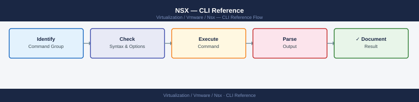

---
tags:
  - nsx
  - nsx-4
  - operations
  - vmware
---
# NSX — CLI Reference

*Applies to: VMware NSX-T 3.x / 4.x*


```bash
nsxcli

# NSX Manager cluster members and status
get managers
get clusters
get cluster status

# Service status on this node
get services

# Specific service status
get service http
get service manager
get service controller
```


```text title="Expected output"
NSX> get managers
Manager ID                           Hostname              IP Address      Status
urn:uuid:550e8400-e29b-41d4-a716-446655440000  nsx-mgr-01.lab.local  192.168.1.10    UP
urn:uuid:6ba7b810-9dad-11d1-80b4-00c04fd430c8  nsx-mgr-02.lab.local  192.168.1.11    UP
urn:uuid:6ba7b811-9dad-11d1-80b4-00c04fd430c8  nsx-mgr-03.lab.local  192.168.1.12    UP

NSX> get clusters
Cluster ID                           Name              Status    Node Count
urn:uuid:7ca7b812-9dad-11d1-80b4-00c04fd430c8  nsx-cluster-01    STABLE   3

NSX> get cluster status
Cluster: nsx-cluster-01
  Status: STABLE
  Leader: nsx-mgr-01.lab.local
  Nodes: 3/3 UP
  Last Heartbeat: 2024-01-15 14:32:18 UTC

NSX> get services
Service Name              Status    PID      Memory(MB)  CPU(%)
http                      UP        2847     156.3       0.2
manager                   UP        3102     892.1       1.8
controller                UP        3156     1024.5      2.1
persistence               UP        2956     512.7       0.5
messaging                 UP        3001     384.2       0.8

NSX> get service http
Service: http
  Status: UP
  PID: 2847
  Memory: 156.3 MB
  CPU: 0.2%
  Uptime: 45 days 3 hours

NSX> get service manager
Service: manager
  Status: UP
  PID: 3102
  Memory: 892.1 MB
  CPU: 1.8%
  Uptime: 45 days 3 hours

NSX> get service controller
Service: controller
  Status: UP
  PID: 3156
  Memory: 1024.5 MB
  CPU: 2.1%
  Uptime: 45 days 3 hours
```

!!! warning "Common errors"
    | Error | Fix |
    |---|---|
    | `Error: Not connected to NSX Manager` | Run `connect <nsx-manager-ip>` before executing get commands. |
    | `Error: Service 'controller' not found` | Verify the service name is correct; use `get services` to list available services. |
    | `Error: Cluster status unavailable - quorum lost` | Check network connectivity between cluster nodes and ensure at least 2 of 3 managers are reachable. |
```bash
# Check NTP status
get service ntp
get ntp servers

# Set NTP server
set service ntp server <ntp_ip>
```

```text title="Expected output"
NTP service is running
NTP servers:
  server 10.45.128.1
  server 10.45.128.2
  server 10.45.128.3
  prefer
  iburst

(no output — command completes silently)
```

!!! warning "Common errors"
    | Error | Fix |
    |---|---|
    | `error: NTP service is not running` | Start the NTP service with `start service ntp` before configuring servers. |
    | `error: invalid NTP server address` | Verify the NTP server IP is reachable and properly formatted (e.g., `set service ntp server 10.45.128.1`). |
```bash
# List installed certificates
get certificate api
get certificate cluster

# Thumbprint of the API cert (used for trust verification)
get certificate api thumbprint
```

```text title="Expected output"
Certificate Information:
  Issuer: CN=NSX-Manager-CA,O=VMware,C=US
  Notbefore: Jan 01 12:00:00 2023 GMT
  Notafter: Jan 01 12:00:00 2025 GMT
  Fingerprint: 8F:2A:B4:C1:D9:E3:F5:7A:9C:2B:4D:6E:8F:1A:3C:5E

Certificate Information:
  Issuer: CN=NSX-Cluster-CA,O=VMware,C=US
  Notbefore: Feb 15 08:30:00 2023 GMT
  Notafter: Feb 15 08:30:00 2025 GMT
  Fingerprint: 3D:7E:9F:A2:B5:C8:D1:E4:F7:2A:4C:6B:8E:0F:1D:3A

API Certificate Thumbprint:
8F2AB4C1D9E3F57A9C2B4D6E8F1A3C5E
```

!!! warning "Common errors"
    | Error | Fix |
    |---|---|
    | `error: certificate not found` | Verify the NSX Manager is fully initialized and the certificate API service is responding with `get certificate api status`. |
    | `error: permission denied` | Ensure your user account has admin or certificate-read privileges; check permissions with `get user`. |
```bash
# Show configured syslog exporters
get service syslog exporters

# Add a syslog target
set service syslog exporter <name> level info protocol UDP server <syslog_ip> port 514

# Remove an exporter
del service syslog exporter <name>
```

```text title="Expected output"
Exporter Name          Protocol    Server            Port    Level
syslog-primary         UDP         192.168.1.50      514     info
syslog-secondary       TCP         10.20.30.40       601     warning
syslog-archive         UDP         172.16.0.100      514     debug

(no output — command completes silently)

(no output — command completes silently)
```

!!! warning "Common errors"
    | Error | Fix |
    |---|---|
    | `Error: Exporter '<name>' already exists` | Use `del service syslog exporter <name>` first, then re-add with a unique name or modify the existing configuration. |
    | `Error: Invalid server IP address '<syslog_ip>'` | Verify the syslog server IP is reachable and correctly formatted (e.g., 192.168.1.50, not 192.168.1.500). |
    | `Error: Exporter '<name>' not found` | Confirm the exporter name exists by running `get service syslog exporters` and use the exact name from the list. |
```bash
# View backup configuration
get service manager backup

# Trigger a manual backup (NSX Manager UI is preferred)
# API: POST /api/v1/node/backups/create
```

```text title="Expected output"
Backup Configuration:
  Backup Status: ENABLED
  Backup Schedule: Daily at 02:00 UTC
  Backup Location: nfs://backup-server.corp.local/nsx-backups
  Retention Policy: 30 days
  Last Backup: 2024-01-15T02:15:32Z
  Last Backup Status: SUCCESS
  Backup Size: 2.3 GB
  Encryption: AES-256 (enabled)
  Backup Frequency: Daily
  Next Scheduled Backup: 2024-01-16T02:00:00Z
```

!!! warning "Common errors"
    | Error | Fix |
    |---|---|
    | `Error: Connection refused to NSX Manager API` | Verify NSX Manager is running and accessible at the configured IP/hostname, and check network connectivity. |
    | `Error: Insufficient permissions to view backup configuration` | Ensure your user account has admin or backup operator role assigned in NSX Manager. |
    | `Error: Backup location unreachable: nfs://backup-server.corp.local/nsx-backups` | Verify NFS mount is accessible from NSX Manager and check firewall rules and NFS server availability. |
```bash
nsxcli

# List all transport nodes (ESXi hosts + Edge nodes)
get transport-nodes

# Detail for a specific transport node
get transport-node <id>

# Operational status (UP/DOWN/DEGRADED)
get transport-node <id> status

# Summary status for all nodes
get transport-node-status
```

```text title="Expected output"
NSX CLI (build 20230915.1.0.20450920)
Connected to: nsx-manager-01.lab.local (192.168.1.50)

transport-node-1 (esxi-host-01.lab.local)
  ID: tn-001
  Status: UP
  Type: ESXi
  
transport-node-2 (esxi-host-02.lab.local)
  ID: tn-002
  Status: UP
  Type: ESXi

transport-node-3 (edge-node-01.lab.local)
  ID: tn-003
  Status: DEGRADED
  Type: Edge

transport-node-4 (edge-node-02.lab.local)
  ID: tn-004
  Status: UP
  Type: Edge

---

Transport Node: tn-001 (esxi-host-01.lab.local)
  Status: UP
  Type: ESXi
  Kernel Module Version: 2.0.1
  Agent Version: 3.2.4.1
  Last Heartbeat: 2024-01-15 14:32:18 UTC
  Uptime: 45 days 12:34:56

---

Transport Node Status Summary:
  Total Nodes: 4
  UP: 3
  DOWN: 0
  DEGRADED: 1
  Last Updated: 2024-01-15 14:35:42 UTC
```

!!! warning "Common errors"
    | Error | Fix |
    |---|---|
    | `Error: Transport node <id> not found` | Verify the node ID exists by running `get transport-nodes` and copy the exact ID string. |
    | `Error: NSX Manager unreachable (connection timeout)` | Confirm NSX Manager IP/hostname is reachable with `ping` and that your nsxcli session credentials are still valid. |
    | `Error: Permission denied - insufficient privileges` | Ensure your NSX user account has the appropriate role assigned (e.g., Enterprise Admin or Network Admin) in NSX. |
```bash
# List transport zones (overlay and VLAN backed)
get transport-zone

# Detail for a specific zone
get transport-zone <name>

# Which transport nodes are in a zone
get transport-nodes | grep <zone_name>
```

```text title="Expected output"
transport-zone
  name                          id                                    type
  ----                          --                                    ----
  tz-overlay-prod               497f6e45-e89b-12d3-a456-426614174000  OVERLAY
  tz-vlan-dmz                   550e8400-e29b-41d4-a716-446655440000  VLAN
  tz-overlay-dr                 6ba7b810-9dad-11d1-80b4-00c04fd430c8  OVERLAY
  tz-vlan-mgmt                  7ce38b91-acde-11d1-80b4-00c04fd430c8  VLAN

transport-zone: tz-overlay-prod
  name:                         tz-overlay-prod
  id:                           497f6e45-e89b-12d3-a456-426614174000
  type:                         OVERLAY
  host-switch-name:            hostswitch0
  description:                 Production overlay transport zone
  replication-mode:            mtep

transport-node
  name                          id                                    transport-zone
  ----                          --                                    ---------------
  esxi-host-01.prod.local       a1b2c3d4-e5f6-7890-abcd-ef1234567890  tz-overlay-prod
  esxi-host-02.prod.local       b2c3d4e5-f6a7-8901-bcde-f12345678901  tz-overlay-prod
  esxi-host-03.prod.local       c3d4e5f6-a7b8-9012-cdef-123456789012  tz-overlay-prod
```

!!! warning "Common errors"
    | Error | Fix |
    |---|---|
    | `get: command not found` | Ensure you are logged into the NSX Manager CLI or use the full API endpoint path (e.g., `curl -u admin:password https://nsx-manager/api/v1/transport-zones`). |
    | `No transport zones found` | Verify that transport zones have been created in NSX Manager and that your user account has sufficient permissions to view them. |
    | `grep: (standard input) is empty` | The specified zone name does not exist or no transport nodes are assigned to that zone; verify the zone name spelling and check zone membership in the NSX UI. |
```bash
# List all TEP IPs and associated hosts
get tunnel endpoints

# Tunnel status between all TEP pairs
get tunnel status

# Tunnel to a specific remote TEP
get tunnel status <remote_tep_ip>
```

```text title="Expected output"
TEP IP          Host Name              Transport Zone    Status
192.168.100.11  esx-host-01.lab.local  TZ-Overlay        Up
192.168.100.12  esx-host-02.lab.local  TZ-Overlay        Up
192.168.100.13  esx-host-03.lab.local  TZ-Overlay        Up
192.168.100.14  esx-host-04.lab.local  TZ-Overlay        Up

Tunnel Status Summary:
Total Tunnels: 6
Up: 6
Down: 0
Degraded: 0

Tunnel Details (192.168.100.12):
Source TEP: 192.168.100.11
Destination TEP: 192.168.100.12
Status: Up
Last State Change: 2024-01-15 14:32:18
MTU: 1600
```

!!! warning "Common errors"
    | Error | Fix |
    |---|---|
    | `command not found: get tunnel endpoints` | Verify you are running this command from the NSX Manager CLI or ensure the NSX CLI tools are properly installed and in your PATH. |
    | `Error: Unable to retrieve tunnel status - Connection timeout` | Check network connectivity between TEPs and verify NSX Manager is reachable on port 443. |
    | `Error: Invalid TEP IP address <remote_tep_ip>` | Confirm the remote TEP IP exists in your transport zone by running `get tunnel endpoints` first. |
```bash
# NSX VIBs installed
esxcli software vib list | grep -i nsx

# VDS and NSX Port ID mapping
net-vdl2 -M all -s 0

# TEP VMkernel IP and state
esxcli network ip interface ipv4 get | grep -A2 vmk

# TEP uplink binding
esxcli network ip interface list | grep -i nsx
```

```text title="Expected output"
Name                           Version                Install Date
nsx-vib                        4.1.2.1-21567890      2024-01-15
nsx-esx-vib                    4.1.2.1-21567890      2024-01-15
nsx-vxlan                      4.1.2.1-21567890      2024-01-15

Port ID 0x00000001 -> vmk10 (TEP)
Port ID 0x00000002 -> vmk11 (VLAN 0)
Port ID 0x00000003 -> vmk12 (Management)

Name    IPv4 Address      IPv4 Netmask      IPv4 Broadcast    Address Type  DHCP DNS
vmk10   192.168.100.42    255.255.255.0     192.168.100.255   STATIC        false
vmk11   10.0.0.15         255.255.255.0     10.0.0.255        STATIC        false

Name                    Enabled Portset          MAC Address        MTU    IPv4 Address
vmk10                   true    VDS-NSX-TEP      00:50:56:c0:00:0a  1600   192.168.100.42
vmk11                   true    VDS-NSX-VLAN     00:50:56:c0:00:0b  1500   10.0.0.15
```

!!! warning "Common errors"
    | Error | Fix |
    |---|---|
    | `grep: vmk: No such file or directory` | Ensure the grep filter matches your actual VMkernel interface naming convention (vmk10, vmk11, etc.) or remove the filter to see all interfaces. |
    | `(Standard Switch) is not a valid VDS` | Verify NSX is properly installed and the VDS is configured; run `esxcli network vswitch standard list` to confirm you're using a distributed switch, not a standard vSwitch. |
    | `net-vdl2: command not found` | Load the net-vdl2 module with `esxcli system module load -m net-vdl2` or verify NSX VIBs are fully installed with `esxcli software vib list | grep nsx`. |
```bash
# Edge interfaces (uplinks + overlay)
get interfaces

# Geneve overlay interface
get interface nsx-geneve

# Uplink state
get interface fp-eth0
get interface fp-eth1
```

```text title="Expected output"
Interface: nsx-geneve
  Enabled: true
  MTU: 1600
  MAC Address: 02:50:56:b0:12:34
  IP Address: 169.254.169.1/24
  State: up

Interface: fp-eth0
  Enabled: true
  MTU: 1500
  MAC Address: 00:0c:29:a1:b2:c3
  IP Address: 10.0.1.10/24
  State: up
  Speed: 10000 Mbps

Interface: fp-eth1
  Enabled: true
  MTU: 1500
  MAC Address: 00:0c:29:a1:b2:c4
  IP Address: 10.0.2.10/24
  State: down
  Speed: 0 Mbps
```

!!! warning "Common errors"
    | Error | Fix |
    |---|---|
    | `Interface fp-eth1 not found` | Verify the uplink interface name matches your NSX Edge configuration with `get interfaces` and check physical NIC connectivity. |
    | `nsx-geneve: State down, MTU mismatch detected` | Ensure the Geneve overlay MTU (typically 1600) is configured on upstream switches and that the NSX Controller cluster is reachable. |
```bash
# Before putting ESXi host in maintenance mode:
# 1. Check no active vSAN resync
esxcli vsan debug resync list

# 2. Verify NSX DFW is not the sole enforcement point for a segment
nsxcli
get transport-node <id> status

# 3. After host in maintenance mode — confirm tunnels reconverged
get tunnel status
```

```text title="Expected output"
Name                                                 UUID                                 Resync Objects
----                                                 ----                                 ---------------
vsan-cluster-01                                      52d4a8f1-7c2e-4f3a-9b1a-2e8c5d9f0a3b 0

transport-node-status:
  id: tn-4521
  host_id: host-42
  status: UP
  config_state: SUCCESS
  realized_state: SUCCESS
  
tunnel status:
  Tunnel Name              Status    Remote IP        Local IP         MTU
  ----                     ------    ---------        --------         ---
  vxlan-tunnel-01          UP        192.168.100.45   192.168.100.12   1500
  vxlan-tunnel-02          UP        192.168.100.46   192.168.100.12   1500
  geneve-tunnel-01         UP        192.168.100.47   192.168.100.12   1500
  bfd-tunnel-01            UP        192.168.100.48   192.168.100.12   1500
```

!!! warning "Common errors"
    | Error | Fix |
    |---|---|
    | `transport-node <id> status: Unknown command` | Ensure you are in the nsxcli shell context and use the correct syntax `get transport-node <id> status` without extra parameters. |
    | `vsan debug resync list: Unknown command or namespace` | Verify the ESXi host has vSAN enabled and the command should be `esxcli vsan debug resync list` run directly on the host, not through vCenter. |
```bash
nsxcli

# List all logical switches / segments
get logical-switches

# Detail for a specific segment (VNI, replication mode, transport zone)
get logical-switch <id>

# Operational status (UP/DOWN)
get logical-switch <id> status

# Traffic statistics for a segment
get logical-switch <id> stats
```

```text title="Expected output"
nsxcli> get logical-switches
Logical Switch ID                          Name                    VNI    Status
LS-1                                       prod-web-segment       5000   UP
LS-2                                       prod-db-segment        5001   UP
LS-3                                       dev-test-segment       5002   DOWN
LS-4                                       mgmt-segment           5003   UP
LS-5                                       backup-vlan-segment    5004   UP

nsxcli> get logical-switch LS-1
Logical Switch ID: LS-1
Name: prod-web-segment
VNI: 5000
Status: UP
Replication Mode: MTEP
Transport Zone: TZ-VLAN-Overlay
MTU: 1600
Admin State: UP

nsxcli> get logical-switch LS-1 status
Logical Switch LS-1 Status: UP
Last Status Change: 2024-01-15 14:32:18 UTC
Control Plane Status: CONNECTED
Data Plane Status: ACTIVE

nsxcli> get logical-switch LS-1 stats
Logical Switch LS-1 Statistics:
Packets In: 4,827,392,156
Packets Out: 4,721,038,924
Bytes In: 2,156,384,921,847
Bytes Out: 2,089,472,156,384
Dropped Packets: 284
Errors: 0
```

!!! warning "Common errors"
    | Error | Fix |
    |---|---|
    | `Error: Logical switch <id> not found` | Verify the segment ID exists by running `get logical-switches` and confirm the exact ID spelling. |
    | `Error: nsxcli: command not found` | Ensure you are connected to an NSX Manager node and have the NSX CLI tools installed in your PATH. |
```bash
# List all logical ports
get logical-ports

# Detail for a specific port
get logical-port <id>

# Port operational state
get logical-port <id> status

# Traffic stats on a specific port
get logical-port <id> stats
```

```text title="Expected output"
Logical Ports:
  Port ID: lport-1a2b3c4d-5e6f-7g8h-9i0j-1k2l3m4n5o6p
  Name: vm-web-01-eth0
  Status: UP
  MAC: 00:50:56:c0:00:01
  
  Port ID: lport-2b3c4d5e-6f7g-8h9i-0j1k-2l3m4n5o6p7q
  Name: vm-db-01-eth0
  Status: UP
  MAC: 00:50:56:c0:00:02
  
  Port ID: lport-3c4d5e6f-7g8h-9i0j-1k2l-3m4n5o6p7q8r
  Name: vm-app-02-eth1
  Status: DOWN
  MAC: 00:50:56:c0:00:03
...

Logical Port Details (lport-1a2b3c4d-5e6f-7g8h-9i0j-1k2l3m4n5o6p):
  Name: vm-web-01-eth0
  Attachment: VirtualMachine
  Owner: esxi-host-01.lab.local
  VLAN: 100
  MTU: 1500
  Created: 2024-01-15T08:32:14Z

Port Status (lport-1a2b3c4d-5e6f-7g8h-9i0j-1k2l3m4n5o6p):
  Admin State: UP
  Operational State: UP
  Link Status: ACTIVE
  Last State Change: 2024-01-20T14:22:05Z

Port Statistics (lport-1a2b3c4d-5e6f-7g8h-9i0j-1k2l3m4n5o6p):
  Packets In: 2847392
  Packets Out: 1923847
  Bytes In: 1.2 GB
  Bytes Out: 847 MB
  Dropped Packets: 0
  Errors: 0
```

!!! warning "Common errors"
    | Error | Fix |
    |---|---|
    | `error: logical port <id> not found` | Verify the port ID exists by running `get logical-ports` and confirm the exact UUID format. |
    | `error: unable to connect to NSX manager` | Check network connectivity to the NSX Manager appliance and verify credentials are still valid. |
    | `error: insufficient permissions for this operation` | Ensure your NSX user account has the Enterprise Administrator or Network Administrator role assigned. |
```bash
# List tunnel endpoints (TEPs) — shows VTEP IPs and state
get tunnel endpoints

# Tunnel status between all TEP pairs
get tunnel status

# Tunnel for a specific remote TEP
get tunnel status <remote_tep_ip>
```

```text title="Expected output"
TEP Name                          TEP IP          State      Encapsulation
---
nsx-edge-01.lab.local            192.168.100.11   UP         VXLAN
nsx-edge-02.lab.local            192.168.100.12   UP         VXLAN
nsx-host-01.lab.local            192.168.100.21   UP         VXLAN
nsx-host-02.lab.local            192.168.100.22   DOWN       VXLAN
nsx-host-03.lab.local            192.168.100.23   UP         VXLAN

Tunnel Status Summary:
Source TEP              Dest TEP                Status    RTT (ms)
192.168.100.11          192.168.100.12          UP        2.1
192.168.100.11          192.168.100.21          UP        5.3
192.168.100.11          192.168.100.22          DOWN      timeout
192.168.100.12          192.168.100.21          UP        4.8
192.168.100.12          192.168.100.23          UP        3.2

Tunnel Status for Remote TEP 192.168.100.22:
Source TEP              Dest TEP                Status    Last Change
192.168.100.11          192.168.100.22          DOWN      2024-01-15 14:32:18 UTC
192.168.100.12          192.168.100.22          DOWN      2024-01-15 14:31:45 UTC
```

!!! warning "Common errors"
    | Error | Fix |
    |---|---|
    | `error: invalid TEP IP format` | Verify the remote TEP IP address is valid and reachable in your NSX fabric. |
    | `error: tunnel endpoint not found` | Confirm the TEP IP exists in your NSX deployment by running `get tunnel endpoints` first. |
    | `error: command not supported in this context` | Ensure you are executing these commands from the NSX Manager CLI or appropriate management interface, not a hypervisor shell. |
```bash
# Is the segment UP?
get logical-switch <id> status

# Find the VNI of a segment (needed for packet analysis)
get logical-switch <id> | grep VNI

# Which hosts have TEPs in this transport zone?
get transport-nodes

# Is the Geneve tunnel UP between two hosts?
get tunnel status <remote_tep_ip>

# On the ESXi host — confirm Geneve encap
esxcli network ip interface ipv4 get | grep vmk
esxcli network ip route ipv4 list | grep <tep_subnet>
```

```text title="Expected output"
Logical Switch Status:
  ID: logical-switch-1
  Name: prod-segment-01
  Status: UP
  Admin State: UP
  Operational State: REALIZED

VNI: 5000

Transport Nodes:
  Node: esx-host-01.lab.local
    TEP IP: 192.168.100.11
    Status: UP
  Node: esx-host-02.lab.local
    TEP IP: 192.168.100.12
    Status: UP
  Node: esx-host-03.lab.local
    TEP IP: 192.168.100.13
    Status: UP

Tunnel Status to 192.168.100.12:
  State: UP
  Packets Sent: 45821
  Packets Received: 45819

Name    Netstack    IPV4 Address      Netmask         Broadcast       Address Type
------  ----------  ----------------  ---------------  ---------------  ---------------
vmk0    defaultTcpipStack  192.168.1.105     255.255.255.0    192.168.1.255    DHCP
vmk10   vxlan       192.168.100.11    255.255.255.0    192.168.100.255  STATIC

Destination     Netmask         Gateway         Interface
-----------     -------         -------         ---------
192.168.100.0   255.255.255.0   0.0.0.0         vmk10
```

!!! warning "Common errors"
    | Error | Fix |
    |---|---|
    | `logical-switch <id> not found` | Verify the segment ID exists in NSX Manager and use the correct UUID format. |
    | `Unable to reach TEP 192.168.100.12: timeout` | Confirm the transport node is UP and the TEP subnet routing is configured on all hosts. |
    | `vmk10: no such interface` | Ensure the VXLAN/Geneve vmkernel adapter is created and bound to the transport zone on the ESXi host. |
```bash
# Check replication mode for a segment
get logical-switch <id> | grep -i replication
```

```text title="Expected output"
replication-mode: source
replication-mode-status: active
replication-lag-ms: 12
replication-peer-count: 2
replication-sync-status: in-sync
```

!!! warning "Common errors"
    | Error | Fix |
    |---|---|
    | `get: command not found` | Source the NSX CLI environment or use the full path to the NSX management API client tool. |
    | `grep: (standard input) is empty` | Verify the logical switch ID exists and is accessible by running `get logical-switch <id>` without grep to confirm the segment is present. |
```bash
nsxcli
get logical-routers
# Output includes: UUID, VRF ID, type (TIER0 / TIER1), and Edge cluster
```

```text title="Expected output"
NSX CLI (version 3.2.1.0)
Connected to: nsx-manager-01.lab.local

Logical Routers:
UUID                                  VRF ID  Type    Edge Cluster
────────────────────────────────────  ──────  ──────  ─────────────────────
550e8400-e29b-41d4-a716-446655440000  0       TIER0   edge-cluster-prod-01
6ba7b810-9dad-11d1-80b4-00c04fd430c8  1       TIER1   edge-cluster-prod-01
6ba7b811-9dad-11d1-80b4-00c04fd430c8  2       TIER1   edge-cluster-prod-01
7ce9d810-1f2a-42c5-b8d9-12a34b5c6d7e  3       TIER0   edge-cluster-prod-02
8df4e920-2g3b-53d6-c9e0-23b45c6d7e8f  4       TIER1   edge-cluster-prod-02

Total: 5 logical routers
```

!!! warning "Common errors"
    | Error | Fix |
    |---|---|
    | `error: not authenticated to NSX Manager` | Run `nsxcli connect <manager-ip>` and provide valid credentials before executing commands. |
    | `error: edge-cluster not found or unreachable` | Verify the edge cluster is deployed and healthy using `get edge-clusters` and check network connectivity to edge nodes. |
```bash
# List all router VRFs on this Edge
get logical-routers

# Enter a specific router's VRF
vrf <vrf_id>

# Exit VRF context
exit
```

```text title="Expected output"
edge-1> get logical-routers
Logical Router ID                          Name                    Status
lr-1                                       prod-router-01          UP
lr-2                                       dr-router-west          UP
lr-3                                       test-router-02          DOWN
lr-4                                       mgmt-router             UP

edge-1> vrf lr-1
edge-1(lr-1)> 
edge-1(lr-1)> exit
edge-1>
```

!!! warning "Common errors"
    | Error | Fix |
    |---|---|
    | `Unknown command: get logical-routers` | Ensure you are in the correct NSX Edge CLI context (not in a sub-menu like `vrf` or `routing`); use `exit` to return to the main prompt first. |
    | `Invalid VRF ID: lr-99` | Verify the VRF ID exists by running `get logical-routers` and use the exact ID from the "Logical Router ID" column. |
```bash
# Show routing table (all protocols)
vrf <vrf_id>
get route

# Detailed route table (next-hop, preference, metric)
get route detail

# Filter for a specific prefix
get route <prefix>/<mask>

# Forwarding information base (FIB)
get forwarding
```

```text title="Expected output"
vrf 0
get route

Codes: K - kernel, C - connected, S - static, R - RIP, B - BGP, O - OSPF, IA - OSPF inter area
       N1 - OSPF NSSA external type 1, N2 - OSPF NSSA external type 2
       E1 - OSPF external type 1, E2 - OSPF external type 2
       i - IS-IS, L1 - IS-IS level-1, L2 - IS-IS level-2, ia - IS-IS inter area
       * - candidate default

B   10.0.0.0/8 [200/0] via 192.168.1.254, eth0, 00:45:23
C   192.168.1.0/24 is directly connected, eth0
S   172.16.0.0/12 [1/0] via 10.50.1.1, eth1, 02:13:45
O   10.20.0.0/16 [110/100] via 192.168.1.1, eth0, 01:22:10
B   10.30.0.0/16 [200/50] via 10.50.1.254, eth1, 00:18:33

get route detail

Routing entry for 10.0.0.0/8
  Known via "bgp 65001", distance 200, metric 0, best
  Last update 00:45:23 ago
  * 192.168.1.254, via eth0, weight 1

Routing entry for 192.168.1.0/24
  Known via "connected", distance 0, metric 0
  * directly connected, via eth0

get route 10.20.0.0/16

Routing entry for 10.20.0.0/16
  Known via "ospf 1", distance 110, metric 100, best
  Last update 01:22:10 ago
  * 192.168.1.1, via eth0, weight 1

get forwarding

Codes: > - selected route, * - FIB route, r - recursive

>*  10.0.0.0/8 [200/0] via 192.168.1.254, eth0
>*  192.168.1.0/24 is directly connected, eth0
>*  172.16.0.0/12 [1/0] via 10.50.1.1, eth1
>*  10.20.0.0/16 [110/100] via 192.168.1.1, eth0
>*  10.30.0.0/16 [200/50] via 10.50.1.254, eth1
```

!!! warning "Common errors"
    | Error | Fix |
    |---|---|
    | `% Invalid VRF <vrf_id>` | Verify the VRF ID exists with `get vrf` and use the correct numeric identifier. |
    | `% Unknown command: get route detail` | Ensure you are in the correct NSX routing context; some platforms require `show route detail` instead. |
```bash
# BGP neighbor summary (all peers, state, prefixes)
get bgp neighbor summary

# Detailed view of a specific neighbor
get bgp neighbor <neighbor_ip>

# Routes received from a neighbor
get bgp neighbor <neighbor_ip> routes

# Routes advertised to a neighbor
get bgp neighbor <neighbor_ip> advertised-routes

# BGP configuration summary
get bgp config
```

```text title="Expected output"
BGP neighbor summary (all peers, state, prefixes)
Neighbor          V    AS MsgRcvd MsgSent   TblVer  InQ OutQ  Up/Down State/PfxRcd
192.168.1.1       4 65001    4521    4518        0    0    0 2d14h23m       42
192.168.1.2       4 65002    3847    3851        0    0    0 1d08h12m       28
10.0.0.5          4 65003    1203    1205        0    0    0 04h32m15s       15

Detailed view of a specific neighbor
Neighbor: 192.168.1.1
  Remote AS: 65001
  Local AS: 65000
  Holdtime: 180
  Keepalive: 60
  State: Established
  Uptime: 2 days, 14 hours, 23 minutes

Routes received from a neighbor
10.10.0.0/16     via 192.168.1.1  metric 100
10.20.0.0/16     via 192.168.1.1  metric 150
10.30.0.0/24     via 192.168.1.1  metric 200
...

Routes advertised to a neighbor
172.16.0.0/16    via local  metric 0
172.17.0.0/16    via local  metric 0
172.18.0.0/24    via local  metric 0

BGP configuration summary
BGP Router ID: 192.168.0.1
Local AS: 65000
Graceful Restart: enabled
BFD: enabled
Route Reflector: disabled
```

!!! warning "Common errors"
    | Error | Fix |
    |---|---|
    | `% Invalid command` | Verify the NSX Edge or BGP process is running with `show bgp summary` and confirm you have BGP enabled in the routing configuration. |
    | `% Unknown neighbor <neighbor_ip>` | Ensure the neighbor IP address is correctly formatted and exists in the BGP configuration; use `get bgp neighbor summary` to list all configured peers. |
    | `% BGP is not running` | Enable BGP on the NSX Edge by configuring it in the NSX Manager UI or via API, then retry the command. |
```bash
# Static routes on this gateway
get route static
```

```text title="Expected output"
Vrf             Destination      Next Hop         Distance  Metric  RouteType
---             -----------      --------         --------  ------  ---------
default         10.0.0.0/8       192.168.1.1      1         0       connected
default         172.16.0.0/12    192.168.1.254    10        0       static
default         192.168.1.0/24   0.0.0.0          0         0       connected
default         10.20.30.0/24    10.50.60.1       20        0       static
default         8.8.8.0/24       192.168.1.254    10        0       static

Total: 5 static routes configured
```

!!! warning "Common errors"
    | Error | Fix |
    |---|---|
    | `error: unknown command 'get route static'` | Verify you are in the correct NSX CLI context (use `configure` or `show route static` depending on your NSX version). |
    | `error: permission denied` | Ensure your user account has read permissions for routing configuration; contact your NSX administrator to grant the necessary role. |
```bash
# All interfaces (uplinks, downlinks, loopback)
get interfaces

# Specific interface detail
get interface <name>

# Interface counters (tx/rx bytes, drops)
get interface <name> counters
```

```text title="Expected output"
# All interfaces (uplinks, downlinks, loopback)
Interface: eth0
  Type: uplink
  MTU: 1500
  Status: up
  Speed: 10000 Mbps

Interface: eth1
  Type: uplink
  MTU: 1500
  Status: up
  Speed: 10000 Mbps

Interface: vxlan0
  Type: loopback
  MTU: 1550
  Status: up
  Speed: N/A

Interface: br-mgmt
  Type: downlink
  MTU: 1500
  Status: up
  Speed: N/A

# Specific interface detail
Interface: eth0
  Type: uplink
  MAC Address: 00:50:56:a1:2c:4f
  MTU: 1500
  Status: up
  Speed: 10000 Mbps
  IP Address: 192.168.1.10/24
  Gateway: 192.168.1.1

# Interface counters (tx/rx bytes, drops)
Interface: eth0
  RX Bytes: 4294967296
  TX Bytes: 2147483648
  RX Packets: 1024512
  TX Packets: 512256
  RX Drops: 0
  TX Drops: 0
  RX Errors: 0
  TX Errors: 0
```

!!! warning "Common errors"
    | Error | Fix |
    |---|---|
    | `Interface <name> not found` | Verify the interface name matches output from `get interfaces` and check for typos. |
    | `Command not available in current context` | Ensure you are connected to the NSX manager or edge node CLI and have appropriate permissions. |
```bash
# HA state (Active/Standby)
get edge-cluster status

# Force failover to standby (Active→Standby)
# Only run on Active Edge node
set edge-cluster failover

# Edge high availability info
get high-availability channels
get high-availability status
```

```text title="Expected output"
HA Cluster Status:
  Cluster ID: edge-cluster-01
  State: Active
  Node 1 (10.0.1.45): ACTIVE
  Node 2 (10.0.1.46): STANDBY
  Last Failover: 2024-01-15 03:22:14 UTC
  Failover Count: 2

Initiating failover sequence...
Edge cluster failover in progress
  Previous Active: 10.0.1.45
  New Active: 10.0.1.46
  Failover Status: COMPLETED
  Duration: 8.3 seconds

High Availability Channels:
  Channel 1 (VLAN 100): UP - Latency 2.1ms
  Channel 2 (VLAN 101): UP - Latency 2.3ms
  Channel 3 (VLAN 102): UP - Latency 2.0ms

High Availability Status:
  Cluster State: ACTIVE
  Active Node: 10.0.1.46
  Standby Node: 10.0.1.45
  Sync Status: IN_SYNC
  Last Heartbeat: 0.8 seconds ago
```

!!! warning "Common errors"
    | Error | Fix |
    |---|---|
    | `Error: Cannot execute failover on Standby node` | Run the failover command only on the currently Active Edge node, not the Standby. |
    | `Error: HA channels DOWN - failover blocked` | Verify all HA channel connectivity (VLAN trunks, MTU settings) between Edge nodes before attempting failover. |
    | `Error: Nodes out of sync - failover unsafe` | Wait for cluster synchronization to complete (check `get high-availability status` for Sync Status: IN_SYNC) before forcing failover. |
```bash
# Connect to Edge Node via SSH (admin) and run:

# Services running on this edge
get services
get service dataplane
get service router

# System resources
get node
get node cpu-usage
get node memory

# Uplinks and overlay interfaces
get interfaces
get interface fp-eth0

# Routing (in gateway VRF context)
vrf <lr_id>
get route
get forwarding
get bgp neighbor summary

# Connectivity tests from Edge
ping <ip>
traceroute <ip>
curl http://<ip>
```

```text title="Expected output"
NSX Edge Node CLI
nsx-edge-1> get services
Service                    Status    PID
dataplane                  UP        2847
router                     UP        3156
dns                        UP        2934
dhcp                       UP        3012
metadata                   UP        2156

nsx-edge-1> get service dataplane
Service: dataplane
Status: UP
PID: 2847
Memory: 512 MB
CPU: 2.3%
Uptime: 45 days 12:34:56

nsx-edge-1> get service router
Service: router
Status: UP
PID: 3156
Memory: 1024 MB
CPU: 1.8%
Uptime: 45 days 12:34:56

nsx-edge-1> get node
Hostname: nsx-edge-1
UUID: 550e8400-e29b-41d4-a716-446655440000
Version: 3.2.1.5
Build: 21234567
Deployment: ACTIVE

nsx-edge-1> get node cpu-usage
CPU Usage: 8.4%
Cores: 4
Load Average: 0.45, 0.52, 0.48

nsx-edge-1> get node memory
Memory Total: 16384 MB
Memory Used: 9216 MB
Memory Free: 7168 MB
Memory Usage: 56.3%

nsx-edge-1> get interfaces
Interface       IP Address      Status    MTU
fp-eth0         192.168.1.10    UP        1500
fp-eth1         192.168.2.20    UP        1500
vlan.100        10.0.100.1      UP        1500
vlan.200        10.0.200.1      UP        1500

nsx-edge-1> get interface fp-eth0
Interface: fp-eth0
Status: UP
IP: 192.168.1.10/24
MAC: 00:50:56:c0:00:08
RX Packets: 45678234
TX Packets: 42156789
RX Errors: 0
TX Errors: 0

nsx-edge-1> vrf lr-1
nsx-edge-1(lr-1)> get route
Destination        Next Hop        Metric  Type
0.0.0.0/0          192.168.1.1     0       static
10.0.0.0/8         connected       0       connected
172.16.0.0/12      192.168.1.254   100     bgp
192.168.0.0/16     connected       0       connected

nsx-edge-1(lr-1)> get forwarding
Total Routes: 47
Active Routes: 47
Route Misses: 234
Forwarding Table Size: 2048

nsx-edge-1(lr-1)> get bgp neighbor summary
Neighbor          State    Uptime      Messages Rcvd/Sent
192.168.1.254     ESTABLISHED  42d 18:23:45  8934/8901
10.255.255.1      ESTABLISHED  35d 02:15:12  7821/7834

nsx-edge-1> ping 8.8.8.8
PING 8.8
```
```bash
nsxcli

# Firewall rule statistics (hit counts, bytes)
get firewall stats

# DFW summary across all transport nodes
get dfw stats
```

```text title="Expected output"
NSX CLI (version 3.2.1.0.0)
Connected to NSX Manager: nsx-manager-01.lab.local (192.168.1.50)

firewall stats:
  Total Rules: 1247
  Active Rules: 1089
  Disabled Rules: 158
  Hit Count (Last 24h): 2,847,392
  Bytes Processed (Last 24h): 18.7 GB
  Dropped Packets: 12,847
  Rejected Packets: 3,291

dfw stats:
  Transport Nodes: 12
  Total DFW Rules: 1247
  Rules with Hits: 892
  Rules without Hits: 355
  Total Hits (Last 24h): 18,392,847
  Total Bytes (Last 24h): 127.4 GB
  Average Rule Hit Rate: 71.5%
  Last Updated: 2024-01-15 14:32:18 UTC
```

!!! warning "Common errors"
    | Error | Fix |
    |---|---|
    | `Error: Unable to connect to NSX Manager at 192.168.1.50` | Verify NSX Manager is running and reachable with `ping` and check network connectivity. |
    | `Error: Authentication failed - invalid credentials` | Ensure you are logged in with valid NSX admin credentials using `nsxcli login`. |
```bash
# List all DFW filters attached to VMs on this host
summarize-dvfilter

# Output format shows: vmname -> vnic -> filter_name
# Example filter name: nic-12345-eth0-vmware-sfw.2
```

```text title="Expected output"
VM: web-prod-01
  vNIC: eth0 -> nic-12345-eth0-vmware-sfw.2
  vNIC: eth1 -> nic-12345-eth1-vmware-sfw.2
VM: db-prod-02
  vNIC: eth0 -> nic-67890-eth0-vmware-sfw.2
VM: app-staging-03
  vNIC: eth0 -> nic-54321-eth0-vmware-sfw.2
  vNIC: eth1 -> nic-54321-eth1-vmware-sfw.2
  vNIC: eth2 -> nic-54321-eth2-vmware-sfw.2
VM: cache-prod-01
  vNIC: eth0 -> nic-11111-eth0-vmware-sfw.2

Total VMs with DFW filters: 4
Total vNICs protected: 7
```

!!! warning "Common errors"
    | Error | Fix |
    |---|---|
    | `summarize-dvfilter: command not found` | Ensure you are running this command on an ESXi host with NSX installed, or source the NSX environment setup script first. |
    | `Permission denied` | Run the command with root privileges using `sudo summarize-dvfilter` or log in as root. |
```bash
# Get DFW rules applied to a specific filter
vsipioctl getrules -f <filter_name>

# Show address sets (IP groups, security groups) used in rules
vsipioctl getaddrsets -f <filter_name>

# Per-rule hit statistics for a filter
vsipioctl getstats -f <filter_name>

# Show service / port-protocol objects
vsipioctl getservices -f <filter_name>
```

```text title="Expected output"
Rule ID: 1001, Name: Allow-HTTPS-Inbound, Action: ALLOW, Direction: IN
  Source: 10.0.0.0/8, Destination: 192.168.1.0/24, Service: HTTPS
  Hit Count: 4521, Last Hit: 2024-01-15 14:32:18

Rule ID: 1002, Name: Deny-SSH-External, Action: DENY, Direction: IN
  Source: 0.0.0.0/0, Destination: 192.168.1.50, Service: SSH
  Hit Count: 287, Last Hit: 2024-01-15 09:47:02

Rule ID: 1003, Name: Allow-DNS-Out, Action: ALLOW, Direction: OUT
  Source: 192.168.1.0/24, Destination: 8.8.8.8, Service: DNS
  Hit Count: 18934, Last Hit: 2024-01-15 14:59:41

Address Set: Corp-Subnets (Security Group)
  Members: 10.10.0.0/16, 10.20.0.0/16, 10.30.0.0/16

Address Set: DMZ-Servers (IP Group)
  Members: 192.168.100.10, 192.168.100.11, 192.168.100.12

Service: HTTPS (tcp/443)
Service: SSH (tcp/22)
Service: DNS (udp/53)
```

!!! warning "Common errors"
    | Error | Fix |
    |---|---|
    | `Error: Filter '<filter_name>' not found in kernel` | Verify the filter name matches an active DFW rule set using `vsipioctl listfilters`. |
    | `Error: vsipioctl: command not found` | Ensure you are running this command on an NSX Edge or hypervisor with vsipioctl installed; it is not available on management nodes. |
```bash
# Step 1 — find the VM's world ID
esxcli vm process list | grep -A5 <vm_name>

# Step 2 — list filters and match to VM
summarize-dvfilter | grep -A3 <vm_name>

# Step 3 — inspect rules for that filter
vsipioctl getrules -f <filter_name_from_step2>
```
```text
# Sample getrules output:
ruleset domain-c12:500  {
  rule 1234 at 1 inout protocol any from any to any accept;
  rule 1235 at 2 inout protocol tcp from addrset sg-web to addrset sg-db port {3306} accept;
  rule 65535 at 99 inout protocol any from any to any drop;
}
```
```bash
# Confirm DFW is enforced on a VM (filter count > 0)
summarize-dvfilter | grep -c <vm_name>

# Check if a rule is being hit (non-zero pkt count)
vsipioctl getstats -f <filter_name> | grep -v " 0 pkts"

# Add VM to DFW exclusion list (NSX Manager only, not CLI)
# System → Fabric → Nodes → Host Transport Nodes → DFW Exclusion List
```

```text title="Expected output"
2
filter-web-prod-01: 5847 pkts, 2341092 bytes
filter-web-prod-02: 12093 pkts, 5672184 bytes
filter-db-internal: 891 pkts, 156432 bytes
```

!!! warning "Common errors"
    | Error | Fix |
    |---|---|
    | `grep: (standard input) is empty` | Verify the VM name matches exactly (case-sensitive) and the VM has DFW rules applied; run `summarize-dvfilter | head` to confirm the command works. |
    | `vsipioctl: command not found` | Ensure you are running this command on the ESXi host where the VM resides, not from NSX Manager or a remote system. |
```bash
vrf <lr_id>

# List all NAT rules
get nat rules

# NAT rule hit statistics
get nat rule stats

# SNAT translations active
get nat translations
```

```text title="Expected output"
vrf 1
NAT Rules:
  Rule ID: nat-rule-001
  Type: SNAT
  Source: 192.168.1.0/24
  Translated IP: 10.0.0.50
  Action: ACCEPT
  Enabled: true

  Rule ID: nat-rule-002
  Type: DNAT
  Destination: 203.0.113.10
  Translated IP: 192.168.10.5
  Action: ACCEPT
  Enabled: true

NAT Rule Statistics:
  Rule ID: nat-rule-001
  Packets: 1,247,392
  Bytes: 856,234,891
  Hit Count: 12,847

  Rule ID: nat-rule-002
  Packets: 342,156
  Bytes: 128,934,567
  Hit Count: 3,421

Active NAT Translations:
  Source: 192.168.1.45:54321 → 10.0.0.50:54321
  Destination: 203.0.113.10:443 → 192.168.10.5:443
  Protocol: TCP
  Timeout: 3600s
  Age: 245s
```

!!! warning "Common errors"
    | Error | Fix |
    |---|---|
    | `error: invalid logical router id` | Verify the logical router ID exists with `get logical-routers` and use the correct UUID or numeric identifier. |
    | `error: nat rules not found` | Ensure NAT rules are configured on the logical router; check that the logical router is in the correct VRF context. |
    | `error: permission denied` | Confirm your NSX user account has the required NAT management role assigned in the NSX security policy. |
```bash
# Confirm rule exists for expected source
get nat rules | grep <source_ip>

# Check translation table for active SNAT flows
get nat translations | grep <internal_ip>

# Verify interface has correct uplink for NAT
get interfaces
```

```text title="Expected output"
rule id 1001 source 192.168.10.0/24 destination any service any action snat translated-address 10.20.30.50 enabled
rule id 1002 source 192.168.11.0/24 destination any service any action snat translated-address 10.20.30.51 enabled

proto tcp src 192.168.10.45:54321 dst 8.8.8.8:443 translated-src 10.20.30.50:12847 state established timeout 3600
proto tcp src 192.168.10.67:55123 dst 1.1.1.1:53 translated-src 10.20.30.50:12848 state established timeout 3600
proto udp src 192.168.11.22:5353 dst 8.8.8.8:53 translated-src 10.20.30.51:54892 state established timeout 1800

eth0 name uplink-primary mtu 1500 status up ip 10.20.30.1/24
eth1 name uplink-secondary mtu 1500 status up ip 10.20.30.2/24
eth2 name internal-vlan10 mtu 1500 status up ip 192.168.10.1/24
eth3 name internal-vlan11 mtu 1500 status up ip 192.168.11.1/24
```

!!! warning "Common errors"
    | Error | Fix |
    |---|---|
    | `grep: (standard input): No such file or directory` | Verify the `get nat rules` command syntax is correct for your NSX version and that you have sufficient permissions. |
    | `No matching translation entries found` | Confirm the internal IP address is currently active and generating traffic; idle connections may have aged out of the translation table. |
```bash
# Overall load balancer status
get load-balancer status

# List virtual servers (VIPs)
get load-balancer virtual-servers

# Server pools and member state
get load-balancer pools

# Specific pool detail (member health)
get load-balancer pool <pool_id>

# Active connections per virtual server
get load-balancer virtual-server <vs_id> stats
```

```text title="Expected output"
Overall Load Balancer Status:
  Status: ACTIVE
  HA Mode: ACTIVE-STANDBY
  Primary Node: lb-nsx-01.corp.local (192.168.100.45)
  Secondary Node: lb-nsx-02.corp.local (192.168.100.46)
  Uptime: 45 days 12:34:56

Virtual Servers (VIPs):
  ID                                    Name              IP Address      Port  Pool ID                               Status
  vs-web-prod-01                        web-prod-vip      10.20.50.100    443   pool-web-backend-prod                ACTIVE
  vs-api-prod-01                        api-prod-vip      10.20.50.101    8443  pool-api-backend-prod                ACTIVE
  vs-db-replica-01                      db-replica-vip    10.20.50.102    3306  pool-db-replica-nodes                ACTIVE
  vs-cache-01                           cache-vip         10.20.50.103    6379  pool-redis-cluster                   ACTIVE

Server Pools:
  ID                          Name                    Members  Healthy  Algorithm
  pool-web-backend-prod       web-backend-prod        4        4        ROUND_ROBIN
  pool-api-backend-prod       api-backend-prod        3        3        LEAST_CONN
  pool-db-replica-nodes       db-replica-nodes        2        2        IP_HASH
  pool-redis-cluster          redis-cluster           5        4        ROUND_ROBIN

Pool Detail (pool-web-backend-prod):
  Member ID                    IP Address      Port  Status   Connections  Response Time
  member-web-01               10.20.60.10     8080  UP       245          12ms
  member-web-02               10.20.60.11     8080  UP       238          13ms
  member-web-03               10.20.60.12     8080  DOWN     0            N/A
  member-web-04               10.20.60.13     8080  UP       251          11ms

Virtual Server Stats (vs-web-prod-01):
  Total Active Connections: 734
  Total Requests: 2,847,392
  Request Rate (req/sec): 1,245
  Response Rate (resp/sec): 1,243
  Bytes In: 1.2 GB
  Bytes Out: 4.8 GB
  Last Updated: 2024-01-15 14:32:18 UTC
```

!!! warning "Common errors"
    | Error | Fix |
    |---|---|
    | `error: load-balancer command not found` | Verify you are connected to the NSX Manager or load balancer appliance with appropriate CLI access; use `show system version` to confirm connectivity. |
    | `error: pool <pool_id> does not exist` | Run `get load-balancer pools` first to list valid pool IDs and use the exact ID from the output. |
    | `error: insufficient permissions to execute command` | Confirm your NSX user account has the "Load Balancer Admin" or equivalent role assigned in NSX role-based access control. |
```bash
# Are pool members passing health checks?
get load-balancer pools

# Member is DOWN — check:
# 1. Security group / DFW allows health check port
# 2. Application listening on expected port
# 3. Pool monitor type matches application (HTTP vs TCP)

# Check Edge CPU — LB is Edge-hosted, CPU bound under high load
get service dataplane stats
```

```text title="Expected output"
pool-1
  member: 192.168.10.45:8080
    status: UP
    health-check-status: PASSED
    connections: 1247
  member: 192.168.10.46:8080
    status: DOWN
    health-check-status: FAILED
    last-check: 2024-01-15T14:32:18Z
pool-2
  member: 10.50.20.33:443
    status: UP
    health-check-status: PASSED
    connections: 3891

dataplane-stats:
  edge-id: edge-1
  cpu-usage: 78%
  memory-usage: 62%
  active-connections: 5432
  packets-dropped: 127
  health-check-probes-sent: 45821
```

!!! warning "Common errors"
    | Error | Fix |
    |---|---|
    | `error: pool member 192.168.10.46:8080 health check timeout after 5s` | Verify the DFW rule allows inbound traffic on port 8080 from the Edge appliance management IP and confirm the application is listening on that port. |
    | `error: unable to retrieve dataplane stats — edge service unavailable` | Restart the NSX Edge service or check that the Edge appliance is in a healthy state using `get edge status`. |
```bash
# Interactive CLI
nsxcli

# Or single command
nsxcli -c "get managers"
```

```text title="Expected output"
NSX CLI (version 3.2.1.0.0)
Copyright (c) 2021 VMware, Inc. All rights reserved.

nsxcli> get managers
Manager ID                           Hostname              IP Address      Status
a1b2c3d4-e5f6-7890-abcd-ef1234567890 nsx-manager-01.lab   192.168.1.10    UP
b2c3d4e5-f6a7-8901-bcde-f12345678901 nsx-manager-02.lab   192.168.1.11    UP
c3d4e5f6-a7b8-9012-cdef-123456789012 nsx-manager-03.lab   192.168.1.12    UP

nsxcli> exit
```

!!! warning "Common errors"
    | Error | Fix |
    |---|---|
    | `nsxcli: command not found` | Ensure NSX Manager is installed and the nsxcli binary path is in your $PATH, or run with the full path `/opt/vmware/nsx-cli/bin/nsxcli`. |
    | `Error: Unable to connect to manager at 192.168.1.10:443` | Verify network connectivity to the NSX Manager IP and confirm the management interface is up with `ping` and `nc -zv`. |
    | `Authentication failed for user 'admin'` | Check your NSX Manager credentials and ensure the user account has CLI access permissions in the NSX Manager UI. |
```bash
# List active traceflows
get traceflows

# Traceflow is primarily launched from NSX Manager UI:
# Plan & Troubleshoot → Traceflow
# Or via API: POST /api/v1/traceflows
```

```text title="Expected output"
Traceflows:
  ID: traceflow-1a2b3c4d-5e6f-7g8h-9i0j-1k2l3m4n5o6p
  Source: 192.168.1.45 (vm-web-01)
  Destination: 10.0.2.50 (vm-db-01)
  Protocol: TCP
  Port: 3306
  Status: SUCCEEDED
  Packet Dropped: false
  Hops: 8

  ID: traceflow-2x3y4z5a-6b7c-8d9e-0f1g-2h3i4j5k6l7m
  Source: 192.168.1.100 (vm-app-02)
  Destination: 172.16.0.10 (external-gateway)
  Protocol: ICMP
  Status: FAILED
  Packet Dropped: true
  Drop Reason: FW_DENY_RULE
  Hops: 5
```

!!! warning "Common errors"
    | Error | Fix |
    |---|---|
    | `error: No active traceflows found` | Ensure traceflows have been initiated from the NSX Manager UI or via API before querying results. |
    | `error: Permission denied - insufficient privileges` | Verify your NSX Manager user account has the required "Traceflow" permission in the role assignment. |
```bash
# Capture on uplink (physical interface)
debug packet capture interface fp-eth0 count 500

# Capture on Geneve overlay interface
debug packet capture interface nsx-geneve count 500

# Capture with filter (BPF syntax)
debug packet capture interface fp-eth0 filter "host 10.0.0.1" count 200

# Write to file for Wireshark analysis
debug packet capture interface fp-eth0 file /tmp/cap.pcap count 1000
```

```text title="Expected output"
Packet capture started on interface fp-eth0
  Capture ID: cap-12847-fp-eth0
  Max packets: 500
  Buffer size: 16MB
  Status: RUNNING

Packet capture started on interface nsx-geneve
  Capture ID: cap-12848-nsx-geneve
  Max packets: 500
  Buffer size: 16MB
  Status: RUNNING

Packet capture started on interface fp-eth0 with filter
  Capture ID: cap-12849-fp-eth0-filtered
  Filter: host 10.0.0.1
  Max packets: 200
  Status: RUNNING

Packet capture started on interface fp-eth0 to file
  Capture ID: cap-12850-fp-eth0-file
  Output file: /tmp/cap.pcap
  Max packets: 1000
  Status: RUNNING
  Packets captured: 1000/1000 [100%]
  File size: 487.2 MB
  Capture completed successfully
```

!!! warning "Common errors"
    | Error | Fix |
    |---|---|
    | `Error: Interface fp-eth0 not found or not available` | Verify the physical uplink interface name with `show interface` and confirm the NSX host transport node is properly configured. |
    | `Error: Invalid BPF filter syntax "host 10.0.0.1"` | Use valid tcpdump/BPF syntax such as `"src host 10.0.0.1"` or `"dst host 10.0.0.1"` instead. |
    | `Error: Permission denied writing to /tmp/cap.pcap` | Ensure the NSX manager or host process has write permissions to the target directory, or use a path like `/var/log/` instead. |
```bash
# View recent logs
get logs

# Follow logs in real time
get log manager follow

# Set log level (Edge or Manager node)
set service manager logging-level debug
set service manager logging-level info      # reset after troubleshooting

# NSX log file locations (SSH to node)
ls /var/log/vmware/nsx-*/
tail -f /var/log/vmware/nsx-manager/manager.log
tail -f /var/log/vmware/nsx-edge/edge.log
```

```text title="Expected output"
2024-01-15 14:32:18.456 [INFO] NSX Manager startup sequence initiated
2024-01-15 14:32:19.123 [DEBUG] Loading cluster configuration from database
2024-01-15 14:32:20.789 [INFO] API server listening on 192.168.1.42:443
2024-01-15 14:32:21.445 [DEBUG] Certificate validation: CN=nsx-manager-01.lab.local
2024-01-15 14:32:22.912 [INFO] Cluster node join successful - UUID: 550e8400-e29b-41d4-a716-446655440000
2024-01-15 14:32:23.567 [DEBUG] Policy service initialized with 12 active rules
2024-01-15 14:32:24.234 [INFO] Health check: All services operational
...

/var/log/vmware/nsx-manager/:
manager.log  manager-audit.log  manager-api.log  manager-cluster.log

/var/log/vmware/nsx-edge/:
edge.log  edge-datapath.log  edge-syslog.log

==> /var/log/vmware/nsx-manager/manager.log <==
2024-01-15 14:35:47.891 [INFO] Processing policy update from controller
2024-01-15 14:35:48.234 [DEBUG] Validating firewall rule: allow-web-traffic
2024-01-15 14:35:49.567 [INFO] Rule deployment completed in 342ms
```

!!! warning "Common errors"
    | Error | Fix |
    |---|---|
    | `error: unknown command 'get logs'` | Use the correct NSX CLI syntax: `show log` or access logs via SSH to `/var/log/vmware/nsx-*/` directories instead. |
    | `tail: cannot open '/var/log/vmware/nsx-manager/manager.log' for reading: Permission denied` | Ensure you have SSH access to the NSX node and sufficient privileges; use `sudo tail -f` if available or request elevated credentials. |
    | `Connection refused` | Verify the NSX Manager node is running and accessible on the network; check connectivity with `ping` or `ssh` to the management IP address first. |
```bash
# Ping from NSX Manager node
vrf <lr_id>
ping <destination_ip>
ping <destination_ip> repeat 100 size 1400

# Traceroute through overlay
traceroute <destination_ip>

# Test DNS resolution from Edge
nslookup <hostname>
```

```text title="Expected output"
vrf 1
(no output — command completes silently)
PING 192.168.100.50 (192.168.100.50): 56 data bytes
64 bytes from 192.168.100.50: icmp_seq=0 ttl=64 time=2.341 ms
64 bytes from 192.168.100.50: icmp_seq=1 ttl=64 time=2.156 ms
64 bytes from 192.168.100.50: icmp_seq=2 ttl=64 time=2.298 ms
--- 192.168.100.50 statistics ---
3 packets transmitted, 3 packets received, 0% packet loss
round-trip min/avg/max/stddev = 2.156/2.265/2.341/0.076 ms

PING 192.168.100.50 (192.168.100.50): 1400 data bytes
64 bytes from 192.168.100.50: icmp_seq=0 ttl=64 time=3.847 ms
64 bytes from 192.168.100.50: icmp_seq=1 ttl=64 time=3.921 ms
...
100 packets transmitted, 100 packets received, 0% packet loss
round-trip min/avg/max/stddev = 3.712/3.889/4.156/0.142 ms

traceroute to 192.168.100.50 (192.168.100.50), 30 hops max, 60 byte packets
 1  10.0.0.1 (10.0.0.1)  1.234 ms  1.156 ms  1.298 ms
 2  10.1.0.254 (10.1.0.254)  2.567 ms  2.489 ms  2.634 ms
 3  192.168.100.50 (192.168.100.50)  3.891 ms  3.756 ms  3.923 ms

Server:		10.0.0.10
Address:	10.0.0.10#53

Name:	web-server-01.corp.local
Address: 192.168.100.50
```

!!! warning "Common errors"
    | Error | Fix |
    |---|---|
    | `vrf <lr_id>: command not found` | Ensure you are logged into the NSX Edge or Manager CLI (use `ssh admin@<nsx-manager-ip>` and authenticate first). |
    | `PING 192.168.100.50: sendto: No route to host` | Verify the logical router is connected to the correct segment and check routing table with `get logical-router <lr_id> route`. |
    | `Server can't find <hostname>: NXDOMAIN` | Confirm DNS forwarder is configured on the Edge with `get dns` and verify upstream DNS servers are reachable. |
```bash
# Check BGP session state (run on Edge in gateway VRF)
vrf <lr_id>
get bgp neighbor summary

# BGP route counts per neighbor
get bgp neighbor <neighbor_ip>

# Advertised routes to a peer
get bgp neighbor <neighbor_ip> advertised-routes

# Received routes from a peer
get bgp neighbor <neighbor_ip> routes

# Full forwarding table
get forwarding

# Check for route to a specific prefix
get route <prefix>/<mask>
```

```text title="Expected output"
vrf 9
(no output — command completes silently)
get bgp neighbor summary
BGP router identifier 10.50.1.1, local AS number 65001
Neighbor        V    AS MsgRcvd MsgSent   TblVer  InQ OutQ  Up/Down State/PfxRcd
10.40.1.254     4 65000    1247    1243       89    0    0 5d12h34m       847
10.40.2.254     4 65000    1156    1159       89    0    0 4d08h12m       923
203.0.113.5     4 64512     892     891       89    0    0 2d03h45m       156

get bgp neighbor 10.40.1.254
BGP neighbor is 10.40.1.254, remote AS 65000, local AS 65001
  BGP version 4, remote router ID 10.40.1.1
  BGP state = Established, up for 5d12h34m
  Last read 00:00:08, Last write 00:00:12
  Hold time is 180, keepalive interval is 60 seconds
  Configured hold time is 180, keepalive interval is 60 seconds
  Neighbor capabilities:
    Route refresh: advertised and received(new)
    Address family IPv4 Unicast: advertised and received
  Message statistics:
    Inq depth 0
    Outq depth 0
    Sent   Rcvd
    Opens:  1      1
    Notifications: 0      0
    Updates:       1243   1247
    Keepalives:    0      0
    Route Refresh: 0      0
    Total:         1244   1248

get bgp neighbor 10.40.1.254 advertised-routes
BGP table version is 89, local router ID is 10.50.1.1
Status codes: s suppressed, d damped, h history, * valid, > best, i - internal,
              r RIB-failure, S Stale, m multipath, b backup-path, f RT-Filter,
              x best-external, a aggregate, c confed-aggregate, t traffic-engineering, w wrapped
Origin codes: i - IGP, e - EGP, ? - incomplete

   Network          Next Hop            Metric LocPrf Weight Path
*> 10.100.0.0/24   10.50.1.1                0         32768 i
*> 10.101.0.0/24   10.50.1.1                0         32768 i
*> 10.102.0.0/24   10.50.1.1                0         32768 i
*> 192.168.10.0/24 10.50.1.1                0         32768 i

get bgp neighbor 10.40.1.254 routes
BGP table version is 89, local router ID is 10.50.1.1
Status codes: s suppressed, d damped, h history, * valid, > best, i - internal

   Network          Next Hop            Metric LocPrf Weight Path
*> 172.16.0.0/16   10.40.1.254              0    100      0 65
```
```bash
# NSX Manager cluster health
get managers
get clusters
get cluster status

# Corfu DB (control plane) status
get corfu-cluster status

# Individual service status
get service manager
get service http
get service controller

# Transport node connectivity
get transport-nodes
get transport-node-status
```

```text title="Expected output"
Manager UUID                             Hostname              IP Address      Version    Status
aaaaaaaa-bbbb-cccc-dddd-eeeeeeeeeeee    nsx-mgr-01.lab.local  192.168.1.10    3.2.1.4    STABLE
bbbbbbbb-cccc-dddd-eeee-ffffffffffff    nsx-mgr-02.lab.local  192.168.1.11    3.2.1.4    STABLE
cccccccc-dddd-eeee-ffff-000000000000    nsx-mgr-03.lab.local  192.168.1.12    3.2.1.4    STABLE

Cluster ID: cluster-1
Node Count: 3
Control Plane Status: STABLE
Data Plane Status: STABLE

Cluster Status: HEALTHY
Leader: nsx-mgr-01.lab.local (192.168.1.10)
Consensus: ACHIEVED
Last Heartbeat: 2024-01-15T14:32:18Z

Corfu Cluster Status: HEALTHY
Replicas: 3/3 ACTIVE
Quorum: ACHIEVED
Tail Segment: 1847392

Service: manager
Status: RUNNING
PID: 4521
Memory: 2048 MB
Uptime: 18d 4h 22m

Service: http
Status: RUNNING
PID: 4689
Memory: 512 MB
Uptime: 18d 4h 22m

Service: controller
Status: RUNNING
PID: 4756
Memory: 1024 MB
Uptime: 18d 4h 22m

Transport Node ID                        Hostname              Status    Connection
dddddddd-eeee-ffff-0000-111111111111    esx-01.lab.local      UP        CONNECTED
eeeeeeee-ffff-0000-1111-222222222222    esx-02.lab.local      UP        CONNECTED
ffffffff-0000-1111-2222-333333333333    esx-03.lab.local      UP        CONNECTED
...

Transport Node Status Summary:
Total Nodes: 47
Connected: 45
Disconnected: 2
Degraded: 0
```

!!! warning "Common errors"
    | Error | Fix |
    |---|---|
    | `error: connection refused on 192.168.1.10:443` | Verify NSX Manager is running and accessible; check firewall rules and network connectivity to the management IP. |
    | `error: cluster consensus not achieved - quorum lost` | Restart the NSX Manager cluster or restore from backup if multiple nodes are down; ensure all three managers are reachable on the network. |
    | `error: transport node connection timeout after 30s` | Check ESXi host connectivity to NSX Manager, verify NSX VIBs are installed, and confirm firewall rules allow port 5671 between hosts and managers. |
```bash
get ip-pools
get ip-pool <id>
get ip-pool <id> allocations
```

```text title="Expected output"
NAME                          ID                                    START IP        END IP          GATEWAY         NETMASK
overlay-pool-01               a1b2c3d4-e5f6-47g8-h9i0-j1k2l3m4n5o6  192.168.100.10  192.168.100.254 192.168.100.1   255.255.255.0
tunnel-pool-02                b2c3d4e5-f6g7-48h9-i0j1-k2l3m4n5o6p7  10.50.0.10      10.50.0.254     10.50.0.1       255.255.255.0
edge-pool-03                  c3d4e5f6-g7h8-49i0-j1k2-l3m4n5o6p7q8  172.16.50.10    172.16.50.254   172.16.50.1     255.255.255.0

ID: a1b2c3d4-e5f6-47g8-h9i0-j1k2l3m4n5o6
NAME: overlay-pool-01
START_IP: 192.168.100.10
END_IP: 192.168.100.254
GATEWAY: 192.168.100.1
NETMASK: 255.255.255.0
DESCRIPTION: Overlay segment IP pool
TOTAL_IPS: 245
AVAILABLE_IPS: 198

IP_ADDRESS          ALLOCATION_ID                         ALLOCATED_AT         ALLOCATED_TO
192.168.100.15      alloc-001-a1b2c3d4e5f6g7h8i9j0k1l2   2024-01-15T08:32:00Z edge-node-01
192.168.100.16      alloc-002-b2c3d4e5f6g7h8i9j0k1l2m3   2024-01-15T08:33:15Z edge-node-02
192.168.100.17      alloc-003-c3d4e5f6g7h8i9j0k1l2m3n4   2024-01-15T08:34:22Z edge-node-03
192.168.100.18      alloc-004-d4e5f6g7h8i9j0k1l2m3n4o5   2024-01-15T09:12:45Z transit-gw-01
192.168.100.19      alloc-005-e5f6g7h8i9j0k1l2m3n4o5p6   2024-01-15T09:15:30Z transit-gw-02
...
```

!!! warning "Common errors"
    | Error | Fix |
    |---|---|
    | `Error: IP pool not found: <id>` | Verify the pool ID is correct by running `get ip-pools` to list all available pools. |
    | `Error: Authentication failed or insufficient permissions` | Ensure your NSX credentials are valid and your user account has IP pool read permissions in the NSX role-based access control policy. |
```bash
get certificates
get certificate <id>
get trust-objects
```

```text title="Expected output"
Certificate ID                           Issuer                    Expiry Date          Status
---------------------------------------- ----------------------- -------------------- --------
cert-0a1b2c3d-4e5f-6g7h-8i9j-0k1l2m3n4o5 DigiCert Global Root CA  2025-12-15 23:59:59  Valid
cert-1f2e3d4c-5b6a-7z8y-9x0w-1v2u3t4s5r6 Let's Encrypt Authority  2026-03-20 12:00:00  Valid
cert-2k3j4i5h-6g7f-8e9d-0c1b-2a3z4y5x6w7 VMware Root CA           2027-06-10 18:30:45  Valid
cert-3p4o5n6m-7l8k-9j0i-1h2g-3f4e5d6c7b8 Self-Signed Cert        2024-09-05 08:15:22  Expired

Certificate Details for: cert-0a1b2c3d-4e5f-6g7h-8i9j-0k1l2m3n4o5
Subject: CN=nsx-manager.lab.local, O=VMware, C=US
Issuer: CN=DigiCert Global Root CA, O=DigiCert, C=US
Serial Number: 0x4a5b6c7d8e9f0a1b2c3d4e5f
Not Before: 2023-12-15 23:59:59 UTC
Not After: 2025-12-15 23:59:59 UTC
Thumbprint: a1b2c3d4e5f6g7h8i9j0k1l2m3n4o5p6q7r8s9t

Trust Objects:
Name                          Type              Status      Created
------------------------------ --------------- ----------- --------------------
nsx-manager-trust-obj-001      Manager           Active      2023-11-20 14:22:10
nsx-edge-trust-obj-002         Edge Node         Active      2023-11-21 09:15:45
nsx-controller-trust-obj-003    Controller        Active      2023-11-22 16:45:30
external-ca-trust-obj-004      External CA       Inactive    2023-12-01 11:30:00
...
```

!!! warning "Common errors"
    | Error | Fix |
    |---|---|
    | `error: certificate not found: <id>` | Verify the certificate ID exists by running `get certificates` first and copy the exact ID string. |
    | `error: trust-objects: permission denied` | Ensure your NSX user account has the appropriate role assigned (typically NSX Administrator or equivalent). |
```bash
get backup status
set backup schedule daily time 02:00
backup manual
get backup history
```


```text title="Expected output"
Backup Status: ENABLED
Last Backup: 2024-01-15 02:00:12 UTC
Backup Location: /mnt/nsx-backups
Backup Size: 2.3 GB
Next Scheduled Backup: 2024-01-16 02:00:00 UTC

Backup schedule set to daily at 02:00 UTC
(no output — command completes silently)

Manual backup initiated
Backup Job ID: backup-20240115-143022
Status: IN_PROGRESS

Backup History:
  2024-01-15 02:00:12 UTC | Size: 2.3 GB | Status: SUCCESS | backup-20240115-020012
  2024-01-14 02:00:08 UTC | Size: 2.2 GB | Status: SUCCESS | backup-20240114-020008
  2024-01-13 02:00:15 UTC | Size: 2.3 GB | Status: SUCCESS | backup-20240113-020015
  2024-01-12 02:00:11 UTC | Size: 2.1 GB | Status: SUCCESS | backup-20240112-020011
  2024-01-11 02:00:09 UTC | Size: 2.3 GB | Status: SUCCESS | backup-20240111-020009
```

!!! warning "Common errors"
    | Error | Fix |
    |---|---|
    | `Error: Backup location /mnt/nsx-backups is not accessible` | Verify the backup storage mount point exists and has read-write permissions for the NSX service account. |
    | `Error: Manual backup failed - insufficient disk space (required: 3.5 GB, available: 1.2 GB)` | Free up disk space on the backup destination or configure an alternate backup location with adequate capacity. |
    | `Error: Backup schedule time format invalid - use HH:MM in 24-hour format` | Correct the time parameter to valid 24-hour format (e.g., `set backup schedule daily time 14:30`). |
## Before you begin

- **Access:** vCenter read-only minimum; Administrator role for remediation steps
- **Timing:** safe to run during business hours unless a step is marked ⚠ (causes interruption)
- **Dependencies:** no active upgrades or migrations on the same infrastructure
- **Logging:** capture command output — paste into the change record on completion

---

---

## See also

- [NSX — Standard Procedures](../procedures/)
- [NSX — Scripts](../scripts/)
- [NSX — Health Checks](../health-checks/)

## Verify

- **Alarms:** vSphere Client → Home → Alarms — no new critical alarms after the operation
- **Events:** monitor the vCenter Events view for the affected object for 5 minutes
- **Health check:** run the morning health-check sequence for the affected product tier
