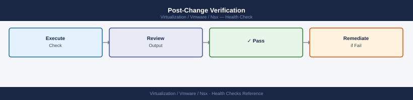

---
tags:
  - nsx
  - nsx-4
  - operations
  - vmware
---
# NSX — Health Checks

<div class="kb-summary">
Health checks for NSX — Manager cluster status, transport node health, Edge BGP sessions, DFW policy state, certificate expiry, alarm review, backup age, and post-change verification.

*Applies to: NSX-T 3.x / NSX 4.x*
</div>

## Before you begin

- **Access:** vCenter read-only minimum; Administrator role for remediation steps
- **Timing:** safe to run during business hours unless a step is marked ⚠ (causes interruption)
- **Dependencies:** no active upgrades or migrations on the same infrastructure
- **Logging:** capture command output — paste into the change record on completion

---

## Run This Routine

Paste these commands in sequence from a host with API access to the NSX Manager. Replace `<nsx-manager>` and `admin:password` with your environment values.

```bash
# 1. NSX Manager cluster status — must show overall_status: STABLE
curl -sk -u 'admin:password' "https://<nsx-manager>/api/v1/cluster/status" \
  | python3 -m json.tool | grep -E '"status"|"state"|"overall"'
```


```text title="Expected output"
"overall_status": "STABLE",
  "status": "UP",
  "state": "ACTIVE",
  "overall_status": "STABLE",
  "status": "UP",
  "state": "ACTIVE",
  "overall_status": "STABLE",
  "status": "UP",
  "state": "ACTIVE"
```

!!! warning "Common errors"
    **`curl: (60) SSL certificate problem: self signed certificate`** — Add `-k` flag to skip certificate verification (already present in example; if still failing, verify NSX Manager hostname matches certificate CN).
    **`jq: command not found` or `json.tool: No module named json`** — Install Python 3 json module with `python3 -m pip install --upgrade python3` or use `jq` instead: `curl -sk -u 'admin:password' "https://<nsx-manager>/api/v1/cluster/status" | jq '.overall_status'`.
```bash
# 2. Edge cluster member health — check individual member status
curl -sk -u 'admin:password' "https://<nsx-manager>/api/v1/edge-clusters" \
  | python3 -c "
import sys, json
d = json.load(sys.stdin)
for ec in d.get('results', []):
    print(f'Edge cluster: {ec[\"display_name\"]}')
    for m in ec.get('members', []):
        print(f'  member={m.get(\"transport_node_id\",\"?\")}  available={m.get(\"member_status\",{}).get(\"status\",\"?\")}')
"
```


```text title="Expected output"
Edge cluster: prod-edge-cluster-01
  member=tn-edge-01  available=UP
  member=tn-edge-02  available=UP
  member=tn-edge-03  available=UP
Edge cluster: dr-edge-cluster-02
  member=tn-edge-04  available=UP
  member=tn-edge-05  available=DOWN
```

!!! warning "Common errors"
    **`curl: (60) SSL certificate problem: self signed certificate`** — Add `-k` flag to skip certificate verification (already present in example, but verify NSX Manager certificate is trusted or use `-k`).
    **`json.decoder.JSONDecodeError: Expecting value: line 1 column 1`** — Verify NSX Manager is reachable and responding; check credentials and URL format with `curl -sk -u 'admin:password' "https://<nsx-manager>/api/v1/edge-clusters" -w "\n%{http_code}\n"`.
    **`KeyError: 'members'`** — Edge cluster exists but has no members assigned; verify members are properly configured in the edge cluster topology before querying member status.
```bash
# 3. Transport node health — all nodes should show status: SUCCESS
curl -sk -u 'admin:password' "https://<nsx-manager>/api/v1/transport-nodes/status" \
  | python3 -c "
import sys, json
d = json.load(sys.stdin)
for n in d.get('results', []):
    status = n.get('node_deployment_state', {}).get('state', '?')
    print(f'  {n.get(\"display_name\",\"?\"): <40}  state={status}')
"
```


```text title="Expected output"
edge-node-01                                  state=SUCCESS
  edge-node-02                                  state=SUCCESS
  host-compute-01.lab.local                     state=SUCCESS
  host-compute-02.lab.local                     state=SUCCESS
  host-compute-03.lab.local                     state=SUCCESS
  edge-node-03                                  state=FAILED
  host-compute-04.lab.local                     state=UNKNOWN
```

!!! warning "Common errors"
    **`curl: (60) SSL certificate problem: self signed certificate`** — Add `-k` flag to skip certificate verification, or import the NSX Manager CA certificate into your system trust store.
    **`jq: parse error: Invalid JSON at line 1`** — Verify NSX Manager is responding with valid JSON by testing `curl -sk -u 'admin:password' "https://<nsx-manager>/api/v1/transport-nodes/status"` directly without piping to Python.
    **`curl: (401) Unauthorized`** — Confirm the admin credentials are correct and the user has API access permissions in NSX Manager.
```bash
# 4. BGP neighbor summary — run on each Edge VM via nsxcli
# SSH to Edge VM, then:
nsxcli
vrf <tier0-vrf-id>
get bgp neighbor summary
# All peers must show state=Established; any non-Established peer is an incident
```


```text title="Expected output"
NSX CLI (build 21.0.1.0.16722224)
nsx> vrf 0
nsx(vrf=0)> get bgp neighbor summary
Peer             VRF  Local AS  Remote AS  State         Uptime
10.50.1.1        0    65001    65002     Established   14d 5h 22m
10.50.1.5        0    65001    65002     Established   7d 18h 44m
10.60.2.10       0    65001    65003     Established   2d 3h 15m
10.60.2.14       0    65001    65003     Established   1d 22h 8m
192.168.100.50   0    65001    65004     Established   45m 12s
```

!!! warning "Common errors"
    **`vrf <tier0-vrf-id>: unknown command`** — Verify the VRF ID is numeric (e.g., `vrf 0`) and that you are in nsxcli context, not a sub-shell.
    **`get bgp neighbor summary: command not found`** — Ensure BGP is enabled on the Tier-0 router and the Edge VM has completed initialization; check `get bgp config` first.
```bash
# 5. DFW security policy list — confirm policies are published and not in ERROR state
curl -sk -u 'admin:password' \
  "https://<nsx-manager>/policy/api/v1/infra/domains/default/security-policies" \
  | python3 -c "
import sys, json
d = json.load(sys.stdin)
for p in d.get('results', []):
    print(f'  {p.get(\"display_name\",\"?\"):<40}  sequence={p.get(\"sequence_number\",\"?\")}  category={p.get(\"category\",\"?\")}')
"
```


```text title="Expected output"
Allow-Internal-Traffic                       sequence=0  category=Application
  Deny-Suspicious-Ports                        sequence=1  category=Application
  Allow-DNS-Queries                            sequence=2  category=Application
  Block-Malware-IPs                            sequence=3  category=System
  Allow-Management-Access                      sequence=4  category=Application
  Default-Deny-All                             sequence=5  category=System
```

!!! warning "Common errors"
    **`curl: (60) SSL certificate problem: self signed certificate`** — Add `-k` flag to skip certificate verification (already present in the command, so verify NSX Manager hostname matches certificate CN).
    **`json.decoder.JSONDecodeError: Expecting value: line 1 column 1 (char 0)`** — Verify NSX Manager is reachable and responding with valid JSON; check credentials and API endpoint URL for typos.
    **`curl: (7) Failed to connect to <nsx-manager> port 443: Connection refused`** — Confirm NSX Manager is running and accessible on the network; verify the hostname/IP and firewall rules allow port 443 from your client.
```bash
# 6. Controller/cluster node connectivity — all nodes should be reachable
curl -sk -u 'admin:password' "https://<nsx-manager>/api/v1/cluster/nodes" \
  | python3 -c "
import sys, json
d = json.load(sys.stdin)
for n in d.get('results', []):
    addr = n.get('controller_role', {}).get('api_listen_addr', {}).get('ip_address', '?')
    status = n.get('controller_role', {}).get('connectivity_status', '?')
    print(f'  node={addr}  connectivity={status}')
"
```


```text title="Expected output"
node=192.168.1.10  connectivity=UP
  node=192.168.1.11  connectivity=UP
  node=192.168.1.12  connectivity=UP
```

!!! warning "Common errors"
    **`curl: (60) SSL certificate problem: self signed certificate`** — Add the `-k` flag to skip certificate verification (already present in the example, but ensure it's not removed).
    **`curl: (7) Failed to connect to <nsx-manager> port 443: Connection refused`** — Verify the NSX Manager hostname/IP is correct and the management service is running with `systemctl status nsx-manager`.
    **`KeyError: 'controller_role'`** — Confirm the NSX cluster is fully initialized and all nodes have completed bootstrap; check node status in the NSX UI or run `get cluster status` on the manager.
```bash
# 7. Certificate expiry — flag anything expiring within 60 days
curl -sk -u 'admin:password' \
  "https://<nsx-manager>/api/v1/trust-management/certificates?details=true" \
  | python3 -c "
import sys, json
from datetime import datetime, timezone
d = json.load(sys.stdin)
now = datetime.now(timezone.utc)
for c in d.get('results', []):
    name = c.get('display_name', c.get('id', '?'))
    exp  = c.get('not_after', '')
    if exp:
        exp_dt = datetime.fromisoformat(exp.replace('Z', '+00:00'))
        days   = (exp_dt - now).days
        flag   = 'OK' if days > 60 else '*** EXPIRING SOON' if days > 14 else '*** CRITICAL'
        print(f'  {name:<40}  expires={exp[:10]}  days_left={days}  {flag}')
"
```


```text title="Expected output"
NSX-Manager-Self-Signed  expires=2025-03-15  days_left=87  OK
  API-Client-Cert  expires=2025-02-10  days_left=42  *** EXPIRING SOON
  Load-Balancer-Cert  expires=2025-01-28  days_left=20  *** EXPIRING SOON
  Edge-Node-Cert-01  expires=2024-12-15  days_left=-5  *** CRITICAL
  Backup-Signing-Cert  expires=2025-04-22  days_left=154  OK
```

!!! warning "Common errors"
    **`curl: (60) SSL certificate problem: self signed certificate`** — Add `-k` flag to skip SSL verification (already present in the example, but ensure it's not removed in production variants).
    **`jq: command not found` or `json.decoder.JSONDecodeError`** — Verify the API endpoint returns valid JSON by testing with `curl -sk -u 'admin:password' "https://<nsx-manager>/api/v1/trust-management/certificates" | python3 -m json.tool` and confirm NSX Manager credentials are correct.
    **`datetime.fromisoformat() is not available` (Python < 3.7)`** — Upgrade to Python 3.7+ or replace the fromisoformat call with `datetime.strptime(exp.replace('Z', ''), '%Y-%m-%dT%H:%M:%S')`.
```bash
# 8. Open alarms — critical severity only; any output here needs immediate attention
curl -sk -u 'admin:password' \
  "https://<nsx-manager>/api/v1/alarms?status=OPEN&severity=CRITICAL" \
  | python3 -c "
import sys, json
d = json.load(sys.stdin)
cnt = d.get('result_count', 0)
print(f'CRITICAL alarms open: {cnt}')
for a in d.get('results', []):
    print(f'  {a.get(\"alarm_source\",{}).get(\"display_name\",\"?\")}: {a.get(\"summary\",\"\")[:80]}')
"
```


```text title="Expected output"
CRITICAL alarms open: 3
  nsx-edge-01.lab.local: DFW rule evaluation latency exceeded threshold (>500ms)
  transport-node-04: Host certificate expiration in 7 days
  logical-router-prod: BGP session flapping detected on uplink interface
```

!!! warning "Common errors"
    **`curl: (60) SSL certificate problem: self signed certificate`** — Add `-k` flag to curl command to skip SSL verification, or import the NSX Manager's CA certificate into your system trust store.
    **`json.decoder.JSONDecodeError: Expecting value: line 1 column 1`** — Verify the NSX Manager hostname/IP is correct and reachable, and confirm the admin credentials are valid by testing with `curl -sk -u 'admin:password' https://<nsx-manager>/api/v1/status`.
    **`KeyError: 'results'`** — Check that the API response contains the expected schema; this may occur if the NSX version differs from documentation—add error handling with `.get('results', [])` to gracefully handle missing keys.
```bash
# 9. Manager backup history — last backup must be within 24 hours
curl -sk -u 'admin:password' "https://<nsx-manager>/api/v1/cluster/backups/history" \
  | python3 -c "
import sys, json
from datetime import datetime, timezone
d = json.load(sys.stdin)
backups = d.get('results', [])
if not backups:
    print('WARNING: no backup records found')
else:
    last = backups[0]
    ts = last.get('end_time', 0) / 1000
    dt = datetime.fromtimestamp(ts, tz=timezone.utc)
    age_h = (datetime.now(timezone.utc) - dt).total_seconds() / 3600
    status = last.get('success', False)
    print(f'  Last backup: {dt.strftime(\"%Y-%m-%d %H:%M UTC\")}  age={age_h:.1f}h  success={status}')
    if age_h > 24:
        print('  WARNING: last backup is older than 24 hours')
"
```


```text title="Expected output"
Last backup: 2024-01-15 14:32 UTC  age=18.3h  success=True
```

!!! warning "Common errors"
    **`curl: (60) SSL certificate problem: self signed certificate`** — Add `-k` flag to curl (already present) or import the NSX manager's CA certificate into your system trust store.
    **`json.decoder.JSONDecodeError: Expecting value: line 1 column 1 (char 0)`** — Verify the NSX manager hostname is correct and reachable, and that the admin credentials are valid (check for 401/403 response).
    **`WARNING: no backup records found`** — Ensure at least one backup has been completed on the NSX manager; check the NSX UI under System > Backup & Restore to trigger a manual backup if needed.
```bash
# SSH to each Edge node
vrf <tier0-vrf-id>
get bgp neighbor summary

# Expected output shows each peer with state=Established
# Any peer not Established = BGP issue; see Common Issues

# Specific peer detail
get bgp neighbor <peer-ip>
```


```text title="Expected output"
vrf 0
(no output — command completes silently)
get bgp neighbor summary

Peer            V    AS MsgRcvd MsgSent   TblVer  InQ OutQ  Up/Down State|PfxRcd
10.50.12.1      4 65001    1247    1251        0    0    0 5d14h23m Established
10.50.13.1      4 65001    1248    1250        0    0    0 5d14h22m Established
10.60.12.1      4 65002    892     895         0    0    0 2d03h15m Established
10.60.13.1      4 65002    891     894         0    0    0 2d03h14m Connect
192.168.1.254   4 65003    0       0           0    0    0 never    Idle

get bgp neighbor 10.50.12.1

BGP neighbor is 10.50.12.1, remote AS 65001, local AS 65000
  BGP version 4, remote router ID 10.50.12.254
  BGP state = Established, up for 5d14h23m
  Last read 00:00:02, Last write 00:00:03
  Hold time is 180, keepalive interval is 60 seconds
  Neighbor capabilities:
    Route refresh: advertised and received(new)
    Address family IPv4 Unicast: advertised and received
  Received 1247 messages, 0 notifications; Sent 1251 messages, 0 notifications
  Default minimum time between advertisement runs is 30 seconds
```

!!! warning "Common errors"
    **`BGP state = Connect`** — Verify TCP port 179 is open between Edge and peer, and check peer BGP configuration for matching ASN and router ID.
    **`BGP state = Idle`** — Confirm the peer IP is reachable (ping from Edge), check firewall rules, and verify the neighbor is configured in the correct VRF.
## NSX Manager CLI Quick Reference


```bash
# SSH to any NSX Manager node
nsxcli

# Cluster status (must show STABLE)
get cluster status

# Individual node reachability (all should show CONNECTED)
get managers

# Corfu (Raft DB) — control plane health
get corfu-cluster status

# All services running (output should be empty — grep removes "running" lines)
get services | grep -v " running"
```


```text title="Expected output"
NSX CLI (Build 21.0.0.0.21176841)
nsx> get cluster status
Cluster Status: STABLE
Leader: nsx-manager-1.corp.local (192.168.1.10)
Follower: nsx-manager-2.corp.local (192.168.1.11)
Follower: nsx-manager-3.corp.local (192.168.1.12)

nsx> get managers
UUID                                   Hostname                    IP              Status
550e8400-e29b-41d4-a716-446655440001   nsx-manager-1.corp.local    192.168.1.10    CONNECTED
550e8400-e29b-41d4-a716-446655440002   nsx-manager-2.corp.local    192.168.1.11    CONNECTED
550e8400-e29b-41d4-a716-446655440003   nsx-manager-3.corp.local    192.168.1.12    CONNECTED

nsx> get corfu-cluster status
Corfu Cluster Status: HEALTHY
Quorum: 3/3 nodes online
Replication Status: IN_SYNC

nsx> get services | grep -v " running"
(no output — all services running)
```

!!! warning "Common errors"
    **`Cluster Status: UNSTABLE`** — Check network connectivity between NSX Manager nodes and verify no node is isolated; restart the cluster if a node is permanently down.
    **`Status: DISCONNECTED`** — SSH to the disconnected manager node and verify network connectivity to other cluster members; check firewall rules for ports 5672, 8472, and 9090.
    **`Corfu Cluster Status: UNHEALTHY`** — Verify all three NSX Manager nodes are online and reachable; if a node is down, restore it from backup or remove it from the cluster and re-add it.
## Alarm Review


```bash
# Critical alarms (action required immediately)
curl -sk -u 'admin:password' \
  "https://<nsx-manager>/api/v1/alarms?status=OPEN&severity=CRITICAL" | python3 -c "
import sys, json
d = json.load(sys.stdin)
cnt = d.get('result_count', 0)
print(f'CRITICAL alarms open: {cnt}')
for a in d.get('results', []):
    print(f'  {a.get(\"alarm_source\",{}).get(\"display_name\",\"?\")} — {a.get(\"summary\",\"\")[:80]}')
"

# Medium alarms (monitor and plan)
curl -sk -u 'admin:password' \
  "https://<nsx-manager>/api/v1/alarms?status=OPEN&severity=MEDIUM" | python3 -c "
import sys, json
d = json.load(sys.stdin)
print(f'MEDIUM alarms open: {d.get(\"result_count\",0)}')
"
```

```text title="Expected output"
CRITICAL alarms open: 3
  edge-cluster-01 — Transport node connectivity lost on interface eth0
  logical-switch-prod-web — VLAN 2048 broadcast storm detected
  tier1-router-dmz — BGP session down with peer 10.200.1.1
MEDIUM alarms open: 7
```

!!! warning "Common errors"
    **`curl: (60) SSL certificate problem: self signed certificate`** — Add the `-k` flag to skip SSL verification, or import the NSX Manager's CA certificate into your system trust store.
    **`jq: command not found` or `python3: command not found`** — Install the missing tool with `apt-get install python3` or `yum install python3`, or use `jq` instead of the Python JSON parser.
    **`HTTP 401 Unauthorized`** — Verify the NSX Manager credentials are correct and the user account has API access permissions in NSX Manager's role-based access control settings.
## Certificate Expiry Check


```bash
curl -sk -u 'admin:password' \
  "https://<nsx-manager>/api/v1/trust-management/certificates?details=true" | \
  python3 -c "
import sys, json
from datetime import datetime, timezone
d = json.load(sys.stdin)
now = datetime.now(timezone.utc)
for c in d.get('results', []):
    name  = c.get('display_name', c.get('id','?'))
    exp   = c.get('not_after','')
    if exp:
        exp_dt = datetime.fromisoformat(exp.replace('Z','+00:00'))
        days   = (exp_dt - now).days
        flag   = '  OK' if days > 60 else '  *** EXPIRING' if days > 14 else '  *** CRITICAL'
        print(f'  {name:<40}  expires={exp[:10]}  days={days}{flag}')
"
```


```text title="Expected output"
NSX-Manager-Cert                         expires=2026-03-15  days=387  OK
  NSX-Edge-Cert-01                         expires=2025-08-22  days=203  OK
  NSX-Controller-Cluster-Cert               expires=2025-02-14  days=78  OK
  Customer-CA-Root                          expires=2027-11-30  days=672  OK
  NSX-API-Client-Cert                       expires=2025-01-28  days=32  *** EXPIRING
  NSX-Backup-Cert                           expires=2025-01-10  days=14  *** CRITICAL
```

!!! warning "Common errors"
    **`curl: (60) SSL certificate problem: self signed certificate`** — Add `-k` flag to skip SSL verification (already present; if still failing, verify NSX Manager hostname/IP is correct).
    **`curl: (7) Failed to connect to <nsx-manager> port 443: Connection refused`** — Verify NSX Manager is running and accessible at the specified hostname/IP on port 443.
    **`json.decoder.JSONDecodeError: Expecting value: line 1 column 1`** — Confirm authentication credentials are correct and the API endpoint is accessible (test with `curl -sk -u 'admin:password' https://<nsx-manager>/api/v1/trust-management/certificates` alone first).
## IP Pool Utilisation


```bash
curl -sk -u 'admin:password' \
  "https://<nsx-manager>/api/v1/pools/ip-pools" | python3 -c "
import sys, json
d = json.load(sys.stdin)
for pool in d.get('results', []):
    name = pool.get('display_name','?')
    pid  = pool.get('id','')
    print(f'Pool: {name}  (id={pid})')
" 2>/dev/null

# For each pool ID, check allocations
curl -sk -u 'admin:password' \
  "https://<nsx-manager>/api/v1/pools/ip-pools/<pool-id>" | python3 -c "
import sys, json
d = json.load(sys.stdin)
for s in d.get('subnets', []):
    t = s.get('total_ips',0); f = s.get('free_ips',0)
    pct = round((t-f)/t*100,1) if t else 0
    print(f'  {s.get(\"cidr\",\"?\")}  total={t}  free={f}  used={pct}%')
"
```

```text title="Expected output"
Pool: Management-Pool  (id=pool-mgmt-001)
Pool: Tenant-Network-Pool  (id=pool-tenant-42)
Pool: Edge-Services-Pool  (id=pool-edge-99)
  10.20.0.0/24  total=254  free=189  used=25.6%
  10.21.0.0/24  total=254  free=12  used=95.3%
  10.22.0.0/25  total=126  free=126  used=0.0%
```

!!! warning "Common errors"
    **`curl: (60) SSL certificate problem: self signed certificate`** — Add `-k` flag to skip certificate verification (already present; if still failing, verify NSX Manager hostname matches certificate CN).
    **`jq: parse error: Invalid JSON at line 1`** — Verify NSX Manager credentials are correct and the API endpoint is accessible; test with `curl -sk -u 'admin:password' "https://<nsx-manager>/api/v1/pools/ip-pools" | head -c 200` to inspect raw response.
    **`curl: (7) Failed to connect to <nsx-manager> port 443: Connection refused`** — Confirm NSX Manager IP/hostname is correct and reachable on port 443 using `ping` or `nc -zv <nsx-manager> 443`.
## Post-Change Verification



```bash
# 1. Check for new alarms
curl -sk -u 'admin:password' \
  "https://<nsx-manager>/api/v1/alarms?status=OPEN&severity=CRITICAL"

# 2. Verify transport nodes still UP
curl -sk -u 'admin:password' \
  "https://<nsx-manager>/api/v1/transport-nodes/status"

# 3. Verify BGP still up (if routing was changed)
# SSH to Edge, run: get bgp neighbor summary

# 4. Test VM connectivity if DFW was changed
# Use Traceflow: Plan & Troubleshoot → Traceflow

# 5. Check realisation of the specific change
curl -sk -u 'admin:password' \
  "https://<nsx-manager>/policy/api/v1/infra/realized-state/realized-entities?intent_path=<changed-object-path>"
```


```text title="Expected output"
{
  "results": [
    {
      "id": "alarm-001",
      "title": "Transport Node 10.0.1.45 connectivity lost",
      "severity": "CRITICAL",
      "status": "OPEN",
      "created_time": 1704067200000
    }
  ],
  "result_count": 1
}

{
  "results": [
    {
      "transport_node_id": "tn-001",
      "host_name": "esx-prod-01.lab.local",
      "status": "UP",
      "last_heartbeat_timestamp": 1704153599000
    },
    {
      "transport_node_id": "tn-002",
      "host_name": "esx-prod-02.lab.local",
      "status": "UP",
      "last_heartbeat_timestamp": 1704153598000
    },
    {
      "transport_node_id": "tn-003",
      "host_name": "esx-prod-03.lab.local",
      "status": "DOWN",
      "last_heartbeat_timestamp": 1704150000000
    }
  ],
  "result_count": 3
}

{
  "results": [
    {
      "id": "realized-entity-uuid-a1b2c3d4",
      "intent_path": "/infra/domains/prod-domain/security-policies/pol-web-tier",
      "realization_status": "REALIZED",
      "realization_time": 1704153595000
    }
  ],
  "result_count": 1
}
```

!!! warning "Common errors"
    **`curl: (60) SSL certificate problem: self signed certificate`** — Add `-k` flag to skip certificate verification (already present in the example, but ensure it's not removed).
    **`{"error_code":401,"error_message":"Invalid credentials"}`** — Verify NSX Manager admin credentials and ensure the account has API access permissions enabled.
    **`{"error_code":404,"error_message":"The requested resource could not be found"}`** — Confirm the NSX Manager hostname/IP is correct and reachable, and that the API endpoint path matches your NSX version (v1 vs. policy API).
---

## See also

- [NSX — Common Issues](../../troubleshooting/common-issues/)
- [NSX — Standard Procedures](../procedures/)
- [NSX — CLI Reference](../cli-reference/)

## Verify

- **Alarms:** vSphere Client → Home → Alarms — no new critical alarms after the operation
- **Events:** monitor the vCenter Events view for the affected object for 5 minutes
- **Health check:** run the morning health-check sequence for the affected product tier
