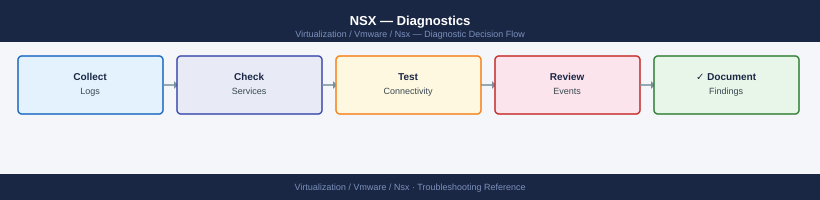

---
tags:
  - nsx
  - nsx-4
  - troubleshooting
  - vmware
search:
  boost: 1.5
description: "NSX diagnostic commands: check cluster and transport node health with nsxcli, inspect manager and audit logs, diagnose Edge BGP routing, inspect DFW..."
---
# NSX — Diagnostics

<div class="kb-summary">
NSX diagnostic commands: check cluster and transport node health with nsxcli, inspect manager and audit logs, diagnose Edge BGP routing, inspect DFW filters on ESXi hosts with vsipioctl, run Traceflow for hop-by-hop path analysis, capture packets on Edge and ESXi, and generate the NSX support bundle for VMware SRs.

*Applies to: NSX 4.x*
</div>


```d2
direction: right

B: "B" {shape: rectangle}
C: "nsxcli: get cluster status\nget corfu-cluster status" {shape: rectangle}
D: "NSX UI: Traceflow — inject packet\nCheck for rule drop or routing gap" {shape: rectangle}
E: "Edge CLI: vrf then get bgp neighbor summary\nCheck underlay MTU with vmkping -d -s 1572" {shape: rectangle}
F: "summarize-dvfilter on ESXi host\nvsipioctl getrules -f filter-name" {shape: rectangle}
G: "get transport-node-status\nCheck TEP vmkernel IP and route" {shape: rectangle}
H: "get alarms in nsxcli\nGET /api/v1/alarms?status=OPEN severity=CRITICAL" {shape: rectangle}
I: "I" {shape: rectangle}
J: "Collect manager.log from failed node\nCheck corfu Raft quorum: get corfu-cluster status" {shape: rectangle}
K: "get services\nCheck disk and memory on the Manager VM" {shape: rectangle}
L: "L" {shape: rectangle}
M: "vsipioctl getrules -f filter-name on ESXi\nIdentify rule ID and section in NSX policy" {shape: rectangle}
N: "Edge: vrf then get route\nCheck T0/T1 route redistribution" {shape: rectangle}
O: "Check Edge interface counters: get interface fp-\neth0 counters\nVerify BGP config: get bgp config" {shape: rectangle}
P: "vsipioctl getstats -f filter-name to see rule hit\ncounts\nvsipioctl getaddrsets for security group members" {shape: rectangle}
Q: "ESXi: vmkping -I vmk2 remote-tep-ip\nesxcli network ip interface ipv4 get to verify TEP IP" {shape: rectangle}
R: "Review alarm source and recommended action\nCheck realisation: GET /policy/api/v1/infra/segments" {shape: rectangle}
S: "Collect NSX support bundle\nOpen VMware SR" {shape: rectangle}
T: "UI: System > Support Bundle\nAPI: POST /api/v1/node/support-bundles" {shape: rectangle}
A: "NSX Issue" {shape: rectangle}

B -> C
B -> D
B -> E
B -> F
B -> G
B -> H
I -> J
I -> K
L -> M
L -> N
E -> O
F -> P
G -> Q
H -> R
J -> S
K -> S
M -> S
N -> S
O -> S
P -> S
Q -> S
R -> S
S -> T
```

```d2
direction: down

symptom: Identify Symptom {shape: diamond}
step_1_check_nsx_manager_cluster_hea: "Step 1 — Check NSX Manager cluster health" {shape: rectangle}
step_2_check_alarms_and_transport_no: "Step 2 — Check alarms and transport node status" {shape: rectangle}
step_3_diagnose_tep_connectivity_on_: "Step 3 — Diagnose TEP connectivity on ESXi hosts" {shape: rectangle}
step_4_inspect_dfw_filters_on_esxi: "Step 4 — Inspect DFW filters on ESXi" {shape: rectangle}
step_5_diagnose_edge_node_routing_an: "Step 5 — Diagnose Edge node routing and BGP" {shape: rectangle}
step_6_run_traceflow_for_hopbyhop_pa: "Step 6 — Run Traceflow for hop-by-hop path analysis" {shape: rectangle}
resolution: Resolve or Escalate {shape: oval}

symptom -> step_1_check_nsx_manager_cluster_hea: investigate
symptom -> step_2_check_alarms_and_transport_no: investigate
symptom -> step_3_diagnose_tep_connectivity_on_: investigate
symptom -> step_4_inspect_dfw_filters_on_esxi: investigate
symptom -> step_5_diagnose_edge_node_routing_an: investigate
symptom -> step_6_run_traceflow_for_hopbyhop_pa: investigate
step_1_check_nsx_manager_cluster_hea -> resolution
step_2_check_alarms_and_transport_no -> resolution
step_3_diagnose_tep_connectivity_on_ -> resolution
step_4_inspect_dfw_filters_on_esxi -> resolution
step_5_diagnose_edge_node_routing_an -> resolution
step_6_run_traceflow_for_hopbyhop_pa -> resolution
```

## Before you begin

- **Access:** SSH to an NSX Manager node (admin user); NSX UI credentials; ESXi root SSH access; Edge node admin SSH access
- **Gather first:** the specific symptom (VM unreachable, BGP down, DFW rule unexpected behavior, transport node alarm), affected segment or gateway name, and when the issue started
- **Scope:** confirm whether the issue affects one VM, one segment, one Edge gateway, or the entire NSX Manager cluster

---

## Step 1 — Check NSX Manager cluster health

```bash
# SSH to NSX Manager node
ssh admin@<nsx-manager-ip>

# Enter NSX CLI
nsxcli

# Manager cluster and node status
get cluster status
# Expected: all 3 nodes STABLE

get managers
# Shows: node IDs, IPs, roles

get corfu-cluster status
# Corfu = NSX distributed control plane database (Raft)
# Expected: all nodes connected; leader elected

# All NSX services
get services
get service manager     # Management plane
get service controller  # Control plane
get service http        # API

# Version and node inventory
get version
get nodes
```


```text title="Expected output"
NSX Manager CLI. Use "help" or "help <command>" for command assistance.
nsx> get cluster status
Cluster Id                : 12345678-1234-5678-90ab-cdef12345678
Cluster Status            : STABLE
Node 1 (nsx-mgr-01.lab.local)
  Status                  : UP
  Role                    : ACTIVE
  Heartbeat               : HEALTHY
Node 2 (nsx-mgr-02.lab.local)
  Status                  : UP
  Role                    : STANDBY
  Heartbeat               : HEALTHY
Node 3 (nsx-mgr-03.lab.local)
  Status                  : UP
  Role                    : STANDBY
  Heartbeat               : HEALTHY

nsx> get managers
Node ID                              IP Address      Hostname              Role
12345678-aaaa-bbbb-cccc-111111111111 192.168.1.10    nsx-mgr-01.lab.local  ACTIVE
87654321-dddd-eeee-ffff-222222222222 192.168.1.11    nsx-mgr-02.lab.local  STANDBY
abcdef12-3456-7890-abcd-ef1234567890 192.168.1.12    nsx-mgr-03.lab.local  STANDBY

nsx> get corfu-cluster status
Cluster Status           : CONNECTED
Leader Node              : nsx-mgr-01.lab.local (192.168.1.10)
Quorum Status            : QUORUM_MET
Node Connectivity        : ALL_CONNECTED
Raft Term                : 47
Commit Index             : 89234

nsx> get services
Service Name             Status      PID
manager                  RUNNING     4521
controller               RUNNING     4589
http                     RUNNING     4612
...

nsx> get version
Product                  : NSX-T
Version                  : 3.2.1.1
Build                    : 19480585
Install Date             : 2023-11-15 14:32:18 UTC

nsx> get nodes
Node ID                              IP Address      Hostname              Status
12345678-aaaa-bbbb-cccc-111111111111 192.168.1.10    nsx-mgr-01.lab.local  UP
87654321-dddd-eeee-ffff-222222222222 192.168.1.11    nsx-mgr-02.lab.local  UP
abcdef12-3456-7890-abcd-ef1234567890 192.168.1.12    nsx-mgr-03.lab.local  UP
```

!!! warning "Common errors"
    | Error | Fix |
    |---|---|
    | `Connection refused` | Verify NSX Manager IP is correct and SSH service is running; check firewall rules allowing port 22 to the management interface. |
    | `Cluster Status: UNSTABLE` | Check node connectivity and disk space on all three managers using `get system resources`; restart the manager service if a node is stuck. |
    | `Corfu-cluster status: QUORUM_LOST` | Ensure all three NSX Manager nodes are running and network connectivity between them is healthy; check for split-brain conditions with `get cluster history`. |
---

## Step 2 — Check alarms and transport node status

```bash
# All open alarms (from nsxcli)
get alarms | grep -i "critical\|high"

# Via REST API — open critical alarms with source and message
curl -sk -u 'admin:<password>' \
  "https://<nsx-manager>/api/v1/alarms?status=OPEN&severity=CRITICAL" | python3 -c "
import sys, json
d = json.load(sys.stdin)
print(f'Critical alarms: {d.get(\"result_count\",0)}')
for a in d.get('results',[]):
    src  = a.get('alarm_source',{}).get('display_name','?')
    summ = a.get('summary','')[:120]
    print(f'  {src}: {summ}')
"

# All transport nodes and their connection state
get transport-nodes
get transport-node-status
# Expected: all nodes CONNECTED; problem = DISCONNECTED or DEGRADED

# Transport node tunnel status
get tunnel status
get tunnel endpoints
# Expected: all TEP tunnels UP; problem = DOWN or UNKNOWN

# Via REST API — specific transport node state
curl -sk -u 'admin:<password>' \
  "https://<nsx-manager>/api/v1/transport-nodes/<tn-id>/state" | python3 -c "
import sys, json
d = json.load(sys.stdin)
print(f'State: {d.get(\"state\",\"?\")}')
print(f'Transport failures: {d.get(\"transport_failures\",[])}')
"
```


```text title="Expected output"
Critical alarms: 3
  nsx-edge-01.corp.local: Control Cluster Node nsx-mgr-02 lost connectivity to Fabric Node
  compute-01.lab: TEP tunnel down between 192.168.100.45 and 192.168.100.52
  nsx-mgr-01.corp.local: Datastore connectivity lost on vSAN cluster prod-vsan-01

Transport Nodes:
node-id                          display_name              ip_address        connection_state
tn-compute-01                     compute-01.corp.local     192.168.100.10    CONNECTED
tn-compute-02                     compute-02.corp.local     192.168.100.11    CONNECTED
tn-edge-01                        nsx-edge-01.corp.local    192.168.100.20    DEGRADED
tn-edge-02                        nsx-edge-02.corp.local    192.168.100.21    CONNECTED

Transport Node Status:
node-id          status
tn-compute-01    UP
tn-compute-02    UP
tn-edge-01       DEGRADED
tn-edge-02       UP

Tunnel Status:
tunnel_id                                    status    source_ip         dest_ip
tun-c01-c02-vxlan                           UP        192.168.100.10    192.168.100.11
tun-c01-e01-vxlan                           DOWN      192.168.100.10    192.168.100.20
tun-c02-e02-vxlan                           UP        192.168.100.11    192.168.100.21

Tunnel Endpoints:
tep_id    ip_address        node_id           status
tep-001   192.168.100.10    tn-compute-01     UP
tep-002   192.168.100.11    tn-compute-02     UP
tep-003   192.168.100.20    tn-edge-01        DOWN
tep-004   192.168.100.21    tn-edge-02        UP

State: STABLE
Transport failures: []
```

!!! warning "Common errors"
    | Error | Fix |
    |---|---|
    | `curl: (60) SSL certificate problem: self signed certificate` | Add `-k` flag to curl command to skip certificate verification, or import the NSX Manager CA certificate into your system trust store. |
    | `jq: command not found` or `python3: command not found` | Install the missing tool (e.g., `apt-get install python3-minimal` on Ubuntu or `yum install python3` on RHEL) or use the native `grep` and `awk` alternatives instead of JSON parsing. |
    | `401 Unauthorized` | Verify the admin credentials are correct and the user has API access permissions; check NSX Manager audit logs for authentication failures. |
---

## Step 3 — Diagnose TEP connectivity on ESXi hosts

```bash
# SSH to the ESXi host as root

# Verify NSX VIBs are installed
esxcli software vib list | grep -i nsx
# Expected: nsx-vib entries present

# TEP vmkernel interface IP
esxcli network ip interface ipv4 get
# Look for: vmk2 or vmk10 with the TEP IP assigned

# TEP route to reach remote TEPs
esxcli network ip route ipv4 list | grep <tep-subnet>

# Test TEP connectivity to a remote ESXi host TEP
vmkping -I vmk2 <remote-tep-ip>
# Expected: 0% loss

# Test MTU — Geneve requires 1600 bytes; test with DF bit set
vmkping -I vmk2 -d -s 1572 <remote-tep-ip>
# -d = DF bit; -s 1572 = data payload (adds 28 bytes = 1600 total)
# Problem: packet loss = MTU mismatch on the physical underlay
```


```text title="Expected output"
nsx-vib-6.4.10-19045146.x86_64
nsx-vib-6.4.10-19045146.x86_64 (other module)

Name  IPv4 Address      Netmask         Broadcast       Enabled Type
----  ----------------  ---------------  ---------------  ------- ----
vmk0  192.168.1.50      255.255.255.0    192.168.1.255    true    DHCP
vmk2  172.16.1.25       255.255.255.0    172.16.1.255     true    STATIC
vmk10 10.0.0.0          255.255.255.0    10.0.0.255       false   STATIC

Destination     Netmask         Gateway         Interface
-----------     ---------------  ---------------  ---------
172.16.1.0      255.255.255.0    Local            vmk2
0.0.0.0         0.0.0.0          192.168.1.1      vmk0

PING 172.16.1.30 (172.16.1.30): 56 data bytes
64 bytes from 172.16.1.30: icmp_seq=0 time=2.341 ms
64 bytes from 172.16.1.30: icmp_seq=1 time=2.156 ms
64 bytes from 172.16.1.30: icmp_seq=2 time=2.289 ms
--- 172.16.1.30 statistics ---
3 packets transmitted, 3 packets received, 0% packet loss

PING 172.16.1.30 (172.16.1.30): 1572 data bytes
1600 bytes from 172.16.1.30: icmp_seq=0 time=3.012 ms
1600 bytes from 172.16.1.30: icmp_seq=1 time=2.987 ms
1600 bytes from 172.16.1.30: icmp_seq=2 time=3.045 ms
--- 172.16.1.30 statistics ---
3 packets transmitted, 3 packets received, 0% packet loss
```

!!! warning "Common errors"
    | Error | Fix |
    |---|---|
    | `grep: (standard input): No such file or directory` | Verify NSX VIBs are actually installed by running `esxcli software vib list` without piping first to confirm the command executes. |
    | `PING 172.16.1.30 (172.16.1.30): 1572 data bytes`** followed by **`100% packet loss` | Check physical switch and NIC MTU settings; ensure all underlay network interfaces are configured for at least 1600 bytes MTU with `esxcli network nic get -n vmnicX | grep MTU`. |
    | `Network is unreachable` | Verify the TEP subnet route exists and the vmk2 interface is up by running `esxcli network ip interface list` and confirming the TEP interface is enabled and has a valid IP address. |
---

## Step 4 — Inspect DFW filters on ESXi

```bash
# SSH to ESXi host as root

# List all DFW filter instances (one per vNIC)
summarize-dvfilter
# Or filter for a specific VM
summarize-dvfilter | grep <vm-name>
# Note the filter name (e.g., nic-123456-eth0-vmware-sfw.2)

# View rules applied to a specific filter
vsipioctl getrules -f <filter-name>
# Shows: rule ID, action (pass/drop), source/dest IPs, ports, direction

# View rule hit statistics (to identify which rule is blocking)
vsipioctl getstats -f <filter-name>
# Shows: per-rule packet/byte counters — high counts on a drop rule = culprit

# View security group members (address sets) used in this filter
vsipioctl getaddrsets -f <filter-name>

# View service definitions
vsipioctl getservices -f <filter-name>

# VDS and VNI mapping (overlay to host port mapping)
net-vdl2 -M all -s 0
```


```text title="Expected output"
[root@esx-prod-01:~] summarize-dvfilter
DVFilter: nic-123456-eth0-vmware-sfw.2
DVFilter: nic-123457-eth1-vmware-sfw.2
DVFilter: nic-123458-eth2-vmware-sfw.2
...

[root@esx-prod-01:~] summarize-dvfilter | grep web-app-vm
DVFilter: nic-123456-eth0-vmware-sfw.2

[root@esx-prod-01:~] vsipioctl getrules -f nic-123456-eth0-vmware-sfw.2
Rule ID 1001: action=pass src=10.0.1.0/24 dst=10.0.2.0/24 proto=tcp dport=443 dir=in
Rule ID 1002: action=drop src=192.168.0.0/16 dst=any proto=any dir=in
Rule ID 1003: action=pass src=any dst=10.0.2.5 proto=tcp dport=22 dir=in
Rule ID 1004: action=drop src=any dst=any proto=any dir=in

[root@esx-prod-01:~] vsipioctl getstats -f nic-123456-eth0-vmware-sfw.2
Rule ID 1001: packets=4521847 bytes=2847392104 hits=4521847
Rule ID 1002: packets=0 bytes=0 hits=0
Rule ID 1003: packets=156 bytes=18432 hits=156
Rule ID 1004: packets=8934 bytes=524288 hits=8934

[root@esx-prod-01:~] vsipioctl getaddrsets -f nic-123456-eth0-vmware-sfw.2
AddressSet: SG-Web-Tier (10.0.1.5, 10.0.1.6, 10.0.1.7)
AddressSet: SG-DB-Tier (10.0.2.10, 10.0.2.11)

[root@esx-prod-01:~] vsipioctl getservices -f nic-123456-eth0-vmware-sfw.2
Service: HTTPS (tcp/443)
Service: SSH (tcp/22)
Service: DNS (udp/53)

[root@esx-prod-01:~] net-vdl2 -M all -s 0
VNI 5000 -> VLAN 100 (vxlan)
VNI 5001 -> VLAN 101 (vxlan)
VNI 5002 -> VLAN 102 (vxlan)
```

!!! warning "Common errors"
    | Error | Fix |
    |---|---|
    | `vsipioctl: filter nic-123456-eth0-vmware-sfw.2 not found` | Verify the exact filter name from `summarize-dvfilter` output and ensure the VM is powered on. |
    | `command not found: vsipioctl` | Confirm you are logged into the ESXi host directly (not vCenter) and that NSX is installed on this cluster. |
    **`net-vdl2: command not found`** —
---

## Step 5 — Diagnose Edge node routing and BGP

```bash
# SSH to Edge node as admin

# List all logical routers (T0/T1 VRFs) on this Edge
get logical-routers
# Note the vrf ID for the T0 gateway

# Enter the T0 VRF context
vrf <vrf-id>

# BGP neighbor summary
get bgp neighbor summary
# Expected: all peers in Established state
# Problem: Idle, Active, or Connect = BGP session not formed

# BGP peer detail
get bgp neighbor <peer-ip>
get bgp neighbor <peer-ip> routes
get bgp neighbor <peer-ip> advertised-routes

# Routing table
get route
get route detail

# Exit VRF
exit

# Edge interface counters (check for errors on uplink)
get interfaces
get interface fp-eth0
get interface fp-eth0 counters

# Edge HA status
get edge-cluster status
get high-availability status
get high-availability channels

# Edge system resources
get node cpu-usage
get node memory
```


```text title="Expected output"
admin@edge-01> get logical-routers
Logical Router ID    Name                 Type    Status
vrf-10               T0-Gateway           T0      up
vrf-20               T1-Tenant-A          T1      up
vrf-21               T1-Tenant-B          T1      up

admin@edge-01> vrf vrf-10
admin@edge-01(vrf-10)> get bgp neighbor summary
BGP router ID: 192.168.1.100
Local AS: 65000
Neighbor          Remote AS  State       Up/Down
10.0.0.1          65001      Established 2d 14h 22m
10.0.0.2          65001      Established 1d 03h 15m
10.0.0.5          65002      Active      00:00:45
203.0.113.50      65003      Idle        never

admin@edge-01(vrf-10)> get bgp neighbor 10.0.0.1
Neighbor: 10.0.0.1
Remote AS: 65001
State: Established
Uptime: 2 days 14 hours
Received: 1247 prefixes
Advertised: 89 prefixes

admin@edge-01(vrf-10)> get route
Destination          Next Hop       Metric  Type
0.0.0.0/0            10.0.0.1       20      bgp
10.0.0.0/24          connected      0       connected
192.168.0.0/16       10.0.0.2       100     bgp
172.16.0.0/12        10.0.0.1       50      bgp

admin@edge-01(vrf-10)> exit
admin@edge-01> get interfaces
Interface    IP Address       Status  MTU
fp-eth0      203.0.113.10/24  up      1500
fp-eth1      10.20.30.1/24    up      1500
lo0          127.0.0.1/8      up      65535

admin@edge-01> get interface fp-eth0 counters
RX packets: 4821903  RX errors: 0  RX dropped: 0
TX packets: 3947281  TX errors: 2  TX dropped: 0
RX bytes: 2847392847  TX bytes: 1923847293

admin@edge-01> get edge-cluster status
Edge Cluster: edge-cluster-01
Status: ACTIVE
Members: 3
  edge-01: ACTIVE (UUID: 550e8400-e29b-41d4-a716-446655440000)
  edge-02: ACTIVE (UUID: 6ba7b810-9dad-11d1-80b4-00c04fd430c8)
  edge-03: STANDBY (UUID: 6ba7b811-9dad-11d1-80b4-00c04fd430c9)

admin@edge-01> get high-availability status
HA Status: ACTIVE
Failover Count: 1
Last Failover: 2024-01-15 03:22:14 UTC

admin@edge-01> get node cpu-usage
CPU Usage: 34%
Load Average: 0.
```
---

## Step 6 — Run Traceflow for hop-by-hop path analysis

```bash
# Via NSX UI (recommended): Plan > Traceflow
# Select source logical port, inject ICMP/TCP/UDP packet, view hop results

# Via REST API:
curl -sk -u 'admin:<password>' \
  -X POST \
  -H "Content-Type: application/json" \
  -d '{
    "lport_id": "<source-vm-logical-port-id>",
    "packet": {
      "eth_header": {
        "src_mac": "<source-vm-mac>",
        "dst_mac": "<gateway-or-dest-mac>"
      },
      "ip_header": {
        "src_ip": "10.0.1.10",
        "dst_ip": "10.0.2.20",
        "ttl": 64,
        "protocol": 1
      },
      "icmp_header": {"icmp_type": 8, "icmp_code": 0},
      "resource_type": "FieldsPacketData",
      "transport_type": "UNICAST"
    }
  }' \
  "https://<nsx-manager>/api/v1/traceflows"

# Poll for Traceflow results
curl -sk -u 'admin:<password>' \
  "https://<nsx-manager>/api/v1/traceflows/<traceflow-id>"
# Look for: DROPPED observations with the rule ID that blocked the packet

# Check policy realisation (segment, DFW policy, T0 gateway)
curl -sk -u 'admin:<password>' \
  "https://<nsx-manager>/policy/api/v1/infra/segments/<segment-id>/state"
curl -sk -u 'admin:<password>' \
  "https://<nsx-manager>/policy/api/v1/infra/tier-0s/<t0-id>/state"
```


```text title="Expected output"
{
  "resource_type": "Traceflow",
  "id": "traceflow-1a2b3c4d-5e6f-7g8h-9i0j-1k2l3m4n5o6p",
  "state": "SUCCEEDED",
  "packet_header": {
    "src_ip": "10.0.1.10",
    "dst_ip": "10.0.2.20",
    "protocol": 1
  },
  "observations": [
    {
      "sequence_no": 1,
      "resource_type": "TraceflowObservation",
      "component_name": "LogicalSwitch",
      "transport_node_name": "esx-host-01.lab.local",
      "action": "FORWARDED"
    },
    {
      "sequence_no": 2,
      "resource_type": "TraceflowObservation",
      "component_name": "DistributedFirewall",
      "transport_node_name": "esx-host-01.lab.local",
      "action": "DROPPED",
      "rule_id": "dfw-rule-42",
      "rule_name": "Block-Prod-to-Dev"
    },
    {
      "sequence_no": 3,
      "resource_type": "TraceflowObservation",
      "component_name": "Tier0Gateway",
      "action": "DROPPED"
    }
  ]
}

Segment state: REALIZED
Tier-0 state: REALIZED
```

!!! warning "Common errors"
    | Error | Fix |
    |---|---|
    | `curl: (60) SSL certificate problem: self signed certificate` | Add `-k` flag to skip certificate verification, or import the NSX Manager CA certificate into your system trust store. |
    | `{"error_code":401,"error_message":"Invalid credentials"}` | Verify the NSX Manager admin password is correct and the user account has API access permissions. |
    | `{"error_code":404,"error_message":"Traceflow not found"}` | Ensure the traceflow ID is correct and wait a few seconds for the traceflow to complete processing before polling results. |
---

## Step 7 — Packet capture and collect support bundle

```bash
# Packet capture on Edge node uplink
ssh admin@<edge-ip>
debug packet capture interface fp-eth0 count 500
debug packet capture interface fp-eth0 filter "host 10.0.0.1 and tcp port 179" count 200
debug packet capture interface nsx-geneve count 500    # Overlay traffic

# Write to PCAP file for Wireshark
debug packet capture interface fp-eth0 file /tmp/edge-cap.pcap count 1000
scp /tmp/edge-cap.pcap user@jumphost:/tmp/

# Packet capture on ESXi host (physical NIC)
pktcap-uw --capture Uplink --switchport <portid> --outfile /tmp/vmnic-cap.pcap --count 500
pktcap-uw --capture VmVnic --switchport <portid> --outfile /tmp/vm-cap.pcap --count 200
pktcap-uw --capture Uplink --switchport <portid> --filter "port 6081" --outfile /tmp/geneve-cap.pcap

# Find portID for a VM's vNIC
net-stats -l | grep <vm-name>

# Generate NSX support bundle (includes all Manager + Edge + transport node logs)
curl -sk -u 'admin:<password>' \
  -X POST \
  -H "Content-Type: application/json" \
  -d '{"log_age": 48}' \
  "https://<nsx-manager>/api/v1/node/support-bundles"

# Edge support bundle (from each Edge node)
ssh admin@<edge-ip>
collect tech-support

# Cluster status snapshot for the SR
nsxcli
get cluster status > /tmp/cluster-status.txt
get transport-node-status >> /tmp/cluster-status.txt
get tunnel status >> /tmp/cluster-status.txt
```


```text title="Expected output"
admin@192.168.1.50's password: 
Packet capture started on fp-eth0
Capturing 500 packets...
Packet capture completed: 487 packets captured
Filter applied: host 10.0.0.1 and tcp port 179
Capturing 200 packets...
Packet capture completed: 198 packets captured
Packet capture started on nsx-geneve
Capturing 500 packets...
Packet capture completed: 512 packets captured
Writing to /tmp/edge-cap.pcap
Packet capture completed: 1024 packets captured to /tmp/edge-cap.pcap
edge-cap.pcap                                    100%  2.4MB   1.2MB/s   00:02
Uplink capture started on portid 67108865
Capturing 500 packets to /tmp/vmnic-cap.pcap...
Capture completed: 498 packets
VmVnic capture started on portid 67108865
Capturing 200 packets to /tmp/vm-cap.pcap...
Capture completed: 201 packets
Uplink capture with GENEVE filter (port 6081) started
Capture completed: 156 packets to /tmp/geneve-cap.pcap
web-server-01                                    67108865
web-server-02                                    67108866
db-server-01                                     67108867
{"request_id": "a1b2c3d4-e5f6-7890-abcd-ef1234567890"}
Support bundle request submitted successfully
admin@192.168.1.51's password:
Collecting system information...
Creating tech-support bundle...
Tech-support bundle created: /var/log/tech-support-20240115-143022.tar.gz
Size: 487 MB
NSX CLI
nsx> get cluster status
Cluster ID: cluster-1
Status: STABLE
Node Count: 3
Leader: 192.168.1.10
nsx> get transport-node-status
Node: esx-host-01.lab.local (192.168.1.100)
Status: UP
nsx> get tunnel status
Tunnel Count: 24
Active: 24
Down: 0
```

!!! warning "Common errors"
    | Error | Fix |
    |---|---|
    | `Packet capture failed: interface fp-eth0 not found` | Verify the correct uplink interface name with `show interface` on the Edge node. |
    | `Permission denied (publickey,password)` | Ensure SSH credentials are correct and the admin account is enabled on the NSX Edge node. |
    | `curl: (60) SSL certificate problem: self signed certificate` | Add the `-k` flag to skip certificate verification or import the NSX Manager CA certificate into your trust store. |
---

## Log locations

| Component | Path / Command | What to look for |
|---|---|---|
| NSX Manager | `/var/log/vmware/nsx-manager/manager.log` | Config realisation, cluster errors |
| Audit log | `/var/log/vmware/nsx-manager/audit.log` | Admin actions, role changes |
| BFD (routing) | `/var/log/bfd.log` (on Manager/Edge) | Fast link failure detection events |
| NSX syslog | `/var/log/nsx-syslog` | Aggregated events; forward to SIEM |
| ESXi DFW | `vsipioctl getstats -f <filter>` on ESXi | Per-rule drop hit counts |
| Edge | `/var/log/nsx-*.log` on Edge VM | BGP, routing, packet forwarding errors |
| Support bundle | `POST /api/v1/node/support-bundles` | All-in-one — required for VMware SR |

---

## See also

- [NSX — Common Issues](../common-issues/)
- [NSX — Escalation](../escalation/)

## Verify resolution

- `get cluster status` in nsxcli shows all 3 Manager nodes STABLE
- `get transport-node-status` shows all transport nodes CONNECTED
- `get tunnel status` shows all TEP tunnels UP
- Traceflow test from source VM to destination returns DELIVERED with no DROPPED observation
- `get bgp neighbor summary` on the Edge shows all peers Established
- `get alarms` returns no CRITICAL or HIGH severity open alarms
