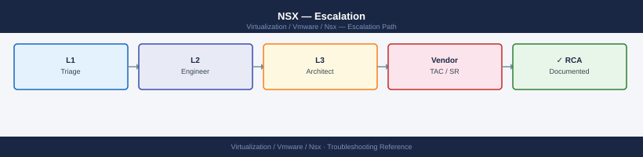

---
tags:
  - nsx
  - nsx-4
  - troubleshooting
  - vmware
search:
  boost: 1.5
description: "How to escalate NSX networking issues to Broadcom support: what data to collect, how to generate the NSX support bundle, step-by-step SR submission on the..."
---
# NSX — Escalation

<div class="kb-summary">
How to escalate NSX networking issues to Broadcom support: what data to collect, how to generate the NSX support bundle, step-by-step SR submission on the Broadcom portal, and the escalation path when progress stalls.

*Applies to: NSX 3.x / 4.x*
</div>



---

```d2
direction: down

symptom: Identify Symptom {shape: diamond}
preescalation_selfcheck: "Pre-Escalation Self-Check" {shape: rectangle}
stepbystep_data_collection: "Step-by-Step Data Collection" {shape: rectangle}
how_to_open_the_sr_on_broadcom_suppo: "How to Open the SR on Broadcom Support Portal" {shape: rectangle}
escalation_path: "Escalation Path" {shape: rectangle}
what_not_to_do: "What NOT to Do" {shape: rectangle}
useful_commands_for_case_updates: "Useful Commands for Case Updates" {shape: rectangle}
resolution: Resolve or Escalate {shape: oval}

symptom -> preescalation_selfcheck: investigate
symptom -> stepbystep_data_collection: investigate
symptom -> how_to_open_the_sr_on_broadcom_suppo: investigate
symptom -> escalation_path: investigate
symptom -> what_not_to_do: investigate
symptom -> useful_commands_for_case_updates: investigate
preescalation_selfcheck -> resolution
stepbystep_data_collection -> resolution
how_to_open_the_sr_on_broadcom_suppo -> resolution
escalation_path -> resolution
what_not_to_do -> resolution
useful_commands_for_case_updates -> resolution
```

## Before you begin

- **Access required:** SSH to each NSX Manager node; NSX Manager API access (admin credentials); Broadcom support account with entitlement to NSX
- **Do this first:** collect all data below before changing anything. Broadcom will ask for the support bundle in their first response
- **Do NOT change DFW rules** while the issue is open — adding or removing rules changes the enforcement state and makes diagnosis harder
- **Do NOT restart NSX Manager** unless Broadcom instructs you to. Restarting a Manager node in a DEGRADED cluster can cause split-brain

---

## Pre-Escalation Self-Check

Run these before opening the SR. Many NSX issues are resolvable without Broadcom.

| Check | What to do | Expected result |
|---|---|---|
| Manager cluster health | NSX Manager UI → System → Overview | All nodes show green |
| Manager cluster API | `curl -sk -u admin:<pw> https://<mgr>/api/v1/cluster/status` | `"control_cluster_status": "STABLE"` |
| Transport nodes | NSX Manager UI → Fabric → Nodes → Transport Nodes | All nodes Connected |
| TEP reachability | SSH to ESXi: `vmkping -I vmk10 <remote-tep-ip> -d -s 1500` | Replies received; increase to 8972 for jumbo |
| BGP sessions | SSH to Edge: `get bgp neighbor summary` | All peers in Established state |
| Alarms | NSX Manager UI → Alarms → Active | Note all CRITICAL alarms |
| NSX-vCenter sync | NSX Manager UI → System → vCenter → Registration status | Status: Connected |
| NSX version | `get version` from Manager CLI or API `/api/v1/node/version` | Matches your change record |

---

## Step-by-Step Data Collection

Run all of these before opening the SR.

### 1. Get the NSX version and build number

```bash
# SSH to any NSX Manager node
ssh admin@<nsx-manager>

# Get version via CLI
get version

# Or via API
curl -sk -u admin:<password> https://<nsx-manager>/api/v1/node/version
# Note: include build number in the SR, not just the release version
```


```text title="Expected output"
admin@nsx-manager-01.lab.local's password: 
NSX Manager> get version
Product: NSX
Version: 3.2.1.0
Build: 21150547
Release Date: 2024-01-15

NSX Manager> exit
Connection to nsx-manager-01.lab.local closed.

$ curl -sk -u admin:MyP@ssw0rd https://nsx-manager-01.lab.local/api/v1/node/version
{
  "product_name": "NSX",
  "product_version": "3.2.1.0",
  "build_number": "21150547",
  "release_date": "2024-01-15T00:00:00Z",
  "node_id": "a7f2c9e1-4b6d-11ee-b56e-005056a1e2c4"
}
```

!!! warning "Common errors"
    **`Permission denied (publickey,password).`** — Verify the admin account credentials and ensure SSH is enabled on the NSX Manager node.
    **`curl: (60) SSL certificate problem: self signed certificate`** — Remove the `-k` flag if using a trusted certificate, or ensure the NSX Manager hostname matches the certificate CN.
    **`NSX Manager> get version: command not found`** — Exit the NSX CLI shell first with `exit`, then use the API call instead, or verify you are connected to an NSX Manager node (not a controller).
### 2. Capture the Manager cluster status

```bash
# Full cluster status — paste this into the SR description
curl -sk -u admin:<password> https://<nsx-manager>/api/v1/cluster/status | python3 -m json.tool

# Control and management cluster nodes
curl -sk -u admin:<password> https://<nsx-manager>/api/v1/cluster/nodes | python3 -m json.tool

# Transport node status — shows all hosts and edges
curl -sk -u admin:<password> "https://<nsx-manager>/api/v1/transport-nodes/status?status=DOWN" | python3 -m json.tool

# Active alarms
curl -sk -u admin:<password> "https://<nsx-manager>/api/v1/alarms?status=OPEN&severity=CRITICAL" | python3 -m json.tool
```


```text title="Expected output"
{
  "cluster_status": "STABLE",
  "cluster_id": "550e8400-e29b-41d4-a716-446655440000",
  "node_count": 3,
  "control_cluster_status": "STABLE",
  "mgmt_cluster_status": "STABLE",
  "last_updated": "2024-01-15T14:32:18.445Z"
}
{
  "result_count": 3,
  "results": [
    {
      "id": "550e8400-e29b-41d4-a716-446655440001",
      "fqdn": "nsx-mgr-01.lab.local",
      "ip_address": "192.168.1.10",
      "status": "UP",
      "role": "MANAGER",
      "version": "3.2.1.0.0.20456789"
    },
    {
      "id": "550e8400-e29b-41d4-a716-446655440002",
      "fqdn": "nsx-mgr-02.lab.local",
      "ip_address": "192.168.1.11",
      "status": "UP",
      "role": "CONTROL_MANAGER",
      "version": "3.2.1.0.0.20456789"
    },
    {
      "id": "550e8400-e29b-41d4-a716-446655440003",
      "fqdn": "nsx-mgr-03.lab.local",
      "ip_address": "192.168.1.12",
      "status": "UP",
      "role": "CONTROL_MANAGER",
      "version": "3.2.1.0.0.20456789"
    }
  ]
}
{
  "result_count": 2,
  "results": [
    {
      "transport_node_id": "tn-edge-01",
      "display_name": "edge-01.lab.local",
      "status": "DOWN",
      "status_detail": "Connection lost",
      "last_heartbeat": "2024-01-15T13:45:22.000Z"
    },
    {
      "transport_node_id": "tn-host-07",
      "display_name": "esx-host-07.lab.local",
      "status": "DOWN",
      "status_detail": "Agent timeout",
      "last_heartbeat": "2024-01-15T12:18:55.000Z"
    }
  ]
}
{
  "result_count": 1,
  "results": [
    {
      "id": "alarm-550e8400-e29b-41d4-a716-446655440099",
      "title": "Control Cluster Node Disconnected",
      "severity": "CRITICAL",
      "status": "OPEN",
      "entity_id": "550e8400-e29b-41d4-a716-446655440002",
      "created_time": "2024-01-15T14:15:33.000Z",
      "description": "Control cluster node nsx-mgr-02 is
```
### 3. Generate the NSX support bundle (takes 10–30 minutes)

```bash
# Trigger support bundle generation via API
curl -sk -u admin:<password> \
  -X POST \
  -H "Content-Type: application/json" \
  -d '{"log_age": 48, "components": ["MANAGER", "CONTROLLER", "EDGE", "HOST"]}' \
  "https://<nsx-manager>/api/v1/node/support-bundles"
# Note the bundle ID returned in the response

# Poll for completion — repeat until status shows "SUCCESS"
curl -sk -u admin:<password> \
  "https://<nsx-manager>/api/v1/node/support-bundles/status"

# Download the bundle (URL provided in the status response)
curl -sk -u admin:<password> \
  -O "https://<nsx-manager>/api/v1/node/support-bundles/download/<bundle-id>"
```


```text title="Expected output"
{
  "bundle_id": "support-bundle-20240115-143052-a7f2c9e1",
  "status": "IN_PROGRESS",
  "progress": 0,
  "timestamp": "2024-01-15T14:30:52.000Z"
}

{
  "bundle_id": "support-bundle-20240115-143052-a7f2c9e1",
  "status": "IN_PROGRESS",
  "progress": 45,
  "timestamp": "2024-01-15T14:30:52.000Z"
}

{
  "bundle_id": "support-bundle-20240115-143052-a7f2c9e1",
  "status": "SUCCESS",
  "progress": 100,
  "file_size": 524288000,
  "download_url": "/api/v1/node/support-bundles/download/support-bundle-20240115-143052-a7f2c9e1",
  "timestamp": "2024-01-15T14:35:18.000Z"
}

  % Total    % Received % Xferd  Average Speed   Time    Time     Time  Current
                                 Dload  Upload   Total   Spent    Left  Speed
100  500M  100  500M    0     0  45.2M      0  0:00:11  0:00:11 --:--:-- support-bundle-20240115-143052-a7f2c9e1.tar.gz
```

!!! warning "Common errors"
    **`curl: (60) SSL certificate problem: self signed certificate`** — Add `-k` flag to skip SSL verification (already included in the example, but ensure it's present if you remove it).
    **`{"error":"Invalid credentials","status":401}`** — Verify the NSX Manager admin password is correct and URL is reachable with `ping <nsx-manager>`.
    **`{"error":"Bundle generation failed","status":"FAILED","reason":"Insufficient disk space"}`** — Free up disk space on the NSX Manager node or reduce log_age parameter to collect fewer days of logs.
### 4. Run Traceflow (for traffic drop or DFW issues)

In NSX Manager UI:

1. Go to **Plan & Troubleshoot** → **Traceflow**.
2. Fill in source VM, destination IP, protocol, and port.
3. Click **Trace**. Wait for results.
4. Click **Export** to download the trace as a JSON or PDF file. Attach this to the SR.

Include in the SR description: source VM, destination, the rule or component that dropped the packet, and what you expected to happen.

### 5. Write the timeline

```text
NSX version: 4.1.2 build 23182604
Manager nodes: nsx-mgr-01, nsx-mgr-02, nsx-mgr-03
vCenter: vcenter-01 (8.0 U2)
Issue first observed: 2026-06-14 14:30 UTC
Last known good state: 2026-06-14 09:00 UTC
Changes in the 24h before the issue:
  - 09:00: NSX 4.1.1 → 4.1.2 upgrade initiated via LCM
  - 14:25: Upgrade task showed FAILED on Edge cluster upgrade
  - 14:30: DFW drops reported on 3 workload VMs
Steps already taken:
  - Verified Manager cluster status: STABLE (Managers OK, Edges failed)
  - Ran Traceflow: packet dropped at DFW rule ID 1234 on host esxi-prod-02
  - Did NOT retry the upgrade or modify DFW rules
Blast radius: 3 VMs in tenant-A segment can no longer reach database segment
```

---

## How to Open the SR on Broadcom Support Portal

1. Go to **support.broadcom.com** and sign in. If you do not have an account: click **Register** and use your company email — entitlement is linked to your Broadcom contract.

2. Click **Open a New Case** in the top navigation.

3. Under **Select Product Family**, choose **VMware NSX**.

4. Under **Product Version**, select your exact NSX version from the drop-down.

5. Under **Request Type**, select **Technical**.

6. Under **Severity**, select:
   - **S1 — Critical**: NSX Manager cluster DEGRADED and you cannot manage networking; DFW drops all production traffic; network is completely down with no workaround
   - **S2 — Major**: A key NSX workflow is failing (upgrade, Edge deployment) but existing VMs retain network connectivity; you have a partial workaround
   - **S3 — Minor**: Single tenant segment affected; non-critical feature degraded; network remains functional for most VMs
   - **S4 — General**: How-to, pre-check, or non-urgent configuration question

7. In the **Summary** field, write one sentence: product + symptom + scope. Example: `NSX 4.1.2 — Edge cluster upgrade failed at 14:25 UTC, DFW dropping traffic for 3 VMs in tenant-A segment`.

8. In the **Description** field, paste:
   - NSX version and build number
   - Manager cluster status API output
   - The timeline from Step 5
   - Traceflow export result (summarise what was dropped and where)
   - Active CRITICAL alarms list
   - What you have already tried

9. Under **Attachments**, upload:
   - The NSX support bundle from Step 3
   - The Traceflow export from Step 4
   - Any screenshots of NSX Manager alarms or cluster status

10. Click **Submit**. You will receive a case number by email immediately.

11. **S1 only:** the case confirmation page shows a regional phone number. Call it immediately and state "Severity 1 — NSX network is down" at the start of the call.

---

## Escalation Path

```text
Step 1 — Open case at support.broadcom.com with NSX support bundle attached
         ↓
Step 2 — T1 support acknowledges and confirms bundle received (typically 30 min–4 hr)
         ↓
Step 3 — If no meaningful progress in 4 hours for S1 or 1 business day for S2:
         → Reply in the case: "Requesting T2 NSX Senior Engineer assignment"
         → State: "Impact: [X] VMs offline / Manager DEGRADED / upgrade failed"
         ↓
Step 4 — T2 NSX SE is assigned; they will schedule a live Zoom/Webex session
         → Have SSH access to NSX Manager and Edge nodes ready for the call
         → Have vSphere Client and NSX Manager UI open
         ↓
Step 5 — If T2 cannot resolve and issue requires code-level investigation:
         → T2 escalates to T3 (NSX engineering) — you do not need to initiate this
         ↓
Step 6 — For complete network outage, data loss risk, or 24h+ with no resolution:
         → Request a Critical Situation (CritSit) engagement
         → Add to case: "Requesting CritSit — [reason: network down / 24h no progress]"
         → CritSit brings dedicated team lead + exec visibility
```

---

## What NOT to Do

| Do NOT do this | Why | What to do instead |
|---|---|---|
| Restart NSX Manager service | Can cause split-brain in the Manager cluster if nodes are mid-sync | Only restart if explicitly instructed by Broadcom GSS |
| Reboot Edge nodes | Causes BGP session drops and traffic loss across all tenants using that Edge | Have GSS assess which Edge is safe to reboot first |
| Add or delete DFW rules mid-incident | Changes enforcement state; makes Traceflow results unreliable | Freeze all firewall policy changes until resolution |
| Retry a failed NSX upgrade | Can leave Managers and Edges at mixed versions; harder to recover | Wait for GSS to confirm the upgrade is safe to retry |
| Delete and re-add a Transport Node | Loses all TEP and host prep configuration | Document the node state and escalate |
| Resolve alarms manually without root cause | Masking the alarm does not fix the underlying issue | Leave alarms active for GSS to use in diagnosis |

---

## Useful Commands for Case Updates

Paste these into case replies to show Broadcom the current state.

```bash
# NSX Manager CLI (SSH to any Manager node: ssh admin@<mgr>)
nsxcli
get cluster status
get managers
get services
get corfu-cluster status

# Transport node and tunnel status
get transport-node-status
get tunnel status

# Edge node CLI (SSH to each Edge: ssh admin@<edge-ip>)
get version
get services
get bgp neighbor summary
get edge-cluster status
get interfaces

# From NSX Manager API (curl from management workstation)
# Manager cluster
curl -sk -u admin:<pw> https://<mgr>/api/v1/cluster/status | python3 -m json.tool

# Transport nodes in DOWN state
curl -sk -u admin:<pw> "https://<mgr>/api/v1/transport-nodes/status?status=DOWN" | python3 -m json.tool

# All active alarms
curl -sk -u admin:<pw> "https://<mgr>/api/v1/alarms?status=OPEN" | python3 -m json.tool

# Logical router status (for BGP/routing issues)
curl -sk -u admin:<pw> "https://<mgr>/api/v1/logical-routers" | python3 -m json.tool
```


```text title="Expected output"
nsx-manager-01> nsxcli
nsx-manager-01# get cluster status
Cluster Status: STABLE
Node ID: 42a7c8d1-9f2e-4b6c-a1e3-7d5f9c2b8e4a
Node IP: 192.168.1.10
Node Status: UP
Cluster Node Count: 3

nsx-manager-01# get managers
Manager Nodes:
  192.168.1.10  nsx-manager-01  UP
  192.168.1.11  nsx-manager-02  UP
  192.168.1.12  nsx-manager-03  UP

nsx-manager-01# get services
Service Name              Status    PID
nsx-manager              UP        4521
policy-service           UP        5847
cluster-service          UP        3294
corfu-service            UP        2156
messaging-service        UP        6123

nsx-manager-01# get corfu-cluster status
Corfu Cluster Status: READY
Cluster Size: 3
Layout Epoch: 127

nsx-manager-01# get transport-node-status
Transport Node Status Summary:
  UP: 24
  DOWN: 1
  DEGRADED: 0

nsx-manager-01# get tunnel status
Tunnel Status Summary:
  UP: 156
  DOWN: 3
  UNKNOWN: 0

edge-01> get version
NSX Edge Version: 3.2.1.0
Build: 18414822
Release Date: 2023-11-15

edge-01> get services
Service Name              Status    PID
nsx-edge                 UP        7234
datapath                 UP        8156
bgp-service              UP        5421

edge-01> get bgp neighbor summary
Neighbor Address    AS      State       Uptime
10.0.0.1           65001   Established 14d 5h 23m
10.0.0.2           65001   Established 8d 12h 44m
10.0.0.3           65002   Connect     0h 2m 15s

edge-01> get edge-cluster status
Edge Cluster: edge-cluster-01
Status: ACTIVE
Member Count: 2
Active Members: 2

edge-01> get interfaces
Interface Name    IP Address        Status    MTU
eth0              10.20.30.41/24    UP        1500
eth1              10.20.30.42/24    UP        1500
eth2              10.20.30.43/24    UP        1500

{
  "cluster_status": "STABLE",
  "node_count": 3,
  "online_nodes": 3,
  "offline_nodes": 0,
  "degraded_nodes": 0
}

{
  "results": [
    {
      "transport_node_id": "tn-456",
      "display_name": "esx-host-07",
      "status": "DOWN",
      "last_heartbeat_timestamp": 1699564821000
    }
  ],
  "result_count": 1
}

{
  "results": [
    {
      "id": "alarm-789",
      "title": "Transport Node Connectivity Lost",
```
---

## Support Portal and SLA Reference

| Severity | Definition | Initial Response SLA |
|---|---|---|
| S1 — Critical | Network down; Manager DEGRADED; data at risk; no workaround | 30 minutes (24×7) |
| S2 — Major | Upgrade failed; key feature broken; VMs still connected | 4 hours |
| S3 — Minor | Single segment issue; non-critical feature degraded | 1 business day |
| S4 — General | How-to, pre-check, documentation question | 2 business days |

---

## See also

- [NSX — Diagnostics](../diagnostics/)
- [NSX — Common Issues](../common-issues/)

---

## Verify resolution

- NSX Manager UI → System → Overview shows all Manager nodes green and cluster status STABLE
- All Transport Nodes show Connected in Fabric → Nodes
- Run Traceflow for the same source/destination that was failing — confirm packet reaches destination
- BGP sessions restored: SSH to Edge → `get bgp neighbor summary` → all peers Established
- Run `curl -sk -u admin:<pw> https://<mgr>/api/v1/alarms?status=OPEN&severity=CRITICAL` and confirm zero active critical alarms
- Monitor NSX Manager Alarms page for 15 minutes and confirm no new alerts
