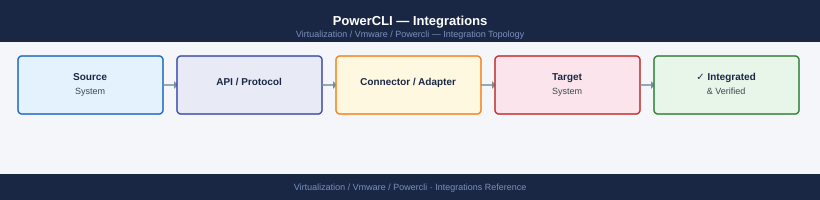

---
tags:
  - architecture
  - powercli
  - vmware
description: "PowerCLI integrates with the full VMware product stack. Each product family has its own module. Most require a separate Connect- call in addition to..."
---
# PowerCLI — Integrations

<div class="kb-summary">
PowerCLI integrates with the full VMware product stack. Each product family has its own module. Most require a separate Connect- call in addition to Connect-VIServer.

*Applies to: PowerCLI 13.x*
</div>


## NSX-T Integration

```powershell
# Install NSX-T module (if not present)
Install-Module VMware.VimAutomation.Nsxt -Scope CurrentUser

# Connect to NSX-T Manager
Connect-NsxtServer -Server nsxmgr.example.com -User admin -Password 'AdminP@ss'

# List logical segments
Get-NsxtSegment | Select-Object DisplayName, Id, ConnectivityPath

# Get transport nodes (ESXi hosts in NSX-T fabric)
Get-NsxtTransportNode | Select-Object DisplayName, NodeDeploymentState

# Disconnect
Disconnect-NsxtServer -Confirm:$false
```

## vSAN Integration

```powershell
# vSAN cmdlets are part of VMware.VimAutomation.Storage
# No separate connection needed — uses the vCenter session

# Cluster vSAN health
$cluster = Get-Cluster -Name "Production"
Get-VsanDisk -VMHost (Get-VMHost -Location $cluster) | Select-Object CanonicalName, State, VsanDiskGroup

# vSAN health summary via vSAN API
$vsanSystem = Get-VsanView -Id "VsanVcClusterHealthSystem-vsan-cluster-health-system"
$healthResult = $vsanSystem.VsanQueryVcClusterHealthSummary($cluster.ExtensionData.MoRef, $null, $null, $true, $null, $null, 'defaultView')
$healthResult.OverallHealth   # green / yellow / red
```

## Site Recovery Manager (SRM)

```powershell
# Connect to SRM (requires vCenter session first)
Connect-SrmServer -Server srm.example.com -Credential $cred

# List recovery plans
Get-SrmRecoveryPlan | Select-Object Name, State

# Get protected VMs in a plan
$plan = Get-SrmRecoveryPlan -Name "Tier1-DR"
$plan | Get-SrmProtectionGroup | Get-SrmProtectedVM | Select-Object Name, State

# Test failover (non-disruptive)
$plan | Start-SrmRecoveryPlan -RecoveryMode Test

Disconnect-SrmServer -Confirm:$false
```

## HCX Migration Integration

```powershell
# HCX module connects to HCX Manager
Connect-HcxServer -Server hcx.example.com -User admin@local -Password 'P@ssword'

# List service meshes (source+destination site pairing)
Get-HcxServiceMesh | Select-Object Name, LocalSiteName, RemoteSiteName, State

# List active migrations
Get-HcxMigration | Where-Object { $_.State -eq 'RUNNING' } | Select-Object Name, State, Progress

Disconnect-HcxServer -Confirm:$false
```

## vROps / Aria Operations

```powershell
# Connect to vROps REST API via PowerCLI (uses REST module)
# VMware.vSphere.SsoAdmin and separate REST modules for vROps

# Alternative: use direct REST API via Invoke-RestMethod
$vROpsServer = "vrops.example.com"
$headers = @{ Authorization = "Basic " + [Convert]::ToBase64String([Text.Encoding]::ASCII.GetBytes("admin:password")) }
$alerts = Invoke-RestMethod -Uri "https://$vROpsServer/suite-api/api/alerts" -Headers $headers -SkipCertificateCheck
$alerts.alerts | Select-Object alertDefinitionName, alertLevel, status
```

## CI/CD Pipeline Integration

PowerCLI works in automated pipelines. Common patterns:

```yaml
# GitHub Actions example
name: vSphere Validation
on: [push]
jobs:
  validate:
    runs-on: [self-hosted, windows]   # needs Windows runner with PowerCLI installed
    steps:
      - uses: actions/checkout@v4
      - name: Connect and validate
        shell: pwsh
        env:
          VCENTER_USER: ${{ secrets.VCENTER_USER }}
          VCENTER_PASS: ${{ secrets.VCENTER_PASS }}
        run: |
          $cred = New-Object PSCredential($env:VCENTER_USER, (ConvertTo-SecureString $env:VCENTER_PASS -AsPlainText -Force))
          Connect-VIServer -Server vcenter.example.com -Credential $cred
          # Run validation
          $hosts = Get-VMHost | Where-Object { $_.ConnectionState -ne 'Connected' }
          if ($hosts) { throw "Disconnected hosts: $($hosts.Name -join ', ')" }
          Disconnect-VIServer -Confirm:$false
```

## See also

- [PowerCLI — How It Works](../how-it-works/)
- [PowerCLI — Deploy](../../deploy/)
