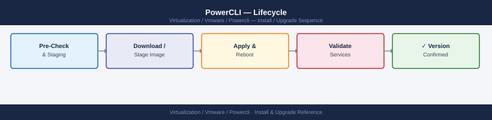

---
tags:
  - operations
  - powercli
  - vmware
description: "PowerCLI module lifecycle: upgrading to new versions, managing individual sub-modules, handling multi-vCenter version compatibility, and offline bundle..."
---
# PowerCLI — Lifecycle

<div class="kb-summary">
PowerCLI module lifecycle: upgrading to new versions, managing individual sub-modules, handling multi-vCenter version compatibility, and offline bundle management.

*Applies to: PowerCLI 13.x*
</div>


## Before you begin

- **Access:** vCenter read-only minimum; Administrator role for remediation steps
- **Timing:** safe to run during business hours unless a step is marked ⚠ (causes interruption)
- **Dependencies:** no active upgrades or migrations on the same infrastructure
- **Logging:** capture command output — paste into the change record on completion

---

!!! warning "Host enters maintenance mode"
    ESXi remediation puts hosts into maintenance mode, triggering DRS evacuation. Confirm DRS is Fully Automated and HA admission control is satisfied before starting.

## Check Installed Version

```powershell
# Show all installed PowerCLI modules
Get-Module -Name VMware.* -ListAvailable | Select-Object Name, Version | Sort-Object Name

# Show the main PowerCLI meta-package version
Get-Module -Name VMware.PowerCLI -ListAvailable | Select-Object Name, Version
```

## Upgrade PowerCLI

```powershell
# Upgrade from PSGallery (online)
Update-Module -Name VMware.PowerCLI -Force

# Verify new version
Get-Module -Name VMware.PowerCLI -ListAvailable | Select-Object Name, Version
```

## Selectively Install Sub-modules

```powershell
# Install only the modules you need (reduces footprint)
Install-Module VMware.VimAutomation.Core    -Scope CurrentUser
Install-Module VMware.VimAutomation.Vds     -Scope CurrentUser
Install-Module VMware.VimAutomation.Storage -Scope CurrentUser
Install-Module VMware.VimAutomation.Nsxt    -Scope CurrentUser

# Skip unused modules (e.g., Horizon, HCX) for faster import
```

## Offline Upgrade

```powershell
# On internet-connected machine: download bundle
Save-Module -Name VMware.PowerCLI -Path C:\PSModules -Repository PSGallery

# Copy C:\PSModules to airgapped host, then install
$modulePath = "C:\PSModules"
$env:PSModulePath = "$modulePath;$($env:PSModulePath)"

# Or copy directly into module path
$targetPath = "$([Environment]::GetFolderPath('MyDocuments'))\PowerShell\Modules"
Copy-Item -Path "$modulePath\VMware*" -Destination $targetPath -Recurse -Force
```

## Multi-vCenter Compatibility

PowerCLI connects to vCenter using the vSphere API version supported by the vCenter. When you manage multiple vCenter versions:

```powershell
# Connect to multiple vCenters (different versions)
Connect-VIServer -Server vcenter-old.example.com   # vCenter 7.0
Connect-VIServer -Server vcenter-new.example.com   # vCenter 8.0

# PowerCLI tracks all active connections
$global:DefaultVIServers | Select-Object Name, Version, Build

# Target a specific vCenter in cmdlets
Get-VM -Server vcenter-old.example.com | Select-Object Name
```

**Compatibility notes:**
- PowerCLI 13+ supports vCenter 6.5 through 8.x
- Newer cmdlet parameters may not exist against older APIs — wrap in `try/catch`
- `Get-VsanClusterHealthSummary` requires vSAN API availability (vCenter ≥ 6.5)

## Uninstall Old Modules

```powershell
# Remove specific old version
Uninstall-Module -Name VMware.PowerCLI -RequiredVersion 13.0.0 -Force

# Remove all VMware modules (clean slate)
Get-Module -Name VMware.* -ListAvailable | ForEach-Object {
    Uninstall-Module -Name $_.Name -AllVersions -Force -ErrorAction SilentlyContinue
}
```

## Module Load Time Optimization

```powershell
# Reduce startup time: import only needed sub-modules
# Instead of: Import-Module VMware.PowerCLI  (loads all 40+ sub-modules)
Import-Module VMware.VimAutomation.Core
Import-Module VMware.VimAutomation.Storage

# Measure import time
Measure-Command { Import-Module VMware.PowerCLI } | Select-Object TotalSeconds
```

---

## See also

- [PowerCLI — Health Checks](../health-checks/)
- [PowerCLI — Common Issues](../../troubleshooting/common-issues/)
- [PowerCLI — Procedures](../procedures/)

## Verify

- **Alarms:** vSphere Client → Home → Alarms — no new critical alarms after the operation
- **Events:** monitor the vCenter Events view for the affected object for 5 minutes
- **Health check:** run the morning health-check sequence for the affected product tier
