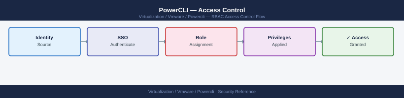

---
tags:
  - powercli
  - security
  - vmware
---
# PowerCLI — Access Control

<div class="kb-summary">
Managing vSphere RBAC via PowerCLI: auditing existing permissions, creating automation service roles with least-privilege, assigning roles to objects, and detecting permission sprawl.

*Applies to: PowerCLI 13.x*
</div>


## Before you begin

- **Access:** vCenter Administrator role
- **Change management:** security changes require CAB approval in most environments
- **Rollback plan:** document current state before any security control change
- **Testing:** validate in a non-production environment first where possible

---

## Audit Existing Permissions

```powershell
# List all permissions on a vCenter (flattened)
Get-VIPermission | Select-Object Principal, Role, Entity, Propagate | Sort-Object Principal | Format-Table -AutoSize

# Find all permissions for a specific principal
Get-VIPermission | Where-Object { $_.Principal -like "*svc-automation*" } | Select-Object Entity, Role, Propagate

# List built-in roles
Get-VIRole | Select-Object Name, Description | Sort-Object Name
```

## Create a Least-Privilege Automation Role

Automation accounts should have only the privileges required — not Administrator.

```powershell
# Required privileges for a read-only inventory role
$readPrivs = @(
    "System.Anonymous",
    "System.View",
    "System.Read",
    "VirtualMachine.Inventory.Create",
    "VirtualMachine.State.RenameSnapshot"
)

# Create a custom role
New-VIRole -Name "Automation-ReadOnly" -Privilege (Get-VIPrivilege -Id $readPrivs)

# Create a VM operator role (power ops + snapshots, no config change)
$operatorPrivs = @(
    "System.Anonymous", "System.View", "System.Read",
    "VirtualMachine.Interact.PowerOn",
    "VirtualMachine.Interact.PowerOff",
    "VirtualMachine.Interact.Reset",
    "VirtualMachine.Interact.GuestControl",
    "VirtualMachine.State.CreateSnapshot",
    "VirtualMachine.State.RemoveSnapshot",
    "VirtualMachine.State.RevertToSnapshot"
)
New-VIRole -Name "Automation-VMOperator" -Privilege (Get-VIPrivilege -Id $operatorPrivs)
```

## Assign Role to Service Account

```powershell
# Assign at datacenter level (propagates to all child objects)
$dc = Get-Datacenter -Name "Production-DC"
New-VIPermission -Entity $dc -Principal "DOMAIN\svc-automation" -Role (Get-VIRole -Name "Automation-VMOperator") -Propagate $true

# Assign at cluster level only
$cluster = Get-Cluster -Name "Production"
New-VIPermission -Entity $cluster -Principal "DOMAIN\svc-monitoring" -Role (Get-VIRole -Name "Automation-ReadOnly") -Propagate $true

# Assign at individual VM level
$vm = Get-VM -Name "web01"
New-VIPermission -Entity $vm -Principal "DOMAIN\svc-backup" -Role (Get-VIRole -Name "Automation-VMOperator") -Propagate $false
```

## Modify and Remove Permissions

```powershell
# Update an existing permission (change role)
$perm = Get-VIPermission | Where-Object { $_.Principal -eq "DOMAIN\svc-automation" -and $_.Entity.Name -eq "Production-DC" }
Set-VIPermission -Permission $perm -Role (Get-VIRole -Name "Automation-ReadOnly")

# Remove a permission
!!! warning "Removes permission immediately — verify principal and scope first"
    This command removes permissions for the matched principal without confirmation. Double-check the filter (`Where-Object`) before running to avoid accidentally revoking access for the wrong group. Run with `-WhatIf` to preview if supported in your PowerCLI version.

$perm | Remove-VIPermission -Confirm:$false
```

## Detect Permission Sprawl

```powershell
# Find principals with Administrator role (should be minimal)
Get-VIPermission | Where-Object { $_.Role -eq "Admin" } | Select-Object Principal, Entity, Propagate

# Find permissions at root/vCenter level (broad blast radius)
Get-VIPermission | Where-Object { $_.Entity.GetType().Name -eq "VCenterInventoryImpl" } | Select-Object Principal, Role

# Find service accounts with excessive scope
Get-VIPermission | Where-Object { $_.Principal -like "*svc-*" -and $_.Propagate } |
    Select-Object Principal, Role, @{N="Entity";E={$_.Entity.Name}} | Sort-Object Principal
```

## Permission Inheritance Check

```powershell
# Show effective permissions on a VM (including inherited)
$vm = Get-VM -Name "prod-web01"
$perms = Get-VIPermission | Where-Object { $_.Entity.Id -eq $vm.Id -or $_.Propagate }
$perms | Select-Object Principal, Role, Entity, Propagate | Format-Table -AutoSize
```

## See also

- [PowerCLI — Authentication](../authentication/)
- [PowerCLI — Hardening](../hardening/)
