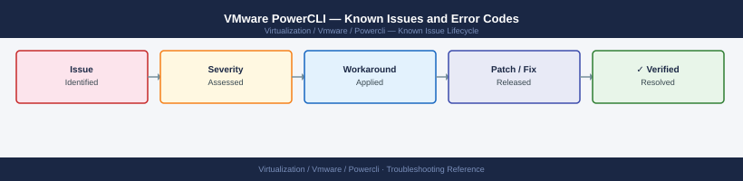

---
tags:
  - troubleshooting
  - powercli
  - vmware
  - known-issues
description: "Catalog of known PowerCLI bugs, error codes, and workarounds covering module loading, certificate handling, and API compatibility."
---
# VMware PowerCLI — Known Issues and Error Codes

<div class="kb-summary">
Catalog of known PowerCLI bugs, error codes, and workarounds covering module loading, certificate handling, and API compatibility.

*Applies to: PowerCLI 12.x / 13.x*
</div>



```d2
direction: down

symptom: Identify Symptom {shape: diamond}
connection_and_authentication: "Connection and Authentication" {shape: rectangle}
module_loading: "Module Loading" {shape: rectangle}
api_and_cmdlet: "API and Cmdlet" {shape: rectangle}
resolution: Resolve or Escalate {shape: oval}

symptom -> connection_and_authentication: investigate
symptom -> module_loading: investigate
symptom -> api_and_cmdlet: investigate
connection_and_authentication -> resolution
module_loading -> resolution
api_and_cmdlet -> resolution
```

## Before you begin

- Run `Get-Module -Name VMware* -ListAvailable` to check installed module versions.
- Certificate errors are the most common PowerCLI issue — set `Set-PowerCLIConfiguration -InvalidCertificateAction Ignore` for lab environments only.
- PowerCLI 13.x requires PowerShell 7.x on Linux/Mac — PowerShell 5.1 is Windows-only.

## Connection and Authentication

| Error / Symptom | Affected Versions | Cause | Workaround / Fix | Fixed In |
|---|---|---|---|---|
| `Connect-VIServer: Certificate error` | All | vCenter using self-signed certificate | Set `Set-PowerCLIConfiguration -InvalidCertificateAction Ignore` (lab only); or install CA cert | N/A |
| `Error: Could not connect using the requested protocol` | PowerCLI 13.x | TLS 1.0/1.1 disabled on vCenter but .NET enforcing older TLS | Set `[System.Net.ServicePointManager]::SecurityProtocol = 'Tls12'` before connecting | N/A |
| `You are not currently connected to any servers` after `Connect-VIServer` | All | Connection silently failed (no error thrown) | Check `$global:DefaultVIServers`; reconnect with `-ErrorAction Stop` to expose error | N/A |

## Module Loading

| Error / Symptom | Affected Versions | Cause | Workaround / Fix | Fixed In |
|---|---|---|---|---|
| `Import-Module VMware.PowerCLI: Could not load file` | PowerCLI 12.x on Linux | Missing .NET runtime dependency | Install `dotnet-runtime-6.0`; re-import module | N/A |
| Conflicting module versions between PowerCLI and VMware.Sdk.* | PowerCLI 13.x | Mixed version modules from PSGallery and manual install | Uninstall all VMware modules: `Get-Module VMware* | Uninstall-Module`; reinstall clean | N/A |

## API and Cmdlet

| Error / Symptom | Affected Versions | Cause | Workaround / Fix | Fixed In |
|---|---|---|---|---|
| `Get-VM` returns no VMs despite connected to vCenter | All | Connected to ESXi host directly — host scope only | Connect to vCenter Server, not ESXi host, for cluster-wide queries | N/A |
| `New-VM` fails: `Operation is not supported in the current state` | All | Target host in maintenance mode or resource pool insufficient | Remove host from maintenance mode; verify resource pool memory/CPU headroom | N/A |
| `Set-VMHostNtpServer` doesn't persist after ESXi reboot | All | NTP config applied but ntpd service not restarted | Run `Get-VMHostService -VMHost $h | Where-Object {$_.Key -eq "ntpd"} | Restart-VMHostService` | N/A |

## See also

- [VMware PowerCLI — Common Issues](../common-issues/)
- [VMware vCenter — Known Issues](../../vcenter/troubleshooting/known-issues.md)
