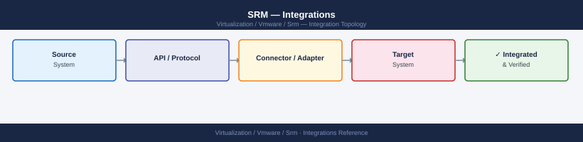

---
tags:
  - architecture
  - srm
  - vmware
description: "Integrations reference covering Storage Replication Adapter (SRA) Integration, vSphere Replication Integration, NSX-T Integration for Network Mapping..."
---
# SRM — Integrations

<div class="kb-summary">
Integrations reference covering Storage Replication Adapter (SRA) Integration, vSphere Replication Integration, NSX-T Integration for Network Mapping, Active Directory / Identity Integration, Identity Federation with vIDM / Workspace ONE Access and 1 more sections.

*Applies to: SRM 8.x*
</div>


## Storage Replication Adapters

**Array Manager configuration for Pure:**

| Field | Value |
|---|---|
| SRA type | Pure Storage FlashArray SRA |
| Array Management IP | FlashArray management VIP |
| Username | `srmuser` (create dedicated account on array) |
| Password | Array account password |
| Protocol | HTTPS |

**Pure minimum permissions for SRA account:**

The SRA account on the Pure FlashArray requires `array_admin` role for replication operations (failover, reverse).

```bash
# On Pure FlashArray CLI
purecli user create srmuser --role array_admin
purecli user setpassword srmuser
```


```text title="Expected output"
User srmuser created successfully
Password updated for user srmuser
```

!!! warning "Common errors"
    **`Error: User srmuser already exists`** — Delete the existing user with `purecli user delete srmuser` before recreating it.
    **`Error: Password does not meet complexity requirements`** — Ensure the password is at least 8 characters and includes uppercase, lowercase, numbers, and special characters.
### SRA for Dell PowerStore / EMC

Dell provides SRAs for multiple product lines.

**PowerStore SRA (appliance):**

```bash
scp Dell_SRA_for_PowerStore_<version>.tar.gz root@srm-appliance:/tmp/
ssh root@srm-appliance
cd /tmp
tar xzf Dell_SRA_for_PowerStore_<version>.tar.gz
./install.sh
systemctl restart vmware-dr
```


```text title="Expected output"
Dell_SRA_for_PowerStore_<version>.tar.gz                                100%  245MB   12.3MB/s   00:20
root@srm-appliance's password: 
root@srm-appliance:~# cd /tmp
root@srm-appliance:/tmp# tar xzf Dell_SRA_for_PowerStore_<version>.tar.gz
root@srm-appliance:/tmp# ./install.sh
Dell SRA for PowerStore Installation Script v2.1.4
Extracting SRA components...
Installing SRA adapter files to /opt/vmware/srm/lib/adapters/
Registering SRA with Site Recovery Manager...
Installation completed successfully. SRA version 2.1.4 installed.
root@srm-appliance:/tmp# systemctl restart vmware-dr
root@srm-appliance:/tmp#
```

!!! warning "Common errors"
    **`tar: Dell_SRA_for_PowerStore_<version>.tar.gz: No such file or directory`** — Verify the exact filename with `ls -la /tmp/` and replace `<version>` with the actual version number in the filename.
    **`./install.sh: Permission denied`** — Run `chmod +x install.sh` before executing the script.
    **`Failed to restart unit vmware-dr.service: Unit vmware-dr.service not found.`** — Confirm the SRM service name with `systemctl list-units --type=service | grep vmware` and use the correct service name.
**PowerStore SRA credentials:**

| Field | Value |
|---|---|
| Array Management IP | PowerStore Manager IP |
| Username | Local admin user |
| Password | Admin password |
| Port | 443 |

Dell SRA writes logs to `/var/log/vmware/srm/` alongside SRM logs.

---

## vSphere Replication Integration

vSphere Replication requires:

1. **VR Appliance** deployed at each site (OVA from VMware download portal).
2. VR Appliance registered with local vCenter.
3. VR Appliances **paired** between sites.
4. SRM configured to use the VR Appliances.

### VR Appliance Deployment

```bash
# Deploy via govc
govc import.ova \
  --ds=vsanDatastore \
  --net="Management" \
  --name=vr-appliance-01 \
  vSphere_Replication_OVF10.ova
```


```text title="Expected output"
Uploading vSphere_Replication_OVF10.ova... 100%
Importing OVA file...
Creating virtual machine vr-appliance-01...
Configuring network interface to Management...
Registering VM on vsanDatastore...
vr-appliance-01 successfully imported
VM UUID: 502e4d63-8c2a-4e1f-9b8a-7d2c1a9f3e5b
Power state: poweredOff
```

!!! warning "Common errors"
    **`Error: datastore 'vsanDatastore' not found`** — Verify the datastore name with `govc datastore.ls` and ensure it is accessible from the current vCenter connection.
    **`Error: network 'Management' not found`** — Confirm the port group name exists with `govc network.ls` and use the full network path if it's in a folder.
    **`Error: failed to parse OVA: invalid manifest`** — Verify the OVA file is not corrupted by checking its integrity with `tar -tzf vSphere_Replication_OVF10.ova` and re-download if necessary.
After deployment:
- Access VR Appliance VAMI at `https://<vr-ip>:5480`
- Configure: network, NTP, password
- Register with vCenter: VAMI → Configuration → vSphere Replication → **Register**

### VR Appliance Pairing

VR pairing is done from SRM UI: Site Recovery → Replication → Configure Replication, or from the VR VAMI: Configuration → vSphere Replication → Remote Sites → **Add Remote Site**. Enter remote VR appliance FQDN/IP and accept certificate.

Required firewall ports between VR appliances:

| Port | Protocol | Purpose |
|---|---|---|
| 80, 443 | TCP | VAMI and API |
| 44046 | TCP | Replication data (VR appliance → recovery ESXi) |
| 10000, 10001 | TCP | VR management channel |
| 31031 | TCP | HBR (host-based replication) control |

### VR Replication Configuration per VM

Configure replication per VM in vSphere Client → VM → **Configure** → **vSphere Replication**:

| Parameter | Description |
|---|---|
| RPO | 5 min – 24 hours |
| Target site | Recovery site VR appliance |
| Target datastore | Where to store replicated VMDK on recovery site |
| Enable quiescing | Quiesce guest OS before snapshot (requires VMware Tools) |
| Enable compression | Compress replication stream (reduces bandwidth, increases CPU) |
| Enable encryption | Encrypt replication stream in transit |

### VR Appliance Health Check

```bash
# SSH to VR appliance
ssh admin@vr-appliance.example.com

# Check VR service status
systemctl status vmware-vcd-watchdog
systemctl status vmware-hbrsrv

# List active replication sessions
hbr-configure -l

# VR log location
ls -lh /var/log/vmware/
# hbrsrv.log      — main replication server log
# vmware-vcd-watchdog.log — VR daemon log
```


```text title="Expected output"
admin@vr-appliance.example.com's password: 
● vmware-vcd-watchdog.service - VMware VCD Watchdog
     Loaded: loaded (/usr/lib/systemd/system/vmware-vcd-watchdog.service; enabled; vendor preset: enabled)
     Active: active (running) since Mon 2024-01-15 14:32:18 UTC; 2 days ago
   Main PID: 2847 (vmware-vcd-watc)
      Tasks: 4 (limit: 4915)
     Memory: 45.2M
        CPU: 2h 14m 32s
     CGroup: /system.slice/vmware-vcd-watchdog.service
             └─2847 /usr/lib/vmware-vcd/bin/vmware-vcd-watchdog

● vmware-hbrsrv.service - VMware Host-Based Replication Server
     Loaded: loaded (/usr/lib/systemd/system/vmware-hbrsrv.service; enabled; vendor preset: enabled)
     Active: active (running) since Mon 2024-01-15 14:32:22 UTC; 2 days ago
   Main PID: 2891 (hbrsrv)
      Tasks: 18 (limit: 4915)
     Memory: 128.7M
        CPU: 5h 47m 19s

Session ID: 550e8400-e29b-41d4-a716-446655440000
  Source VM: prod-db-01.example.com
  Target VM: prod-db-01-replica.example.com
  Status: Synced
  RPO: 0 seconds
  Throughput: 2.4 MB/s

Session ID: 6ba7b810-9ebd-41d4-85d9-e6b321b4d113
  Source VM: web-app-02.example.com
  Target VM: web-app-02-replica.example.com
  Status: Syncing
  RPO: 45 seconds
  Throughput: 1.8 MB/s

total 2.1M
-rw-r--r-- 1 root root 512K Jan 15 14:28 hbrsrv.log
-rw-r--r-- 1 root root 256K Jan 15 14:30 vmware-vcd-watchdog.log
-rw-r--r-- 1 root root 128K Jan 15 14:25 vmware-hostd.log
-rw-r--r-- 1 root root  64K Jan 15 14:22 vpxd.log
```

!!! warning "Common errors"
    **`ssh: Could not resolve hostname vr-appliance.example.com: Name or service not known`** — Verify the VR appliance hostname/IP is correct and resolvable in your DNS or /etc/hosts file.
    **`Unit vmware-hbrsrv.service could not be found.`** — Confirm the SRM VR appliance is properly deployed and the hbrsrv service package is installed.
    **`hbr-configure: command not found`** — Ensure you are logged in as root or with sudo privileges, as hbr-configure
---

## NSX-T Integration for Network Mapping

When the protected and recovery sites use NSX-T, SRM uses **network mappings** to translate NSX-T logical segments between sites.

### Port Group Mapping (vDS-based)

Standard mapping for traditional vSphere networking:

```text
Protected Site: dvPortGroup-App-VLAN100
      ↓ maps to ↓
Recovery Site:  dvPortGroup-App-VLAN200
```

Configure in SRM UI: Site Recovery → Inventory Mappings → Network → **Add Mapping**.

### NSX-T Logical Segment Mapping

When using NSX-T overlay segments, segments have logical names (not tied to physical VLANs):

```text
Protected Site: overlay-segment-app-tier  (NSX-T logical segment)
      ↓ maps to ↓
Recovery Site:  overlay-segment-app-tier  (same name at recovery site, different segment ID)
```

SRM discovers NSX-T segments via the vSphere Client's NSX-T integration. Requirements:

- NSX-T Manager at recovery site must be registered with recovery-site vCenter.
- SRM service account requires NSX-T read permissions.

### Recovery Site Shadow Networks

In DR scenarios, recovery site VMs often need to come up on isolated networks until routing is established:

1. Create a dedicated **transit port group** at recovery site with controlled uplink access.
2. Map protected-site VLANs → recovery-site transit segments.
3. Adjust BGP/routing at recovery site to advertise protected-site subnets after failover completes.

For NSX-T stretched topologies (where segments span both sites), no network re-mapping is needed — VMs retain the same IP and the segment extends automatically.

---

## Active Directory / Identity Integration

SRM does **not** maintain its own user database. All authentication is delegated to vCenter SSO.

- Users are defined in the vCenter SSO identity source (Active Directory, local SSO domain, or LDAP).
- SRM roles are assigned via vCenter's **Roles and Permissions** system on the SRM extension object.
- AD group membership flows through vCenter SSO — assign SRM roles to AD groups, not individual users.

No AD configuration is required on the SRM Server directly. The SRM service runs as a local service account (Windows) or as root (appliance).

**Recommended AD groups for SRM:**

| AD Group | SRM Role |
|---|---|
| `grp-srm-admins` | Site Recovery Administrator |
| `grp-srm-recovery-ops` | Site Recovery Recovery Admin |
| `grp-srm-readonly` | Site Recovery User |

---

## Identity Federation with vIDM / Workspace ONE Access

For environments with multiple vCenters (e.g., management vCenter + workload vCenters), VMware Identity Manager (vIDM / Workspace ONE Access) federates SSO across vCenter instances.

With vIDM:
- Users authenticate once (IdP-initiated SSO) and access both vCenters and SRM without re-entering credentials.
- SRM follows vCenter SSO federation — no separate vIDM configuration needed on SRM.
- Useful in SRM deployments where operators need access to both protected-site vCenter and recovery-site vCenter simultaneously.

Configure vIDM integration on each vCenter: vCenter → Administration → Single Sign-On → Identity Providers → **Add Identity Provider**. SRM inherits the federation automatically.

---

## SRM and vSAN Integration

When datastores are vSAN:

- **vSAN stretched cluster** does not use SRM (built-in HA across sites).
- **Standard vSAN (non-stretched)** can be used with vSphere Replication — replicate VMs from vSAN at protected site to vSAN (or any datastore) at recovery site.
- ABR is not applicable to vSAN — vSAN does not expose block LUNs for SRA discovery. Use VR instead.

### vSAN and VR Considerations

| Factor | Impact |
|---|---|
| vSAN deduplication | Does not apply to VR staging area — replicated data is not deduplicated |
| vSAN encryption | VMs encrypted at source arrive encrypted at recovery site if same key is available; requires key server at recovery site |
| vSAN capacity at recovery site | Must accommodate all replicated VMDK data for all protected VMs |

## Integration Points Overview

SRM sits at the centre of multiple integration layers — storage, networking, monitoring, and orchestration all connect through a defined interface.

---

## Dell EMC SRA for PowerMax

The Dell EMC SRA translates SRM storage operations into SYMCLI/Unisphere REST API calls against PowerMax arrays.

**Installation:**

1. Download the Dell EMC SRA from the Dell support portal — match the SRA version to the SRM version in use.
2. Install on both protected-site and recovery-site SRM servers (Windows `.exe` installer or Linux package).
3. In SRM: Site Recovery → Configure → Array Managers → Add.
4. Provide PowerMax Unisphere credentials and array SID.
5. SRM discovers all SRDF groups visible to that Unisphere instance.

**Configuration notes:**

- The Unisphere account used by SRA requires the **StorageAdmin** role on both arrays.
- If Unisphere manages multiple arrays, configure a separate Array Manager entry per array serial (SID).
- SRA test failover uses SnapVX on the R2 — ensure adequate SnapVX capacity on the DR array before running tests.

---

## Pure Storage SRA

The Pure Storage SRA supports both **ActiveCluster** (synchronous, stretch cluster) and **async pod replication**.

- For ActiveCluster: SRM recovery plans perform a controlled cutover of write access between sites.
- For async replication: SRM presents the async replica to the recovery site hosts.
- Install Pure1 SRA on both SRM servers; configure with FlashArray management VIP and API token credentials.

---

## NetApp SnapMirror SRA

The NetApp SRA for ONTAP supports SnapMirror Asynchronous and SnapMirror Synchronous.

- Protection groups map to SnapMirror destination volumes.
- Test failover uses a FlexClone of the destination volume.
- SRM reprotect (post-failover reverse replication) triggers a SnapMirror reverse resync.

Configure with ONTAP management LIF credentials. Both source and destination SVM must be accessible from the SRM server at the corresponding site.

---

## vSphere Replication Configuration

vSphere Replication is built into vSphere and requires no SRA.

**Configure per-VM replication:**

1. Right-click a VM in vCenter → Site Recovery → Configure Replication.
2. Select a target replication server (remote vSphere Replication appliance).
3. Set RPO (5 minutes to 24 hours), quiescing, and network compression.
4. Monitor replication health: vCenter → Site Recovery → vSphere Replication → Monitor.

**Bandwidth estimate:** vSphere Replication bandwidth ≈ (VM change rate per RPO window) × (1 / compression ratio). For a VM with 5GB/hour change rate and 15-minute RPO, expect ~1.25GB per cycle before compression.

---

## NSX Network Mapping

When VMs are protected by SRM across NSX-T environments, network mappings ensure VMs connect to the correct segments at the recovery site.

**Configure in SRM:**

1. Site Recovery → Configure → Network Mappings.
2. Map each source NSX segment to the corresponding recovery site segment.
3. For test failover, map to an isolated test segment to avoid IP conflicts.

NSX Distributed Firewall (DFW) policy follows the VM via Security Group tags — the VM's group membership is preserved after failover without requiring manual firewall rule reconfiguration.

---

## Aria Operations Integration

The SRM monitoring pack for Aria Operations provides:

- **Protection group state** — healthy / degraded / failed per group
- **RPO compliance** — current vs. target RPO per VM
- **Recovery plan readiness** — last test date, test outcome
- **Replication lag** — for vSphere Replication-based protection groups

Configure the SRM management pack in Aria Operations under Administration → Solutions → Cloud Accounts: add the SRM endpoint with vCenter credentials.

---

## Runbook Integration

For SRM to execute custom scripts as part of a Recovery Plan:

1. In the Recovery Plan → View Steps → right-click a step → Add Step.
2. Choose **Call a script on the SRM server** (runs PowerShell or shell scripts on the SRM server itself) or **Run a program in the virtual machine** (requires VMware Tools).

Example use cases:
- Pre-failover: disable monitoring alerts to suppress DR failover noise
- Post-failover: update DNS records pointing services to the recovery site
- Post-failover: notify stakeholders via webhook

## See also

- [SRM — How It Works (VMware Platform)](../how-it-works/)
- [SRM — Deploy](../../deploy/)
