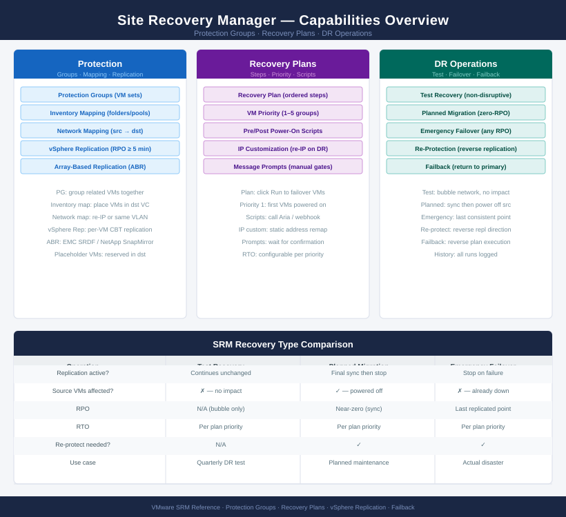
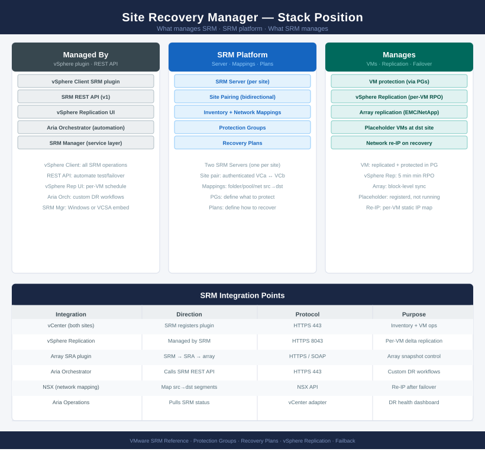

# SRM (VMware Platform)

<div class="kb-summary">
Site Recovery Manager knowledge base — architecture, operations, deploy, CLI references, security, and troubleshooting.

*Applies to: SRM 8.x*
</div>





```text
┌──────────────────────────── Site Recovery Manager — Installation Sequence ────────────────────────────┐
│                                                                                                       │
│  Step 1 · Pre-Deploy Checks                                                                           │
│  ─────────────────────────────────────────────────────────────────────────────────────────            │
│  Two vCenter sites operational: protected site and recovery site                                      │
│  Network connectivity between sites: SRM ports 443, 8095, 9086 open                                   │
│  Replication mechanism in place: array-based (SRDF, RecoverPoint) or vSphere Replication              │
│  DNS: SRM appliance FQDNs resolvable from both sites                                                  │
│  vCenter Enhanced Linked Mode or at minimum both sites independently operational                      │
│                                                                                                       │
│                                        │  deploy SRM at protected site                                │
│                                        ▼                                                              │
│  Step 2 · SRM Appliance — Protected Site                                                              │
│  ─────────────────────────────────────────────────────────────────────────────────────────            │
│  Deploy SRM OVA on protected site vCenter  ·  Select size based on VM count                           │
│  Set FQDN, management IP, gateway, DNS, NTP  ·  Set admin password                                    │
│  Register SRM with local vCenter: enter vCenter FQDN + SSO credentials                                │
│  SRM plugin appears in vSphere Client  ·  Confirm plugin loads without errors                         │
│  Enter SRM licence key  ·  Protected site SRM Ready state confirmed                                   │
│                                                                                                       │
│                                        │  deploy SRM at recovery site                                 │
│                                        ▼                                                              │
│  Step 3 · SRM Appliance — Recovery Site                                                               │
│  ─────────────────────────────────────────────────────────────────────────────────────────            │
│  Deploy SRM OVA on recovery site vCenter using same procedure                                         │
│  Register with recovery site vCenter  ·  Confirm plugin loads                                         │
│  Pair recovery site SRM with protected site SRM: Site Pairing wizard                                  │
│  Enter protected site SRM FQDN + admin credentials  ·  Accept thumbprint                              │
│  Pairing completes  ·  Both sites show each other in SRM inventory                                    │
│                                                                                                       │
│                                        │  configure inventory mappings                                │
│                                        ▼                                                              │
│  Step 4 · Inventory Mappings                                                                          │
│  ─────────────────────────────────────────────────────────────────────────────────────────            │
│  Network mappings: map protected site port groups to recovery site port groups                        │
│  Folder mappings: map VM folders between sites for test recovery placement                            │
│  Resource mappings: map clusters/resource pools between sites                                         │
│  Test network: create isolated test network at recovery site for DR tests                             │
│  Placeholder datastores: configure at recovery site for VM inventory placeholders                     │
│                                                                                                       │
│                                        │  create protection groups                                    │
│                                        ▼                                                              │
│  Step 5 · Protection Groups                                                                           │
│  ─────────────────────────────────────────────────────────────────────────────────────────            │
│  Array-based groups: use storage array replication sets (SRDF, RecoverPoint)                          │
│  vSphere Replication groups: select VMs  ·  RPO target  ·  Seed if needed                             │
│  Assign VMs to protection groups  ·  Replication health confirms no lag                               │
│  Placeholders created at recovery site  ·  VMs appear in recovery inventory                           │
│  Verify all VMs in group show Protected status  ·  No missing components                              │
│                                                                                                       │
│                                        │  build and test recovery plans                               │
│                                        ▼                                                              │
│  Step 6 · Recovery Plans & Testing                                                                    │
│  ─────────────────────────────────────────────────────────────────────────────────────────            │
│  Create recovery plan: select protection group(s)  ·  Define startup priority                         │
│  Add custom steps: pre/post-recovery scripts, IP customisation rules                                  │
│  Test recovery: SRM powers on VMs in isolated test network  ·  No production impact                   │
│  Validate VM boot order, IP changes, application startup scripts                                      │
│  Document RTO achieved during test  ·  Clean up test  ·  Schedule recurring tests                     │
│                                                                                                       │
└───────────────────────────────────────────────────────────────────────────────────────────────────────┘
```


<div class="kb-grid kb-grid-3">

<a class="kb-card" href="architecture/">
  <strong>Architecture</strong>
  <span>How it works, integrations, and design standards.</span>
</a>

<a class="kb-card" href="deploy/">
  <strong>Deploy</strong>
  <span>Phase-by-phase deployment from SRM appliance install through site pairing, protection groups, and recovery plan testing.</span>
</a>

<a class="kb-card" href="operations/">
  <strong>Operations</strong>
  <span>CLI reference, health checks, procedures, lifecycle, backup, and scripts.</span>
</a>

<a class="kb-card" href="security/">
  <strong>Security</strong>
  <span>Authentication, access control, encryption, and hardening.</span>
</a>

<a class="kb-card" href="troubleshooting/">
  <strong>Troubleshooting</strong>
  <span>Common issues, diagnostics, and escalation.</span>
</a>

</div>
