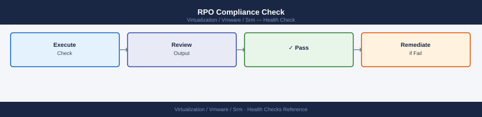
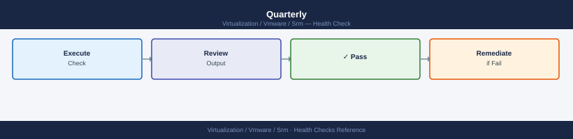

---
tags:
  - operations
  - srm
  - vmware
description: "SRM health checks: Get-SrmRecoveryPlan, site pair connectivity test, VM protection group status, replication lag review, and RPO compliance validation."
---
# SRM — Health Checks

<div class="kb-summary">
SRM health checks: `Get-SrmRecoveryPlan`, site pair connectivity test, VM protection group status, replication lag review, and RPO compliance validation.

*Applies to: SRM 8.x / 9.x*
</div>

## Before you begin

- **Access:** vCenter read-only minimum; Administrator role for remediation steps
- **Timing:** safe to run during business hours unless a step is marked ⚠ (causes interruption)
- **Dependencies:** no active upgrades or migrations on the same infrastructure
- **Logging:** capture command output — paste into the change record on completion

---

## Run This Routine

Work through these steps in order. Steps 1–2 use PowerShell; steps 3–9 use the SRM and vSphere UIs.

**1. Verify SRM service is running on the protected site.**

```powershell
# Run on the SRM Windows server at the protected site
Get-Service -Name vmware-dr | Select-Object Name, Status, StartType
# Status must be: Running
# If stopped: Start-Service -Name vmware-dr
```

**2. Verify SRM service is running on the recovery site.**

```powershell
# Run on the SRM Windows server at the recovery site (remote, or open a session there)
Get-Service -Name vmware-dr | Select-Object Name, Status, StartType
```

**3. Check site pair connection status.**

```text
SRM UI (vSphere Client → Site Recovery plugin) → Summary → Site Pair
  Status must show: Connected
  If Disconnected: check network between sites, SRM service on both sides, and certificate trust
```

**4. Review protection group status — all groups must show "Protected".**

```text
Site Recovery → Protection → Protection Groups
  Scan the State column — every group should show: Protected
  Flag any group showing: Error, Unconfigured, or Not Configured
  Drill into flagged groups → VMs tab to identify which VMs are causing the issue
```

```powershell
# PowerCLI: programmatic check — any non-OK state is logged as a warning
$pgs = $srm.ExtensionData.Protection.ListProtectionGroups()
foreach ($pg in $pgs) {
    $info = $srm.ExtensionData.Protection.QueryProtectionGroupState($pg)
    if ($info.State -ne "OK") {
        Write-Warning "PG $($pg.Name): $($info.State)"
    }
}
```

**5. Check recovery plan status — all plans must show "Ready".**

```text
Site Recovery → Recovery Plans
  Check the Status column for each plan
  Acceptable: Ready
  Investigate immediately: Error, Configuration Needed, or Warning
  Run Plan → Actions → Validate to get a detailed error list
```

**6. Check vSphere Replication health — flag any RPO violations.**

```text
vSphere Replication Appliance UI (or vSphere Client → Monitor → vSphere Replication)
  Review each VM entry for: RPO Status, Last Sync time, and Replication State
  RPO violation = Last Sync time exceeds configured RPO window
  Common causes: network congestion, snapshot accumulation, storage I/O contention
```

**7. Verify placeholder VMs exist at the recovery site.**

```text
vCenter (Recovery Site) → VMs and Templates
  Placeholder VMs appear with the same names as protected VMs but with minimal resource allocation
  Every VM in a protection group must have a corresponding placeholder
  Missing placeholders → Site Recovery → Protection → [PG] → Configure → Reconfigure
```

**8. Verify network mappings are complete and green.**

```text
Site Recovery → Configure → Network Mappings
  Every protected-site network must have a mapped recovery-site network
  Status must be green (valid mapping)
  Red or missing mappings cause recovery plan validation failures
```

**9. Check last test date on all recovery plans — flag any untested for more than 90 days.**

```text
Site Recovery → Recovery Plans
  Review the Last Test column for each plan
  Flag any plan where Last Test is blank or older than 90 days
  Schedule a test recovery for flagged plans — use isolated network mode
  Record test date and outcome in your change log
```

**10. Verify inventory mappings (resource, folder, and storage).**

```text
Site Recovery → Configure → Inventory Mappings
  Resource Mappings: each protected cluster/resource pool maps to a recovery counterpart
  Folder Mappings: VM folders mapped at the recovery site
  Storage Mappings: each protected datastore maps to a recovery datastore
  Any unmapped item appears with a warning icon — resolve before the next recovery plan run
```

---

## RPO Compliance Check



All protected VMs must be within their configured RPO. VMs outside RPO appear in amber/red:

```text
Site Recovery → Replication → vSphere Replication
  Filter by: RPO violation
  Any VMs shown: investigate immediately — replication is lagging

Site Recovery → Protection → Protection Groups → [group] → VMs
  Check "Last Sync" column against RPO setting
```

```powershell
# Check VM replication lag vs configured RPO
$pgs = $srm.ExtensionData.Protection.ListProtectionGroups()
foreach ($pg in $pgs) {
    $vms = $srm.ExtensionData.Protection.ListProtectedVms($pg)
    foreach ($vm in $vms) {
        $state = $vm.ReplicationState
        if ($state -and $state -ne "OK") {
            Write-Warning "$($vm.Vm.Name): replication state = $state"
        }
    }
}
```

---

## SRA Status (Array-Based Replication)


```bash
Site Recovery → Storage → Array Pairs
  All array pairs should show: Enabled, Healthy
  Last discovery: recent timestamp

# If SRA shows error:
# Site Recovery → Storage → Array Pairs → [pair] → Discover Devices
# This re-runs the SRA discovery against the storage array
```


```text title="Expected output"
Array Pair: EMC-VMAX-01
  Status: Enabled
  Health: Healthy
  Last Discovery: 2024-01-15 14:32:18 UTC
  Devices Discovered: 47
  
Array Pair: NetApp-FAS8300
  Status: Enabled
  Health: Healthy
  Last Discovery: 2024-01-15 14:28:45 UTC
  Devices Discovered: 23

Array Pair: Pure-FlashArray-X90R2
  Status: Enabled
  Health: Degraded
  Last Discovery: 2024-01-14 09:15:22 UTC
  Devices Discovered: 12

SRA Discovery Process Started
  Target Array: Pure-FlashArray-X90R2
  Discovery Duration: 45 seconds
  Status: Completed Successfully
  Devices Re-discovered: 12
```

!!! warning "Common errors"
    | Error | Fix |
    |---|---|
    | `SRA Discovery Failed: Connection timeout to storage array (60s)` | Verify network connectivity to the storage array and confirm SRA credentials are current in Site Recovery → Storage → Array Pairs settings. |
    | `Array Pair Status: Unhealthy - SRA Plugin Version Mismatch` | Update the SRA plugin to match the vSphere Replication version by downloading the latest SRA from the storage vendor's support portal. |
---

## Placeholder VMs at Recovery Site


Placeholder VMs must exist at the recovery site for each protected VM:

```bash
vCenter (Recovery Site) → VMs and Templates
  Look for VMs with names matching protected VMs — these are placeholder VMs
  They appear as "shadow" VMs with minimal resources

# Placeholder VMs missing = protection group needs reconfiguration
# Site Recovery → Protection → [PG] → Configure → Reconfigure
```


```text title="Expected output"
vCenter (Recovery Site) → VMs and Templates
  Look for VMs with names matching protected VMs — these are placeholder VMs
  They appear as "shadow" VMs with minimal resources

Placeholder VMs found:
  prod-web-01 (128 MB RAM, 1 vCPU) — Recovery Site
  prod-web-02 (128 MB RAM, 1 vCPU) — Recovery Site
  prod-db-01 (256 MB RAM, 2 vCPU) — Recovery Site
  prod-app-03 (128 MB RAM, 1 vCPU) — Recovery Site

Protection Group Status: PROTECTED
Last Test Failover: 2024-01-15 14:32:18 UTC
Recovery Point Objective: 5 minutes
```

!!! warning "Common errors"
    | Error | Fix |
    |---|---|
    | `Error: Protection group not found in Site Recovery Manager` | Verify the protection group name matches exactly in Site Recovery → Protection and check that SRM is properly licensed on both sites. |
    | `Error: Placeholder VMs missing from recovery site datastore` | Re-run the protection group reconfiguration wizard via Site Recovery → Protection → [PG] → Configure → Reconfigure to regenerate placeholder VMs. |
---

## Recovery Plan Pre-Check


Run the built-in pre-check before any recovery:

```text
Site Recovery → Recovery Plans → [plan] → Test or Recover
  Step 1: Run validation checks (pre-check)
  Verify: no errors before proceeding
  Common warnings: network mapping not set, no IP customization defined
```

---

## Certificate Expiry


```bash
# Check SRM Server certificate
echo | openssl s_client -connect srm-protected.example.local:443 2>/dev/null \
  | openssl x509 -noout -dates

echo | openssl s_client -connect srm-recovery.example.local:443 2>/dev/null \
  | openssl x509 -noout -dates

# Check vSphere Replication appliance cert
echo | openssl s_client -connect vra-protected.example.local:443 2>/dev/null \
  | openssl x509 -noout -dates
```


```text title="Expected output"
notBefore=Jan 15 08:23:47 2023 GMT
notAfter=Jan 15 08:23:47 2026 GMT
notBefore=Jan 15 08:23:47 2023 GMT
notAfter=Jan 15 08:23:47 2026 GMT
notBefore=Mar 22 14:10:12 2022 GMT
notAfter=Mar 22 14:10:12 2025 GMT
```

!!! warning "Common errors"
    | Error | Fix |
    |---|---|
    | `connect: Connection refused` | Verify the SRM or VRA appliance is running and the hostname resolves correctly with `nslookup` or `ping`. |
    | `connect: Name or service not known` | Add the appliance hostnames to your DNS or `/etc/hosts` file, or use the IP address instead of the FQDN. |
    | `Verify return code: 20 (unable to verify the first certificate)` | This is a warning for self-signed certificates; the dates are still valid—add `-showcerts` to inspect the full chain if needed. |
---

## Monthly Test Recovery Verification


Run a test failover monthly on at least one non-critical Recovery Plan:

```yaml
Site Recovery → Recovery Plans → [test-plan] → Test
  Mode: Test
  Network: isolated (do not connect test VMs to production network)

After test:
  Verify: all VMs powered on in isolated network
  Check: IP addresses correct per IP customization rules
  Check: application-level connectivity within isolated network (ping, service check)

Cleanup:
  Site Recovery → Recovery Plans → [test-plan] → Cleanup
```

Document test results and any issues found. Track trend of test durations — increasing duration indicates scaling issues.

## Weekly Checks


| Check | Location / Command | Expected State |
|---|---|---|
| Protection group status | SRM UI → Protection Groups | All groups `OK` |
| SRA connectivity | SRM UI → Array Managers | Connection `Connected` |
| vSphere Replication health | vSphere Replication UI → Monitor | No replication errors |
| Recovery plan status | SRM UI → Recovery Plans | All plans `Ready` |
| Failed protection jobs | SRM UI → Tasks & Events | No failed jobs in last 7 days |

## Quarterly



- Execute test failover on at least one non-critical recovery plan.
- Document results and resolve any script or network mapping failures.
- Confirm SRA version compatibility with current array firmware.

---

## See also

- [VMware SRM — Common Issues](../../troubleshooting/common-issues/)
- [SRM — Procedures](../procedures/)
- [SRM — CLI Reference](../cli-reference/)

## Verify

- **Alarms:** vSphere Client → Home → Alarms — no new critical alarms after the operation
- **Events:** monitor the vCenter Events view for the affected object for 5 minutes
- **Health check:** run the morning health-check sequence for the affected product tier
